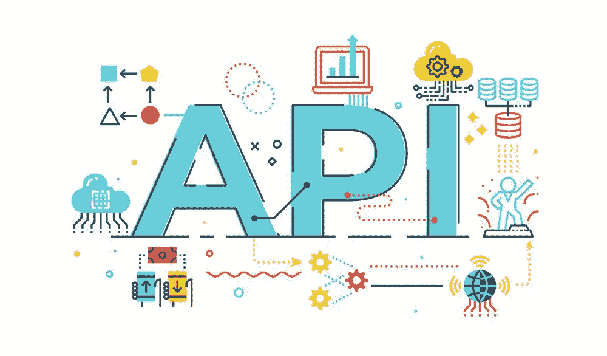
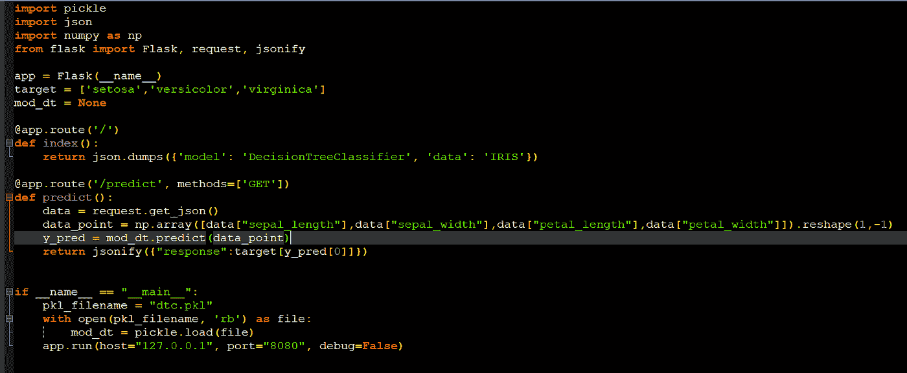
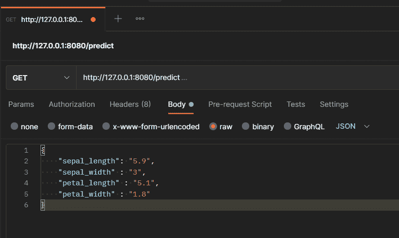
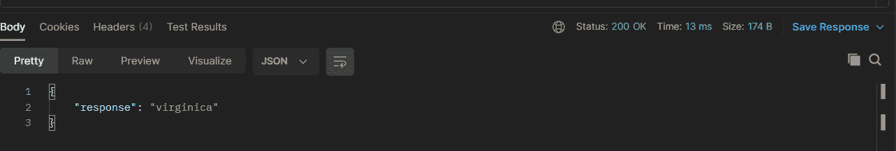

# 通过与模型互动。烧瓶 API

> 原文：<https://medium.com/analytics-vidhya/interacting-with-models-via-flask-api-3fe9b681868a?source=collection_archive---------6----------------------->

本博客将向您介绍构建 ML 模型后的过程，如何通过 API 与它们交互，如何在您的本地机器上托管它们并通过 API 访问它们。

来源:谷歌图片

假设您有一个经过训练的模型，并且您有一个指标显示您的模型的性能足够好，可以在现实世界中使用。

那么现在，一个人如何为现实世界托管他们的应用程序，以便可以与之互动呢？

这篇博客不是向你展示如何生产化，因为这涉及到很多步骤，但是创建 API 肯定是其中之一。

如果您已经构建了一个 API，那么您可以使用 Web APIs 从另一个应用程序中调用能够与您的模型交互的方法

在继续学习本教程之前，需要满足某些先决条件:

*   您的模型已经准备好并经过测试。

现在就这些了，剩下的我将展示如何创建预测函数，并把它们转换成可以通过。API。

为了便于说明，我将使用一个类似 iris_classification 模型的简单模型来解释 API 的使用以及如何与模型进行交互。

我将把这篇博客分成几个步骤，你可以按照这些步骤来创建你自己的 API 和做更多的事情。

为了方便起见，我不会生产模型，而是我们将利用一个免费的工具与 API 进行交互，名为 Postman。但在此之前，我们仍然需要创建我们的预测函数和 Flask 应用程序，并将其托管在我们的本地系统中，以便通过访问它。邮递员。

第一步:

将您的模型保存到 pickle 文件中，以便在需要时可以加载它。

第二步:

从 flask 获取库导入。

> 从烧瓶导入烧瓶，请求，jsonify

Flask:它帮助我们创建 flask 应用程序

请求:它帮助我们从客户端获取数据

jsonify:它帮助我们将响应转换成 JSON

第三步:

> app = Flask("您的应用名称")

这一行帮助我们创建一个具有指定名称的 flask 应用程序。

第四步:

现在，当我们的 URL 被点击时，我们需要调用我们的函数，这些函数将依次向我们发送数据。

API 中有不同类型的路由方法，它们是“GET”、“POST”、“PUT”、“DELETE”等等

为了简单起见，我们将只看到 GET 和 POST 方法，因为我们想学习如何创建我们的第一个 API，而不是马上成为一个完全的专业人员。

获取:

> @app.route('/predict '，methods=['GET'])

帖子:

> @app.route('/predict '，methods=['GET'])

因此，我们将使用这两个路由选项将我们的用户路由到已定义的函数，现在要明白，这些注释将直接写在函数之上，使我们能够调用已定义的方法。

仅此而已！是的，你没听错，现在你只需要知道这些。

当我们向 API 提供数据时，让我们创建一些函数来帮助我们预测。

> 定义预测():
> 
> data = request.get_json()
> 
> data _ point = NP . array([data[" sepal _ length "]，
> 
> 数据["萼片宽度"]，
> 
> 数据["花瓣长度"]，
> 
> 数据["花瓣宽度"]])。整形(1，-1)
> 
> y _ pred = mod _ dt . predict(data _ point)
> 
> return JSON ify({ " response ":target[y _ pred[0]]})

让我为你定义每一行，

data=request.get_json()

这一行指定了我们将在请求对象中发送给我们的 API 的数据，这是我们之前导入的。这有助于我们读取从客户端传来的数据。

data_point = np.array(…。)

这一行将来自 JSON 对象的数据转换成一个数组，并将其重新整形为模型可以理解的格式。

y _ pred = mod _ dt . predict(data _ point)

这是预测发生的地方。

return JSON ify({ " response ":target[y _ pred[0]]})

在这里，我们使用为表示数据而创建的字典格式将预测转换为 json 对象。

这是 python 文件的样子:-

app.py

这是 PostMan app，通过它我们可以和 API 进行交互。

邮递员 UI

响应看起来是这样的:

反应

现在你知道了，你知道基本的东西了。

在此之后，你的想象力是极限。

去探索吧。

如果你在这个博客上有任何问题，我一定会回复任何需要的帮助。

> **感谢阅读！**
> 
> 如果你想了解更多类似的话题或者看看我还能提供什么，一定要访问我的网站:[所有关于东西](https://digital.allaboutstuffs.com/)
> 
> 准备好让你的学习更上一层楼了吗？查看我提供的课程:[课程](https://digital.allaboutstuffs.com/courses/)
> 
> 生活工作压力大？花一点时间来放松和放松我的舒缓和放松的视频！现在就去我的频道，用"[灵魂镇定剂](https://www.youtube.com/c/TheSoulTranquilizer)"开始你的内心平和与宁静之旅