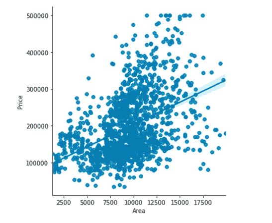
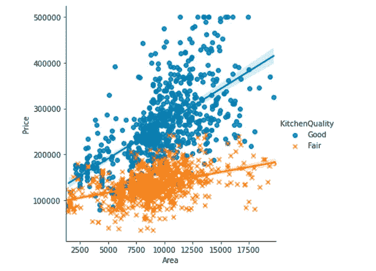
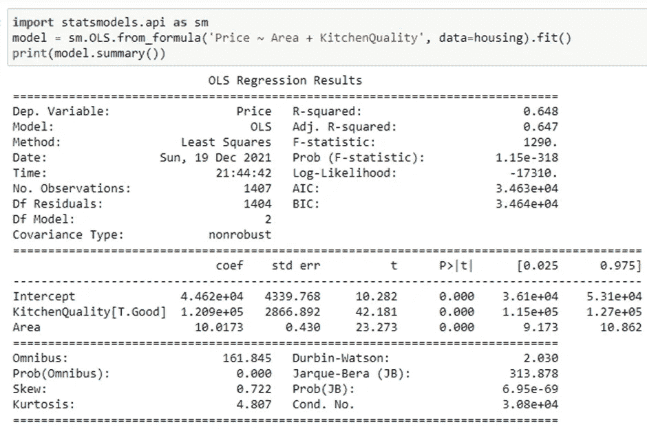
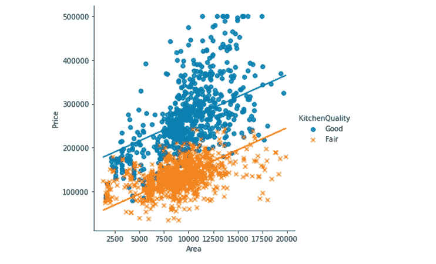
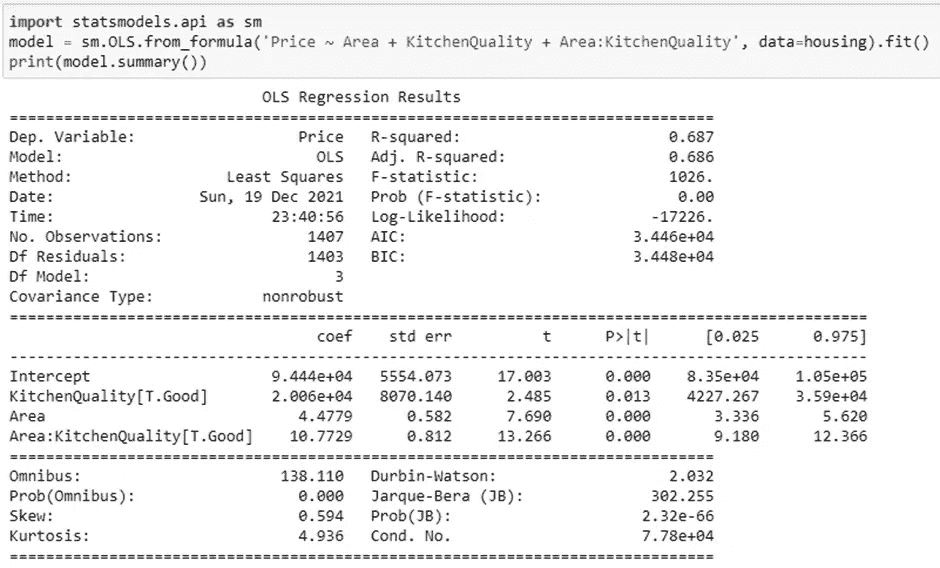
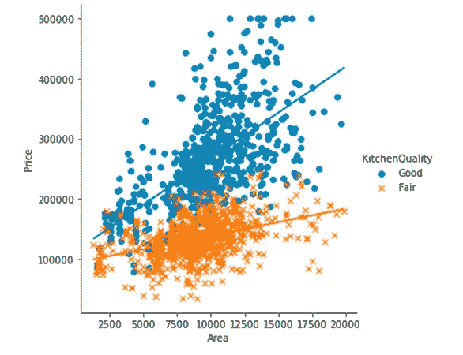

# 机器学习中的交互效应

> 原文：<https://medium.com/analytics-vidhya/interaction-effects-in-machine-learning-c8374a9e62dc?source=collection_archive---------0----------------------->

照片由 [Pexels](https://www.pexels.com/photo/hands-of-people-reaching-to-each-other-5541019/?utm_content=attributionCopyText&utm_medium=referral&utm_source=pexels) 的 [lilartsy](https://www.pexels.com/@lilartsy?utm_content=attributionCopyText&utm_medium=referral&utm_source=pexels) 拍摄

作为一名分析师，你希望从回归模型中获得最大收益。虽然您通常会被数据集中的要素数量所限制(或破坏),但还是有一些创造性的方法来增强您的模型。

其中之一是观察特征之间的交互作用。交互术语可以被创建为两个或多个现有特征的组合。

我们用一个例子来理解。

这是一个只有一个特征(即面积)的房价回归图。毫无疑问，面积和房价之间存在正相关关系。

还有一个你认为会影响房价的特征‘KitchenQuality’。毕竟，合乎逻辑的假设是，厨房质量好的住宅价格高于其他住宅。

以下是与 KitchenQuality 的关系。

不出所料，拥有“好”质量厨房的房子通常比“一般”的价格要高。然而，请注意，**斜率**在厨房质量好的住宅中要高得多，即与质量“一般”的住宅相比，这些住宅的价格随着面积的增加而上涨。坡度以后会变得很重要。

使用面积和厨房质量来拟合模型。这是结果。

该模型的调整后 R 平方为 **0.647** ，这两个特征在 95%的置信区间都是显著的。

一个简化的模型方程应该是这样的。

1.  如果 KitchenQuality = Good(即 1)，价格= 4.462 e+04+10.0173 *面积+ 1.209e+05*KitchenQuality 或 ***价格=(4.462 e+04+1.209 e+05)+10.0173 *面积***
2.  如果 KitchenQuality = Fair(即 0)， ***价格= 4.462 e+04+10.0173 *面积***

注意:KitchenQuality 是一个虚拟变量，编码为 1 表示“好”，0 表示“一般”。

让我们画出两条回归线。

注意两个方程有相同的斜率，即 **10.0173** ，它们只是截距不同。不出所料，两条线是平行的。

现在，让我们为模型添加一个额外的特征，即面积和厨房质量之间的交互项，即面积*厨房质量。

所有特征在 95%置信区间都是显著的，调整后的 R 平方从 **0.647 上升到 **0.686** 。**这意味着与以前的型号相比，新型号解释了更多的价格变化。

一个简化的模型方程应该是这样的。

1.  如果 KitchenQuality = Good(即 1)，Price = 9.444 e+04+2.006 e+04 * kitchen quality+4.4779 * Area+10.7729 * Area * kitchen quality 或***Price =(9.444 e+04+2.006 e+04)+15.2508 * Area***
2.  如果 KitchenQuality = Fair(即 0)， ***价格= 9.444 e+04+4.4779 *面积***

回归线看起来像这样。

注意，现在斜率和截距都不同了。这个模型比早期的模型更好地捕捉了关系的本质，早期的模型受到每个厨房质量水平的相同斜率的限制。

# 总结一下-

1.  交互作用效应可以解释因变量在个体特征之外的额外变化
2.  并非所有的交互作用都是显著的。您将需要通过用不同的交互项评估模型来测试它们。
3.  为了避免过度拟合，不要机械地添加过多的交互项。

学分:代码学院

***您在模型中使用交互术语吗？***