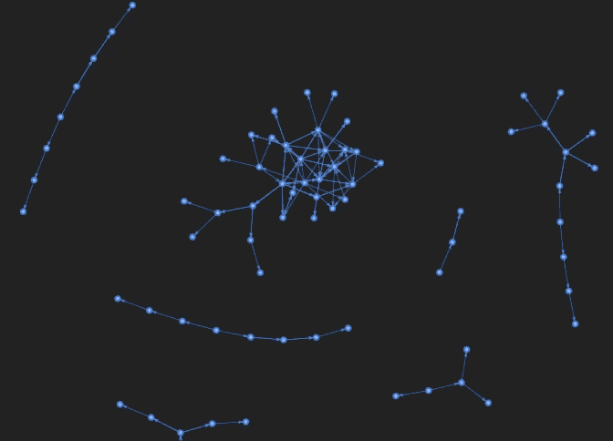
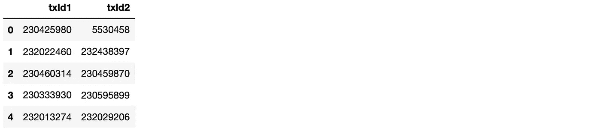
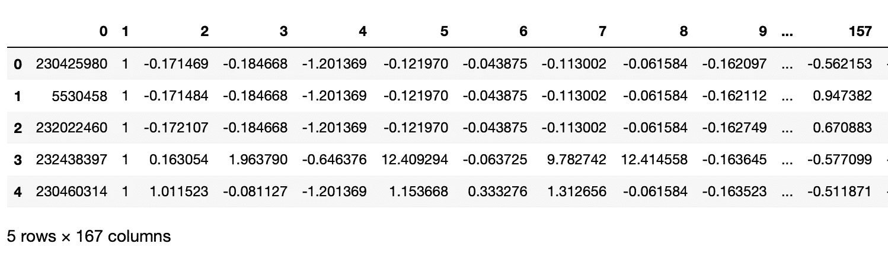
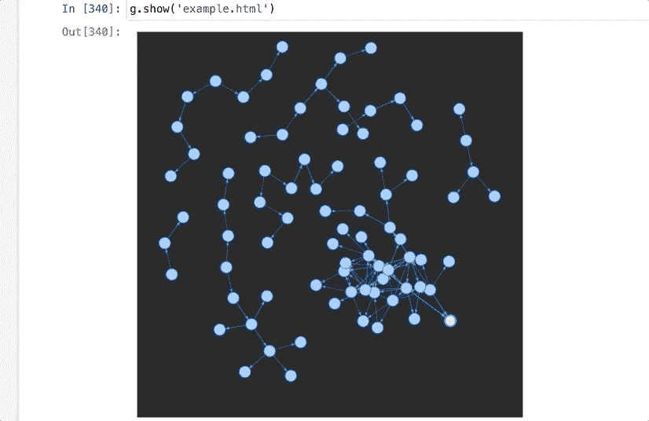
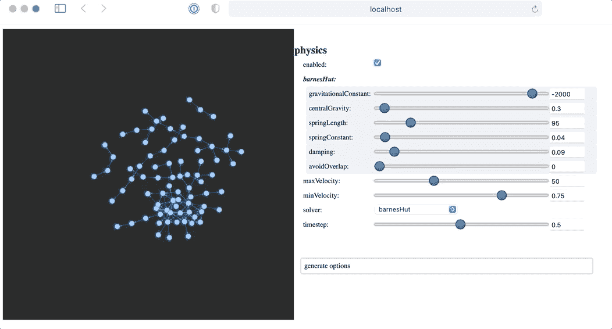

# 使用 Python 和 Pyvis 简化比特币交易的交互式可视化

> 原文：<https://medium.com/analytics-vidhya/interactive-visualisation-of-bitcoin-transactions-made-easy-with-python-and-pyvis-109dea06b86e?source=collection_archive---------12----------------------->



需要更好地理解区块链交易结构？使用 [Pyvis](https://pyvis.readthedocs.io/en/latest/) 库很容易实现交互式图形可视化。

本文要求对比特币交易，Python 编程有基本的了解(我用的是 Jupyter 笔记本)。此外，你应该了解网络图中的“节点”和“边”是什么。

本文提供了一个使用[椭圆数据集](/elliptic/the-elliptic-data-set-opening-up-machine-learning-on-the-blockchain-e0a343d99a14)进行比特币交易的简单示例，该数据集可从 [Kaggle](https://www.kaggle.com/ellipticco/elliptic-data-set/activity) 获得。由此你将能够进一步精炼和扩展你的观想。

让我们加载数据集

```
**import** pandas **as** pd
**import** numpy **as** np
**edges** = **pd.read_csv**('elliptic_txs_edgelist.csv')
**features** = **pd.read_csv**('elliptic_txs_features.csv', **header=None**)
```

edges 表实际上包含了我们需要的一切，即事务节点(作为 id)和边(由行表示):



但是，我们需要“features”表的简单目的是识别集合中事务的开始:Elliptic 以 49 个不同的时间步长(由列“1”表示)表示数据，每个时间步长大约为。交易发生的 3 小时内:



让我们选取一个节点子集(15)并构建前 4 个事务层，如下所示:

*   从属于时间步长的“特征”中获取第一小组节点
*   使用 Pyhton 函数`isin()`，将它们的 Id(列“0”)作为第一个节点，并将它们作为表“edges”中的“txId1”，获得相应的边。

```
features.sort_values(by=[‘1’])
nodes_1 = features[0:15][‘0’].to_numpy()
edges_1 = edges[edges['txId1'].isin(nodes_1)]
```

我们需要使用函数`to_numpy()`稍微调整一下数据，然后我们可以将条目作为节点添加到 Pyvis 图中。现在，

*   将“txId2”(即所收集的边的输出节点)视为输入节点(即现在是“txId1”)，我们提取相应的边，等等:

```
nodes_2 = edges_1[‘txId2’].to_numpy()
edges_2 = edges[edges[‘txId1’].isin(edges_1[‘txId2’])]
nodes_3 = edges_2[‘txId2’].to_numpy()
edges_3 = edges[edges[‘txId1’].isin(edges_2[‘txId2’])]
nodes_4 = edges_3[‘txId2’].to_numpy()
edges_4 = edges[edges[‘txId1’].isin(edges_3[‘txId2’])]
```

为了构建我们的 Pyvis 图，我们需要使用函数`to_list()`将我们的列表(Numpy 格式的 currenyl)转换成简单的 Python 列表。除此之外，Pyvis 图需要元组列表，我们通过函数`to_records()`提供了这些列表。

```
nodes_1 = nodes_1.tolist()
nodes_2 = nodes_2.tolist()
nodes_3 = nodes_3.tolist()
nodes_4 = nodes_4.tolist()
edges_1 = edges_1.to_records(index=False).tolist()
edges_2 = edges_2.to_records(index=False).tolist()
edges_3 = edges_3.to_records(index=False).tolist()
edges_4 = edges_4.to_records(index=False).tolist()
```

现在，我们准备生成图表:

```
from pyvis import network as net
from IPython.core.display import display, HTMLg=net.Network(directed=True, bgcolor=’#222222', font_color=’white’)
*# use 'directed=True' for arrows showing the direction of the edges*g.add_nodes(nodes_1)
g.add_nodes(nodes_2)
g.add_nodes(nodes_3)
g.add_nodes(nodes_4)g.add_edges(edges_1)
g.add_edges(edges_2)
g.add_edges(edges_3)
```

将图表保存为单独的 HTML 文件:



成功！我们有了第一个可以玩的互动网络。然而，安排节点组仍然有点棘手。Pyvis 中有专门的选项按钮，我们可以在 HTML 文件中显示，如下所示:

```
# under the line 'g=net.Network(...' add
g.show_buttons(filter_= ['physics'])
```

再次生成 HTML 文件，并从 Jupyter 文件管理器中打开它。



这是开始理解事务的更好的基础。放大和缩小以查看细节。此外，您可以添加更多的选项按钮，例如节点大小、颜色等。

# 结论

从椭圆比特币交易数据集中，我们提取了一个交易子集，并生成了一个包含数据的交互式图表。

从这里很容易将我们制作的基本图形增强为更复杂的可视化。有 fu [n](https://datasmithes.com/2021/04/09/interactive-visualisation-of-bitcoin-transactions-made-easy-with-python-and-pyvis/) 。