# SQL 和 R 之间的接口

> 原文：<https://medium.com/analytics-vidhya/interfacing-between-sql-and-r-177f7a28d998?source=collection_archive---------10----------------------->

伊利亚·巴甫洛夫在 [Unsplash](https://unsplash.com?utm_source=medium&utm_medium=referral) 上的照片

一定会有数据集太大而不适合 csv 或 txt 文件的时候。例如，在零售业，你可能要处理大量的客户记录和销售信息。

这些类型的数据存储和维护在数据库中。简而言之，数据库以有组织和结构化的方式存储信息，以保持其可访问性、安全性和完整性。数据库中的信息由数据库管理系统(DBMS)维护和控制。要访问该系统，需要使用特定的语言，即结构化查询语言(SQL) (Oracle.com)。

使用 SQL，您可以在数据库中导航，例如读取、争论和更新数据。最流行的工具是 PostgreSQL、SQLite、GraphQL 等。几个月前我开始学习查询数据库，我意识到我可以用 r 做类似的事情。

作为一个一贯的 R 用户，我发现通过 R 查询开源数据库更容易。我喜欢学习 SQL，但我意识到我需要将其与其他软件相结合，以进行分析和可视化。此外，如果您已经知道 R 中的 dplyr 包，那么您可以完全使用 dplyr 语法在数据库中导航。

在本文中，我将分享如何首先在由 SQL 控制的开源数据库和 R 之间建立连接。在示例问题的指导下，我将展示从 R 导航 SQL 的两种方式:1)使用 SQL 查询，2)使用 dplyr 语法。我还将演示如何从 SQL 中收集数据，并将其存储为 R 中的数据帧，以便您可以进行分析、建模和可视化。

## 从 R 创建到数据库的连接

要访问和检索数据库中的数据，必须首先在数据库和 r 之间建立一个连接。该连接存储在对象*出租*中。

要使用 dplyr 语法在数据库中导航，我应该将 dplyr 与 dbplyr 结合使用。dbplyr 包接口 dplyr 语法和 SQL 语法。因此，当我们使用 dplyr 语法从 SQL 数据库中检索一些数据时，dbplyr 将成为“翻译器”,以便 SQL 可以理解 dplyr 语法想要什么。

DBI 包定义了 R 和关系数据库管理系统之间通信的接口。函数 dbConnect 包含在 DBI 包中，用于通过适当的身份验证过程建立连接。

odbc 包和函数允许我指定驱动程序管理器，我用它来连接 R 和开源数据库。我将驱动程序指定为 PostgreSQL 版本 12。

您可以使用下面的代码 odbc::odbcListDrivers()检查 R 支持的驱动程序管理器。大多数常见的开源数据库已经在 R 中安装了它们的驱动程序，比如 SQLite、Amazon Redshift、Microsoft Access Driver 等。您也可以按照 RStudio 帮助页面中的说明安装驱动程序:

[设置 ODBC 驱动程序(rstudio.com)](https://db.rstudio.com/best-practices/drivers/)

由于 PostgreSQL 通常要求身份验证(用户 ID 和密码)，我必须在我的连接中设置身份验证过程。我指定了端口、主机(本地主机，意味着它由我的本地计算机托管)、用户 ID 和密码。

如果你正在访问一个开源数据库，默认情况下用户 ID 由 PostgreSQL 给出。这些信息可以在数据库管理工具中找到，例如 pgAdmin for PostgreSQL。你可以去你的 pgAdmin → servers → PostgreSQL →你的数据库名→属性查看用户 ID。对于其他驱动程序管理器，您可以查看他们的帮助页面以获得有关用户 ID 的信息。

密码本身是您在第一次设置驱动程序管理器时给出的。已经为 PostgreSQL 定义了端口，对于本地主机，通常是 5433。

但是，对于那些已经使用过 SQL 并且需要一些身份验证过程来访问数据库的人来说，这个过程是很熟悉的。如果数据库不需要任何身份验证过程，您可以跳过整个过程，使用以下代码建立连接

要使用这段代码，您需要安装相关的 SQL 包。对于 SQLite，可以安装 r SQLite，对于 PostgreSQL 可以安装 r PostgreSQL 等。在本例中，我安装了 RPostgreSQL 来建立与我的数据库 dvdrental 的连接。您可以在 RStudio 帮助页面中查看与您选择的数据库驱动程序接口的可用软件包列表。

【rstudio.com 使用 R(T3)的数据库

连接成功建立后，您将在 RStudio 右上面板的 environment 选项卡上看到您的数据库。它与 PostgreSQL 类一起列出

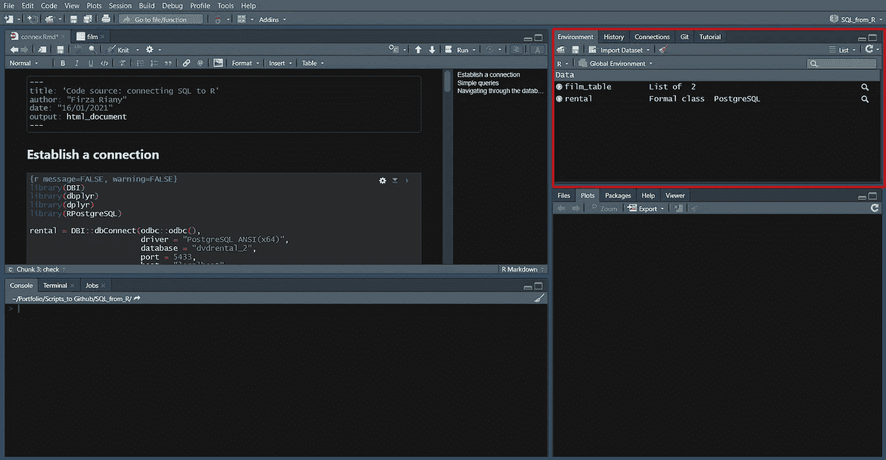

该数据库也可以在同一个面板的 connection 选项卡中找到。

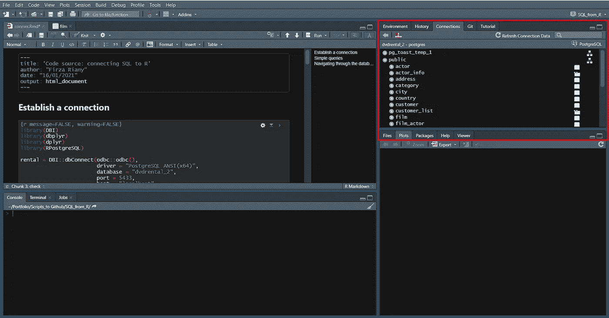

## 检查数据库中包含的表

建立连接后，您可能想知道数据库中有什么。一个数据库可以由许多表组成。每个表都包含可变列和观察行。一个表中的列可以与另一个表中的列相关。所以，当你想知道你的数据库里面有什么，这意味着你想知道有多少个表，它们是什么。

在 connection 选项卡中，您可以立即看到数据库中包含的表。在这种情况下，我可以通过单击 public schema 中的下拉箭头来查看包含在我的 dvdrental 数据库中的表。要检查某个表的观察值和变量，我只需单击表右侧的白纸图标。

如果你喜欢编码，你可以用下面的代码列出 dvdrental 数据库的表

函数 src_dbi()告诉你包含在 dvdrental 数据库中的表。结果可以在 tbls 行中看到。

## 在 R 中使用 SQL 和 dplyr 语法编写简单的查询

如果您已经知道如何构造 SQL 语法，您可以直接在 R 脚本中传递它。dplyr 中的函数 tbl()允许 R 将 SQL 语法发送到数据库。

**使用 SQL 语法查询**

从 dvdrental 数据库中包含的*电影*表中选择所有内容

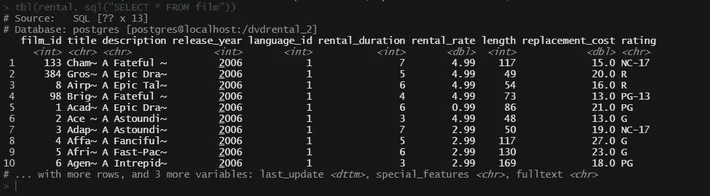

缩放{SELECT * FROM film}的结果

从*电影*表中的变量**等级**中识别不同的(唯一的)值

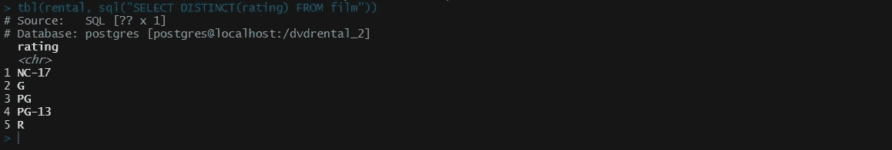

调用{从电影中选择不同(分级)}的结果

**用 dplyr 的语法查询**

除了传递 SQL 查询，您还可以使用 dplyr 语法导航数据库。例如，要从 *film* 表中选择所有内容，我只需要将 *film* 表中的所有内容存储到一个名为 film_table 的 R 对象中。调用 film_table 对象将为您提供 *film* 表中变量的前 10 行的快照。

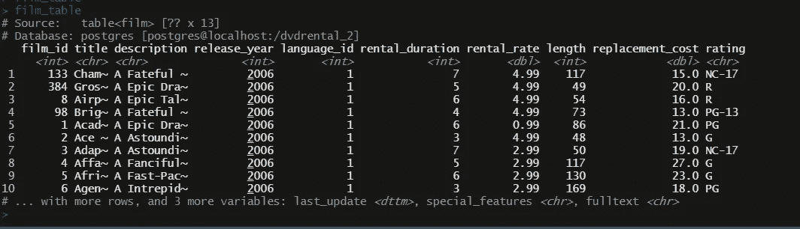

使用 dplyr 语法将返回与使用 SQL 语法相同的结果

如果想选择某些变量，可以使用 dplyr 中的 select()函数

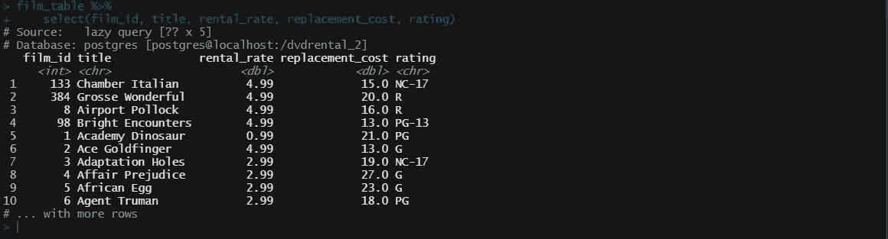

r 中 select()函数的结果。它返回的结果与我们在 SQL 中使用{SELECT film_id，title，rental_rate，replacement_cost，rating FROM film}查询时返回的结果相同

作为在 SQL 中选择 DISTINCT 语法的替代方法，您还可以使用 dplyr 语法执行以下操作。

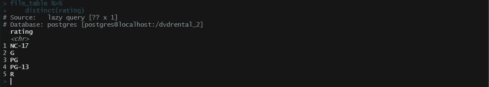

使用 distinct 函数的 dplyr 语法的结果

使用 dplyr，您可以通过在每个任务后传递“%>%”符号来告诉 R 使用几个函数执行几个任务。它使得任务管道的构造更加容易，可读性更好。

例如，如果我们想在 R 中重新创建这个 SQL WHERE 过滤语法，我们可以使用 filter、select 和 order 函数执行后续任务。

**用于过滤的 SQL 语法**

如果我们想从 *film* 表中获取变量 **title、length、replacement_cost、rental_rate、**和 **rating** ，只针对分级为 PG-13 或 PG 的片头。

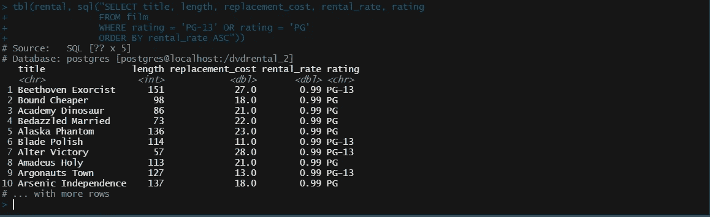

过滤只有 PG-13 或 PG 分级的电影标题的结果。

**用于过滤的 dplyr 语法**

解决相同问题的程序:

首先，我们要求 R 基于某些值进行过滤，在这种情况下，我希望过滤分级= PG-13 或分级= PG 的电影标题。使用“%>%”符号，我让 R 继续选择变量的任务，然后根据列租赁价格以升序对结果进行排序。该语法将返回与 SQL 语法相同的结果。

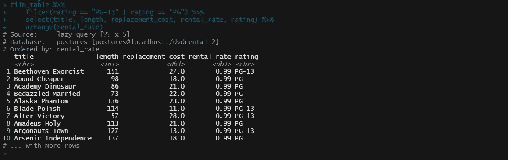

## dplyr 语法的懒惰

在前面的例子中，R 所做的仅仅是向 SQL 发送命令，以便 R 可以提取数据库的快照。如果您注意上面的 filter select 语法的调用，您可能会注意到在调用的第一行有“Source:”字样。它说“懒惰查询”没有行和 5 列的信息[？？x 5]。这就是我们通过 r 导航数据库时发生的情况。

正如我所说的，R 只是发送命令，给你一个数据库内容的快照。它不会从数据库中检索任何内容，除非您明确要求它这样做。为了从数据库中检索数据，我们可以在 dplyr 语法的最后添加 collect()函数。

这种在末尾不传递 collect()函数的语法会将 *NA 5* 返回到语法 dim(subset_film_0)。这是因为 R 只发送命令并给你一个数据库的快照。对象 subset_film_0 的类将是“tbl_lazy”(以及其他名称)，表明 R 在检索数据时是“懒惰的”。

现在我们来看看通过 collect()函数后，新对象 subset_film 在维度和类上的区别。

Collect()允许 R 从数据库中检索数据。然后，数据被存储为数据帧，而不再是 tbl_lazy。现在，如果我们检查维度，我们将获得数据框的行和列的总数。subset_film 数据帧包含 417 个观测值和 5 个变量。

将数据存储为数据框后，您可以使用它进行其他分析。你可以做 EDA，可视化，建模等。一切尽在不言中。高效且省事！

## R 中的复杂查询

我们还可以在 R 中进行复杂的查询。在 R 和 SQL 中，语法管道背后的直觉必须是相同的，即使语法的结构不同。

例如，我想从 dvdrental 数据库中找到租借次数最多的电影。我需要租得最多的电影的片名。

为此，我需要检查每部电影出租了多少次。这些信息可以在*租赁*表中找到。电影片名信息存储在*电影*表中。自然，我们可以用相同的标识符连接*出租*表和*电影*表。因此，首先检查这些表中有什么。

**中的*胶片*表**

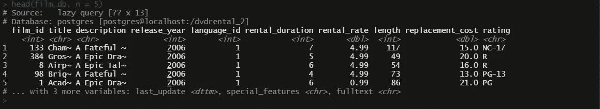

*胶片表中包含的变量。请注意，在此图所示的内容之外还有另外 3 个变量*

**中的*租金*表**

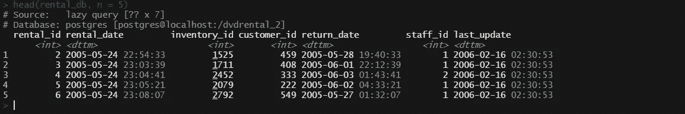

租赁表中包含的变量。

原来我们在*租赁*和*电影*表之间找不到相同的标识符。

所以，*出租*和*电影*表之间没有相似的标识符。但是*租赁*表中有 inventory_id，在*库存*表中也可以找到。当我们检查*库存*表时，发现有 film_id，这是在*电影*表中查找电影标题的标识符。

**在*库存*表**

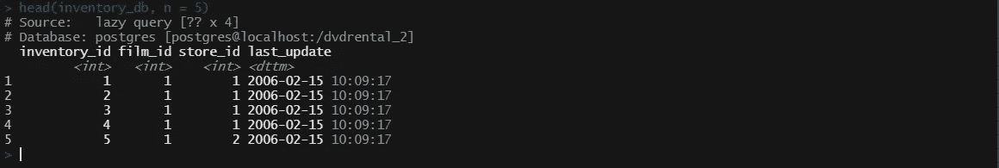

库存表中包含的变量。还有 film_id，这是一个相同的标识符，也可以在 film 表中找到。还有 inventory_id，这是一个相同的标识符，可以在 rental 中找到

在某种程度上，*库存*表可以作为*租金*和*电影*表之间的桥梁，以找到每个电影名称的总租金。

**使用 dplyr 语法编写复杂查询**

我现在需要做的是通过 inventory_id 内部连接*租赁*和*库存*表。我将首先使用 dplyr 语法。

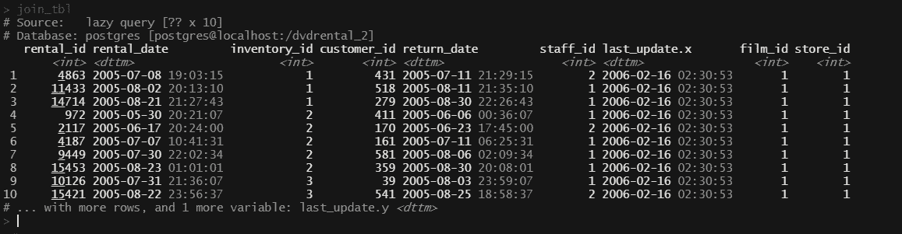

join_tbl 中包含的变量。租赁表和库存表之间内部联接的结果。

然后，为了获得电影的总租借次数，我通过 film_id 计算总租借次数。film_id 在 join_tbl 中出现了多次。一次租赁是针对一个 film_id 进行的，所以我可以只统计 film_id 的多次出现。

在加入*租赁*和*库存*表(存储在 join_tbl 中)后，我对 film_id 进行分组，然后计算 join_tbl 中出现了多少个不同的 film_id。(存储在**计数**变量中)。为了得到电影标题，我用*电影*表加入结果。

为了找到租得最多的电影，我根据 **count** 变量按降序排列结果。最后，我从 film_db 中只选择了变量**标题、计数、替换成本和评级**。然后，我必须通过在语法末尾传递 collect()函数，将它存储在我的 R 环境中。

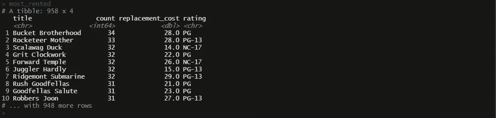

被多次租借的电影的名称，从最大租借计数到最小租借计数排序。

每部电影的总租金存储在**计数**变量中。这个结果已经从最大租赁到最小租赁进行了排序。我想得到前五名，所以我这样做:

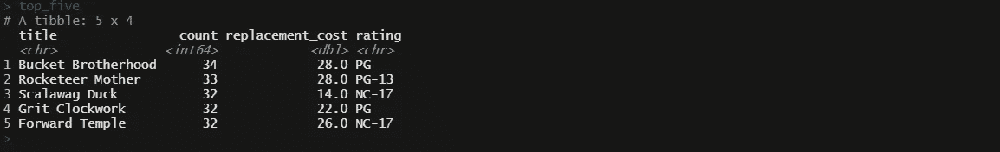

出租最多的五部电影的名字。

这就对了，现在你得到了最受欢迎的五部电影的名字！

**使用 SQL 语法编写复杂查询**

同样的管道可以应用于编写一个 SQL 语法来获得最常租借的电影。在 SQL 中，我会写:

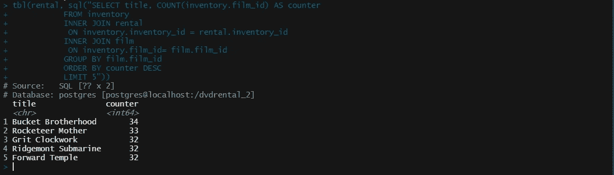

SQL 查询的结果是前五名最常租借的电影。

语法的管道基本上是相同的。所以我创建了嵌套内部连接。首先在库存 id 上的*租赁*和*库存*表之间，库存 id 是在两个表中都存在的标识符。其次是在先前与电影 id 上的*电影*表的连接结果之间，电影 id 是出现在*电影*和*库存*表中的标识符。

我对按 film_id 分组的 film_id 的多次出现进行计数，并将结果存储在 **count** 变量中。然后我对结果进行降序排序，只返回前五行。

## 一些优点和缺点

在 R 中使用 dplyr 尝试了一些 SQL 语法之后，我发现了使用 R 查询数据库的利弊。

**使用 R 的优点**

*   在 R 中，你可以做任何事情，而不必在软件之间转换

我对 SQL 的理解是，我必须提取查询结果，并在另一个软件(如 Excel、Tableau、PowerBI)中使用它们进行可视化。

我也有查询结果，并在另一个软件(如 Excel，Tableau，PowerBI)中使用它们进行可视化。

软件之间的转换是需要时间的，有时候 SQL 文件在某个软件打不开还得处理一些调试。因此，能够在一个软件中完成所有这些事情真的非常高效，节省了我的时间。然而，如果您在 SQL 中查询，提取结果，并导入到 R 中，可能不会有太多问题。

*   如果您已经知道如何在 R 中建立与数据库的连接，那么您可能根本不需要学习 SQL

正如我之前向您展示的那样，建立一个连接并使用 dplyr 语法找到自己的路，就足以在数据库系统中导航。如果你的工作主要是收集见解，你可以用 dplyr 中的知识做更多的事情。

**仅使用 R 的缺点**

*   你可以收集见解，但你不能维护一个数据库

这是因为 R 中没有相关的包(据我所知)允许你在 SQL 数据库中添加、更新或删除条目。一些认证也可能拒绝你这样做。

至少使用 dplyr 语法，您不能直接在数据库中添加、更新或删除条目。您可以将数据库作为数据框进行查询和采集，并进行本地更改，但不能在数据库中进行更改。这就是数据库保护其数据完整性的方式。

如果你的工作涉及数据库管理，你需要学习 SQL 才能有效。

*   对连接的身份验证可能会被拒绝或出错

同样，这是驱动程序管理器保护数据库完整性的一种方式。如果您不能创建连接，您只需要在 SQL 中查询并提取结果，以便在另一个软件中进一步分析。

不管利弊如何，学习一门新语言总是好的。它丰富了你的知识，你可以在两者之间建立一个独特的工作管道。

## 参考

*   数据库系统:[什么是数据库| Oracle](https://www.oracle.com/database/what-is-database/)
*   dplyr cheat sheet:【rstudio.com 数据-争论-cheat sheet
*   来自一位 R 用户的体验:[动态二人组:SQL & R — RStudio](https://rstudio.com/resources/rstudioglobal-2021/the-dynamic-duo-sql-and-r/)