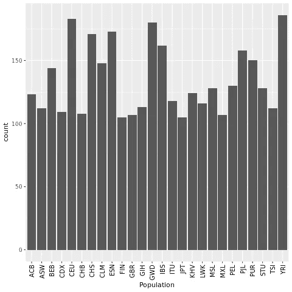
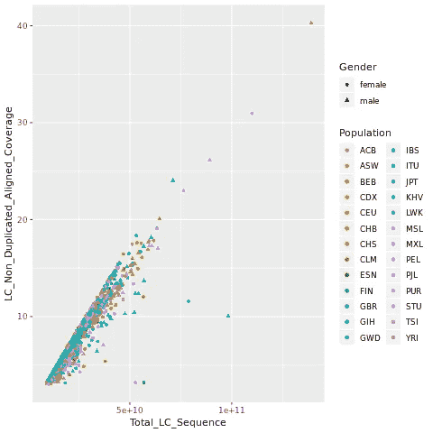
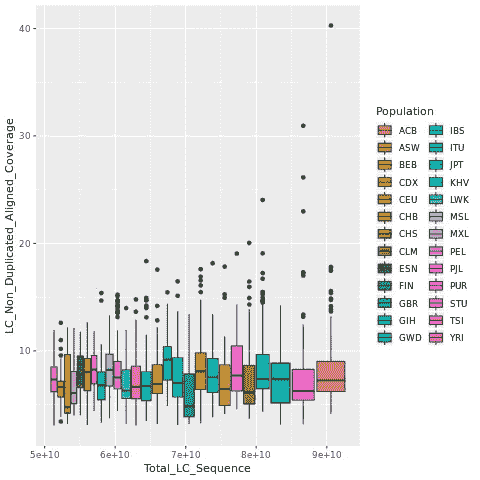

# 使用 Python 与生物信息学的 R 接口

> 原文：<https://medium.com/analytics-vidhya/interfacing-r-using-python-for-bioinformatics-9387c17344bd?source=collection_archive---------22----------------------->

## 学习使用 Rpy2 库作为使用 python 与 R 接口的一种方式


来源: [iStock 照片](https://www.istockphoto.com/photo/dna-sequence-with-colored-letters-on-black-background-containing-mutation-gm589572010-101296599)

# 介绍

在生物信息学中，所有任务都可以使用两种编程语言中的一种来完成:

*   稀有
*   计算机编程语言

Python 是一种高级编程语言，以其**【易于阅读和学习】**格式而闻名。Python 可以完成从自动化到数据科学和机器学习的任务。

另一方面，R 是一种为**统计和数据处理而设计的编程语言。**

在过去的几年中，R 被生物信息学社区采用为发布新包的头号编程语言，部分原因是 Bioconductor(用于下一代测序分析的成熟库集合)和用于高级绘图的 ggplot2 库。

> 但是从我个人的生物信息学经验来看，我的大部分数据争论和操作都是在 python 和端点分析中完成的，绘图是在 R 中完成的。但是 R 几乎可以做 Python 可以做的任何事情，在统计方面甚至更多。我对 R 的唯一问题是有时不直观的语法 **( < -，% > %，variable$attribute)** ，但是有一种方法可以解决这个问题，那就是使用 python 中的 rpy2 库。

在这篇文章中，我想展示一个将这个库用于生物信息学的例子。

# 设置环境

1.  下载 [Anaconda 包](https://docs.anaconda.com/anaconda/install/windows/)
2.  下载 Python 3 和 R
3.  从[这里](https://anaconda.org/r/rpy2)安装 rpy2
4.  打开 Jupyter 笔记本

# 下载数据

在这次演示中，我们将使用来自 1000 基因组计划的数据。使用下面的 **wget** 命令下载项目数据:

**Linux:**

```
# Get the data
!wget https://raw.githubusercontent.com/VarunSendilraj/Bioinformatics/main/rpy2_tutorial/1000-genomes_other_sample_info_sample_info.csv
```

如果您在 widows 或 mac 上， **wget** 命令将不起作用，因此请使用 **urlib** 库:

Windows/Mac:

```
import urllib.request
url = 'https://raw.githubusercontent.com/VarunSendilraj/Bioinformatics/main/rpy2_tutorial/1000-genomes_other_sample_info_sample_info.csv'
filename = 'genomes_other_sample_info_sample_info.csv'
urllib.request.urlretrieve(url, filename)
```

# 将 Python 数据帧转换为 R 数据帧

让我们从导入必要的库开始，打开 python 数据帧并将其转换为 R 数据帧:

```
#Import Librariesimport pandas as pd
import rpy2.robjects as ro
from rpy2.robjects.packages import importr
from rpy2.robjects import pandas2ri
from rpy2.robjects.conversion import localconverter
```

现在让我们打开我们使用 pandas[**read _ CSV**](https://pandas.pydata.org/pandas-docs/stable/reference/api/pandas.read_csv.html)**函数下载的文件:**

```
df = pd.read_csv('1000-genomes_other_sample_info_sample_info.csv')
df.head()
```

**使用。head()方法我们能够查看前几行的数据。在我们继续之前，让我们仔细检查这是一个熊猫数据帧:**

```
print(type(df))#expected output: <class 'pandas.core.frame.DataFrame'>
```

**随着 pandas DataFrame 到 R DataFrame 的转换，转换在对浮点和整数值进行编码时遇到了问题，所以让我们从将整个 DataFrame 转换为一个字符串开始。**

```
#converts values in df into string 
df = df.applymap(str)# Double check that values have changed
print(type(df['In_Final_Phase_Variant_Calling'][0]))#Expected output: <class 'str'>
```

**现在让我们使用 rpy2 库中的[**local converter**](https://rpy2.github.io/doc/v3.0.x/html/generated_rst/pandas.html)将熊猫数据帧转换为 R 数据帧:**

```
#conversion
with localconverter(ro.default_converter + pandas2ri.converter):
  r_df = ro.conversion.py2rpy(df)#Check if conversion Worked
print(type(r_df))#Expected output: rpy2.robjects.vectors.DataFrame
```

# **使用 rpy2 转换数据类型**

**在我们继续之前，让我们更好地理解我们的数据:**

```
print(f'This dataframe has {r_df.ncol} columns and {r_df.nrow} rows\n')
print(r_df.colnames)
```

**这里我们只是打印出数据框中不同的列。输出应该如下所示:**

```
This dataframe has 62 columns and 3500 rows

 [1] "Sample"                              "Family_ID"                          
 [3] "Population"                          "Population_Description"             
 [5] "Gender"                              "Relationship"                       
 [7] "Unexpected_Parent_Child"             "Non_Paternity"                      
 [9] "Siblings"                            "Grandparents"                       
[11] "Avuncular"                           "Half_Siblings"                      
[13] "Unknown_Second_Order"                "Third_Order"                        
[15] "In_Low_Coverage_Pilot"               "LC_Pilot_Platforms"                 
[17] "LC_Pilot_Centers"                    "In_High_Coverage_Pilot"             
[19] "HC_Pilot_Platforms"                  "HC_Pilot_Centers"                   
[21] "In_Exon_Targetted_Pilot"             "ET_Pilot_Platforms"                 
[23] "ET_Pilot_Centers"                    "Has_Sequence_in_Phase1"             
[25] "Phase1_LC_Platform"                  "Phase1_LC_Centers"                  
[27] "Phase1_E_Platform"                   "Phase1_E_Centers"                   
[29] "In_Phase1_Integrated_Variant_Set"    "Has_Phase1_chrY_SNPS"               
[31] "Has_phase1_chrY_Deletions"           "Has_phase1_chrMT_SNPs"              
[33] "Main_project_LC_Centers"             "Main_project_LC_platform"           
[35] "Total_LC_Sequence"                   "LC_Non_Duplicated_Aligned_Coverage" 
[37] "Main_Project_E_Centers"              "Main_Project_E_Platform"            
[39] "Total_Exome_Sequence"                "X_Targets_Covered_to_20x_or_greater"
[41] "VerifyBam_E_Omni_Free"               "VerifyBam_E_Affy_Free"              
[43] "VerifyBam_E_Omni_Chip"               "VerifyBam_E_Affy_Chip"              
[45] "VerifyBam_LC_Omni_Free"              "VerifyBam_LC_Affy_Free"             
[47] "VerifyBam_LC_Omni_Chip"              "VerifyBam_LC_Affy_Chip"             
[49] "LC_Indel_Ratio"                      "E_Indel_Ratio"                      
[51] "LC_Passed_QC"                        "E_Passed_QC"                        
[53] "In_Final_Phase_Variant_Calling"      "Has_Omni_Genotypes"                 
[55] "Has_Axiom_Genotypes"                 "Has_Affy_6_0_Genotypes"             
[57] "Has_Exome_LOF_Genotypes"             "EBV_Coverage"                       
[59] "DNA_Source_from_Coriell"             "Has_Sequence_from_Blood_in_Index"   
[61] "Super_Population"                    "Super_Population_Description"
```

**现在，我们需要执行一些数据清理。例如，一些列应该被解释为整数或浮点数，但是它们被读取为字符串:**

**让我们从定义 [**为 _numeric**](https://r-lang.com/as-numeric-r/) 和 [**match**](https://www.rdocumentation.org/packages/base/versions/3.6.2/topics/match) 函数开始:**

```
#define the as_numeric function
as_numeric = ro.r('as.numeric')#define the Match function
match = ro.r.match
```

**功能:**

*   ****as_numeric** :将字符串转换为整数值或浮点值**
*   ****匹配**:类似 python 索引函数**

**因为有许多列需要转换成数字，所以让我们将这些列名存储在一个列表中并遍历它:**

```
#columns
numCol = ['Has_Sequence_in_Phase1','In_Phase1_Integrated_Variant_Set','Has_Phase1_chrY_SNPS','Has_phase1_chrY_Deletions','Has_phase1_chrMT_SNPs','LC_Passed_QC','E_Passed_QC','In_Final_Phase_Variant_Calling','Has_Omni_Genotypes', 'Has_Axiom_Genotypes','Has_Affy_6_0_Genotypes','Has_Exome_LOF_Genotypes', 'Has_Sequence_from_Blood_in_Index', 'Total_LC_Sequence', 'LC_Non_Duplicated_Aligned_Coverage','Total_Exome_Sequence', 'X_Targets_Covered_to_20x_or_greater', 'VerifyBam_E_Omni_Free', 'VerifyBam_E_Affy_Free', 'VerifyBam_E_Omni_Chip', 'VerifyBam_E_Affy_Chip', 'VerifyBam_LC_Omni_Free', 'VerifyBam_LC_Affy_Free','VerifyBam_LC_Omni_Chip','VerifyBam_LC_Affy_Chip', 'LC_Indel_Ratio', 'E_Indel_Ratio', 'EBV_Coverage']#loop
for col in numCol:
    my_col = match(col, r_df.colnames)[0] #returned as a vector 
    print('Type of read count before as.numeric: %s' % r_df[my_col - 1].rclass[0])
    r_df[my_col - 1] = as_numeric(r_df[my_col - 1])
    print('Type of read count after as.numeric: %s' % r_df[my_col - 1].rclass[0])
```

**结果应该如下所示(确保所有列都转换为数字):**

```
Type of read count before as.numeric: character
Type of read count after as.numeric: numeric
Type of read count before as.numeric: character
Type of read count after as.numeric: numeric
Type of read count before as.numeric: character
Type of read count after as.numeric: numeric
Type of read count before as.numeric: character
Type of read count after as.numeric: numeric
Type of read count before as.numeric: character
Type of read count after as.numeric: numeric
...
Type of read count before as.numeric: character
Type of read count after as.numeric: numeric
Type of read count before as.numeric: character
Type of read count after as.numeric: numeric 
```

# **使用 ggplot2 绘制数据**

**现在让我们使用 rpy2 库中的 [**ggplot2**](https://ggplot2.tidyverse.org/) 来绘制我们的数据。**

**让我们从制作一个柱状图开始，绘制每个国家参与 [**1000 基因组计划**](https://console.cloud.google.com/storage/browser/genomics-public-data/1000-genomes/other/sample_info;tab=objects?prefix=&forceOnObjectsSortingFiltering=false) 的人数:**

```
#import ggplot2
import rpy2.robjects.lib.ggplot2 as ggplot2
from rpy2.robjects.functions import SignatureTranslatedFunction#set theme
ggplot2.theme = SignatureTranslatedFunction(ggplot2.theme, init_prm_translate = {'axis_text_x': 'axis.text.x'})#plot
bar = ggplot2.ggplot(r_df) + ggplot2.geom_bar() + ggplot2.aes_string(x='Population') + ggplot2.theme(axis_text_x=ggplot2.element_text(angle=90, hjust=1))#save to img
ro.r.png('out.png', type='cairo-png')
bar.plot()
dev_off = ro.r('dev.off')
dev_off()
```

**这可能看起来有点吓人，但它主要只是样板代码:**

*   **绘图代码:**

> **bar = gg plot 2 . gg plot(seq _ data)+gg plot 2 . geom _ bar()+gg plot 2 . AES _ string(x = ' CENTER _ NAME ')+gg plot 2 . theme(axis _ text _ x = gg plot 2 . element _ text(angle = 90，hjust=1))**

*   **格式:**

> **variableName = gg plot 2 . gg plot(* * data frame * *)+gg plot。** GRAPH _ TYPE * *+gg plot 2 . AES _ string(X = ' * * X 轴* * ')+gg plot 2 . THEME(* *根据需要调整主题* *)**

**最后，图表将存储在 pdf 文件中，但您也可以在您的笔记本中查看该文件:**

```
from IPython.display import ImageImage(filename='out.png')
```

**图表:**

****

**图片作者:Varun Sendilraj**

**同样，让我们创建一个散点图来比较 **Total_LC_Sequence** 和**LC _ Non _ Duplicated _ Aligned _ Coverage**与**人口**和**性别:****

```
#plot
pp = ggplot2.ggplot(r_df) + ggplot2.aes_string(x='Total_LC_Sequence', y='LC_Non_Duplicated_Aligned_Coverage', col='Population', shape='Gender') + ggplot2.geom_point()#save img
ro.r.png('scatter.png', type='cairo-png')
pp.plot()
dev_off = ro.r('dev.off')
dev_off()#veiw img
Image(filename='scatter.png')
```

**图表:**

****

**图片作者:Varun Sendilraj**

**我们也可以使用上面的相同数据绘制箱线图:**

```
#plot
bp = ggplot2.ggplot(r_df) + ggplot2.aes_string(x='Total_LC_Sequence', y='LC_Non_Duplicated_Aligned_Coverage', fill='Population') + ggplot2.geom_boxplot()#save img
ro.r.png('box.png', type='cairo-png')
bp.plot()
dev_off = ro.r('dev.off')
dev_off()#veiw img
Image(filename='box.png')
```

**图表:**

****

**图片作者:Varun Sendilraj**

**使用 ggplot2 可以做更多的事情。如果您想了解更多信息，请参考关于使用 rpy2 绘制的文档。**

**完整的 Jupyter 笔记本:**

**【github.com】**