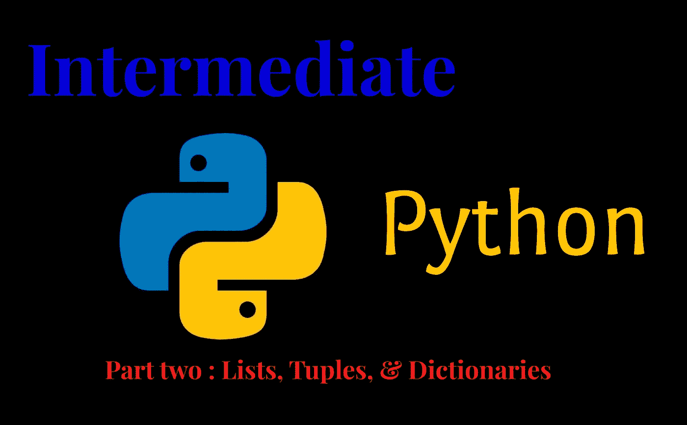
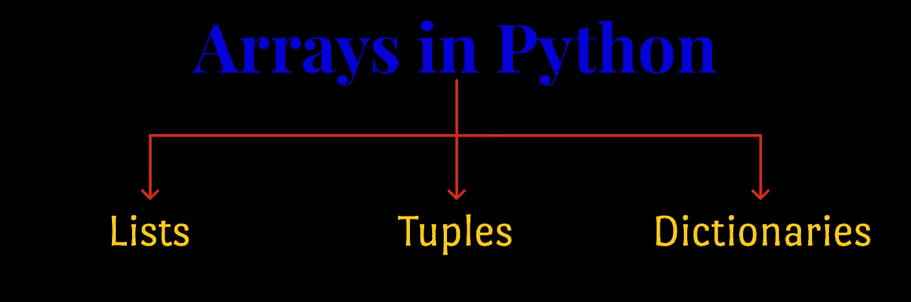
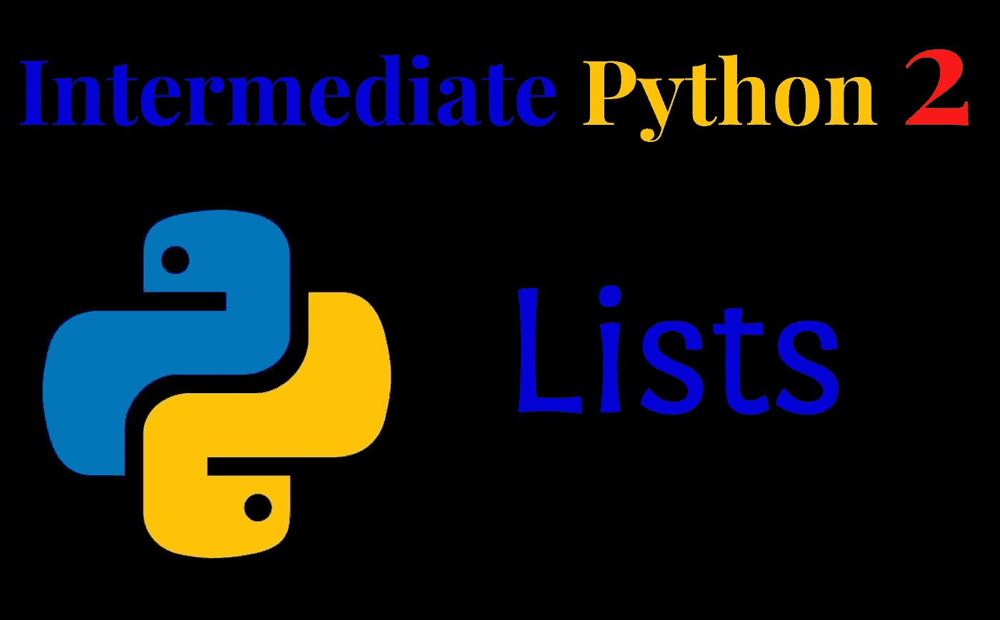
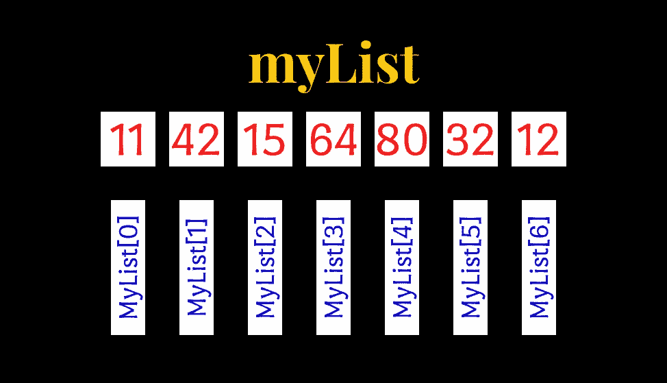
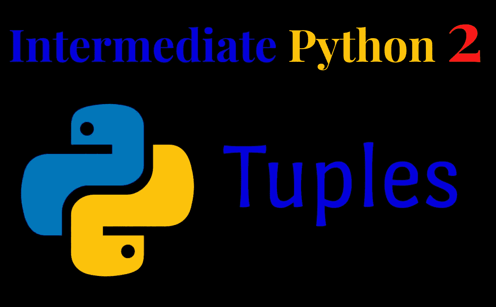
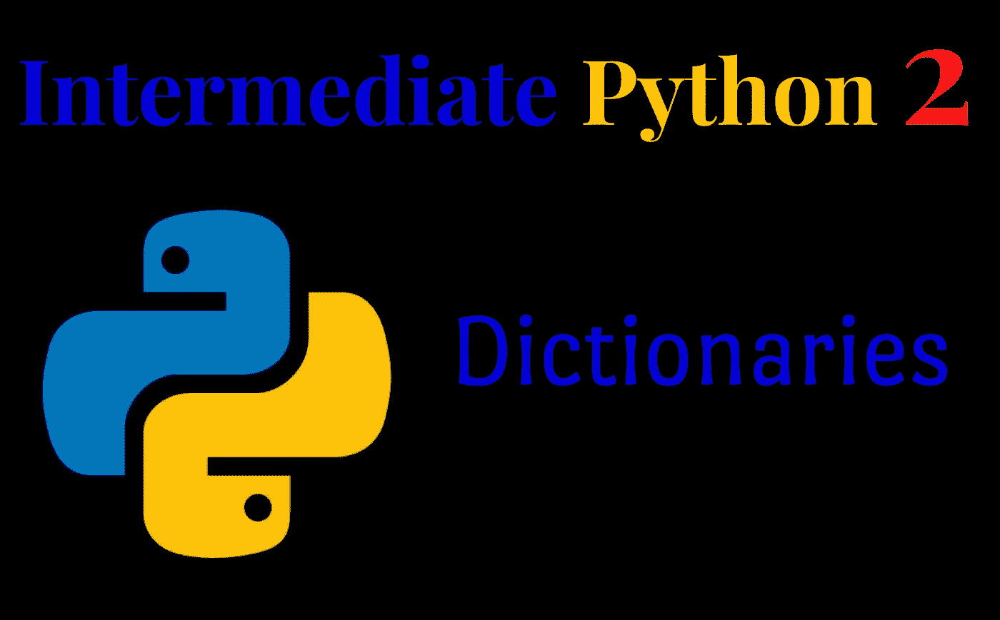
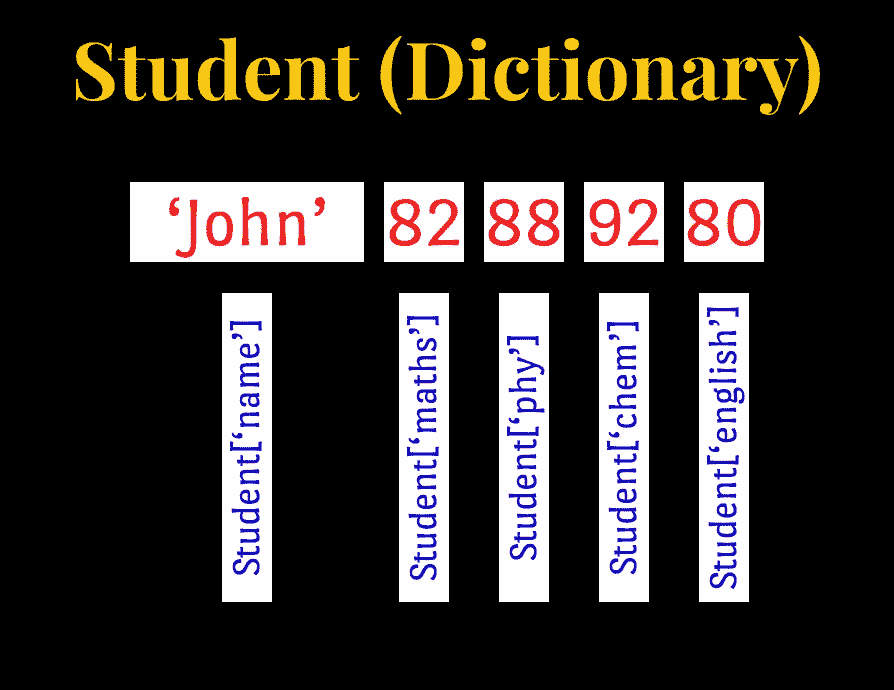

# 中级 Python #2

> 原文：<https://medium.com/analytics-vidhya/intermediate-python-2-3630af254160?source=collection_archive---------8----------------------->

列表、元组和字典



大家好！

这是中级 Python 文章系列的第二篇文章，面向愿意学习 Python 的中级程序员。在我的第一篇文章中，我讨论了一些数据类型、变量以及在 Python 中获取用户输入的方法。首先也是最重要的，我建议你在阅读本文之前先阅读那篇文章，如果你还没有的话。如果你已经阅读了第一篇文章，欢迎你继续。下面是第一篇文章的链接。

[](https://pasandevin.medium.com/intermediate-python-b59455fdfcce) [## 中级 Python #1

### 数据类型、变量和输入

pasandevin.medium.com](https://pasandevin.medium.com/intermediate-python-b59455fdfcce) 

作为一名中级程序员，您必须了解数组。数组在大多数编程语言中都扮演着重要的角色。它们可以存储相同数据类型的固定大小的元素集合。然而，在 Python 中，没有这种称为数组的数据结构。

相反，Python 为我们提供了三种选择。他们是，

1.  列表
2.  元组
3.  字典



现在，让我们逐一讨论一下。

## 列表



python 中的列表数据类型是 Python 中最通用的数据类型，它可以写成方括号中逗号分隔值(项)的列表。列表的一个重要方面是同一列表中的项目不必是同一类型。此外，列表项从零开始索引。下图将帮助您理解列表的索引。考虑一个名为`myList`的列表。



列表索引

您可以通过在方括号之间放置不同的逗号分隔值来创建 Python 列表。

由相同数据类型组成的列表

需要注意的是，当我们访问 Python 列表中的一系列条目时，它只允许我们访问最后一个参数之前的一个索引。这在所有 Python 数据类型和结构中都很常见。

不同数据类型的列表

## 更新和删除列表元素

我们可以通过在赋值操作符的左边提供索引或范围，在右边提供新值来更新单个或多个列表元素。

更新列表元素

要删除列表元素，如果知道要删除的元素的索引，可以使用`del`语句。

如果你不知道这些指数，你可以使用`remove()`方法。(我们将在下一章讨论`remove()`方法)

用 ***del*** 语句删除列表元素

## 内置列表函数和方法

Python 列表有大量的内置函数和方法，使它们更加方便、易于管理和更新。我将向你解释一些最常用的列表函数和方法。

列表函数的示例:

1.  `len(list)`给出了列表的总长度。
2.  `max(list)`返回列表中最大值的项目。
3.  `min(list)`从列表中返回具有最小值的项目。
4.  `sum(list)`返回列表中项目的总和。

要使用列表函数，请将列表名放在要使用的函数名后面的括号内。

使用列表函数

列表方法的示例:

1.  `list.append(obj)`将对象 *obj* 追加到列表中。
2.  `list.count(obj)`返回 *obj* 在*列表*中出现的次数。
3.  `list.extend(seq)`将*序列*的内容追加到*列表*中。
4.  `list.index(obj)`返回*列表*中*对象*出现的最低索引。
5.  `list.insert(index, obj)`将对象 *obj* 插入到*列表*偏移*索引处。*
6.  `list.sort([func])`对*列表*中的对象进行排序，如果给定，使用比较*函数*。
7.  `list.remove(obj)`从*列表*中移除对象 *obj* 。

下面的代码片段演示了如何使用 List 方法。我将使用上面列出的一些方法作为例子。您可以使用相同的语法尝试上述所有方法。

列出方法

## 元组



元组是一系列不可变的 Python 对象。元组是序列，就像列表一样。列表和元组之间有两个主要区别。他们是，

1.  元组不能像列表一样改变。
2.  元组使用括号，而列表使用方括号。

您可以通过放置不同的逗号分隔值来创建 Python 元组。或者，您也可以将这些逗号分隔的值放在括号中。要访问元组中的值，您需要像在 python 列表中一样使用索引。

创建 python 元组

我提到了元组是不可变的，这意味着它们的值在赋值后不能改变。如果我们试图改变一个元组的值，Python 会抛出一个错误。下面的例子说明:

元组是不可变的

几乎所有的内置列表函数和内置列表方法都希望尝试修改元组的方法对元组也是一样的。

元组的函数和方法

如果真的需要修改一个元组，必须先转换成列表再修改。

将元组转换成列表

## 字典



字典用于在键:值对中存储数据值。冒号(:)将每个键与其值分开，逗号将各项分开，花括号将整个字典括起来。一个没有条目的空字典，写出来只有两个花括号。

键在字典中是唯一的，而值可能是也可能不是。要访问字典值，您可以使用熟悉的方括号和键来获取它的值。考虑一本名为*学生*的字典来帮助你理解这一点。

```
Student={'name':'John','maths':82,'phy':88,'chem':92,'english':80}
```

下图演示了如何访问上述字典的值。



Python 词典

您还可以使用相应值的键来更改 python 字典的值。

更新字典值

字典键的重要属性

字典值没有限制。它们可以是任何任意的 Python 对象，标准对象或用户定义的对象。然而，对于键来说，情况并非如此。

关于字典键，您必须记住两个重要的事实。

1.  不允许每个键有多个条目。这意味着不允许有重复的密钥。如果在赋值过程中遇到重复的键，则最后一个赋值的赋值获胜。

为键赋值

2.键必须是不可变的。这意味着您可以使用字符串、数字或元组作为字典键，但不能使用类似['key']的东西。

字典键必须是不可变的

## 字典的内置函数和方法

Python 字典与列表和元组一样，也有许多内置的函数和方法，用于对它们执行各种操作。以下是其中最常见的一些:

1.  `len(dict)`给出了字典 *dict* 的总长度。这将等于字典中的条目数。
2.  `dict.clear()`删除字典 *dict* 的所有元素
3.  `dict.copy()`返回字典 *dict* 的浅拷贝
4.  `dict.items()`返回*字典的*(键，值)元组对的列表
5.  `dict.keys()`返回字典 *dict 的*键列表
6.  `dict.update(dict2)`将字典*字典 2* 的键值对添加到*字典*
7.  `dict.values()`返回字典 *dict 的*值列表

下面的代码片段演示了上述一些方法和函数的用法。你可以用同样的方式玩所有给定的功能。

词典的功能和方法

这是 Python 列表、元组和字典的基础。下面是我上面包含的所有代码的链接。

[](https://github.com/pasandevin/Python_Tutorials/blob/main/Tutorial%202%20-%20Lists%2C%20Tuples%2C%20and%20Dictionaries.ipynb) [## python _ Tutorials/Tutorials 2-列表、元组和字典。

### 我用 Medium 编写的中级 Python 教程系列的学习资料。-Python _ Tutorials/Tutorials 2-列表…

github.com](https://github.com/pasandevin/Python_Tutorials/blob/main/Tutorial%202%20-%20Lists%2C%20Tuples%2C%20and%20Dictionaries.ipynb) 

在结束这篇文章之前，我想给你一些建议。无论你对这些理论有多精通，你都必须有很好的实践知识才能继续 Python 编程。因此，请尝试使用我提供的代码和函数。也可以找好的编程题和竞赛，进一步发展自己的技能。走出去，试着自己解决一些问题。至此，我将结束中级 Python 系列的第二篇文章。在下一篇文章中，我希望讨论 Python 中的决策。在那之前，再见，注意安全！


-帕桑·德文·贾亚华登-