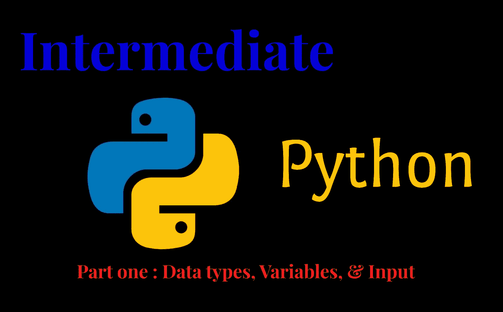
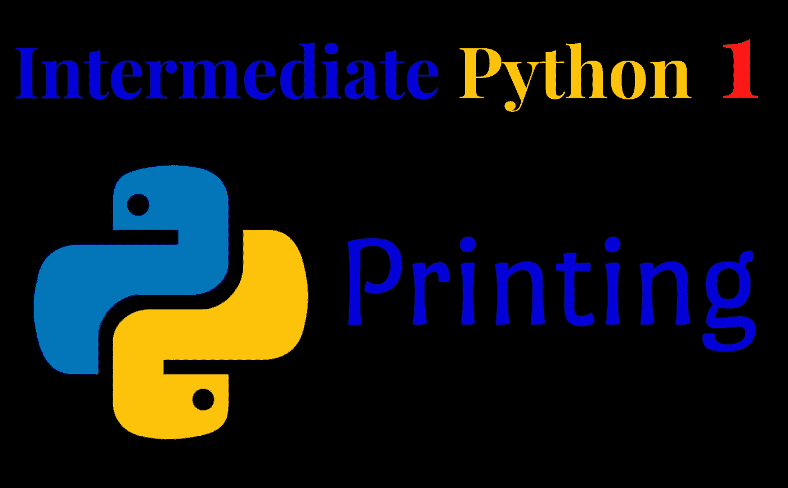
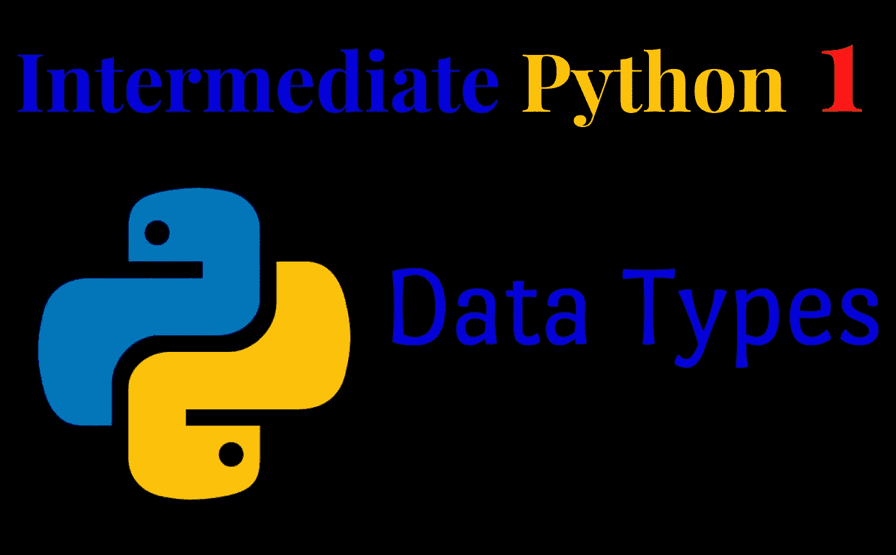
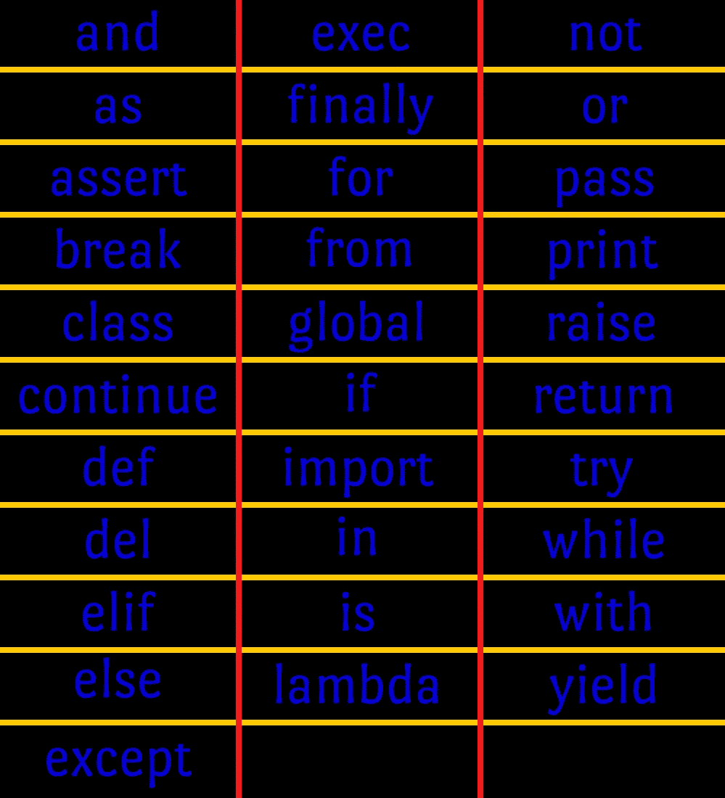
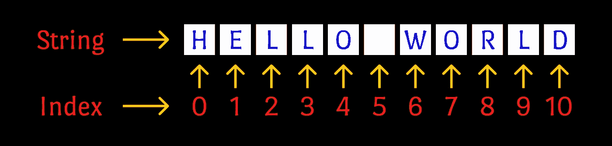

# 中级 Python(第 1 部分)

> 原文：<https://medium.com/analytics-vidhya/intermediate-python-b59455fdfcce?source=collection_archive---------14----------------------->

数据类型、变量和输入

C 是我学习的第一门编程语言。用 C，我能够涵盖许多基本的编程概念，如变量、数据结构、函数、文件处理等。我记得当我刚开始学习 ***Python*** 的时候，作为一个拥有基本编程知识的人，那对我来说真是一段乏味的经历。我在网上找到的大多数教程都涵盖了我已经知道的基本编程知识。即使我在经历了许多必要和不必要的 Youtube 课程后成功地学习了 python，但我仍然相信，对于具有基本编程知识的人来说，这不是最好的 Python 学习体验。于是想到了给中级程序员写 python 教程系列。

如果你有一些编程基础知识，用 python 之外的语言做过编程，想学习 Python 编程，那么这个文章系列很适合你。**需要注意的是，这不是针对初学者的，只针对中级程序员**。因此，我将主要讨论三件事。他们是，

1.  基本 python 语法
2.  python 和其他语言(如 C)的相似之处
3.  python 和其他语言的区别

## 你好 Python

首先，我们来学习一下用 python 把东西打印到控制台的语法。下面是将“Hello World”打印到控制台的代码。

用 python 打印东西

您只需将字符串包含在双引号或单引号中，作为`print()`函数的参数。

## Python 注释

您可以通过添加哈希符号向 python 代码添加注释。下面是一个例子。

向 python 代码添加注释。

## python 代码是如何工作的？

任何对学习 python 感兴趣的人都应该知道，Python 代码不是用来编译和运行的。更确切地说，它是由翻译者翻译的。这意味着即使你的代码有错误，它也能工作，直到找到一个错误。而且遇到这样的错误(可能是语法或者运行时错误)还是会停止运行。下面是一个例子。

python 中的错误。请注意，代码已经执行到发现错误的位置。

## Python 中的数据类型

就像任何其他编程语言一样，Python 也有各种数据类型。事实上，Python 有五种标准数据类型。他们是，

1.  数字
2.  线
3.  目录
4.  元组
5.  词典

数字可以是浮点数，也可以是整数。字符串是字符的集合或字符本身。现在不要担心最后三种数据类型。我将在本系列的后续文章中讨论它们。

## 变量

正如您可能在编程基础中所学的，变量被定义为存储数据的占位符。Python 里也是这样。

但是也有一些不同之处。其中之一是在声明 python 变量时不需要指定变量类型。此外，您可以在程序中间为 Python 变量分配不同类型的值(但是，不建议这样做)。以下是为 python 变量赋值的示例代码。

Python 中的变量

## 命名规格

在命名标识符时，Python 有一些命名约定。在用标识符命名变量、函数、类、模块或其他对象时，应该遵守这些规则。标识符应该总是以字母 ***(A-Z / a-z)*** 或下划线 ***(_)*** 开头，后跟零个或多个字母、下划线和数字 ***(0-9)*** 。Python 不允许标识符中包含任何其他字符，如 ***%、@、(*** )。Python 是区分大小写的。因此，单词 ***【你好】*** 和 ***【你好】*** 在 Python 中被认为是两个不同的单词。

下图显示了 Python 关键字。这些是保留字，不能用作常量、变量或标识符名称。Python 的关键词都是小写字母。

Python 关键字

## Python 中的数字

与其他编程语言相比，python 中的数字要方便得多。Python 程序员在用数字做计算时，不需要担心数据类型。例如，如果您将`*12.5 (float)*`和`15(integer)`相加，您将得到`27.5`，这是作为输出的期望答案。以下是该示例的代码:

Python 中的数字

## Python 字符串

在 Python 中，字符串被定义为用引号表示的一组连续的字符。Python 支持字符串的单引号或双引号。

字符串中的索引

以下是你可以用 python 字符串做的一些基本事情。

Python 中的字符串

## 接受输入

Python `input()`函数将用户键盘输入作为字符串返回。当接受输入时，您可以在括号中指定一条消息出现在控制台中。此外，您可以使用`eval()`函数将其转换成所需的数据类型。下面的代码片段演示了 input()和 eval()函数的一些用例。

接受一个输入(注意我给了 10 作为输入)

接受带有消息的输入(括号中的消息出现在控制台中)

获取输入并连接

您现在可能对上面代码的输出有问题。你可能在想输出应该是 30 对吗？那为什么程序会输出`1020`？嗯，原因是这样的，

当我们给一个 Python 程序输入时，它会被自动当作一个字符串。在这种情况下，`10`和`20`都被当作字符串，而不是数字。因此，当我们将它们相加时，字符串`“10”`和`“20”`被连接在一起，导致`“1020”`作为输出。下面的代码通过使用来自`eval()`函数的帮助给出了解决方案。因为`eval()`函数将字符串转换成数字，所以我们得到 30 作为输出。

获取两个输入值的总和

我估计第一篇就这些了。为了方便起见，我提供了一个 GitHub repo 的链接，其中包含了我讨论过的所有代码。

 [## python _ Tutorials/Tutorials 1-main 上的数据类型、变量和输入

### 我用 Medium 编写的中级 Python 教程系列的学习资料。-Python _ Tutorials/Tutorials 1-数据…

github.com](https://github.com/pasandevin/Python_Tutorials/blob/main/Tutorial%201%20-%20Data%20Types%2C%20Variables%2C%20%26%20Input.ipynb) 

在本系列的下一篇文章中，我将解释 Python 列表、元组和字典。在那之前，再见，注意安全！

-帕桑·德文·贾亚华登-