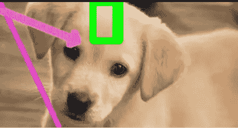

# 实习生日记:OpenCV 简介

> 原文：<https://medium.com/analytics-vidhya/intern-diaries-introduction-to-opencv-81a9db39657a?source=collection_archive---------25----------------------->

在这个博客中，我们将对 OpenCV 库有一个基本的了解。

来源:codementor.io

但是在我们学习 OpenCV 的本质之前，我们需要了解计算机视觉是怎么回事。

# 计算机视觉

这是一个研究领域，其中机器被赋予类似人类的属性来分析图像。就像人类可以识别和分析图像的不同部分一样，计算机也可以通过计算机视觉做到这一点。

## 应用程序

*   用于自动驾驶汽车，使其能够实时分析周围环境并采取相应行动
*   用于视觉监控
*   使用面部识别进行身份验证的消费设备
*   帮助人类完成识别任务(例如:物种识别系统)

# OpenCV

OpenCV(开源计算机视觉)是一个高度优化的图像处理库，由英特尔创建，后来由 Willow Garage 提供支持。现在，它由 Itseez 维护。它的应用主要针对实时计算机视觉。它是一个跨平台的库，可以在 C、C++和 Python 中工作。

## 计算机是如何“看到”图像的？

图像的最基本实体被称为像素或图片元素。它就像图像中的一个彩色点。但是我们的计算机并不把它看作一种颜色，而是以 0 和 1 的形式存在。数字图像是以矩阵的形式存储的。当计算机看到一张图片时，它以像素矩阵的形式看到它，图像分辨率通常以 ppi(或每英寸像素)表示。

因为 openCV 处理的图像本质上是数字矩阵，所以我们需要很好地理解 NumPy 库，它是一个高效的操作工具，可以方便地访问矩阵和数组。

我在之前的博客中已经提到了 NumPy，所以如果你愿意，你可以在这里[查看一下。](/@tanya-gupta18/intern-diaries-numpy-basics-caf6e30460d5)

## **图像类型**

有两种类型的数字图像:

*   **灰度图像:**每个像素只代表一个色调的强度。它代表图像中的光量。它显示为黑白图像，因此，据说它只有一个彩色“通道”。
*   **彩色图像:**有 3 个颜色通道，即红、绿、蓝(RGB)。

## 装置

*   您可以在命令提示符下使用 pip 命令来完成此操作，只需键入以下命令，一切就都准备好了:

`**pip install opencv-python**`

*   对于 anaconda 用户，转到 Anaconda 提示符并键入以下内容:

`**conda install -c conda-forge opencv**`

*   **如果这不起作用，那么**您可以打开 anaconda navigator。转到 environments，然后选择安装 opencv 的环境。
*   然后在未安装包中搜索包中键入 opencv，然后安装。现在，一切都准备好了。

转到环境

选择安装环境

选择未安装

在搜索包中输入“opencv”并安装所有的包。

通过选择 installed 并在搜索包中键入 opencv，可以查看安装是否完成。

## **导入 openCV**

`**import cv2**`

*注意:当我们在 python 中安装 openCV 时，NumPy 库也会随之安装。*

# openCV 入门

以此为例图(来源:scroll.in)

**读取图像:**

`**img = cv2.imread('<full_location_path_of_the_image',<flag value>)**`其中，

*   **第一个参数**是要读取的图像的位置路径。如果您的图像保存在您的项目或笔记本所在的位置，那么我们只需键入图像名称。
*   **标志值:**您只需输入 1、0 或-1。值 1 表示图像将以彩色模式加载，值 0 表示图像将以灰度模式加载，-1 表示图像将以其原始格式(包括 alpha 通道)读取。

> **Alpha 通道:**以数值形式定义像素的透明度。这意味着，如果一个像素在其 alpha 通道中的值为 100%，那么它就是完全不透明的。值为 0%时，像素变得完全透明。

***注意:*** *即使图像的文件路径或名称错误，也不会显示任何错误。然而，在打印其值时，它会显示“无”。*

**显示图像:**

`**cv2.imshow('<window name>',<variable in which the image is stored>)**`哪里，

*   **窗口名称**是一个字符串参数，它给出显示图像的窗口的标题。
*   **第二个参数:**存储图像矩阵形式的变量

仅仅使用 cv2.imshow()只会显示瞬间的图像。为了正确查看，需要配合 **cv2.waitKey( )** 和**cv2 . destroyallwindows()**使用。

`**cv2.waitKey(<time>)**`其中，参数是以毫秒为单位的时间。它等待任何键盘事件的指定时间。如果您在这段时间内按下任何键，图像窗口将会关闭。如果 0 作为参数传递，那么它将无限期地等待一个键事件。

`**cv2.destroyAllwindows()**`摧毁我们创造的所有窗口。

第一个值是高度，第二个值是宽度。因为 img 变量以灰度模式存储图像，所以它只有一个通道。当我们使用 numpy 库的 shape 特性检查我们的图像矩阵的形状时，这一点被指出。如果是灰度图像，那么它将只显示图像的高度和宽度。

当我把标志值设为 1(甚至-1)而不是 0 时，我得到了图像的三维矩阵。数字 3 表示 rgb 颜色通道。

**将图像写入文件:**

`**cv2.imwrite('<new file name>',<image to be saved>)**`

如果操作成功，则返回 true

新的图像文件显示在 Jupyter 笔记本的主页上

## **在图像上绘制几何形状**

**增加一行:**

`**cv2.line(<image>,<start>,<end>,<color>,<thickness of line>)**`其中，

*   **<开始>** 和 **<结束>** :表示你的线的起点和终点坐标的元组。
*   **<颜色>** :类似(b，g，r)的元组值，其中元组中的数值分别用于蓝色、绿色和红色通道。
*   **<线条粗细>** :最小值为 1。

上面的代码片段创建了下面的图像:

对于创建任何其他颜色的线条，bgr 元组中可以有任何值。例如，颜色元组(200，0，203)给了我:

我们可以使用`**cv2.arrowedLine()**`创建一条箭头线，如下所示:

## 绘制矩形:

`cv2.rectangle(<image> , pt1, pt2, <color>,<thickness of the border>)`其中，

*   **pt1:** 矩形左上角的坐标
*   **pt2:** 矩形右下角的坐标

如果您想用颜色填充矩形，而不是厚度值，只需键入-1。

## 画圆

`**cv2.circle(<image>,
,<radius>,<color>,<thickness>)**`

对于中心坐标(100，60)，半径= 45，bgr 元组(150，36，45)，厚度 4。

同样，如果我们用-1 替换厚度值，我们会得到一个实心圆，我们的狗现在会有一个“黑色的眼睛”。

## 在图像上书写文本

`**cv2.putText(<image>,'<text>',<start>,Font_Face, , <color>,<thickness>, <line_type>)**`

其中，start 是指文本的起始坐标，Font_Face 和 line_type 是从 openCV 提供的列表中选择的。

## 您还可以用 numpy.zeros()创建一个图像:

> **鸡毛蒜皮的小事……**
> 
> 因此，如果我们运行`**img.size**` ，那么它会给出该图像的像素数，如果我们运行`**img.dtype**`，它会返回其数据类型。

**分割图像**

我们可以使用以下方法将图像拆分到它们的颜色通道中:

`**blue, green , red = cv2.split(img)**`

红色通道

绿色通道

蓝色信道

## 将独立的频道合并成一个频道:

`**cv2.merge((blue, green, red))**`

## 感兴趣区域

有时我们可能只对图像的特定区域感兴趣。例如，在上面的图片中，一个孩子在学习，我可能对地球感兴趣。这就是我们所说的 ROI。

原象

我得到了地球的坐标，通过从上到下和从左到右的切片，我们得到了地球的裁剪图像。然后，我将这个裁剪后的图像分配到一个相同形状的新位置。

合成图像

今天就到这里，谢谢你看我的博客！！！

祝你今天开心！玩的开心！

## **参考文献:**

*   [https://machinelearningmastery.com/what-is-computer-vision/](https://machinelearningmastery.com/what-is-computer-vision/)
*   [https://bdtechtalks.com/2019/01/14/what-is-computer-vision/](https://bdtechtalks.com/2019/01/14/what-is-computer-vision/)
*   [https://en.wikipedia.org/wiki/Computer_vision](https://en.wikipedia.org/wiki/Computer_vision)
*   [https://towards data science . com/everything-you-everything-everything-you-even-want-to-want-to-know-know-on-computer-vision-here-a look-why-s-so-awesome-e 8 a 58 DFB 641 e](https://towardsdatascience.com/everything-you-ever-wanted-to-know-about-computer-vision-heres-a-look-why-it-s-so-awesome-e8a58dfb641e)
*   [https://en.wikipedia.org/wiki/OpenCV](https://en.wikipedia.org/wiki/OpenCV)
*   [https://realpython.com/lessons/how-computers-see-images/](https://realpython.com/lessons/how-computers-see-images/)