# 实习生日记:线性代数

> 原文：<https://medium.com/analytics-vidhya/intern-diaries-linear-algebra-24b996b0806c?source=collection_archive---------20----------------------->

在今天的博客中，我们将进入事情的本质，沿着记忆的轨迹重温我们“钟爱的”高中数学话题线性代数。我们还将讨论为什么学习线性代数对于开始机器学习是必不可少的。

资料来源:acc.fibfl.ru

## **什么是线性代数？**

它是数学的一个分支，研究向量和矩阵的运算。它是连续数学的一种形式，因此不像离散数学那样受到许多计算机科学家的重视。

然而，尽管如此，我们不能忽视它在机器学习中的重要性。它主要用于以某种方式格式化数据，以便机器学习算法可以理解并处理它。随着博客的继续，我们将讨论线性代数的更多应用。

# 基本术语

这里，我们将首先了解线性代数中常用的一些基本术语:

*   **Vector:** 它是一个数字数组，可以是列格式，也可以是行格式。这意味着它们可以分别垂直或水平表示。

*你也可以说，行向量可以通过对列向量执行转置操作来获得，反之亦然。*

它既有方向又有大小。当我们谈到向量时，它的顺序给了我们数据集的维度。举个例子，

**【x，y，z】=>**这个行向量可以表示为一个箭头，其尾部在原点，头部指向三维空间中的坐标(x，y，z)。换句话说，这个向量的每一个元素给我们一个不同坐标轴的值。

*   矩阵:这是一个标量/数字的二维数组。你甚至可以说它是向量的集合。矩阵的每个元素可以使用行和列索引来分配，而不是在向量的情况下仅使用一个索引。矩阵的阶例如 n×m 可以被定义为 n 行和 m 列。
*   **张量:**是维度大于 2 的向量、矩阵、数组的广义术语。这里，一维张量代表一个向量，二维张量代表一个矩阵。
*   **标量:**在线性代数中只是表示“数”的意思。
*   **迹:**一个方阵的所有对角元素之和。

# 向量运算

## 两个或多个向量的相加:

这是一个非常基本的操作。例如，有两个行向量 a 和 b-

a= [ x1，y1，z1]和 b=[x2，y2，z2]，那么加法将是这样的

a+b = [ x1+x2，y1+y2，z1+z2 ]

所以，我们只是在每个向量的相同索引位置添加元素。

## 但是为什么用 ML 在上下文中添加向量很重要呢？

这是因为，很多时候，在数据集中，我们可能最终拥有多个相似类型的要素。因此，添加这些特征的向量将帮助我们创建一个向量，然后可以使用该向量来预测输出特征。这有助于我们减少数据集中的要素数量，使我们的算法更容易计算。

举个例子，

在“房价预测”的数据集中，我们发现有类似“1stFlrSF”(或一楼平方英尺)、“2ndFlrSF”(或二楼平方英尺)和 GrLivArea(或群体宜居面积)的列。它们都在房子的不同位置定义了区域。

但我们的目的只是预测房子的价格，所以不需要单独使用上述特征。相反，我们可以将它们相加，并在新的列向量“TotalAreaSF”下定义总和。

通过这种方式，减少了要素的数量，并且该新要素仍将与原始要素具有相同的与输出要素的关系，即，房屋的价格随着房屋面积的增加而增加。

在这个例子中，我们所做的是使用求和运算的数字分组，这是一种“特征工程”技术。

## 纯量乘法

它只不过是，数字 x [给定向量中的每个元素]。例如，如果我们有 num= 2 和 vector [2，1，3 ]，那么标量乘法的结果将是，

[ 2*2 , 1*2 , 3*2] = [ 4 , 2 , 6 ]

之前我们说过，向量[x，y，z]代表一个箭头，它指向 3D 中的点(x，y，z)。所以，如果我们想象在这样的向量上做标量乘法，我们所做的只是沿着它原来的方向拉长或缩小这个向量。下图可以说明这一点:

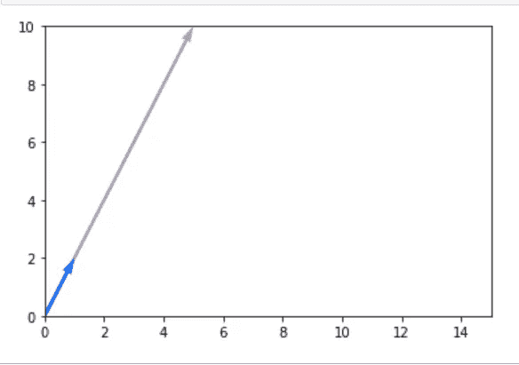

向量[ 1，2 ](蓝色箭头)乘以 5。紫色向量代表拉长的向量。

下面是创建上述图像的代码片段，

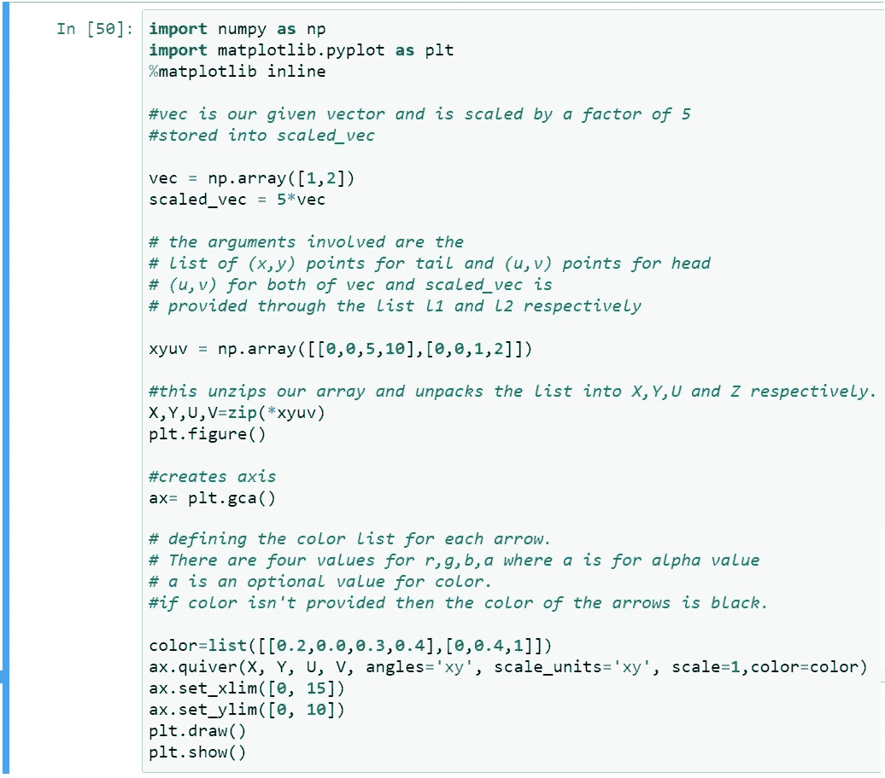

# 向量的大小

“范数”是用于定义向量的大小或长度的术语。也可以说是将向量映射到非负值的函数。它用符号表示，其中 v 是一个矢量。范数有 3 个性质:

*   它总是一个非负值。
*   向量的标量乘法或者减少或者增加范数。
*   三角形不等式:这意味着如果有**两个向量 a 和 b** 并且它们的**相加得到一个向量 c** ，那么 a 和 b 的幅值之和大于或等于向量 c 的幅值即∩**a**∩**+**∩**b**∩**≥**∩**c**∩。

## 规范的种类

范数(也称为 Lᴾ范数)最普遍的符号如下所示:

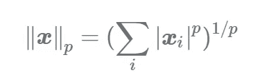

来源:[https://www . data camp . com/community/tutorials/tutorials-machine-learning-basics-norms](https://www.datacamp.com/community/tutorials/tutorial-machine-learning-basics-norms)

在哪里，

|xᵢ|是矢量的 iᵗʰ元素的绝对值。

我们取了绝对值，因为如果我们不这样做，当我们的 p 是奇数，xᵢ为负时，我们的距离可能最终为负，这违背了范数的性质。

基于这个广义的定义，我们有不同类型的规范:

*   **L 范数:(又称欧几里德范数)**p = 2 时得到的范数。它是最常用的范数，定义了从原点到由 n 维向量定义的点的欧几里德距离。
*   **L 范数:**又称**【曼哈顿距离】**或**【出租车几何】**。它只是将向量中所有元素的绝对值相加。这在给定网格且网格线代表街道的情况下非常有用。我们只能沿着“街道”行走，因此使用这个标准可以找到从 A 点到 B 点的最短路径。虽然 L 范数给了我们从 A 到 B 的最短路径，但它不适用于这个场景，因为我们不能走出网格线。

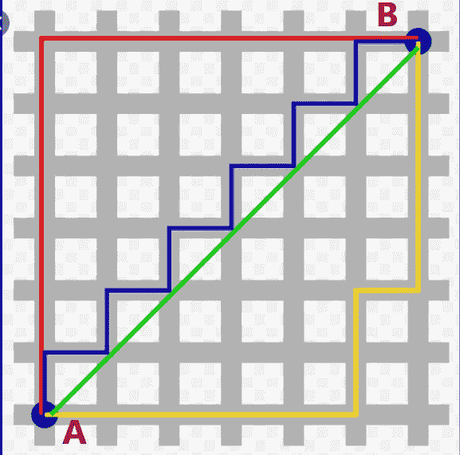

(来源:en.wikipedia.org)红色、蓝色和黄色路径符合 L1 规范，而绿色路径是由 L2 规范给出的直接路径。

*   **L-inf 范数(L-infinity 范数):**这个范数给出了向量的最大绝对值。例如，在一个误差向量中，它指出哪个元素对误差的贡献更大。
*   **L⁰范数:**由于不符合范数的性质，所以从技术上讲不是范数。它只是给出了向量中非零元素的数量。如果我们把 L⁰ 范数乘以任意一个标量 a，那么非零元素的个数不会改变，不满足范数第二性质。

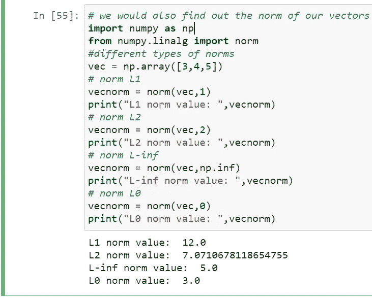

## 两个向量之间的角度

这可以用点积来找出。给定两个向量 **v** 和 **w**

v = [v1，v2，v3，…。，vn]和 w = [ w1，w2，w3，…。wn]点积就是，

VW =(v1 * w1)+(v2 * w2)+(v3 * w3)+…..+(VN * wn)=∨v∨。∨w∨. cosθ

其中，v∨和 w∨是矢量 **v** 和**w**的大小

我们也可以把它写成， **vᵀ.其中，vᵀ是向量 v 的转置，v 和 w 原本是列向量。不用说，它们的维数必须相同。**

*   **正交性:**如果两个向量互相垂直或者它们的点积为 0，那么它们互相“正交”。
*   **超平面:**是 n 维空间中的(n-1)维空间的一部分。所以，如果我们在二维空间，这是一条线。如果我们在三维空间，那么它就是一个平面。对于一个特定的向量，如果某个直线、平面或子空间垂直于它，那么这个直线、平面或子空间称为它的超平面。这些被用作分类器问题的决策边界。

# 矩阵类型的快速复习:

*   **方阵:**行数和列数相等
*   **零或空矩阵:**所有元素为 0
*   **对角矩阵:**沿对角线有非零元素。
*   **单位矩阵:**它是一个方阵，当与一个矩阵相乘时，并不改变那个矩阵的值。所以，我们可以说它保留了它的“身份”。
*   **对称矩阵:**矩阵的转置等于原矩阵
*   **反对称矩阵:**矩阵的转置等于原矩阵乘以标量-1。

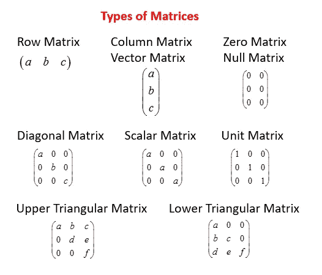

资料来源:onlinemathlearning.com

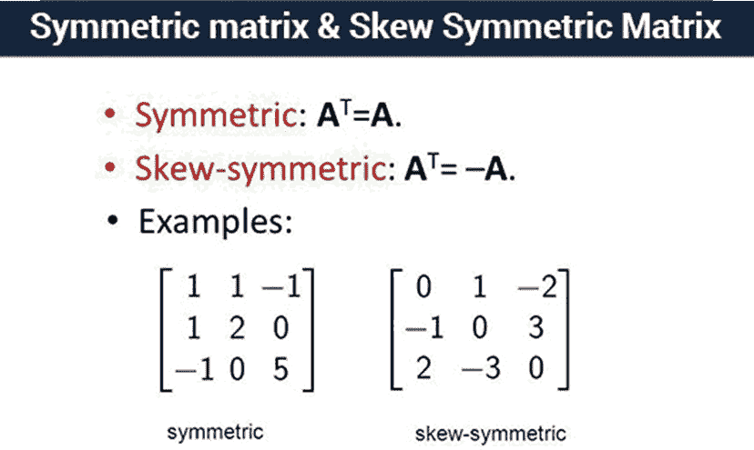

资料来源:flexiprep.com

# 矩阵运算

## **两个矩阵的和**

我们对 2 个矩阵进行元素相加:

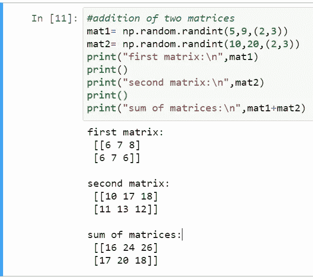

## 向量和矩阵的加法:

通常，如果我们有一个 n×m 阶的矩阵和一个 1×m 阶的向量，那么为了将它们相加，我们需要通过重复 n 次该行来创建一个相同阶的矩阵。但是**“广播”**为我们创造了一条捷径，在这条捷径中，向量被隐式地添加到每一行中。

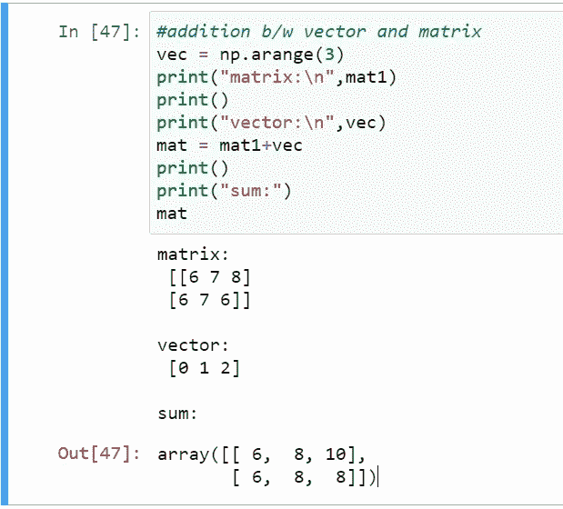

## 纯量乘法

类似于向量，我们也可以用一个标量乘一个矩阵。

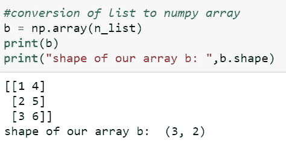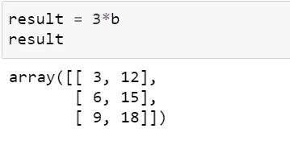

## **两个矩阵相乘**

对于适用于乘法的两个矩阵，第一个矩阵的列数必须等于第二个矩阵的行数。数学上它被定义为，

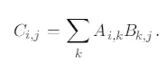

这种逐元素乘法称为 Hadamard 积，用 a≥b 表示。它类似于 a 的 iᵗʰ行和 b 的 jᵗʰ列的点积

> **注:**A 和 B 的矩阵乘法不可交换 or，AB ≠ BA(不一定)但它是分配的【例如:A(B+C) = AB+AC】和结合的【例如:A(BC) = (AB)C】。

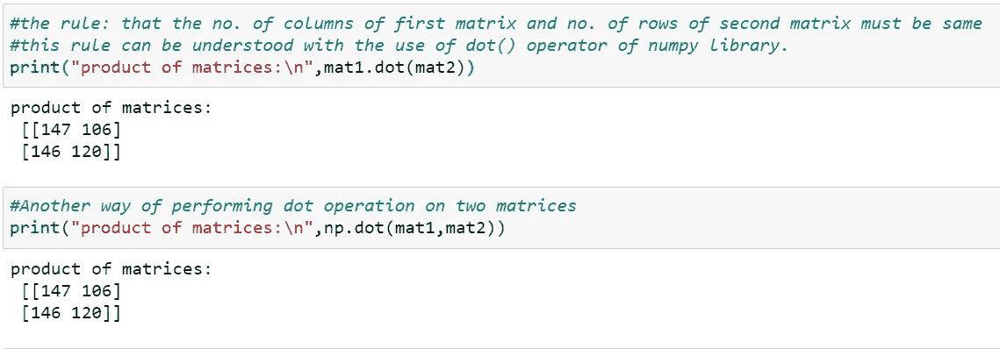

## 单位矩阵

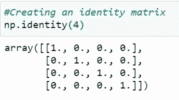

使用 numpy 库创建 4x4 单位矩阵

## 逆矩阵

如果对于矩阵 A，我们有 AB = I，其中 I 是单位矩阵，那么我们说 B 是 A 的逆矩阵。只有方阵可以有逆矩阵，即使这样，也不是所有的方阵都有逆矩阵。没有逆矩阵的方阵称为“奇异矩阵”。这种矩阵的行列式值为 0。

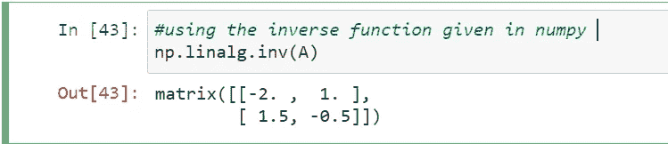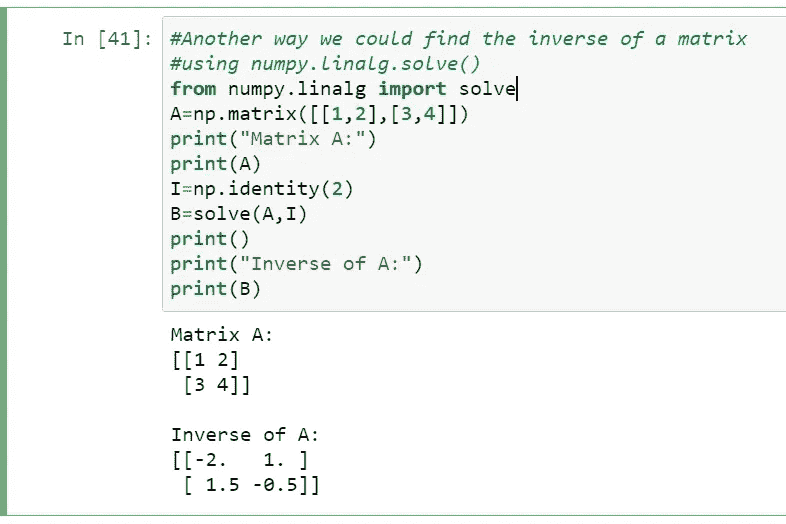

np.solve()求解线性矩阵方程或线性标量方程组。

## 转置矩阵

在这个操作中，我们只是交换行和列。以这种方式，矩阵的维度被翻转。

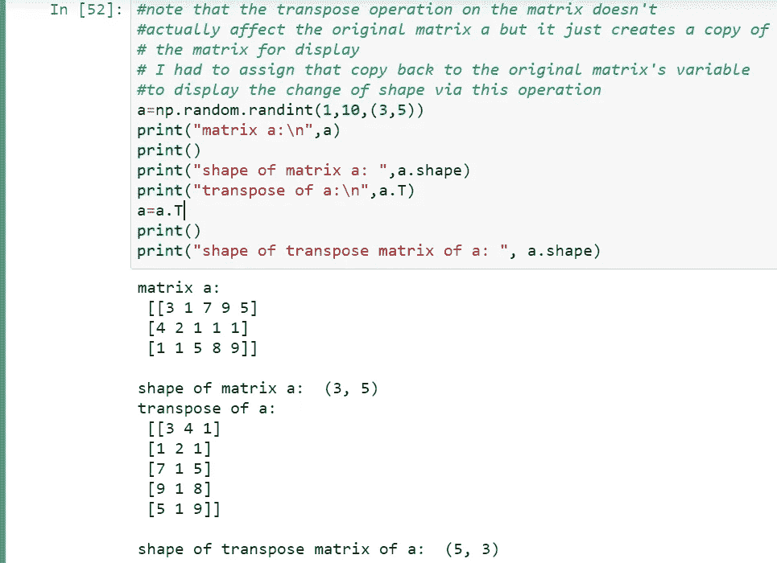

## 特征值和特征向量:

“特征分解”是一种将方阵分解为特征值和特征向量的方法。

***AX =λX***

其中，A 是矩阵，X 是我们的特征向量，λ是称为特征值的标量。根据这个定义，我们看到向量 X 乘以 A 只会导致其大小或比例的变化，而不是方向的变化。这是特征向量的一个性质。

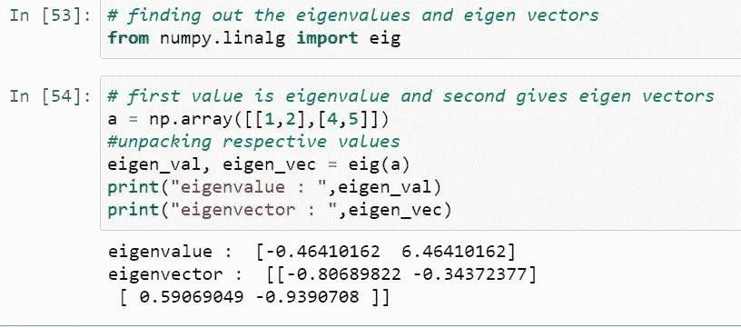

## 决定因素

当我们把一个矩阵和一个向量相乘时，我们看到向量被转换了。这意味着，我们的矢量被缩放，也可能被旋转。甚至在特征值和特征向量的情况下，我们看到一个矩阵乘以一个向量会导致该向量的缩放。这个改变向量形式的标量，隐藏在我们的矩阵下面，我们称之为行列式。这是直觉的想法。

它的正式定义是，

> 在线性代数中，**行列式**是一个标量值，可以从一个方阵的元素中计算出来，并对矩阵所描述的线性变换的某些属性进行编码。矩阵 *A* 的行列式表示为 det( *A* )、det *A* 或| *A* |。

因此，对于一个二维平面上的向量，乘以矩阵可能会导致某个区域的剪切和缩放。对于三维平面，它可能导致单位体积立方体的体积或形状的变化。

不管怎样，直观的想法已经足够了…现在我们来看看它是如何计算的。

对于 2 x 2 矩阵，其定义为:

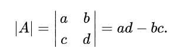

对于 3×3 矩阵，其定义为:

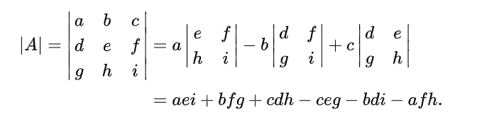

关于行列式值得注意的一件有趣的事情是，如果在与矩阵相乘时，一个向量与一个坐标轴合并，甚至合并成一个点，向量的特征就丢失了。您无法通过与任何矩阵相乘来恢复原始特征。这导致了可逆性。所以一个|A|=0 的矩阵，从这个意义上来说，是不能求逆的，因此，没有逆。

**使用 NumPy 计算行列式的代码片段:**

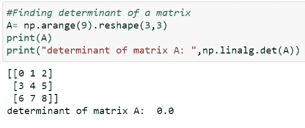

## 线性相关性:

它的思想是一个向量可以表示为一组向量的线性组合。为了理解这个概念，我们需要理解跨度是什么。

**Span:** 对于给定的一组向量，指该组向量中所有可能的标量操作和组合所覆盖的空间中的所有点。对于一个单独的矢量，一个跨度将构成一条直线，它沿着这条直线滑动。

因此，如果向量 a 位于向量 V 的跨度上，那么这意味着它是向量 V 的组合之一，其中一些(或全部)可能已经乘以了标量。

线性相关性的数学定义，

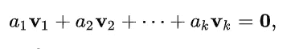

其中 a1，a2，…，ak 是标量，而 v1，v2，…，vk 是向量。

这一概念非常重要，因为线性相关性通常会导致冗余的特征，而这些特征不会提供关于数据集的任何信息。

今天的课就到这里。我希望这篇博客对你有所帮助。感谢您的阅读！！

# 参考资料和有用的链接:

*   [https://www . deep learning book . org/contents/linear _ algebra . html](https://www.deeplearningbook.org/contents/linear_algebra.html)
*   http://datahacker.rs/linear-algebra-for-machine-learning/
*   [https://en . Wikipedia . org/wiki/Linear _ independence # Geometric _ meaning](https://en.wikipedia.org/wiki/Linear_independence#Geometric_meaning)