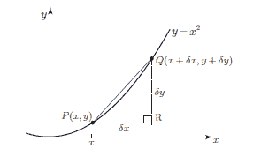
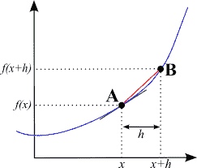
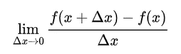
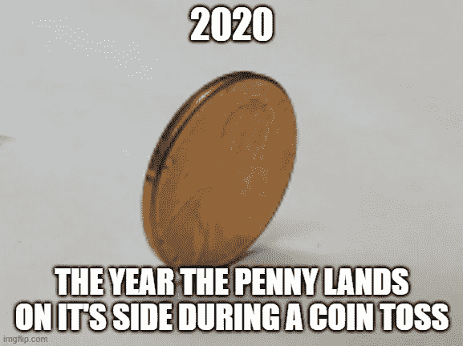
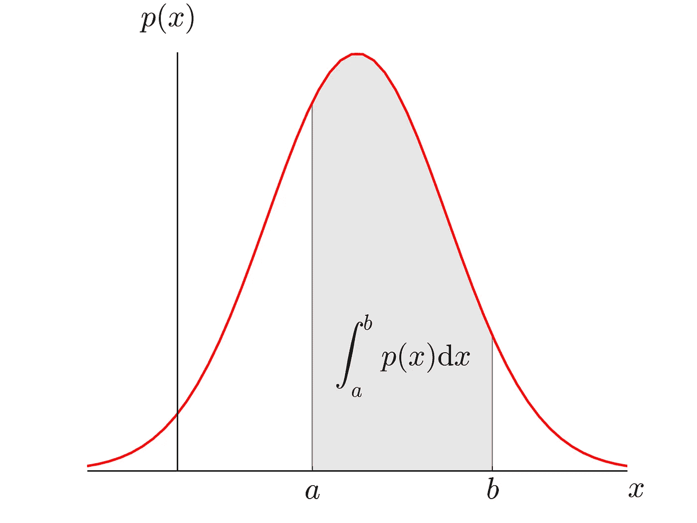
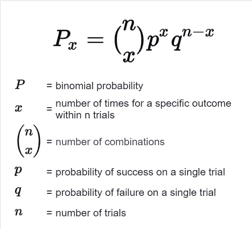

# 实习生日记:数学的 ML

> 原文：<https://medium.com/analytics-vidhya/intern-diaries-mathematics-for-ml-138c3d81b4c9?source=collection_archive---------21----------------------->

今天的博客给大家预热一下机器学习中涉及的数学概念。所以，让我们重温一下在高中的那些日子，那时你绝对“崇拜”数学，并想知道学习这些东西在生活中会有什么用。

资料来源:plus.maths.org

# 我们为什么需要学习数学？

首先，人们需要理解的是，知道机器学习算法所需的库是不够的。为了提高你的实现和对机器学习的掌握，你需要理解算法是如何工作的，这就是数学的用武之地。

*   它帮助您了解某些因素、参数和特征是如何影响结果的。
*   它帮助您选择正确的指标来评估您的实现的工作情况。
*   它有助于表达响应和预测变量之间的关系(至少在监督学习中)，并分析您的模型与数据集的“吻合”程度。

总之:高中数学毕竟不是一无是处…

既然我们已经花时间欣赏了数学之美，那就让我们进入正题吧。

## 机器学习需要关注的四个关键领域:

*   **线性代数**
*   **统计**
*   **微积分**
*   **概率**

这个博客将向你介绍微积分和概率。你可以在下面找到我的线性代数和统计博客:

*   [https://medium . com/analytics-vid hya/intern-diaries-linear-algebra-24b 996 b 0806 c](/analytics-vidhya/intern-diaries-linear-algebra-24b996b0806c)
*   [https://medium . com/analytics-vid hya/intern-diaries-statistics-67c 7 d2e 75192](/analytics-vidhya/intern-diaries-statistics-67c7d2e75192)

# 多元微积分

我们不是判断单个因素对我们输出变量的影响，而是在多元微积分中寻找多个因素。微积分有助于优化我们的机器学习模型的实现。

大多数时候，我们在机器学习中使用微分，例如在梯度下降期间(用于在线性和逻辑回归中找到损失函数的最小值)。

## 区别

这是微积分的子领域，它帮助我们找出我们的输出变量 y 对多重因子 x₁,x₂,…,xₙ有多敏感，其中 y = f(x₁,x₂,…,xₙ).如果多个因素使你困惑，那么只需理解 w.r.t 单因素区分意味着，

(y 的变化)/(x 的变化)=∏y/∏x 其中，y = f(x)= x 的函数

y/x

上图向我们展示了在给定 x(⇼x)变化的情况下，y(⇼y)的变化量。例如，距离相对于时间的变化给了我们速度。在某种程度上，速度是距离对时间的导数。

如果 x 的变化*无穷小*小(⇼x->0)那么，我们称上面的表达式为导数，然后表示为 dy/dx。

换句话说，导数给出了 y w.r.t x 的瞬时变化，它是曲线 y = f(x)在点 x 的切线的斜率:

导数表示为点 A 处切线的斜率。在这种情况下，x = h。因此，对于导数，h 趋向于 0。

在多元微分的情况下，通过使用偏导数，我们可以看到函数 f(x₁,x₂,…,xₙ相对于任何一个因子 x₁,x₂,…,xₙ的变化。

# 差异化快速复习

我们将首先学习 w.r.t 一元微积分，然后再扩展到多元微积分。

## **不同 y 的导数列表**

*   y = x，`**dy/dx = 1**`
*   y =常数，`**dy/dx = 0**`
*   y = xⁿ，`**dy/dx = n*xⁿ⁻¹**`
*   y = a*xⁿ，`**dy/dx = a*n*xⁿ⁻¹**`
*   y = eˣ，`**dy/dx = eˣ**`
*   y = log(x)，`**dy/dx = 1/x**`
*   y = x⁻ⁿ，`**dy/dx = -n*x⁻⁽ⁿ⁺¹⁾**`
*   y = 2ˣ，`**dy/dx = 2ˣ(log 2)**`
*   y = cos(x)，`**dy/dx = -sin(x)**`
*   y = sin(x)，`**dy/dx = cos(x)**`

## **微分求和规则:**

如果 y =第一次+第二次，则 dy/dx = d(第一次)/dx + d(第二次)/dx

例如，设 y = x + 2x⁵，那么，

dy/dx = d(x+2x⁵)/dx = d(x)/dx +d(2x⁵)/dx

dy/dx = 3x + 2*5*x⁴

dy/dx = 3x + 10x⁴

## **产品差异化规则:**

如果 y =第一*第二那么 dy/dx =(第二)*d(第一)/dx +(第一)*d(第二)/dx

例如，y = x* (cos(x))那么，

dy/dx = cos(x)* dx/dx+x * d(cos(x))/dx = cos(x)+x(-sin(x))

## **微分链式法则:**

**我们以 y = sin(x)为例来了解一下。**

1.  dy/dx = d(sin(x ))/dx = dsin(z)/dx 其中， **z= x** 。
2.  首先，我们找到 sin(z)的导数 w.r.t z= **cos(z)**
3.  然后，我们对 z(= x ) w.r.t x 求导，得到 **2*x**
4.  d(sin(x )) =步骤(2)和(3)的乘积= 2 * x * cos(z)=**2 * x * cos(x)**。

简而言之，d(sin x )/dx = d(sin z)/dz * dz/dx

**再比如:**

1.  设 y = (sin x)那么，我们假设 **z = sin(x)**
2.  我们找到 y(= z)w . r . t . z 的导数，即 **2*z**
3.  我们现在找到 z w.r.t x 的导数，这样我们就得到= **cos(x)**
4.  dy/dx = dy/dz * dz/dx = 2 * z * cos(x)=**2 * sin(x)* cos(x)。**

将上述概念推广到多元微积分我们得到偏导数的概念。

## 偏导数及如何求偏导数

部分分化可以用房价的例子来理解。我们可以看到，房价受许多因素的影响，如房间数、楼层数、总面积等。

但是，如果我们想知道某个特定因素(比如总面积)对我们的房价有多大影响(假设其他因素都相同)，那么我们就可以看到价格相对于总面积的变化。因子的这种影响可以使用偏导数来找出。

如果你懂微分，计算起来就很简单了。让我们假设我们区分 f(x₁,x₂,…,xₙ)x₁.你所要做的就是假设所有的自变量都是常数(除了 x₁在这种情况下),并且只区分包含 x₁.的项举个例子，

y = 3*(x₁) + 4*x₂

所以我们对 x₁进行偏导数，

∂y/∂x₁ = ∂(3*(x₁) + 4*x₂)/∂x₁

=∂(3*(x₁))/∂x₁+∂(4*x₂)/∂x₁=6*x₁

第一项的结果是 6*x₁，第二项的结果是 0。我们再举一个例子。

让 y = 3*(x₁) + 4*x₂*x1.然后，

∂y/∂x₁=∂(3*(x₁)+4*x₂*x1)/∂x₁=∂(3*(x₁))/∂x₁+∂(4*x₂*x1)/∂x₁

∂y/∂x₁ = 6*x₁ + 4*x₂

# 可能性

它是数学的一个分支，处理计算事件发生的可能性。这种可能性的值介于 0 和 1 之间，其中 0 表示事件根本不会发生，而 1 表示事件肯定会发生。

***事件发生的概率=预期结果/总结果***

所有的概率加起来都是 1。

例如当我们扔硬币时，

得到正面的概率=得到反面的概率= 1/2。

这可以被发现，因为硬币只有两面，因此，总结果= 2，而这两种情况的期望结果= 1，当将这些值代入上述公式时，我们得到 1/2。

## 重要术语

*   **随机实验:**结果“随机”或不确定的过程。
*   **样本集:**随机实验所有可能结果的集合。
*   **事件:**给定实验的结果。

## 事件的类型

*   **联合事件(A∩B):** 两个事件(A 和 B)可以有共同的结果。例如，我们掷两个骰子。假设事件 A 得到一个偶数，事件 B 得到一个小于 5 的数。事件 A 的结果:{ 2，4，6 }和事件 B 的结果:{1，2，3，4}所以 A∩B = {2，4 }。
*   **分离事件:**它们没有任何共同的结果。以骰子为例，如果事件 a 是奇数，b 是偶数，那么 A∩B = ∅.
*   **独立事件:**第一个事件的结果不影响第二个事件的结果，反之亦然。独立事件和互斥事件的区别在于，因为互斥的两个事件不可能同时发生。

例如，在扔硬币时，我们不能同时得到一个头和一个尾…

资料来源:imgflip.com

好吧，那就算了。至于独立事件，即使它们确实同时发生，它们各自的结果也不会相互影响。

## 概率的类型

*   边际概率:它给出了一个单一事件的概率，没有附加条件，也就是说，我们不关心其他事件的结果。例如，从一副牌中选择国王的概率= 4/52=1/13。
*   **联合概率:**给出两个事件同时发生的概率。例如，当掷骰子时，我们希望找到得到小于 5 的偶数的概率。这里的两个事件是——得到偶数(事件 A)和得到数字< 5(事件 B)。所以，P(A∩B) = 2/6 = 1/3。
*   **条件概率:**给定其他事件已经发生的情况下，一个事件发生的概率。例如，下雨时孩子在外面玩耍的概率。这里事件 A 是“在外面玩”，B 是“下雨”。在我们的例子中，条件概率表示为 P(A|B)或 P(“在外面玩”|“下雨”)。

## 绕道学习条件概率:

如果两个事件 A 和 B 是相关的，那么它们的条件概率是，

**P(A|B) = P(A∩B)/P(B)**

如果 A 和 B 是独立事件(你可以将 A 和 B 的概率相乘):

**P(A | B)= P(A)* P(B)/P(B)= P(A)**

## 贝叶斯定理

它为我们提供了一种通过以下公式找到条件概率的方法:

**P(A | B)= P(B | A)* P(A)/P(B)**这里，

*   P(B|A)给了我们**似然比**
*   P(A)被称为**先验值**，P(A|B)被称为**后验值**
*   P(B)被称为**证据**(很多时候不给我们)

可以使用下面的等式来计算证据，

**P(B)= P(B | A)*P(A)+P(B |非 A)* P(非 A)**

# 概率密度函数(PDF)

这不过是概率的图形表示，而概率现在可以描述为一个函数。PDF 具有以下属性:

*   曲线下的面积= 1
*   这些值都是连续的。
*   随机变量取 x1 和 x2 之间的值的概率是由 x1 和 x2 从两侧界定的曲线下的面积。这可以通过从 x = x1 到 x = x2 对 pdf 进行积分得到，如下所示。

## 二项分布

它给出了重复多次的事件成功或失败的概率。这里求概率的公式由下式给出:

例如，如果一个学生进行了 10 次模拟测试，那么这个学生通过 8 次测试的概率是多少？

因此，对于这个我们有 x = 8，p = 0.5(因为，一个学生可以通过或不通过考试)，n = 10。我们把这些值代入公式，

P = ⁿCₓ .pˣ.(1-p)ⁿ⁻ˣ = ⁰C₈.(0.5)⁸.(1–0.5) = 45*(0.5) ⁰ = 0.0439

**本次分配的条件:**

*   试验的次数是有限的和固定的。
*   事件必须是独立的。
*   每个事件的成功概率必须相同。

*关于正态和标准分布曲线的细节在我的统计博客中给出。*

# 中心极限定理

它指出，

> 如果样本量足够大，任何独立随机变量的均值的抽样分布将是正态或接近正态的。

换句话说，如果我们从总体中抽取足够大的样本量，那么样本均值(每个样本的均值)将近似呈正态分布。增加样本量会导致样本均值的概率分布越来越像正态分布。

***作为一个经验法则，据说样本量至少要 30 个 CLT 才能起作用。***

# 它的实际含义是什么？

它很有用，因为即使您的样本分布是任意随机形状，您的样本均值分布也将接近高斯曲线(给定上述样本大小限制)。

这对于在不访问群体中的每个数据点的情况下发现群体的性质非常有用。

> 除了样本大小之外，CLT 唯一的条件是初始分布必须使我们能够找出样本的平均值。柯西分布就是其中一个例子，我们找不到样本均值。

## 让我们举一个真实的例子:

假设您正在进行一项调查，以确定整个州人民的收入。然而，我们都知道询问州内每个人的收入是不可行的。这就是我们可以应用 CLT 的地方。

所以，我们能做的就是从这个州的一些城市中提取一些样本。这里的样本是每个城市的人数。给定后，我们可以计算每个样本的平均值，并由此绘制概率分布曲线。然后，我们将能够看到曲线与正态分布的相似性，从而利用它的特性找到所需的数据。

# 概率的应用:

*   这有助于我们优化模型
*   可以使用概率计算损失，这进一步帮助我们正确分类数据点。

*****************************************************************

我们的博客到此结束，我希望它能帮助你理解这些数学概念(即使是一点点)。谢谢你阅读我的博客，祝你有美好的一天😄！！！