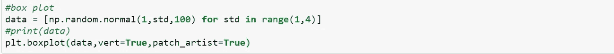

# 实习生日记:Matplotlib 和 Seaborn

> 原文：<https://medium.com/analytics-vidhya/intern-diaries-matplotlib-and-seaborn-922061d8107e?source=collection_archive---------24----------------------->

在这篇博客中，我们将看到如何使用 matplolib 和 seaborn 库来可视化我们的数据。

**来源:pythonprogramming.in**

首先，我们将了解 matplotlib 库。

# **Matplotlib:**

## **简介:**

这是一个 Python 中的大型可视化库，用于创建二维或三维数据集的绘图。它的基础库是 NumPy，旨在与更广泛的 SciPy 堆栈一起工作。

## **设置环境:**

**安装 matplotlib** 有两种方法-

1.通过安装 anaconda:这个包预安装在 python 的 anaconda 发行版中。

2.通过使用 pip 命令:在命令提示符下，只需键入“pip install matplotlib”。

## 【matplotlib 入门:

像任何包一样，我们需要首先导入 matplotlib。如果你在 Jupyter 笔记本上工作，启用 matplotlib 的交互模式会增加便利性。互动模式的优势:

*   这种模式使我们能够绘制不同类型的图形
*   放大图表以查看详细信息
*   保存图表以备后用。
*   在每个语句后更新我们的图

在 Jupyter 中启用内联后端。这样你就不需要每次想要显示你的绘图时都编写 plt.show()。

**如何导入:**只需输入，

`**import matplotlib.pyplot as plt**`

**在 Jupyter 笔记本中启用交互模式和内嵌后端:**

`**%matplotlib notebook**`

## **创建图表:**

**plt.scatter(x，y，c=' < color > '):** 它以点的形式绘制数据集中的每个点。点的位置给出了变量之间关系的信息。它的论点是:

*   **x 和 y:** 都可以是浮点值，也可以是数组
*   **c:** 用于指定点的颜色。c 的值可以是“r”代表红色，“g”代表绿色，“b”代表蓝色。

**plt.xlabel( <标签> )** 和 **plt.ylabel( <标签> ):** 使我们能够分别给 x 轴和 y 轴一个标签。

**PLT . title(<string>):**我们可以用这个给一个图加标题。

**PLT . save fig(<Name _ file>):**您可以将图形保存为图像格式。

## 下图的代码片段:

使用 plt.scatter()创建

## **使用 plt.plot(x，y，< format_string > ):**

给定函数的参数是-

*   **x 和 y:** 这是水平轴和垂直轴上的间隔标记。
*   **fmt 或格式字符串:**这可以包括颜色符号和绘图中线条出现的样式。如果没有提到颜色符号，那么默认情况下，图表会有一条蓝色线。例如，在下图中，我们使用了“r-*”样式格式，这意味着红线将显示为一条连续的线，这条线上的点将标记为“*”。

如果我们使用了' r- -* '，那么我们将得到第二个图像，如果格式字符串是' ro '，那么我们将得到第三个图像。

下面给出的所有语法格式给出了相同的结果(第一个图):

*   plt.plot(x，y，' r* '，linestyle='-'，markersize=10)
*   plt.plot(x，y，' r* '，ls='-'，markersize=10)
*   plt.plot(x，y，' r-* '，markersize=10)

图 1

图 2

图 3

## **创建支线剧情:**

**plt.subplots(nr，nc，index)** 帮助我们在一块画布上创建多个情节。它主要有三个论点-

*   **nr:** 行数
*   **nc:** 列数
*   **索引:**给出每个支线剧情的索引位置。例如，如果 nr=2，nc=2，index=3，我们将在画布的第 2 行第 1 列的位置有一个子图。

画布(显示我们的图形的地方)分为 nr 行和 nc 列。因此，对于下面给出的代码片段，我们得到:

## **创建条形图:**

我们使用 **plt.bar(x，高度，宽度，对齐，颜色)**其中，

*   这些是我们数据集(标量序列)的 x 坐标
*   **height:** 给出每个单独条的高度(标量序列)
*   **宽度:**给出每个条形的宽度；默认值为 0.8
*   **对齐:**值可以是“中心”或“边缘”(默认:“中心”)。
*   **颜色:**给条形指定颜色(可选)

## 下图的代码片段:

## **要创建带网格线的条形图，我们使用:**

**plt.grid(b，which，axis，color，linestyle)** 其中，

*   b: 是一个布尔值。如果你想要网格线，然后分配真(可选)
*   **which:** 表示定制哪些网格线。它可以有“主要”、“次要”或“两者”选项。(可选)
*   **轴:**说明网格线应沿哪个轴应用，即我们需要水平或垂直网格线，还是两个轴都需要。可接受的值包括(' x '，' y '和' both ')。
*   **颜色:**给网格线分配一种颜色(可选)
*   **线条样式:**将网格线样式化。例如，它可以有诸如、—、— —等值。

## 代码片段:

我们也可以使用 **plt.barh(x，height):** 创建水平条形图

*(注意:Seaborn 的条形图比 matplotlib 的好得多)*

## **创建直方图:**

我们使用 **plt.hist(x，bin)**其中，

*   **x:** 标量值序列(可以是单个数组，也可以是一系列数组)
*   **bin:**要么是整数，要么是整数序列。它为该变量指定了连续的、不重叠的间隔。其默认值为 10。

## 创建下图的代码片段:

## **创建饼图:**

我们可以使用， **plt.pie(x，explode，labels，colors，autopct，shadow)** 来完成此操作，其中，

*   **x:** 楔形尺寸的数组或列表
*   **展开:**数字序列，提供了扇形从我们的饼图中分离的程度。
*   **标签:**这是一个可选的字符串列表，给出了每个楔形区的标签。
*   **颜色:**matplotlib 接受的颜色列表
*   **autopct:** 这是一个应用于所有楔形标签的格式字符串(可选)
*   **阴影:**要给饼图添加阴影效果，将该参数设为 True。

## 创建下图的代码片段:

## **创建方框图:**

箱形图给出了数据集中的最小、第 25、第 50、第 75 和最大百分位。

我们可以使用 **plt.boxplot( x，vert，patch_artist )** 来创建它，其中，

*   **x:** 是向量的数组
*   **vert:** 为布尔值；如果你想要垂直方框图，然后将其赋值为 True
*   **patch_artist:** 如果为假，那么这个盒子是用 Line2D artist 制作的，否则，它是用 Patch artist 制作的。

## 箱形图的解释

*   盒子外面最下面的线给了我们最小的百分位数。
*   我们盒子的最底部边缘给出了第 25 个百分点。
*   框中的中线给出了中间值或第 50 个百分位数。
*   最上边给了我们 75 个百分点
*   盒子外面最上面的线给了我们第 100 百分位。

## 创建下图的代码片段:

# **Seaborn**

可视化和分析单变量和双变量问题是相当容易的。但是，当数据集中的每个输入都有两个以上的要素时，分析中的真正问题就来了。这就是 seaborn 前来救援的地方。

Seaborn 是一个基于 matplotlib 库的可视化库。它为创建结合美学特征的信息统计图表提供了高级界面。

## 设置环境:

同样，我们有两种方法-

*   在命令提示符下使用 pip 命令。只需输入以下内容，它就会被安装

`**pip install seaborn**`

*   或者，只需安装好旧的 Anaconda 发行版，就万事大吉了。

# Seaborn 入门

我们在 Seaborn 有不同类型的分布图:

*   距离图
*   接合图(对双变量分析特别有用)
*   pairplot(适用于包含 3 个或 3 个以上要素的数据集)

*这些分布是针对连续特征的。*

## 要导入 Seaborn:

`import seaborn as sns`

今天，我们将通过使用一个名为“tips”的数据集来学习。像“提示”一样，Seaborn 中有许多内置的数据集。这可以通过使用`**sns.load_dataset(<name_of_dataset>).**`来访问

## 关于“提示”数据集的一些信息…

*   它包含关于在餐馆给小费的顾客的数据
*   数据集有这样的信息，**总账单**、**小费**、**性别**、**吸烟者**(顾客是否吸烟)、**日**(进行观察的那一天)、**时间**(例如午餐，何时给小费)、**规模**(他们用餐时的群体规模)。

因为我们想从输入中找到 tip，tip 就变成了输出/因变量，而其余的特性则属于我们的自变量。

这是我们数据集的前五个值的样子

# 锡伯恩的热图

在我们介绍这个话题之前，我们需要对什么是相关性有一些基本的概念。

## **关联:**

它是一种统计方法，用于定义两个变量之间的关系。它是由数值介于-1 和+1 之间的相关系数来定义的。如果相关性为正，则表明这两个变量走向相同。如果一个变量的值增加，其他的也会增加。

如果相关系数=+1，则称为完全相关。这表明这两个实体走向相同的方向，并且百分比完全相同。

同样，负相关意味着两个实体走向相反的方向，零相关意味着它们之间没有关系。

总账单、小费和金额之间的相关性

## 回到热图…

热图是 seaborn 的一个特性，它可以帮助我们找到特性之间的关联。重要的一点是，相关性只能在数据类型为浮点数或整数的变量之间找到。它不适用于分类数据类型(它们是对象类型而不是标量值)。

斜体部分解释了为什么只发现了账单总额、小费和金额之间的关系。

从热图和相关性的图像中，我们可以看到以下关系:

*   随着我们账单总额的增加，我们的小费也增加了。
*   随着用餐人数的增加，我们的小费也会增加。但是当我们的账单总额增加时，小费增加的数量就少了。与 total_bill 和 tip 相比，大小和 tip 之间的相关值较低，这也表明了这一点。
*   在热图中，颜色越深，相关性越小。

## 接合图

它用于分析两个变量之间的关系。在这里，我们将应用于特征:“提示”和“大小”。

**代码片段:**

在哪里，

*   **x 和 y:** 是我们要分析其关系的特征
*   **数据:**用于传递数据集
*   **种类:**定义要绘制的图形种类。它可以有值“十六进制”或“注册”。在“hex”的情况下，if 以六边形的形式绘制图形上的点。在“reg”的情况下，它代表回归。它绘制了一条回归线，给出了数据集的概率分布。

黄色圆圈代表高浓度点。大多数人给了 2 美元的小费。大多数人倾向于 2 号群体。这可以使用直方图(给出单变量分析)来推导

当 kind='reg '

## **成对图或散点图:**

这对于具有两个以上独立要素的数据集非常有用。它为我们特征的每一种可能的组合绘制了两个变量之间的图表。该特征也必须是整数值或浮点值。

在散点图中，我们可以根据数据集的特征对点进行分类。我们可以通过以下方式实现这一切:

`sns.pairplot(df,hue='sex')`在哪里，

df 是我们的数据集，而`hue`被赋予我们想要用来对图进行分类的特征。分类后，我们的配对图如下所示:

## 距离图:

它用于绘制直方图，我们可以在同一个图形中绘制 kde 或概率分布曲线。

`sns.distplot(df['tip'],kde=True,bins=10)`哪里，

**第一个参数**是我们要绘制直方图或 kde 的整型或浮点型数据类型特征。

**kde(核密度估计):**为布尔值；如果为真，它将绘制第一个参数的概率分布，纵轴中的值将在(0，1)的范围内。默认值为 True。

**bin:**类似于 plt.hist()中的，我们可以设置连续不重叠区间的个数。

# 分类图:

**countplot():** 它使用条形图显示分类特征的分布。

`sns.countplot('<categorical_feature>',data=df)`其中，

1.  **第一个参数**是我们想要绘制的分类特征。如果我们把它作为 y 值传递，我们会得到一个水平条形图。它的默认传递方式是作为 x 值。
2.  **数据:**指我们的数据集

**boxplot( ):**

`sns.boxplot(x=<feature>,y=<feature>,data=<data_set>,hue=<feature>,orient=<v|h>)`在哪里，

1.  第一个参数显示在 x 轴上(可选)
2.  第二个参数显示在 y 轴上(可选)
3.  **数据:**要绘制的数据集
4.  **色调:**待分类的特征。基于此，我们将获得不同群体的数据。例如:我们可以显示吸烟者或不吸烟者的数据。
5.  **orient:** 希望绘图是水平的还是垂直的(可选)

**小提琴剧情:**

结合了箱线图和 kde 分布图。其语法如下所示:

`sns.violinplot(x='<value'>,y='<value'>,data=<dataset>,palette=<'color_scheme'>)`

仔细观察我们的图表，我们看到在 kde 分布的中间，我们也有一个箱线图。

不用说，这是一个很大的话题，我强烈建议您阅读文档并尝试这些功能。这是一个关于 matplotlib 和 seaborn 库函数的基本概念的博客。

今天就到这里，非常感谢你阅读这个博客！！