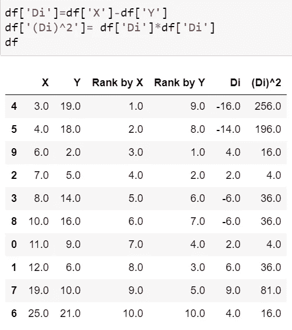

# 实习生日记:统计

> 原文：<https://medium.com/analytics-vidhya/intern-diaries-statistics-67c7d2e75192?source=collection_archive---------29----------------------->

在这个博客中，我们学习用统计数据处理数字。这个博客将是对高中数学中已经学到的概念的快速复习，也将引入机器学习背景下的新主题。

资料来源:forbes.com

# 为什么我们需要学习统计学？

在这个时代，我们有大量的数据需要处理和理解。但是，如何开始对数据集执行操作呢？当一个人对给定的数据有足够的信息来分析和处理它时，它就开始了。这是用统计学来做的。统计学只不过是收集大量信息并从中推断出某些细节以备后用的实践。下面是统计学在机器学习中的一些应用:

*   清理和准备数据集
*   帮助选择型号
*   有助于从一系列观察中获取信息，并根据这些信息做出推断
*   有助于发现不同变量和数据之间的相关性

# 基本主题的快速复习

*   **百分位数:**如果一个序列中的某个数字落在 n%百分位数以下，则表明该数字大于该序列中数字的 n%。我们首先按照升序对序列进行排序，从而找到百分位数。

然后，我们用公式 **n =( P/100)*N** 计算

其中，N 是序列中的排名，P 是要计算的百分位数，N 是数据集或序列中值的数量。

*   **分位数:**它们构成了数据集的第 25、50、75 和 100 个百分点。
*   **Mean:** 它是值的总和除以数据集的值的数量。
*   **中位数:**在某些情况下，均值给出的集中趋势的度量值会偏离很多。这导致了关于数据的错误推断。为了抑制这种情况，我们对给定的数据进行排序并选取中间值(或者如果值的数量是偶数，则选取 2 个中间值的平均值)。这个中项是我们的中位数。这有助于减少异常值的影响。例如:[1，2，5，6，45]在这种情况下，45 是我们想要减少其影响的异常值。因此，我们选择 5 作为我们的中心趋势指标。
*   **模式:**数据集最频繁出现的值。
*   **标准差和方差:**方差计算如下:

**∑ (xᵢ-μₓ)(xᵢ-μₓ)/n** 从 i =1 到 i=n

其中 n 是数据集**中值的数量，μₓ** 是给定数据值的平均值。标准差就是方差的平方根。

# 重要概念

*   **人口:**是相似物品的汇集。群体中此类项目的数量通常非常大，以至于从中创建数据集成为一项单调乏味的工作。例如，如果我们想收集某个州感染新冠肺炎病毒人数的数据，那么该州的人民就是总人口。
*   **样本:**再次类似于人口，是一组相似的项目，但规模要小得多。因此，样本是总体的一个子集。体积越小，我们收集数据和计算数据就越容易。在前面的例子中，我们可以随机选取该州的一个或两个区域作为样本数据。
*   **随机变量:**它只是表示与某个随机事件相关的结果。它有两种类型:离散型和连续型。一个离散的随机变量，只能有整数值。任何随机的人都会有整数个孩子。一个连续的随机变量，在给定的范围内可以有实数的值。例如，任何随机的房子都会有实数的价格。

## **高斯或正态分布:**

资料来源:hyperphysics.phy-astr.gsu.edu

它是连续随机变量的钟形概率分布曲线。它以平均值为中心。它给出了随机变量可能值的概率密度。平均μ和标准差σ的 GD 特性包括:

1.  连续随机变量假设值的 68%位于左边的第一个σ和右边的第一个σ之间。
2.  随机变量的值的 95%位于曲线两侧的第二σ之间。
3.  随机变量的值的 99.7%位于曲线任一侧的第三σ之间。

高斯分布曲线中涉及的函数

*这种曲线可以在包含身高或血压测量值的数据集上看到。*

## **对数正态分布曲线:**

资料来源:wiki.analytica.com

它具有与高斯分布曲线相似的形状，但是它更加向右倾斜，即，朝向它的右侧，它变得越来越长。对于连续的随机变量，这种分布可以定义为该随机变量假定的所有值的对数的正态分布，

给定一个 x ∈ X(随机变量)，对于给定的μ和σ，它有 log(x)的正态分布曲线。

> 这种曲线的例子可以在一个关于人们收入的数据集上观察到。这背后的逻辑是，低收入的人(相对)较少，随着我们收入的增加，我们看到既不低也不高的收入(中产阶级)更容易被看到。然后随着收入的增加，我们看到曲线变平了。这是因为只有越来越少的人有这么高的收入。

## **标准正态分布:**

资料来源:spss-tutorials.com

μ=0，σ=1 时为正态分布。当我们有不同的特征，其值的范围有很大差异时，我们通过将它们各自的概率分布转换成标准的正态分布来缩小范围。以这种方式缩小要素有助于提高模型的准确性。

## **协方差:**

它提供了一种方法，通过这种方法我们可以衡量两个随机变量之间的关系。它在数学上可以定义为，

**cov(x，y) = ∑ (xᵢ-μₓ)(yᵢ-μᵧ)/n**

其中，μₓ和μᵧ是随机变量 x 和 y 的平均值，而 n 是数据值的数量。 **∑** 从 i=1 到 i=n 发生

看上面的公式，我们可以看到方差和协方差之间的一些相似之处。协方差处理 2 个随机变量，而我们的方差只处理一个，因此，我们将有第二个(xᵢ-μₓ)方差公式，而不是(yᵢ-μᵧ):

**var(x，x) = ∑ (xᵢ-μₓ)(xᵢ-μₓ)/n**

**协方差方向:**

*   如果 cov(x，y)为正，那么 x 和 y 将在同一方向增长。
*   如果 cov(x，y)是负的，那么 x 和 y 的方向相反。

> **局限性:**x 和 y 之间的协方差不能告诉我们随机变量之间的正或负的程度。它只是告诉相对方向。

## **皮尔逊相关系数(ρ(x，y)):**

为了克服上述局限性，引入了皮尔逊相关系数。这不仅用于说明两个随机变量之间关系的方向，还用于说明其强度。它可以被发现为:

**ρ(x，y) = cov(x,y)/(σₓ。σᵧ)**

其中，σₓ和σ **ᵧ** 是各自变量的标准差。 **ρ(x，y)** 的值仅位于-1 和+1 之间(含这两个值)。我们将看到 **ρ(x，y)** 的不同值，以及我们如何解读它们。

这是找出皮尔逊相关系数的一种方法:使用 np.std()和 np.cov()函数。上述 x 和 y 值的图表和相关性在第一个解释图中给出。

下面的值是使用上述方法和 numpy 的 corrcoef()函数计算的。

该函数通常返回一个 2 乘 2 矩阵，其中在位置[0][0]和[1][1]处，它分别显示 x 和 y 的相关性，而在[0][1]和[1][0]处，它显示 x 和 y 之间的相关性。

## 解释:

我们的皮尔逊系数越接近 1，相关性就越大，变量之间或多或少成正比。

对于 x 和 y 的这些值，我们有下面给出的图表和系数值:

与上一幅图相比，它的皮尔逊系数更小，这最终表明它比前一幅图具有更大的随机性。

系数为负。这表明，随着 x 增加，y 减少，并且非常接近-1，我们可以看到这些点几乎与红线对齐。它们成反比，随机性很小。

系数越接近零，在图中看到的随机性就越大，两个随机变量之间似乎没有真正的相关性。

## 斯皮尔曼等级相关系数；

皮尔逊系数看起来不错，但它仍然有局限性:它仅显示两个随机变量之间的线性相关程度，即，即使数据之间的实际相关性很高，皮尔逊系数也可能会由于变量之间的线性度较低而给出较低的值。

然而，Spearman 的等级系数处理了这个问题。它不是直接使用 x 和 y 的值，而是使用皮尔逊系数公式中 x 和 y 值的等级:

**ρ=rᵧ)/(σᵣₓcov(rₓ。σᵣᵧ)**

其中，Rₓ和 Rᵧ是 x 和 y 随机变量元素的秩， **σᵣₓ** 和 **σᵣᵧ** 是 x 和 y 秩的标准差

该系数用于热图和探索性数据分析。

## 求斯皮尔曼秩系数的步骤:

*   首先按升序对 x 列进行排序，并从 1 开始为该列中的每个元素指定一个等级。
*   然后，我们从 1 开始将等级分配给相应的 y 值。

根据“X”值对数据帧进行排序，然后根据 X 和 y 进行排序

*   然后，我们求 x 的秩和 y 的秩的差，求它的平方。

*   找出这些平方和 **∑(di)** ，并将其应用于下面给出的公式:

**ρ = 1- 6*∑(di) /n*(n -1)。**

只有当所有 n 阶都不同时，才使用上述公式。

**我们得到的值，为上面的数据为，**

***注:*** *寻找相关性有助于我们找到可能相互依赖的特征。如果存在多个像这样的要素，那么除了一个之外，其余的要素将被移除，因为它们在数据集上不提供新信息。*

# 查找数据集中的异常值:

下面给出的是示例数据集，

*   **异常值:**这些数据点与其他数据点有很大的距离。离群值可能是由于数据收集中的人为错误或数据集中有太多变化而导致的。有时，它们被添加作为测试检测方法的虚拟对象。异常值会导致均值和标准差发生不必要的变化。
*   **Z 分数:**在概率分布图中，这些 Z 分数告诉我们我们的数据点离数据集的平均值有多远。在这里，我们看到，如果数据点的 Z 分数位于第三个标准差范围之外，则它被视为异常值。将数据集转换为标准正态分布形式的 z 得分公式为:

**Z = (xi-μ)/σ** 对于 i =1 到 i = n 其中 n 是数据集的大小。(Z≤3 表示点不是异常值)。

使用 z 值查找异常值的代码片段。这里，极限是标准差的值，超出该值的数据点将被视为异常值。

*   **IQR:** **四分位区间**是指数据集第 75 和第 25 百分位之间的差值。计算百分位数的方法已经在复习部分说明了。在这种方法中，如果我们的数据点位于 **q1-IQR*1.5(下限)**和 **q3+IQR*1.5(上限)**之间，那么它就不是异常值。这里，q1 和 q3 分别代表第 25 和第 75 百分位。

这些下限和上限将在我们的循环中用于每个数据点。如果它们位于这些界限之间，那么它是好的，否则它是一个离群值。

除了这两种方法，我们还可以使用散点图和箱线图来发现异常值。

圈起来的点给了我们异常值。

今天就到这里，非常感谢你阅读我的博客！！！