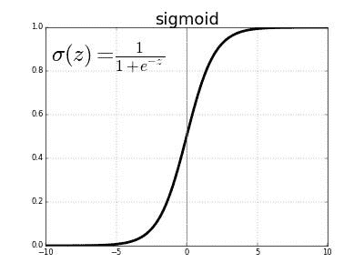

# 内部协变量移位:批量标准化如何加速神经网络训练

> 原文：<https://medium.com/analytics-vidhya/internal-covariate-shift-an-overview-of-how-to-speed-up-neural-network-training-3e2a3dcdd5cc?source=collection_archive---------1----------------------->

来源:[理解神经网络的结构](https://becominghuman.ai/understanding-the-structure-of-neural-networks-1fa5bd17fef0)(如果你需要复习一下神经网络的内部工作原理，看看这个！！

当开始构建你的第一个神经网络时，这个过程似乎类似于蒙着眼睛在大海捞针。有一百万个超参数——学习速率、层数、节点数、批量大小、激活函数——看起来找到最佳参数充其量只是在黑暗中摸索。

今天，我们将在 **Sergey Ioffe** 和 **Christian Szegedy 的**论文、 [*批处理规范化:通过减少内部协变量移位*](https://arxiv.org/abs/1502.03167) *、*来加速深度网络训练的帮助下，有望揭示这个“黑箱”，以便更仔细地了解这些模糊的超参数中的至少一个——*批处理大小。*

# 快速概览

2015 年，Ioffe & Szegedy 发表了这篇论文，提出了一种神经网络训练策略，经过彻底的实验，该策略被证明:

*   大幅**减少**培训时间
*   取消[退出](https://machinelearningmastery.com/dropout-for-regularizing-deep-neural-networks/)的必要性
*   减少所需的调整量
*   考虑到**增加的学习率**

他们将这种策略称为**批量标准化。**

使用 [MNIST 数据集](https://deepai.org/dataset/mnist)，他们实验了一个具有大量卷积和池层的网络，以及一个 softmax 层来预测图像类别。

他们发现，他们的批量标准化数据集能够实现与控制模型相同的准确性(4.82%的测试误差)，而训练步骤减少了 **14 步。**

考虑到神经网络的计算成本接近 MNIST 数字分类领域，任何可以帮助网络更快学习的进步都可以对深度学习社区产生真正的积极影响。

如果你想自己浏览一下[论文](https://arxiv.org/abs/1502.03167)，你可以参考这篇文章底部的**词典**来跟踪他们在分析中使用的一些独立术语。

# 那么，什么是*内部协变移位呢？？*

Ioffe & Szegedy 的定义如下:

> "**内部协变量移位**是由于训练期间网络参数的变化而导致的网络激活分布的变化。"

你的关系网越深，越会引起*内部的混乱*的反变。让我们记住，神经网络通过电话的数学游戏来学习和调整它们的权重(链中的人或“层”越多，消息就越混乱)。作为神经网络的构建者，我们的工作是**稳定**并改善输出层结果和每个隐藏层节点之间的联系。

我们的作者推断，如果我们稳定每一层的输入值(定义为 **z = Wx + b，**其中 z 是 W 权重/参数和偏差的线性变换)，我们可以防止我们的激活函数将我们的输入值放入我们的激活函数的最大/最小值中。为了说明这个概念，他们强调了下面所示的**乙状结肠激活功能**。

查看该图，我们可以看到，z**越大，函数就越接近他们所说的函数的“饱和状态”(或“区域”)。**

对于一篇解释**饱和度的好文章，**点击[这里](https://jamesmccaffrey.wordpress.com/2017/07/06/neural-network-saturation/)。

为什么我们要置身于“饱和政体”之外？

让我们来看看激活函数的**导数**:

关于神经网络梯度计算如何工作的回顾，请查看 3Blue1Brown 的惊人视频[此处](https://www.youtube.com/watch?v=tIeHLnjs5U8)。

随着 z 的增加，导数迅速下降到零。为什么这个很重要？好吧，如果我们仍然从我们的成本函数中得到一个巨大的值，我们需要最小化，但是我们将只根据激活的导数(梯度)改变我们的权重，我们向收敛的“步骤”将变得真正**微小**。

这种激活函数输出持续膨胀(也称为“非线性”)可以通过**批处理规范化来防止。**

# 批处理规范化是如何工作的？

我们已经知道**缩放我们的数据**(平均值为 0，标准差为 1)对于我们正在构建的任何模型都是必不可少的。Ioffe & Szegedy 不仅要确保数据在进入训练之前*被缩放，而且要在*训练期间继续保持缩放。

但是，这究竟是如何实现的呢？

Ioffe & Szegedy，第 4 页

经过反复试验(见第 2 页[和第 3 页](http://proceedings.mlr.press/v37/ioffe15.pdf)，他们发现网络输入可以通过**批量归一化变换来稳定。**看一下左边的图片；新的变换值被表示为 **y，**，其代表具有两个不熟悉的参数γ和β的 **x** (也称为“非线性输入值”)的变换。

这些参数作为一个“标准化器”，在整个培训过程中学习，以改变输入值(表示为 **x-hat** )，这是标准化。

用他们的话说…

> 先前接收 x 作为输入的任何层现在接收 BN(x)。

使用**小批量的**平均值和方差对输入(x)进行标准化。

***此处的重要说明*** :在使用这个额外的批量标准化(BN)步骤训练网络后，将使用*整个训练集的*均值和方差。

## 我们来看一些图表！

Ioffe & Szegedy，第 7 页

**Inception** 是他们控制模型的术语(无批量规格化)。上图显示了每个模型在达到收敛之前的训练步数。在这里，批处理规范化如何大大减少训练时间变得非常清楚。除了 Inception 之外，其他行都显示了一个稍微调整过的批处理规范化网络版本:

*   BN 基线:与初始学习率相同。
*   **BN-x5** :初始学习率 0.0075 (5 倍 Inception 的学习率)。
*   **BN-x30** :初始学习率 0.045 ( ***是初始*** 的 30 倍)。
*   **BN-x5-Sigmoid** :使用 Sigmoid 激活功能(非线性)代替 ReLU。

我们看到 **BN-x5** 胜出，只需要初始训练步骤的很小一部分(确切地说是 6.7%)就可以达到 **73%** 的准确度，而差的非规范化初始需要几乎**15 倍**的步骤数才能达到 **72.2%** 的准确度。

为了获得我在开始提到的令人印象深刻的 4.82%的错误率，他们使用了**集合分类**，由基于 BN-x30 的 6 个网络组成，带有一些修改的超参数(见[第 7 页](http://proceedings.mlr.press/v37/ioffe15.pdf))。

***另一个重要的注意事项:*** 要使用带有**卷积神经网络**的批量归一化，归一化必须发生在稍微不同的点，以尊重“卷积属性”([第 4 页](http://proceedings.mlr.press/v37/ioffe15.pdf):相同特征图的不同元素，在不同的位置，将以相同的方式归一化):

> *“为了实现这一目标，我们在所有位置以小批量方式联合标准化所有激活。”(第 4 页)*

# 外卖时间…

简而言之，当你试图把你的神经网络串在一起时，你可能想尝试一些批量标准化。点击这里查看这篇伟大的文章[，它提供了关于这个主题的更多资源。查看](https://machinelearningmastery.com/batch-normalization-for-training-of-deep-neural-networks/)[这篇](https://towardsdatascience.com/batch-normalization-in-neural-networks-code-d7c9b88da9f5)帖子，学习如何用 **keras** 实现 BN。网络快乐！

# 一本小字典！

*   **批量标准化**:对网络的隐藏层输入进行转换。
*   **非线性**(名词):给定激活函数*(例如:Sigmoid 非线性== Sigmoid 激活函数)*
*   [**饱和状态**](https://jamesmccaffrey.wordpress.com/2017/07/06/neural-network-saturation/) :大部分隐藏节点的值接近-1.0 或+1.0，输出节点的值接近 0.0 或 1.0。预激活积和相对较大。当您的网络节点存在于此空间中时，训练会明显变慢，因为梯度值会降低。
*   **白化**:去相关随机向量的各个分量*和*使方差为 1
*   **雅可比矩阵**:来自 *n* 个变量中 *n* 个方程的函数，其在任意一点的值都是在该点计算的那些方程的偏导数的*n×n*行列式。
*   **学习仿射变换**:一种保持共线性(即最初位于一条线上的所有点在变换后仍位于一条线上)和距离比的变换。