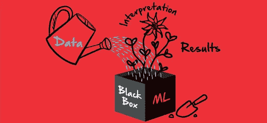
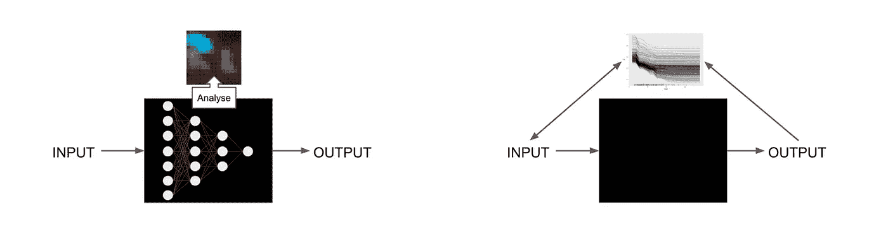

# 可解释的机器学习——一个简短的调查

> 原文：<https://medium.com/analytics-vidhya/interpretable-machine-learning-a-short-survey-157ba2a56bb8?source=collection_archive---------13----------------------->

大家好，今天我要讲的是一篇新的研究论文“[***——可解释机器学习——简史、现状与挑战***](https://arxiv.org/abs/2010.09337) ”。最近的会议被 IML 的论文所主导，但是这个领域已经有 200 年的历史了。最大的挑战是缺少被社区接受的可解释性的严格定义。

# 介绍

在部署 ML 模型时，行业中最常见的一个问题是该模型是否可信。在我短暂的行业生涯中，我有很多关于模型如何做出决策/预测的问题。一些常见的问题是某个特定特征有多重要，或者为什么模型会做出这种特定的预测。当在安全、客户服务等领域部署特定的 ML 模型时，可解释性通常是一个重要因素。此外，IML 可用于调试或证明模型及其预测，并进一步改进模型。

# 历史

随着深度学习的进步，IML 的研究达到了顶峰。但是，IML 的根非常古老。早在 19 世纪初，Gauss、Legendre 和 Quetelet 就使用了线性回归模型，并从那时起发展成为大量的回归分析工具，如广义加法模型。这些模型预先做出某些分布假设或限制模型的复杂性，因此强加了模型的内在可解释性。

与此相反，ML 算法遵循非线性、非参数方法，其中模型复杂性由超参数或通过交叉验证来控制。因此，最大似然模型具有非常好的预测性能，但可解释性差。

尽管在 ML 中的可解释性还没有得到充分的探索，但是在 IML 已经做了一些杰出的工作。随机森林的内置“特征重要性”度量是 IML 的重要里程碑之一。最近，许多模型不可知的解释方法被引入，它们适用于不同类型的 ML 模型。而且还开发了特定于模型的解释方法，例如解释深度神经网络或树集成。回归分析和基于规则的 ML 至今仍是重要和活跃的研究领域，并正在融合在一起，例如基于模型的树、规则拟合等回归模型和基于规则的 ML 都可以作为独立的 ML 算法，也可以作为 IML 方法的构建模块。

# IML 模型

IML 模型的区别在于它们是否分析模型组件、模型敏感度或代理模型。一些 IML 方法通过给单个模型组件赋予意义来工作(左)，一些方法通过分析模型预测的数据扰动来工作(右)。替代方法是其他两种方法的混合，使用(扰动的)数据近似 ML 模型，然后分析可解释的替代模型的组成部分。

莫尔纳尔等人《 [***可解释机器学习——简史、现状与挑战***](https://arxiv.org/abs/2010.09337) 》

## (1)分析可解释模型的组成部分:

在这些方法中，我们关注模型的单个组件，而不是整个模型。因此，不一定需要理解整个模型，但是为了分析模型的特定组件，需要将它分解成我们可以单独解释的部分。可解释模型是具有学习到的参数和学习到的结构的模型，它们可以被赋予某种解释，就像线性回归、决策树等。例如，线性回归模型的权重可以解释为单个特征对模型预测的影响。决策树有一个学习结构，其中每个节点都有一个基于特定特征的划分。这有助于我们通过跟踪节点来追踪决策树做出的预测。但是，这仅在高维情况下的某一点上有效。具有大量特征的线性回归模型不再具有可解释性，因此一些方法试图减少要解释的特征，例如 LASSO。

 [## 套索页面

### 套索页面 L1 约束拟合的统计和数据挖掘套索是一个收缩和选择的方法…

statweb.stanford.edu](http://statweb.stanford.edu/~tibs/lasso.html) 

## (2)分析更复杂模型的组件:

我们还可以分析复杂模型的组件。例如，我们可以将 CNN 层学习到的特征可视化。

 [## 特征可视化

### 越来越多的人意识到神经网络需要能够被人类理解。神经网络领域…

蒸馏. pub](https://distill.pub/2017/feature-visualization/) 

一些方法试图通过引入一些单调性约束或修改的损失函数来解开 CNN 学到的概念，从而使组件更容易解释。

## (3)解释个人预测:

大多数用于研究最大似然模型敏感性的方法都是模型不可知的。他们通过分析输入数据中微小扰动的模型预测来工作。我们区分本地和全球的解释。局部方法侧重于个体模型预测。一种流行的本地 IML 方法是 Shapley 值。

 [## 5.9 Shapley 值|可解释的机器学习

### 预测可以通过假设实例的每个特征值是游戏中的“玩家”来解释，其中…

christophm.github.io](https://christophm.github.io/interpretable-ml-book/shapley.html) 

一些 IML 方法依赖于特定于模型的知识来分析输入特征的变化如何影响输出。例如，显著图用于 CNN。显著性图产生显示改变像素如何改变预测的热图。

 [## 使用显著图可视化您的卷积神经网络预测

### 在许多情况下，理解为什么模型预测一个给定的结果是一个关键的细节，模型用户和必要的…

medium.com](/@ODSC/visualizing-your-convolutional-neural-network-predictions-with-saliency-maps-9604eb03d766) 

## (4)解释全局模型行为:

全局模型解释方法用于解释模型对于给定的特定数据集的平均表现。全局解释的一个有用的区别是“特征重要性”和“特征效应”。

要素重要性根据要素对预测的重要性/相关性对其进行排序，例如随机森林的置换要素重要性。

 [## 5.5 排列特征重要性|可解释的机器学习

### 置换特征重要性度量了置换后模型预测误差的增加

christophm.github.io](https://christophm.github.io/interpretable-ml-book/feature-importance.html) 

“特征效应”显示了输入特征的变化如何改变预测的结果。流行的特征效应图是部分相关图、个体条件期望曲线、累积局部效应图和函数方差分析。

 [## 5.1 部分相关图(PDP) |可解释的机器学习

### 部分相关性图(短 PDP 或 PD 图)显示了一个或两个特征对预测结果的边际影响

christophm.github.io](https://christophm.github.io/interpretable-ml-book/pdp.html)  [## 5.3 累积局部效应(ALE)图|可解释的机器学习

### 累积的局部效应描述了特征如何平均影响机器学习模型的预测。麦芽酒…

christophm.github.io](https://christophm.github.io/interpretable-ml-book/ale.html) 

## (5)替代模型:

代理模型是试图模仿相关 ML 模型行为的可解释模型。代理方法仅需要 ML 模型的输入和输出数据来训练代理 ML 模型。他们把 ML 模型当作一个黑箱。LIME 是局部替代方法的一个示例，它通过学习与待解释数据点接近的数据的可解释模型来解释单个预测。

 [## 5.7 本地代理(LIME) |可解释的机器学习

### 局部代理模型是可解释的模型，用于解释黑箱机器的个别预测…

christophm.github.io](https://christophm.github.io/interpretable-ml-book/lime.html) 

# 挑战

IML 领域的一些挑战是:

(1)缺乏对可解释性的适当定义。

(2)特征依赖引入了重要性归属和外推的问题。

(3)许多 IML 方法提供了解释，但没有量化解释的不确定性。模型本身及其解释都是根据数据计算出来的，因此具有不确定性。

(4)如论文中所述，“理想情况下，模型应反映其潜在现象的真实因果结构，以便能够进行因果解释。可以说，如果在科学中使用 ML，因果解释通常是建模的目标。但是大多数统计学习过程仅仅反映特征之间的相关结构，并且分析数据生成过程的表面，而不是其真实的内在结构。需要进一步的研究来了解我们何时被允许对一个 ML 模型进行因果解释。”