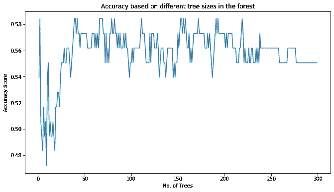

# 如何建立一个简单的股票运动分类器

> 原文：<https://medium.com/analytics-vidhya/intro-stock-classifier-f2b20559a0ff?source=collection_archive---------5----------------------->

## 这篇文章将探讨构建股票运动分类器的步骤。

克里斯·利维拉尼在 [Unsplash](https://unsplash.com?utm_source=medium&utm_medium=referral) 上的照片

有可能掌握金融市场吗？这是一个古老的问题，自 1602 年股票市场出现以来就一直困扰着人类。

# 商业案例

自从金融市场出现以来，人类试图预测市场，让市场心理学为他们服务。随着技术变得越来越先进，我们拥有前所未有的计算能力来揭示金融数据中隐藏的模式，这些模式直到今天还没有被交易员发现。这个项目的目的是通过构建一个 ML 分类器来预测股票在任何给定的一天是上涨还是下跌，从而利用这种计算能力。这对投资经理特别有用，这样他们在投资管理实践中就能有更好的预测能力。

在本帖中，我们将尝试回答以下问题，作为我们使用最新的人工智能/人工智能和数据科学工具创建交易策略之旅的第一步:

*Q1。历史价格和交易量数据是否可以作为预测各自股票价格的潜在特征？*

*Q2。总体历史股票市场波动是否与给定股票的价格数据有任何相关性，因此是否也可以用作一个特征？*

*Q3。我们是否可以使用监督 ML 分类器模型来预测股票价格在任何给定的一天是上涨还是下跌？*

> 请注意，这篇文章不包含任何投资建议。投资受到市场风险的影响，任何投资决策都应考虑这些风险。这篇文章的目的是告诉读者创建分类器的典型过程。在实际交易环境中部署最终模型之前，应该执行本文中没有提到的许多流程。

为了检查我们的 ML 模型的预测能力，我们将要求我们的分类器预测在任何给定的一天，股票是上涨还是下跌，然后与当天结束时股票的实际运动进行比较，然后尝试计算模型的准确性。

我已经使用 Python 和它的数值库如 pandas 和 numpy 以及 Jupyter notebook 进行了分析。

# 采用的流程

为了回答上述问题，我们将探索谷歌股票(股票代码:“GOOG”)价格数据。我们将采用以下方法来创建股票分类器:

1.  获取定价数据
2.  清理和可视化数据，以识别任何缺失和异常数据
3.  创建可用于训练模型的潜在特征
4.  检查要素的相关性，以查看要素之间的相关程度
5.  将特征数据拆分为训练和测试拆分，然后检查是否需要缩放
6.  使用 sci-kit learn 在训练数据上训练分类器
7.  测试和测量性能
8.  调整超参数
9.  比较模型并在样本外数据上验证模型

# 数据理解

我们将使用雅虎财务库来获取股票市场数据。我们将使用 2019 年 7 月 1 日至 2020 年 10 月 1 日的价格数据，并将数据分成 70:30 的比例，其中 30%用于测试模型。可以从以下链接查阅其文档:[https://pypi.org/project/yahoofinancials/](https://pypi.org/project/yahoofinancials/)

# 清理和可视化

获得数据后，应检查是否有异常值，并检查是否包含任何缺失值。我们可以使用 pandas 内置的‘describe’方法来检查数据是否正态分布，是否有异常值。我们还可以使用 pandas 'isna '方法计算缺失值。我们还可以直观地看到数据，以识别任何异常。

体积数据

价格数据

一旦数据是好的和干净的，我们可以继续创建我们认为与回答我们上面确定的问题相关的特征。

# 特征工程

在这一步中，我们可以迭代和重复，以获得具有经济意义的特征，也可以用作未来价格走势的良好预测。在本帖中，我们将使用以下特征来训练我们的分类器模型:

1.  开盘价:任何一天的开盘价
2.  成交量:股票前一天的成交量
3.  SMA _ 20:20 天窗口的简单移动平均线
4.  STD _ dev:20 天窗口的标准偏差
5.  Band_1:使用 SMA_20 (+) Std_dev 创建的布林线
6.  波段 2:使用 SMA_20 (-) Std_dev 创建的布林线
7.  ON_returns:从前一天的收盘价到当天的开盘价是向上还是向下移动
8.  dist_from_mean:股票价格离平均值有多远
9.  vix_data:前一天的 CBOE 波动指数价格

你可以查看我的 GitHub 库来获得完整的笔记本:【https://github.com/zainfarrukh/simple-stock-classifier

# 这些特征相关吗？

一旦我们有了所有必要的特征，我们就可以使用相关矩阵来检查特征之间的相关性。

相关矩阵—特征

## *历史价格和成交量数据能否作为潜在特征？*

是啊！我们可以看到，像开盘价和移动平均线这样的历史定价数据与收盘价有很强的相关性(0.8 以上)。因为它们是相关的，所以可以用来预测未来的价格。

## *市场波动性与给定股票的价格是否有相关性，是否可以作为一种特征？*

再说一遍，是的。波动性指数与股票价格负相关(-0.23)，与股票的波动性和成交量密切相关。这也回答了我们的第二个问题，因此我们将使用它作为我们分类模型的一个特征。

# 缩放和分割要素

现在，我们完成了要素的创建，将开始分割要素。我已经决定将我的数据按照 70:30 的比例分成训练集和测试集。

# 训练分类器

一旦我们对数据进行了缩放和分割，我们将把它提供给我们选择的分类器模型，以便根据该数据对其进行训练。

为此，我选择了随机福里斯特分类器。

你可以查看我的 GitHub 库来获得完整的笔记本:【https://github.com/zainfarrukh/simple-stock-classifier

一旦模型完成训练，我们就可以在测试数据上检查它的准确性。

混淆矩阵

# 调整参数

52%的准确率没那么大。所以我现在将尝试改变模型的参数，看看我是否能达到更好的精度。

不同树大小的准确度分数

# 比较模型

如你所见，通过调整参数，我能够将模型的精确度提高到 58.42%。但现在我将看看是否有其他分类器给出更好的预测。

我现在将使用支持向量分类器来看看我是否能获得更好的准确性。使用 RBF 核，我能够获得 59.55%的准确率。

肯定比上一款好！

支持向量分类器的混淆矩阵

我们现在有了我们的模型，该模型被测试为 59.55%准确。这种模式比纯粹凭运气盲目赌股票要好。然而，我们仍然需要在样本外数据上测试我们的模型，以确保我们的模型不会过度拟合样本内数据。

# 确认

由于支持向量分类器提供了更好的准确性，我将使用它和验证数据来检查模型的样本外准确性。对于该模型，我将使用 2020 年 10 月 2 日至 2020 年 12 月 31 日的定价数据。验证结果如下:

样本外数据的混淆矩阵

# 那么，我们可以使用 ML 分类器*来预测每日股票走势*吗？

是的，这个选项是值得探索的，因为我们能够得到 63.44 的准确率，这肯定比预测一个简单的掷硬币要高。此外，我们的模型对样本外数据有更高的准确性。这是令人鼓舞的。然而，它还远未准备好用于现场交易环境。但是我们当然可以探索使用 ML 分类器来更好地预测股票走势。

# 结论

在这篇文章中，我们试图探索 ML 分类器是否可以用来预测股票的每日运动。我们试图回答历史定价数据是否可以用来预测运动，以及市场波动性(CBOE VIX，用作代理)是否可以用作预测运动的特征。使用相关表，我们能够确定以前的价格和收盘价有很强的相关性，这表明以前的价格可能有一定的预测能力。而 VIX 与价格负相关，这也是一个可以用来预测股票走势的独特特征。

最后，我们检查了一些分类器模型的准确性，以测试它们是否可用于预测股票走势。基于对模型的初步探索，在某些条件下，我们确实可以使用 ML 分类器来获得股票价格的预期运动。

我们可以执行几个步骤来改进分类器模型。我们可以探索额外的功能，试图使我们的模型更加准确。在将该模型投入生产之前，我们还可以围绕该模型建立止损，这将增加我们的模型长期盈利的可能性。最后，我们应该对我们的策略进行回溯测试，以检查它是否提供了有利可图的结果。

这一分析给了我们几个关键线索，我们可以遵循这些线索，利用最新的 ML 技术做出更好的投资决策。