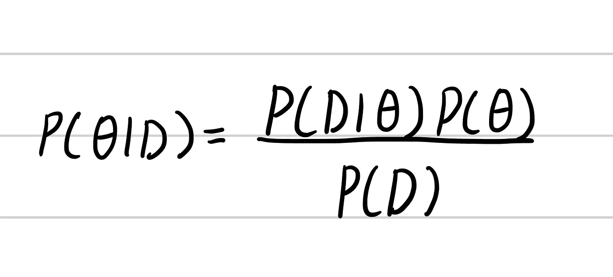
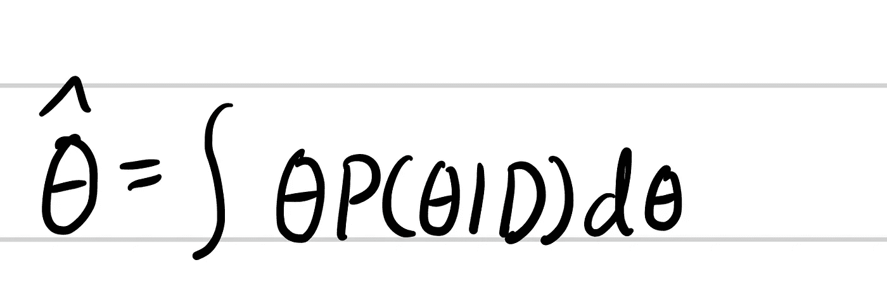
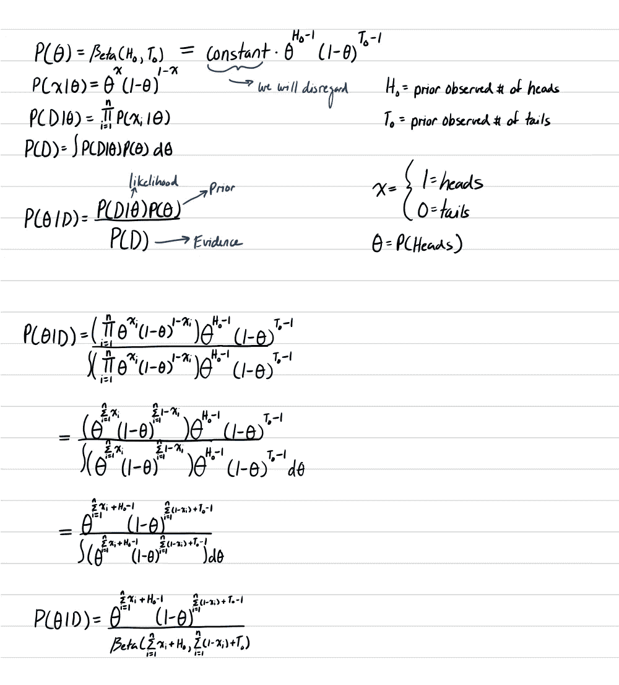
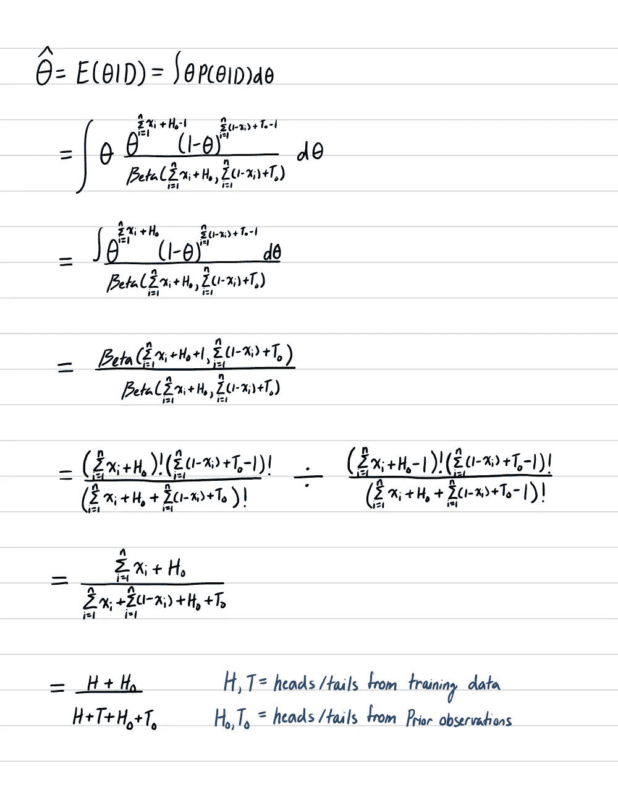
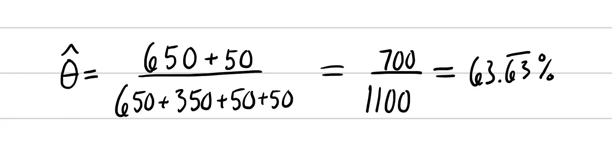

# 贝叶斯参数估计简介

> 原文：<https://medium.com/analytics-vidhya/intro-to-bayesian-parameter-estimation-f324498bb505?source=collection_archive---------13----------------------->

[https://unsplash.com/photos/TBHOuN6URGU](https://unsplash.com/photos/TBHOuN6URGU)

# 什么是贝叶斯参数估计？

还记得上一篇文章中的最大似然估计吗？在 MLE 中，我们假设训练数据是总体数据的良好表示。如果我们有先验信息呢？我们如何在参数估计中利用这些先验信息？这就是贝叶斯参数估计的用武之地。在贝叶斯参数估计中，θ是一个随机变量，其中关于θ的先验信息是给定的或假设的。我们基于新的训练样本更新先验假设/知识。这背后的想法是对θ的知识有一个起点，但我们用通过训练样本看到的数据来提炼这个先验知识。

贝叶斯定理

这个公式实际上是贝叶斯定理。P(D|θ)也是 MLE 中的相同公式。P(θ)是θ上的先验概率。P(D)被称为证据，但用于规范化方程(使方程成为概率)。如果你需要复习如何计算[极大似然估计](/analytics-vidhya/intro-to-maximum-likelihood-estimate-64616f8a624)或[贝叶斯定理](/analytics-vidhya/bayes-theorem-made-simple-b1b403bf5ffb)，我有关于这两个问题的博客文章，所以一定要去看看！那么，我们该何去何从？

# 贝叶斯参数估计示例

让我们再来看一下 [MLE](/analytics-vidhya/intro-to-maximum-likelihood-estimate-64616f8a624) 博客中的例子，我们假设抛硬币的 P(正面)= 0.65。假设你的朋友使用了同样的硬币，他昨天将硬币抛了 100 次，得到了 50 次正面，所以他假设 P(正面)= 0.50。知道 MLE 没有考虑先验知识，我们决定迁就这个朋友。我们把他所说的关于 100 次抛硬币的话作为先验。那么，我们如何计算新的θ来最大化向我们的朋友证明 50%并不总是最佳估计的可能性呢？

上面的公式是我们最大化θ的方法。该等式对θs 相对于 P(θ|D)或给定训练数据的θ概率进行平均，从而得出平均θ值(这是最有可能的)。让我们开始求解 hat。

# 贝叶斯参数估计的计算

首先，我们需要找到 P(θ|D)。我们只能用贝叶斯定理来解决这个问题。我们知道 P(D|θ)与来自 [MLE](/analytics-vidhya/intro-to-maximum-likelihood-estimate-64616f8a624) 博客的可能性相同，但是 P(θ)和 P(D)是什么呢？我们来关注 P(θ)。你可能会想，这个奇怪的贝塔函数是什么？由于θ是一个概率，我们需要使用一个模拟概率的分布，因此我们使用β。至于对 P(D)的解释，我建议查看我在[贝叶斯定理](/analytics-vidhya/bayes-theorem-made-simple-b1b403bf5ffb)上的帖子。现在有了 P(D|θ)，我们来找θhat。

我们抛硬币 1000 次作为我们的训练数据。我们得到正面 650 次，反面 450 次。这导致θ的最大估计值为:

因此，我们更接近了，但更重要的是，我们有一个公式，当我们有先验信息时，可以找到θ最可能的估计值。如果这位朋友多抛几次硬币，他可能是对的吗？技术上来说是的，但我会假设随着更多的翻转，硬币会收敛到 P(正面)= 0.65。

# 结论

希望你能留下来完成这个职位。这篇文章有点重数学，但我希望你能够带走一些信息。和往常一样，如果你喜欢这个材料，请给它一些掌声，如果你喜欢它，我建议跟随我。我会一周发布几次。下次见！