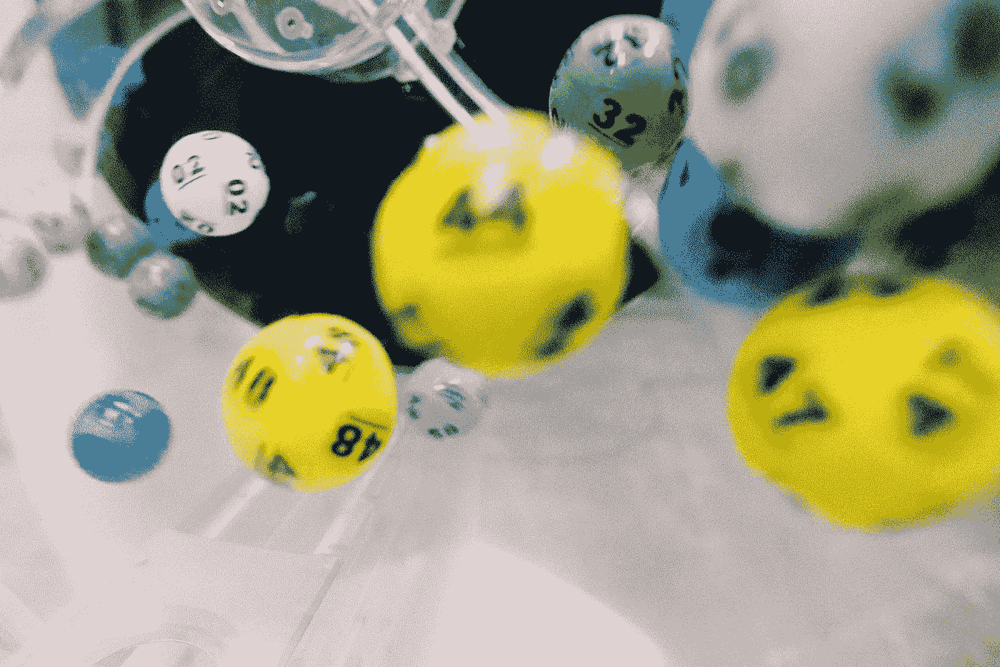
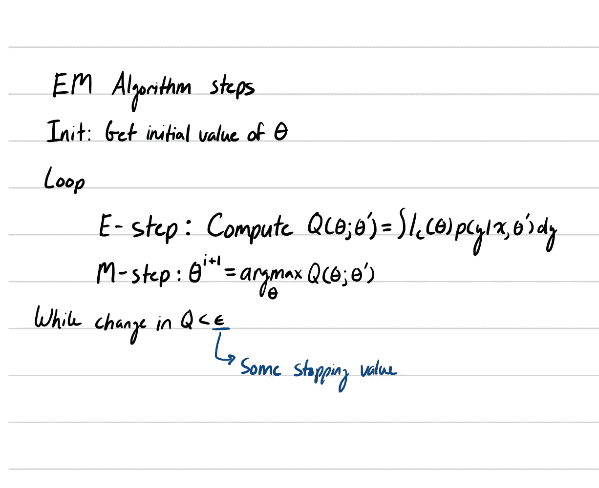
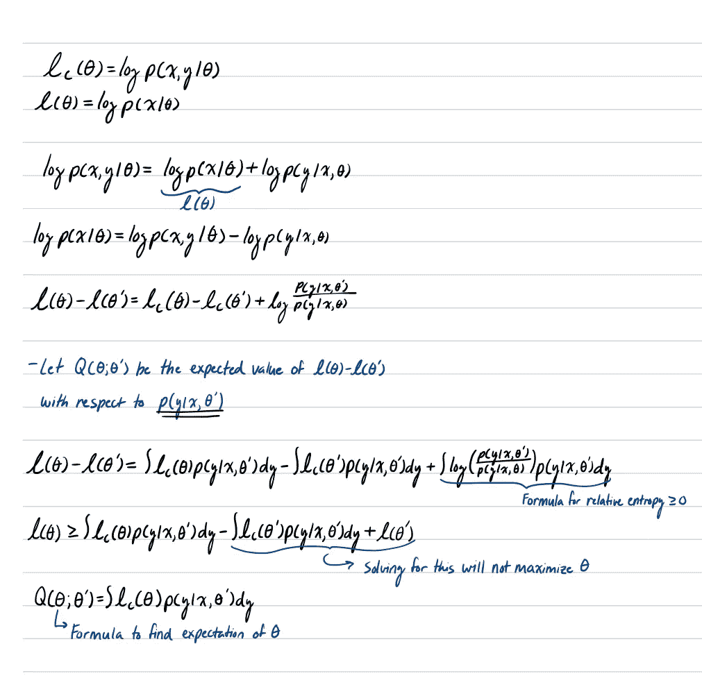
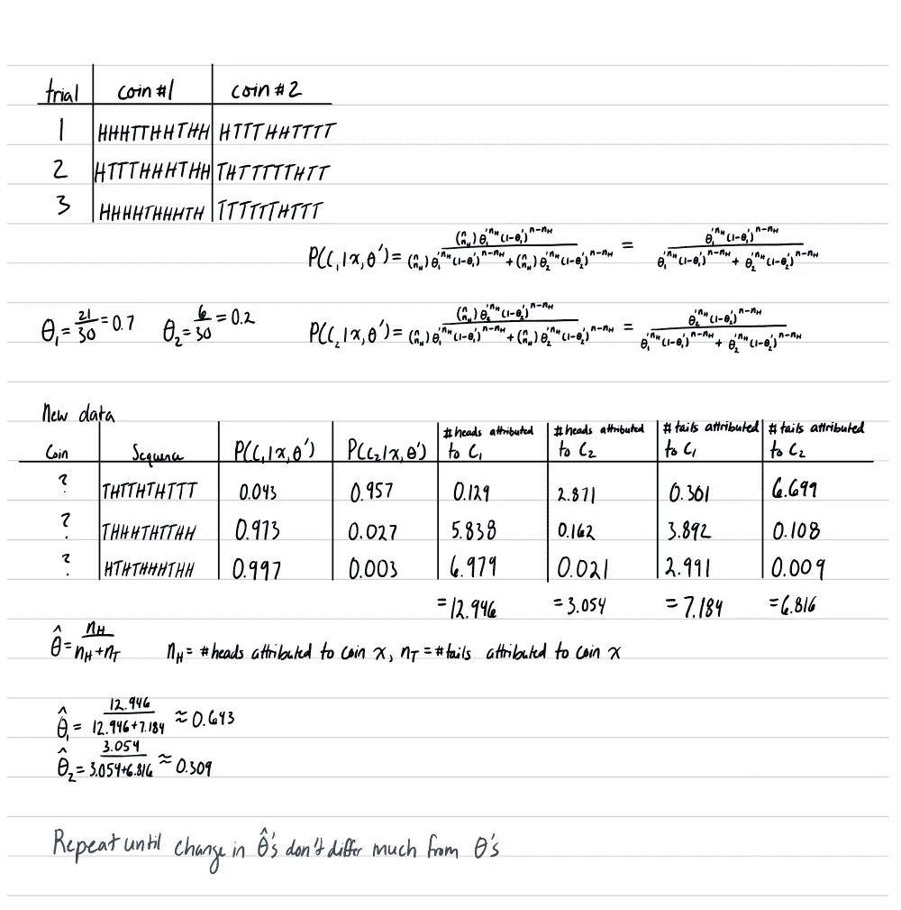
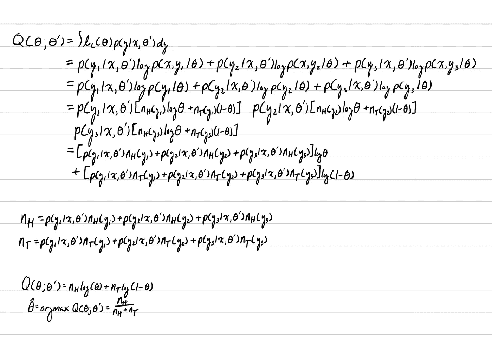

# 期望值最大化简介

> 原文：<https://medium.com/analytics-vidhya/intro-to-expectation-maximization-f02849db1f89?source=collection_archive---------25----------------------->

迪伦·诺尔特在 [Unsplash](https://unsplash.com/?utm_source=unsplash&utm_medium=referral&utm_content=creditCopyText) 上的照片

我写过几篇关于参数估计的帖子。第一个帖子是关于最大似然估计(MLE ),我们希望找到某个参数θ的值，使训练数据最有可能，这也可以称为给定训练数据时最有可能的参数。贝叶斯参数估计(BPE)扩展了最大似然估计，因为关于θ的先验信息是给定的或假设的。资料不全怎么办？如果有丢失的数据，丢失可能意味着噪音、丢失或隐藏数据，该怎么办？这就是期望最大化(EM)的用武之地。EM 算法是一种迭代方法，用于边缘化缺失数据以寻找最大似然估计。目标是迭代地找到更好的参数θ，使得 l(θ) > l(θ')，其中θ'是当前估计，θ。

# 定义 EM 算法

EM 算法由两个步骤组成。第一步是计算期望值，或计算 Q(θ；θ').第二步是最大化第一步计算的期望值。我们也用 Q 的 arg max(θ；θ').由于这是一个迭代算法，当 Q 变化不大时，该算法在数据上循环，将终止。

# **推导 EM 算法**

我们有一个数据集 Z = (x，y ),其中 x 是可用的，y 是潜在的数据，不可观察的数据。在 MLE 中，我们想求 P(X|θ)其中 X={x_1，x_2，…，x_n}，但由于我们既有可观测数据又有不可观测数据，所以我们想求 P(Z|θ)。在我们想求 P(Z|θ)的同时，如何在 y 为潜伏时最大化 P(x，y|θ)？由于只知道 x，所以只能最大化 P(x|θ)其中 P(x|θ)=P(x，y|θ)-P(y|x，θ)。让我们更深入一点来推导期望。

现在，我们对如何用公式表示 Q(θ，有了更好的想法。θ’)，让我们看一个例子来进一步理解。

# EM 示例

假设你和一个朋友在掷两枚不同的硬币。你把你的硬币抛 10 次，你的朋友也把他的硬币抛 10 次。你们两个总共重复 3 次试验。然后你们交换硬币，但是在这个过程中，你们两个人都把硬币掉了，导致两个人都不知道他们有谁的硬币。你想算出两个硬币正面概率的最佳估计值，但是你不知道你在掷哪个硬币。在这里，我们可以使用 EM 来估计硬币正面的概率，而不完全知道哪个硬币正在被投掷。我们决定把硬币放在一个袋子里，我们从袋子里随机选择一枚硬币，并翻转 10 次。作为 EM 算法的第一次迭代，我们再执行 2 次。这是第一次迭代的结果。

这里我们展示了 EM 算法的一次迭代。理想情况下，我们会执行更多次迭代，直到新θ的变化小于或等于某个停止条件值。你可能想知道为什么这看起来一点也不像 EM 算法方程，你是对的。让我们来看看我们是如何将θ最大化简化为归因头数乘以归因翻转数的。

虽然做了很多转换，但我认为这有点直观。我们有 y_n，其中 n 在{1，2，3}中，是每个试验，y 是代表试验 n 的硬币的潜在数据，如果我们最大化硬币 1 的θ，y_n 将是试验 n 是硬币 1 的偶数。我们最多只进行 3 次试验，因为这是我们在第一次迭代中定义的。理论上，可以进行任意数量的试验。从这个方程中，我们可以解出 n_H 和 n_T，它们是每次试验的头和尾。这看起来应该很熟悉。从 MLE 的帖子中我们知道，如果我们对 Q 求导，就可以找到使θ最大化的值。我们在这里得到的问题的 EM 公式和问题的 MLE 公式的结果之间唯一真正的区别是，我们不知道抛的是什么硬币。我们必须根据人头来自某个硬币的概率来衡量我们观察到的人头的数量。

# 结论

EM 算法有一些缺点。EM 算法中的 E 步骤在计算上可能非常昂贵，尤其是该算法接近最大值。这主要是由于求解 p(y|x，θ’)可能的复杂性。EM 算法的另一个缺点是它会收敛到局部最大值。尽管 EM 算法有缺点，但它是一种解决具有潜在数据的数据集的最大似然估计的强大算法。如果你喜欢这篇文章，一定要击碎鼓掌按钮。如果你觉得有帮助，我会看看我的其他帖子。下次见！