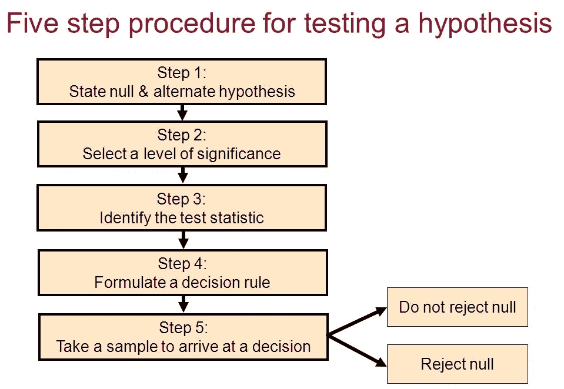
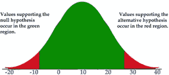

# 通过示例简化假设检验

> 原文：<https://medium.com/analytics-vidhya/intro-to-hypothesis-testing-using-an-example-c0ab568e78d6?source=collection_archive---------6----------------------->

一种容易理解的方法

**假设检验**是统计学领域最强大、最优雅的概念之一。它在市场上被不同领域的数据科学家、统计学家和研究人员广泛使用。但是在我们开始了解与假设检验相关的统计学术语之前，让我们先用一个例子通俗地理解一下。

## 简单的解释

让我们假设有一家食品配送公司，名为 XYZ 公司，为城市中的各种餐馆向消费者配送食品。该公司声称，平均而言，他们的送货时间最多为 30 分钟，即 30 分钟或更少，但最近进行的一项研究表明，这是不正确的，即平均需要 30 多分钟才能送达食物。在这里，我们将进行假设检验，看看研究结果是否属实，即公司是否需要 30 分钟以上的时间来运送食物。

由[罗文·弗里曼](https://unsplash.com/@rowanfreeman?utm_source=medium&utm_medium=referral)在 [Unsplash](https://unsplash.com?utm_source=medium&utm_medium=referral) 上拍摄

但在此之前，我们将会看到一些术语和我们需要遵循的某些步骤，以便正确地进行假设检验。

**零假设(Ho):** 假设假设中的两个变量之间没有统计学意义。这是研究者试图否定的假设。

**备择假设(Ha** ) **:** 表示假设中两个变量之间存在统计显著性的假设。这是研究者试图证明的假设。

**检验统计量(X):** 检验统计量是从假设检验中使用的样本中得出的数量。我们将在示例中计算它。

**P 值:** P 值是在假设零假设为真的情况下，获得至少与我们观察到的一样极端的测试统计值的概率。它是假设零假设为真的观察概率。使用这个值，我们要么拒绝零假设，要么接受它。

**显著性水平:**显著性水平是当原假设为真时拒绝原假设的概率。一般来说，用于 alpha 的值是 0.1%、1%、5%和 10%。较小的 alpha 值表示更可靠的解释，我们通常在误差窗口太小的医疗保健情况下使用它。

如果 **p 值< = alpha:** 拒绝零假设，接受替代假设

如果 **p 值>α:**接受零假设

为了进行好的假设检验，你需要记住一些重要的标准。首先，我们需要一个合适的样本量，尤其是对于某些领域，选择合适的样本量非常重要。其次，我们需要正确定义零假设。此外，设计测试实验和选择正确的显著性水平是其他重要的标准。下面是我们在进行假设检验之前需要记住的五个步骤。

图片来源:【https://slideplayer.com/slide/9270076/ 

现在让我们回到我们的例子，进行假设检验，看看食品配送公司的说法是真是假。为了进行测试，我们对 300 次送货进行了抽样，发现平均送货时间为 35 分钟。很难对整个数据进行测试，所以在这种情况下，我们取出一个样本进行测试。

**我们案例中的零假设**是平均交付时间最长为 30 分钟，即μ ≤ 30。

**替代假设**在我们的案例中，平均需要 30 多分钟来运送食物，即μ > 30。

**P 值:**我们将这里的 P 值计算为一个概率(X = 35/零假设)。x 是观察值的检验统计量。在这里，我们观察到平均交付时间是 35 分钟。

我们假设这里得到的 p 值是 3%。我们使用方法**重采样和置换**来计算 p 值，我们将在下一篇文章中详细探讨。

**显著性水平:**我们将在这里选择 5%的显著性水平。5%通常是行业中使用的固定标准。

当我们观察到 3%的 p 值小于 5%的显著性水平时，我们将拒绝零假设并接受替代假设。

因此，我们可以得出结论，替代假设是正确的，研究发现是正确的，平均而言，该公司需要 30 多分钟来交付食物。

图片来源:[https://courses . EDX . org/c4x/UTAustinX/ut . 7.01 x/asset/Chapter _ 12 . pdf](https://courses.edx.org/c4x/UTAustinX/UT.7.01x/asset/Chapter_12.pdf)

在本文中，我们介绍了假设检验的基础知识、相关术语，以及如何通过一个例子进行假设检验。在下一篇文章中，我们将探讨假设检验的类型以及我们如何计算 p 值。