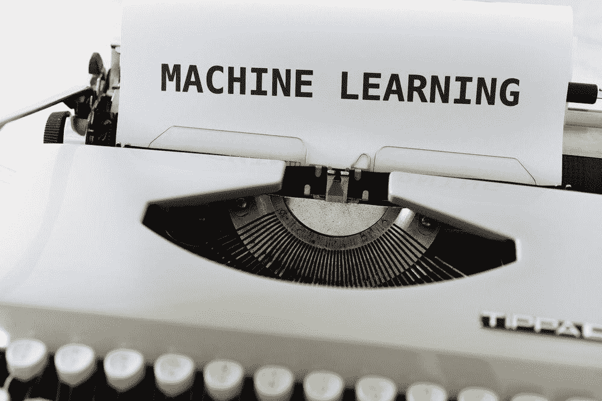
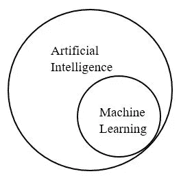
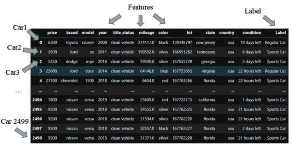
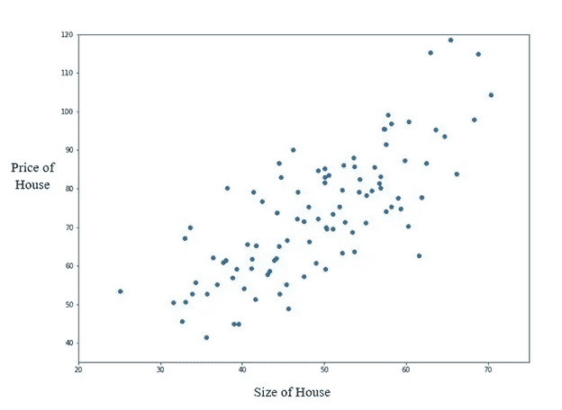

# 面向普通人的机器学习介绍

> 原文：<https://medium.com/analytics-vidhya/intro-to-machine-learning-for-the-everyday-person-1d4f09b6b754?source=collection_archive---------10----------------------->

图片由[马库斯·温克勒](https://unsplash.com/@markuswinkler)在 [Unsplash](https://unsplash.com/?utm_source=medium&utm_medium=referral) 上拍摄

过去十年的技术进步导致了数据收集和实施的激增。我们没有一天不听到像“数据科学”、“人工智能”或“机器学习”这样的流行词汇。我们听说公司利用数据的力量，使用一种被称为人工智能或机器学习的神秘过程来推动商业决策，但这些术语的真正含义是什么？

我遇到的大多数关于这个主题的文章要么充满了太多的技术术语，以至于普通人完全无法理解，要么过于简单，以至于看起来像科幻魔术。这篇文章的目的是以一种对没有任何技术知识的人来说容易理解的方式介绍机器学习，以便通过将它分解成主要组件来揭开它的神秘面纱。

然而，在我们深入机器学习的模糊领域之前，我们有必要将它与另一个流行词汇:人工智能区分开来。如今，这两个词在媒体中可以互换使用，但有一个微妙但重要的区别:机器学习是人工智能的一个子集。这是我们教计算机“学习”如何做事的过程的一个应用。

作者图片

对于那些只在文章和社交媒体上听说过机器学习的人来说，这似乎是一个神奇的过程，通过这个过程，计算机将学习如何接管世界，但现实远没有这么戏剧性。不要误解我，机器学习绝对令人兴奋，但本质上，它只是一个非常聪明的标签制造商。不需要太专业，机器学习基本上是一个过程，其中数据被输入到一个数学模型中，然后该模型使用数据中的趋势来执行任务。在其核心，机器学习由两个重要部分组成:数据和算法(模型)。

# 数据

我们输入模型的数据是这个过程的一个重要部分，这样它就可以“机器学习”了。我们的模型表现如何很大程度上取决于我们的数据有多好。这些数据通常以“数据集”的形式出现，即行和列(比如 Microsoft excel)的信息。每行通常代表一个项目/对象，而每列代表关于该项目/对象的信息。此外，我们可能还会有一个额外的栏目，为我们提供我们试图解决的问题的答案，称为“标签”。为了更好地理解这一点，让我们看一个简单的例子。

考虑一个关于汽车的数据集。数据集中的每一行代表一辆汽车，而每一列代表该汽车的信息，如颜色、型号、轮胎尺寸、里程、最高速度等。这些列被称为“特征”。此外，可能还有另一个名为“标签”的列，它告诉我们这辆车是跑车还是普通车。

作者图片

当我们将这些数据输入到我们的模型中时，它会指出哪些功能是重要的，哪些功能与“标签”列无关。在我们的例子中，我们给模型的标签允许它查看数据并说，“啊，好吧，在大多数情况下，奥迪、宝马或保时捷等公司生产的最高时速很高的汽车是跑车”。然后，当你给它看另一辆没有贴标签的汽车时，它可以根据汽车的特点，如最高速度或品牌，告诉你这辆车最有可能是跑车还是普通车。

我们的模型是如何做到这一点的呢？它是如何“弄清楚”事情的？这是大多数文章引入“梯度下降”和“优化”等技术术语的地方，这往往会使外行人放弃试图理解正在发生的事情，而简单地宣布这一过程是现代魔法。然而，请允许我尝试用最非技术性的方式来解释这个过程。

# 该算法

算法是机器学习实际发生的地方。有无数的算法执行不同种类的任务，但大多数都有相同的框架结构。几乎所有的方法都由两个主要部分组成:损失函数和优化器。

不要让这些术语吓到你。学者们喜欢使用花哨的术语，以便让自己看起来比实际情况更聪明。使用下面的例子可以很容易理解“优化器”和“损失函数”的本质。公平的警告，我将不得不介绍一点点数学，但是如果你不能马上理解，不要担心。概念比计算更重要。

考虑一个包含房屋信息的数据集。请记住，这些列包含有关房子“特征”的信息，如起居室的大小、位置、建造时间、价格等。，而每一排代表不同的房子。在这里,“标签”是房子的价格，因为这是我们试图预测新房子的价格。

我们要用来解决这个问题的算法叫做线性回归，这是我们要用一条线的一种奇特的学术说法。如果我们画一张“房子的大小”对“价格”的图表，我们会得到这样的结果:

作者图片

我们可以看到，随着房子面积的增加，价格也会上涨。线性回归就是简单地画一条线，最好地代表这种随着规模的增加而增加价格的趋势。

回想一下，我们可能记得我们的高中数学老师说过一些关于直线方程的事情。它看起来像这样:y = mx + c。我保证，这是我唯一会折磨你的等式。在方程中，x 和 y 简单地代表了图上直线的 x 和 y 坐标。另一方面,“m”代表直线的“斜率”,换句话说，就是直线的倾斜度。小斜率代表接近水平线，而大斜率代表接近垂直线。c '代表直线的 y 截距，它只不过是直线在图上的高度。较高的“c”会将整条线直接向上推，而较低的“c”则会相反，将其向下推。

为了找到“最适合”我们的数据的线，我们需要操作“m”和“c ”,以便我们的线尽可能接近更多的数据点。这就是我们的算法为我们做的，这就是我们神秘地称之为“机器学习”的东西。恭喜你！你现在知道什么是机器学习了。如果你想更深入地了解机器学习是如何工作的，请继续阅读。否则，请随意跳到结论。

# 更深一步

什么是“最佳拟合”线？简而言之，当考虑到每个数据点时，具有最小组合“损失”的线称为最佳拟合线。“损失”只是“错误”的一个花哨术语。“损失”可以通过多种方式计算，例如“均方根误差”或“r2 误差”。在本文中，我不会深入探究每一种错误的复杂性，但是，这些计算损失的函数就是我们所说的“损失函数”。简单地说，“损失函数”通过使用诸如计算线和每个数据点之间的距离，然后组合所有这些距离的方法，来计算我们当前的线与其周围的所有数据点相比有多少误差。

因此，为了“机器学习”，也就是说，找到“m”和“c”的最佳值，我们需要获得“损失”或“错误”最少的线。我们的算法首先从‘m’和‘c’的一个随机但合理的值开始。使用这些值，它计算“损失”。这就是事情变得有点棘手的地方。我们的算法如何知道是否增加或减少‘m’和‘c’以减少损失？本质上，该算法采用损失函数的“导数”,它告诉我们是否增加或减少“m”和“c ”,以减少我们的损失函数。这个求导并改变“m”和“c”的过程就是所谓的“梯度下降”。

由[阿达什·梅农](https://adarsh-menon.medium.com/)在[向](https://towardsdatascience.com/linear-regression-using-gradient-descent-97a6c8700931)的数据科学

这些过程背后的数学是我不想给你们讲的。需要知道的重要部分是，该算法首先选取一个随机值“m”和“c ”,然后计算损失。然后，它通过使用“梯度下降”稍微改变“m”和“c”的值来减少这种损失。一遍又一遍地重复这个过程，我们得到了“最佳拟合”线，也就是说，在上面的 GIF 中看到的可能具有最低损失的线。

我们可以用这条线来预测数据集之外的房价。因此，我们的算法已经“学会”如何利用房子的大小来预测它的价格。我们可以利用数据集的更多特征，例如房间数量或位置，使我们的算法在现实生活中表现得更好。

# 结论

我们讨论的上述房价例子只是被称为“回归”的机器学习的一个应用。我们在汽车上使用的另一个例子是一个叫做“分类”的应用程序。回归和分类都属于被称为“监督学习”的机器学习分支。还有另外两种机器学习的方法，“无监督学习”和“强化学习”，但它们超出了本文的范围。

机器学习还有各种各样的其他应用，它们使用越来越多的算法。然而，它们中的大多数都是基于相同的原理，即使用“梯度下降”来减少“损失函数”以完成各种任务。如果你有兴趣了解更多，我鼓励你去查阅。

我希望这篇文章能够揭开机器学习的真相。如果您有任何意见、建议或问题，请随时通过我的 LinkedIn [这里](https://www.linkedin.com/in/roban1994/)联系我。感谢您的阅读。