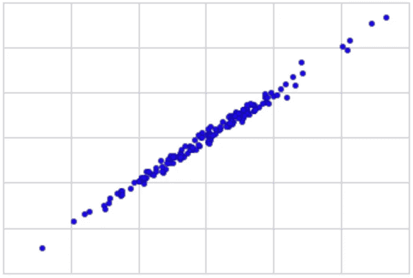
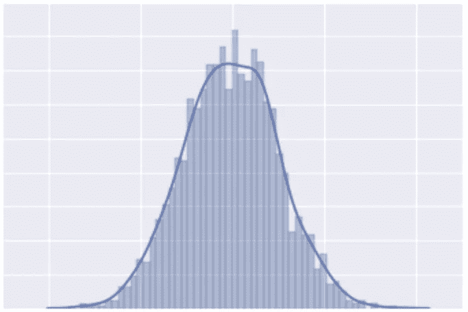
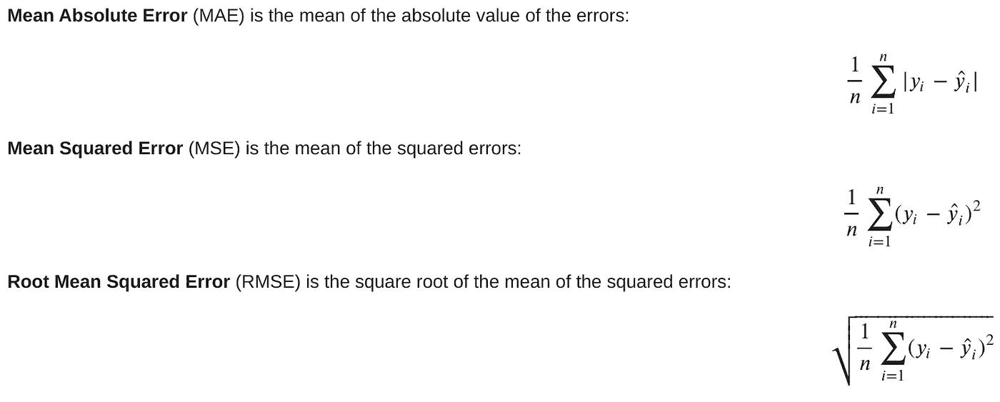

# Python 中的机器学习简介:第三部分

> 原文：<https://medium.com/analytics-vidhya/intro-to-machine-learning-part-iii-2bf5757d0219?source=collection_archive---------33----------------------->


(图片由作者提供)

# 目录

1.  模型评估
2.  模型的预测
3.  回归评估指标
4.  结束思考

这是我的 Python 机器学习入门系列的 3 部分中的最后一部分，写起来很刺激，希望你们中的一些人能从阅读中有所收获。在[机器学习简介:第二部分](/analytics-vidhya/intro-to-machine-learning-in-python-part-ii-d91adb274324f)的上一篇文章中，我们谈到了如何分割、训练、测试和拟合我们的线性回归模型。在这一篇中，我们将在构建并测试我们的模型之后，深入研究这个过程。为此，我们需要通过打印截距和系数来评估模型，查看来自我们模型的预测，然后从定量方法评估它。这是我们的总结，让我们通过例子和一些代码来看看这是如何完成的！

# 模型评估

为了开始评估我们的线性回归模型，我们将打印模型的截距和系数。我们需要做的第一件事是打印我们的截距，代码如下所示。

```
print(lm.intercept_)
```

这应该会给你下面的截距。完成这些后，你可以继续打印系数。系数与 X_train 中的列相关。因此，通过这样做，我们将从系数中创建一个数据框架，使它们更具可读性，更易于解释。Python 中的代码可能如下所示。

```
coeff_df = pd.DataFrame(lm.coef_,X.columns,columns=['Coefficient'])
coeff_df
```

这将创建一个数据框，其中包含您的相关行，以及它们旁边的相应系数。从这里开始，我们转移到如何解释这些系数。

解释一下你那一栏右边的数字，意思是在所有东西都不变的情况下，增加 1 个单位将导致系数增加多少个单位。因此，根据数据和你试图回答的问题，解释这些将取决于具体情况。

现在，我们已经从系数中获得了一些见解，我们可以开始查看我们的模型的预测数据。

# 模型的预测

为了从我们的模型中分析我们的预测，我们需要:

*   将我们从测试数据中得到的预测存储在一个变量中
*   使用 matplotlib 制作散点图
*   使用 seaborn 制作一个 distplot

要将我们的预测数据存储在一个变量中，这将是一行简单的代码和 scikit-learn 包的帮助，看起来像这样:

```
predictions = lm.predict(X_test)
```

现在我们已经得到了一个变量的预测，我们可以通过观察线性模型和它的分布来定性地分析我们的模型。

为此，我们将使用 matplotlib 创建测试值与预测值的散点图，方法是:

```
plt.scatter(y_test,predictions)
```

您的散点图结果应该看起来有点像这样



作者图片

你想要一条紧密的直线，这意味着你的预测和测试模型非常接近。

我们定性分析模型的另一种方法是通过观察它的分布。为此，我们将使用 seaborn 包并通过编码使用 distplot:

```
sns.distplot((y_test-predictions),bins=50);
```

运行此命令后，它应该会生成类似如下的图:



作者图片

我们希望这个图的残差是均匀分布的钟形曲线，就像我们在第二部分中讨论的那样，以确保我们很好地拟合了我们的模型。

既然我们已经定性地分析了我们的模型，我们可以更进一步，通过使用回归评估度量进行定量分析。

# 回归评估指标

在分析我们的线性回归模型时，我们不仅希望直观地看到，还希望看到数字。幸运的是 scikit-learn 可以为我们做这道数学题。这并不意味着知道我们是如何到达那里的不好。



3 个最常见的回归评估指标的备忘单(图片由作者提供)

以下是 3 个最常见的回归评估指标，比较这些指标的最佳方法是:

*   MAE 是基本的，因为它只是平均误差
*   MSE 往往比 MAE 更好，因为它惩罚更常见的较大错误
*   RMSE 是三者中最受欢迎的，因为它以“y”为单位，可读性更强

值得注意的是，这些都是**损失**函数，因此我们正试图在模型中尽可能减少这些损失。当您运行代码来展示这些时，这些将变得更加清楚。

这段代码看起来会像这样:

```
from sklearn import metricsprint('MAE:', metrics.mean_absolute_error(y_test, predictions))
print('MSE:', metrics.mean_squared_error(y_test, predictions))
print('RMSE:', np.sqrt(metrics.mean_squared_error(y_test, predictions)))
```

这将为您提供所有三个回归评估指标，并列出它们的错误。请记住，我们希望模型中的**错误少于**，因此三个模型中数量最少的将是最佳模型。

现在我们终于学会了如何定性和定量地分析我们的线性回归模型。这是最后一步，我们已经完成了机器学习的系列介绍！

# 结束思考

这是我的三部分系列的结论，我希望你们喜欢其中的一部分，或者至少能从中找到一些收获。我绝不是这方面的专家，我写这篇文章是为了尽可能地帮助像我这样的人，他们可能正在开始他们的旅程，并在途中寻找一些帮助。我知道我真的很享受当我找到好的文章来加速我的学习过程，所以我相信这些文章中的一些可能会帮助阅读这篇文章的人。感谢你花时间阅读，如果你没有抓住我过去的文章，我会在下面链接它们，如果有人想看的话。如果你喜欢这篇文章，请留下赞或评论，告诉我我可以做得更好的地方，以及一些你希望我接下来写的东西。再次感谢你，无论你在旅途中的任何地方，都值得期待。

[Python 中的机器学习简介:第一部分](/analytics-vidhya/intro-to-machine-learning-in-python-part-i-ae109dcd4eb0)

[Python 中的机器学习简介:第二部分](/analytics-vidhya/intro-to-machine-learning-in-python-part-ii-d91adb74324f)