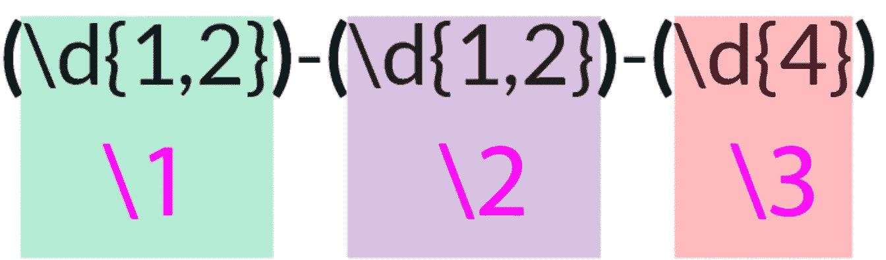

# Python 中的正则表达式简介

> 原文：<https://medium.com/analytics-vidhya/intro-to-regex-in-python-9d57e365d4c8?source=collection_archive---------13----------------------->

已创建:于，Quert
标签:python，regex

*   `re.match`用整个字符串或子字符串匹配模式，返回一个匹配的迭代器/字符串/匹配对象。模块锚定在字符串的开头。
*   `re.match(pattern, string, flags=re.M)` 标志`re.M`表示匹配多行。
*   `re.findall`在字符串中查找所有匹配的模式
*   `re.search`在字符串中搜索一个匹配的模式
*   `re.sub(r'old', 'new', string)`换弦工作。
*   `re.split`用特定字符或正则表达式分割字符串。
*   `re.compile()`用来建立一个新的模式，然后我们可以使用`pattern.findall(texts)`
*   量词
    `{times}`:代表我们想要的次数
    `{n, m}`:最少 n 次，最多 m 次
*   re.search()和 re.match()都有找到的`start()`、`end()`的属性索引

`\d`:数字`\D`:非数字`\w`:文字字符`\W`:非文字字符`\b`:文字边界

> `\s`:空白、`*\t*` `*\b*` `*\f*` `\S`:非空白`+`:一次或多次`*`:零次或多次`?`:零次或一次`.`:匹配任意字符`^`:字符串开头`$`:字符串结尾

`.+`:任何带有数量`|`:表示“或”`//`匹配“/”

## 正则表达式

剥离文本文件中 hashtag 的代码示例

`.`的使用代码

`^`和`$`的使用代码

或者操作员`|`、`[]`、`^`

`[^]`将表达式转换为负数

## 将字符分组以便进一步处理

使用`()`

**非捕获组** : `(?:)`，`(?:(a|b)`

**编号组**

**命名组**

`(?P<name>regex)`

**在正则表达式中选择组号**

**向后看&向前看**

正面前瞻(？=)确保表达式的第一部分后面跟有前瞻表达式。

正面回望(？< =)返回指定模式前面的所有匹配项。

## f 字符串的类型转换

*   `!s`:字符串版本
*   `!r`:包含可打印表示的字符串(即带引号)
*   `!a`:转换成 ASCII 字符

## 格式规范

*   `:e`科学符号
*   `:.d`数字
*   `:.f`浮动

## 贪婪和非贪婪匹配

## 其他的

## 查找子字符串