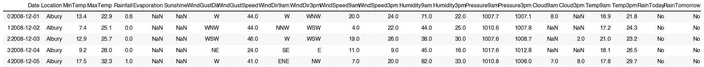
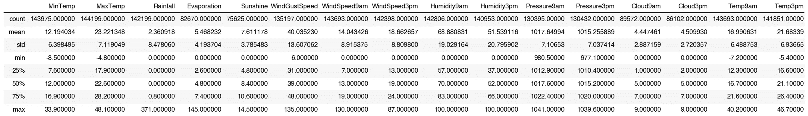
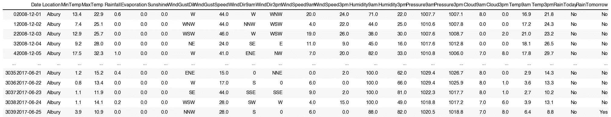
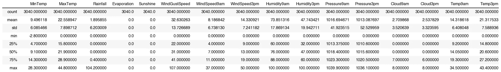
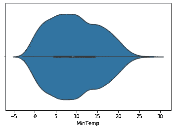
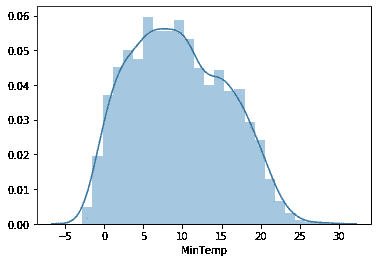
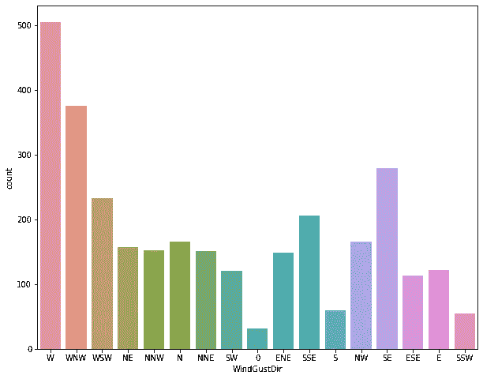

# 更深入的单变量分析

> 原文：<https://medium.com/analytics-vidhya/intro-to-univariate-analysis-de75454b4719?source=collection_archive---------16----------------------->

正如我在之前的文章[单变量、双变量和多变量分析简介](/analytics-vidhya/univariate-bivariate-and-multivariate-analysis-8b4fc3d8202c)中提到的，本文将更深入地探讨不同的分析。我们将使用一个 Kaggle 数据集，澳大利亚的[雨](https://www.kaggle.com/jsphyg/weather-dataset-rattle-package?select=weatherAUS.csv)，来进行我们的分析。

## 单变量摘要

单变量分析只分析一个变量。进行单变量分析的最常见方法是检查数值变量的集中趋势和分类变量的频率分布。

## 开始吧

*   下载数据集
*   导入必要的包
*   读入文件

```
import pandas as pd
import numpy as np
import matplotlib.pyplot as plt
import seaborn as sns

# changing display options to increase the number of columns and rows viewable
pd.set_option('display.max_columns', 300)
pd.set_option('display.max_rows', 200)df = pd.read_csv('weatherAUS.csv')
df.head()
```



使用。info()方法，我们可以看到每个特性的计数和数据类型。

该数据集由 145，460 个观察值(行)和 23 个特征(列)组成。

```
df.info()<class 'pandas.core.frame.DataFrame'>
RangeIndex: 145460 entries, 0 to 145459
Data columns (total 23 columns):
Date             145460 non-null object
Location         145460 non-null object
MinTemp          143975 non-null float64
MaxTemp          144199 non-null float64
Rainfall         142199 non-null float64
Evaporation      82670 non-null float64
Sunshine         75625 non-null float64
WindGustDir      135134 non-null object
WindGustSpeed    135197 non-null float64
WindDir9am       134894 non-null object
WindDir3pm       141232 non-null object
WindSpeed9am     143693 non-null float64
WindSpeed3pm     142398 non-null float64
Humidity9am      142806 non-null float64
Humidity3pm      140953 non-null float64
Pressure9am      130395 non-null float64
Pressure3pm      130432 non-null float64
Cloud9am         89572 non-null float64
Cloud3pm         86102 non-null float64
Temp9am          143693 non-null float64
Temp3pm          141851 non-null float64
RainToday        142199 non-null object
RainTomorrow     142193 non-null object
dtypes: float64(16), object(7)
memory usage: 25.5+ MB
```

我们看到“日期”列和“位置”列包含所有 145，460 个观测值，但是其余的特征都是缺失的观测值。根据分析的目标和您所拥有的领域知识，您将不得不处理空值。出于本文的目的，我将把空值转换为 0。

快速浏览数据集的方法是使用[。](https://pandas.pydata.org/docs/reference/api/pandas.DataFrame.describe.html)形容()方法在熊猫身上的运用。

该方法提供了数据集中所有数值数据的摘要。如下图所示，它显示了每个特征的计数、平均值、标准偏差、最小值、25%、50%和 75%百分比，最后是最大值。

```
df.describe() #before replacing all null values to 0
```



```
df.fillna(0, inplace = True) 
# inplace = True replaces all null values in the same dataset.
# by default, to prevent errors, pandas will create a copy of the dataset where 
# all null values are filled if inplace=True is not specified.
```

现在让我们再次检查空值。

```
df.info()
# there are no more null values in the dataframe<class 'pandas.core.frame.DataFrame'>
RangeIndex: 145460 entries, 0 to 145459
Data columns (total 23 columns):
Date             145460 non-null object
Location         145460 non-null object
MinTemp          145460 non-null float64
MaxTemp          145460 non-null float64
Rainfall         145460 non-null float64
Evaporation      145460 non-null float64
Sunshine         145460 non-null float64
WindGustDir      145460 non-null object
WindGustSpeed    145460 non-null float64
WindDir9am       145460 non-null object
WindDir3pm       145460 non-null object
WindSpeed9am     145460 non-null float64
WindSpeed3pm     145460 non-null float64
Humidity9am      145460 non-null float64
Humidity3pm      145460 non-null float64
Pressure9am      145460 non-null float64
Pressure3pm      145460 non-null float64
Cloud9am         145460 non-null float64
Cloud3pm         145460 non-null float64
Temp9am          145460 non-null float64
Temp3pm          145460 non-null float64
RainToday        145460 non-null object
RainTomorrow     145460 non-null object
dtypes: float64(16), object(7)
memory usage: 25.5+ MB
```

假设我只对阿尔伯里感兴趣，想知道那里的最低和最高温度。首先，我需要分离出阿尔伯里的所有观察数据，然后进行分析。

```
# this function checks for "Albury" in the "Location" column and returns a boolean. 
df["Location"]=="Albury" 
# this function returns a dataframe where the the "Location" is "Albury". 
df[df["Location"]=="Albury"]
```



我现在将指定一个名为 albury_df 的变量作为只包含 Albury city 的数据帧

```
albury_df = df[df["Location"]=="Albury"]
```

如前所述，我们只对阿尔伯里记录的最低和最高温度感兴趣。

```
lowest = albury_df["MinTemp"].min()
highest = albury_df["MaxTemp"].max()

print(lowest, highest)output: -2.8 44.8
```

但是您也可以使用。describe()方法来查看关于这些特性的更多信息。

您可以看到 MinTemp 和 MaxTemp 的最低值和最高值。

```
albury_df.describe()
```



然而，如果你只对最小温度的分布或频率感兴趣，你可以使用柱状图、箱线图、紫线图或分布图。我个人比较喜欢 violinplot，但是使用的不多。我写过一篇关于[为什么 violinplot 应该更常用](/analytics-vidhya/a-violin-is-better-f7068129a14)的文章。

```
sns.violinplot(x="MinTemp", data=albury_df)
```



```
sns.distplot(albury_df["MinTemp"])
# here you can see the distribution of the MinTemp.
# y-axis represents the percentage
```



现在让我们来看看分类变量。我们会看风阵风。这里我们将使用计数图，因为方向的数量有限。

```
fig, ax = plt.subplots(figsize = (10,8))
sns.countplot(x="WindGustDir", data=albury_df)
```



有很多方法可以美化它，让它看起来更像样。可以在本文的[上找到启动代码。](https://dorjeys3.medium.com/matplotlib-quick-and-pretty-enough-to-get-you-started-5f425b55132f)

另一种简单查看数字分布的方法是创建熊猫的数据透视表。

```
duplicates = albury_df.pivot_table(index= ["WindGustDir"], aggfunc="size")
print(duplicates)WindGustDir
0       32
E      122
ENE    149
ESE    113
N      165
NE     157
NNE    151
NNW    152
NW     166
S       60
SE     279
SSE    206
SSW     55
SW     120
W      505
WNW    375
WSW    233
dtype: int64
```

正如在[单变量、双变量和多变量分析简介](/analytics-vidhya/univariate-bivariate-and-multivariate-analysis-8b4fc3d8202c)中提到的，单变量分析是三种分析中最简单的。它提供了基本信息，但也提供了某个功能的关键信息。只要看一下上面的表格和数字，我们就可以肯定大部分阵风来自西方。我们还知道阿尔伯里市记录的最低和最高温度。

在下一篇文章中，我们将着眼于双变量分析，并深入研究可用于进行分析的不同方法。

请随时查看我的[网站](https://dorjeysherpa.com/)。它包含了我参与的所有项目和博客。