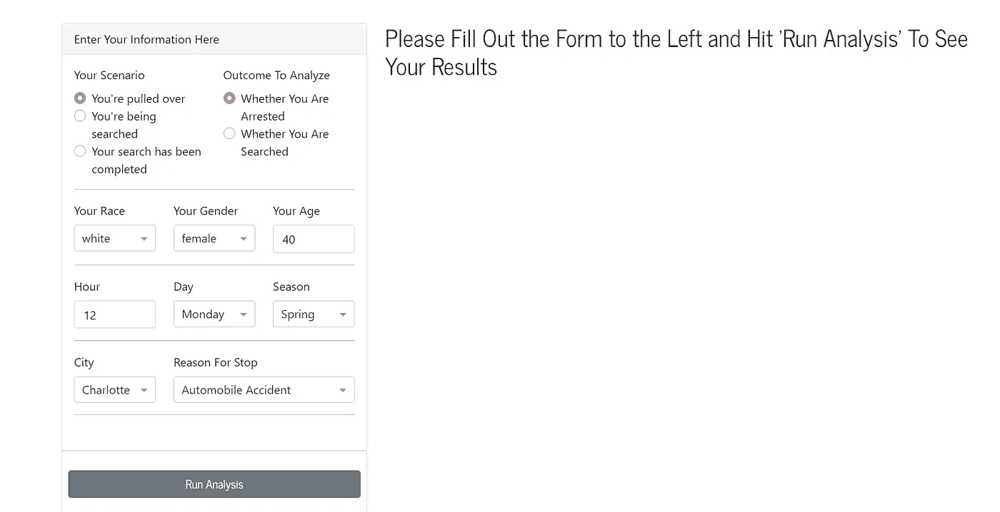
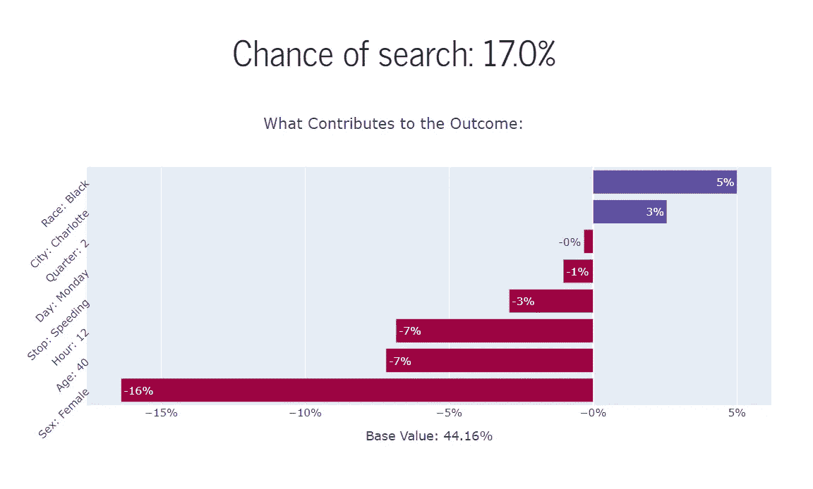
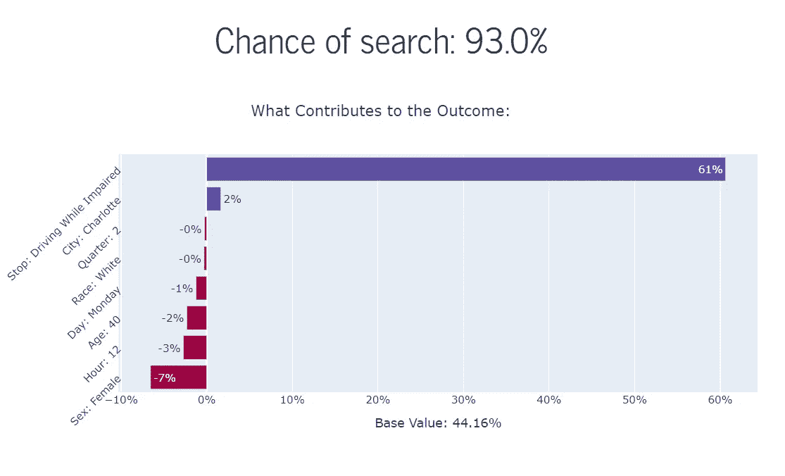
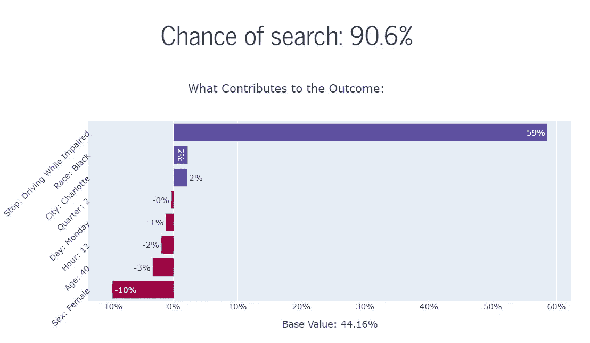
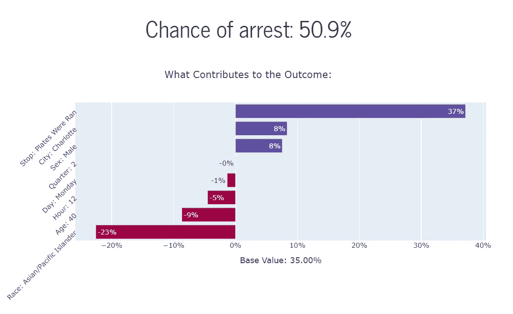
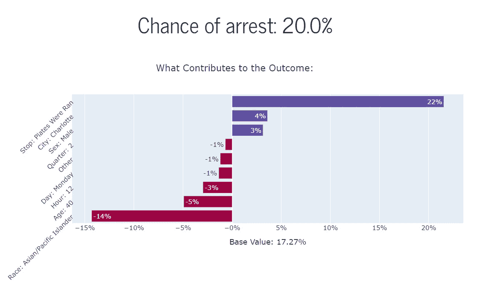
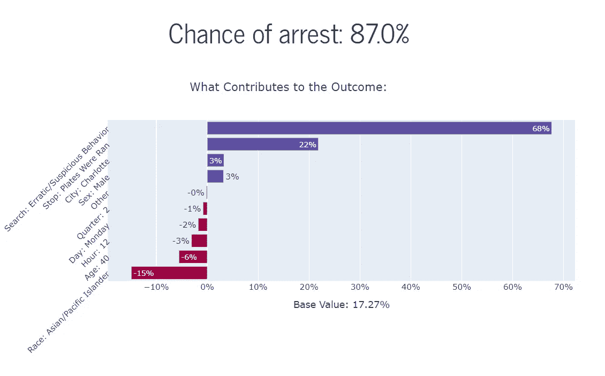
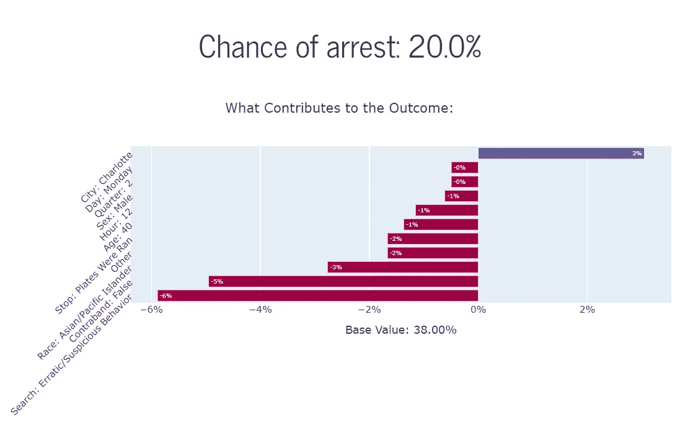

# 警察 x 射线简介:研究种族、性别和行为对警务影响的工具

> 原文：<https://medium.com/analytics-vidhya/introducing-police-xray-a-tool-to-study-the-impact-of-race-gender-behavior-on-policing-a7b750936f35?source=collection_archive---------9----------------------->

警察 x 光:一种使用机器学习来理解警察结果的工具

在美国，很少有社会问题像治安及其对不同人群的不同影响那样受到如此多的关注。乔治·弗洛伊德(George Floyd)之死引发了对美国治安状况的情绪高涨和辩论，以及警察行为是否因种族而有偏见。

随着这一问题成为公众讨论的焦点，不同的观点被自愿用来塑造我们对警务的公平性和效用的看法。其中包括:

——美国的治安从根本上来说是腐败的，整个行业都需要解散。(即“解除警察的武装”)

—警务结果倾向于特定群体，但一旦你考虑到不同群体与警察互动的频率，差异就变得不那么严重了。(即，不同类型行为的每次互动逮捕率在人口统计类别中大致相同)
—警务结果倾向于特定群体，但这种影响在某些类型的争吵中比其他类型更普遍。(也就是说，少数民族被更积极地搜查，但没有被更积极地逮捕或枪杀)
—作为一种制度，警察是如此重要，以至于我们应该容忍异常情况，如果这意味着公共安全作为一个整体得到维护的话。警察并不完美，但总的来说，他们行动合理，促进了社会福祉。

各种类型的讨论从上面列出的要点中衍生出来。最有力的证据是警方实时虐待嫌疑人的视频，比如[乔治·弗洛伊德](https://www.youtube.com/watch?v=f5eYvDToQgQ)和[托尼·廷帕](https://www.youtube.com/watch?v=6X4PUwrq8tA&t=281s)。(警告:两个视频都是图文)。

其他类型的讨论产生于学术材料，旨在量化警察如何对待不同人群的具体细节。一些被引用较多的例子包括:

—一项研究评估了超过 1 亿次警察拦截，发现[警察使用比白人](https://5harad.com/papers/100M-stops.pdf) s.
更低的阈值来证明对少数族裔的搜查是合理的 Roland Fryer 的一篇论文研究了 4 个不同的数据集，发现[有明显的证据表明对嫌疑人的搜查存在种族偏见，但对他们使用暴力](https://www.nber.org/system/files/working_papers/w22399/w22399.pdf)。
——一项研究发现，一旦你解释了他们遭遇的环境，种族差异就会消失[。](https://journals.sagepub.com/doi/abs/10.1177/1948550618775108?journalCode=sppa)

所有这些要点都有它们的位置，但综合起来，它们并没有很好地描述警察的结果是如何以及何时由我们是谁与我们做什么决定的。至少对普通大众来说不是。视频功能强大，但不是数据。学术研究很重要，但大多数人都无法理解它，包括报道它的记者。

# 警察 x 光:理解警务的更好方法

[Police Xray](https://www.policexray.com/home/) 是一个 web 应用程序，让您可以轻松查看不同的环境如何影响种族、性别、年龄和行为对您在警察拦截期间是否被搜查或逮捕的影响。

它在来自[开放警务项目](https://openpolicing.stanford.edu/)的数据集上使用了当代机器学习技术，该项目包括北卡罗来纳州的 450 多万次停车，这些停车提供了关于警察停车的情况和结果的一致注释。

要使用它，您只需在主页上填写一张[表单:](https://www.policexray.com/home/#main)

系统会提示您回答一些问题，这些问题描述了您的个人信息、被停止的原因以及您所处的流程步骤。然后，应用程序将使用其模型来预测结果的概率，以及个人对最终结果的贡献。它提供了一种粒度方式来理解在各种情况下是什么促成了一个结果。

例如，让我们假设你被拦下，警察还没有采取行动。你被搜索的几率有多大，为什么？

如果你因为一些良性的事情被拦下，比如超速，那么“基于口味的特征”比如年龄、种族或性别对结果有很大的影响。一个 40 岁的白人妇女因超速被拦下，她的情景分析如下:

在这里你很容易看到，身为白人、女性和 40 岁从被搜索的基线概率中减去 22%，或减少 50%的搜索机会。同样，像中午被拦下和超速行驶这样的事情会减少被搜查的机会。只有事件发生在夏洛特的事实增加了搜索结果的机会。

如果您研究同样的场景，但用白色代替黑色，您会得到以下结果:

在这里，我们可以看到搜索的概率从 11%增加到 17%，受试者的种族的影响做了一个完整的翻转，从减少 5%的概率到增加 5%的预期结果。然而，作为女性对黑人来说比白人更有利，正如嫌疑人的性别在两种情况下的影响所证明的那样。

然而，如果我们把某人被拦下的原因从像超速这样无害的事情改变为像酒后驾车这样更明显违反法律的事情，结果会有很大的变化。

以下是一名 40 岁的白人妇女因酒后驾车被拦下的情景:

在这里你可以看到，被搜索的机会几乎是有保证的，种族并没有发挥特别重要的作用。结果由嫌疑人的行为决定。

改变一个人的种族对这个结果几乎没有影响，因为你可以看到具有相同特征的黑人的结果几乎是相同的:

如果你因酒后驾车被拦下，某人的肤色是白是黑远没有他们的酒醉重要。

该应用程序允许您查看三种不同场景下的结果，并研究两种不同的结果:
—对于一种结果，您可以研究您被搜查或逮捕的可能性
—对于一种场景，您可以在警察互动的过程中选择三个点:
— — —当您第一次靠边停车时(没有进行搜查)
— — —在警察搜查了您之后
— — —警察的搜查结果已经最终确定(即，他们在您身上找到任何东西了吗？)

观察在止损过程中结果的不同变化，可以说明一段时间内情况不同部分的重要性。
例如，假设你是一名亚洲男性，因为警察检查了你的车牌并发现了可疑之处而被拦下。

当警察第一次让你靠边停车时，这是你被逮捕的概率:

你可以看到，因为这个原因被拦下来会产生很大的负面结果，没有提供额外的信息。

但是，如果他们让你靠边停车后，没有发现任何可疑行为的线索，也没有进行搜查，该怎么办？你出现负面结果的几率会大大降低:

然而，假设你*由于在停车时的可疑行为而被*搜查。那么您的结果会有以下细分:

如您所见，搜索过程中发生的事情对预期结果有着巨大的影响！

然而，如果你被搜查，但没有发现违禁品，你可以看到某人被逮捕的机会正好回到他们根本没有被搜查的情况:

这里的主要想法是，人们现在可以探索警察互动的不同方面，并且以一种所有背景的人都非常容易获得的方式，从一个量化严格的来源获得具体信息。对头脑和心灵都有吸引力的工具。

# 好的科学是可复制的

正确的科学必须以一种既便于他人使用又易于复制的方式进行。

为此，警察 x 射线试图以三种不同的方式使其工作透明:
—其结果[可通过 REST api](https://www.policexray.com/api) 获得，其他人可以用来研究结果或在他们认为合适的时候重用。软件开发人员可以很容易地连接到用于支持应用程序的服务，如果他们想为自己的目的使用它的话。它不需要认证，可以免费使用。
—创建结果的建模[可以从项目的 github repo](https://github.com/JonathanBechtel/policexray) 中复制。如果可以使用命令行，则可以在一行中重新运行分析，并获得模型结果以及项目中使用的实际模型的副本。
—如果你有雄心壮志，你甚至可以[提交一个 IPython 笔记本和你的工作，为项目](https://github.com/JonathanBechtel/policexray/blob/main/CONTRIBUTING.md)提供分析，以便在应用程序中使用。

这应该给开发人员、研究人员和有抱负的数据科学家一个机会，以他们选择的任何方式评估工作，并根据他们的愿望进行改进。

# 前方是什么

如果这种努力证明是有用的，有很多方法可以扩大项目的范围。这些补充包括:
—随着数据的可用，覆盖了美国更多的城市
—从更全球化的意义上解释了什么是重要的(例如，当某人被拦下时，他的性别是不是一个具有统计意义的逮捕预测因素？)
—让人们轻松比较不同场景的方法，以便更容易地了解他们关心的细节的结果如何变化

为更好地以数据为导向理解我们关心的问题干杯。