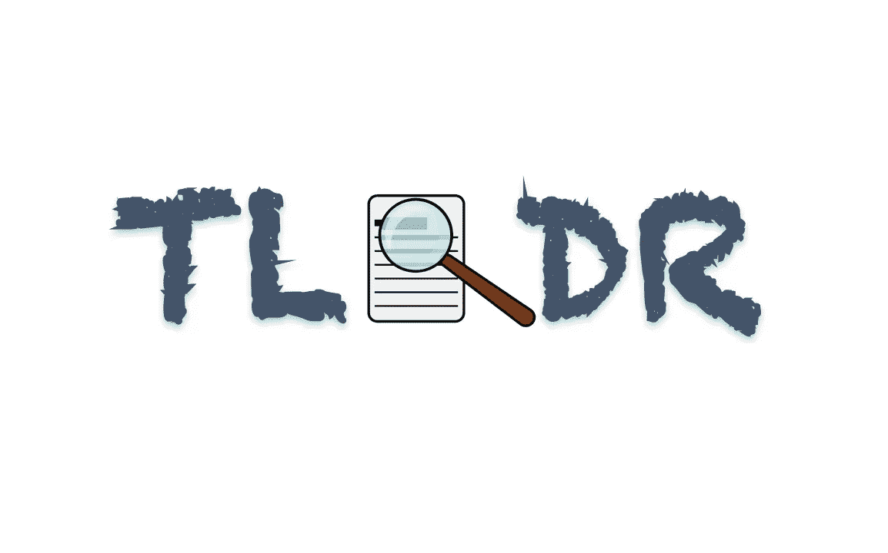

# 介绍 TLDR，一个用于文本摘要和分析的 API。

> 原文：<https://medium.com/analytics-vidhya/introducing-tldr-an-api-for-text-summarization-and-analysis-ece064efdbad?source=collection_archive---------3----------------------->

## 如何使用这个强大的 API 来分析网上的文章。

图片由作者提供。

在信息时代，我们手边有大量的信息。互联网是如此之大，以至于实际估算其规模是一项复杂的任务。说到信息，我们的问题不是缺少…