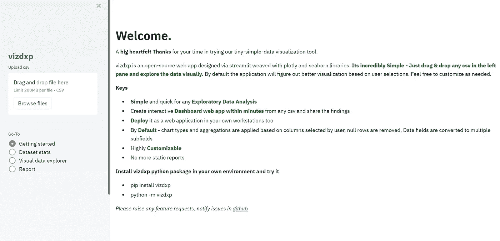
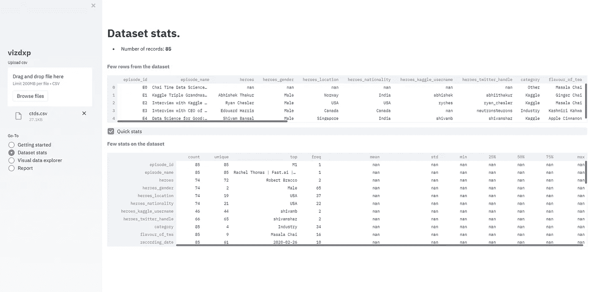
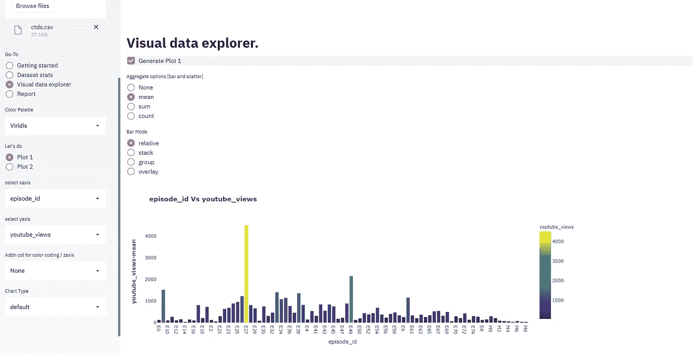
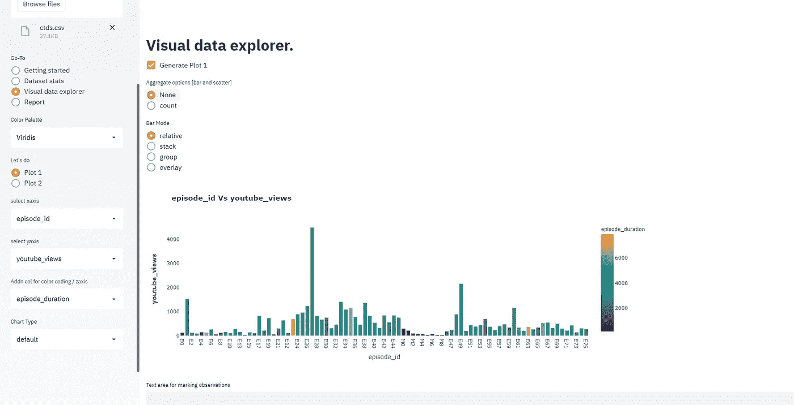
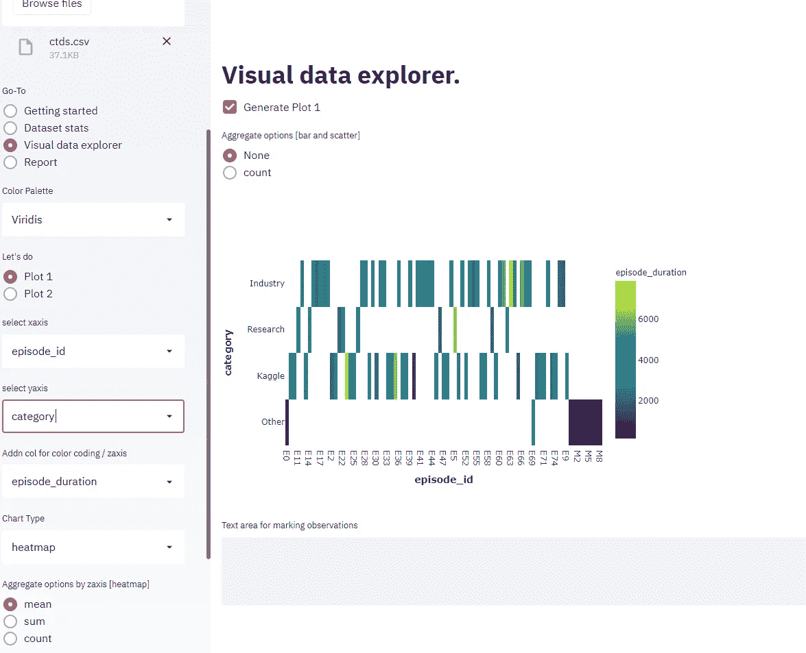
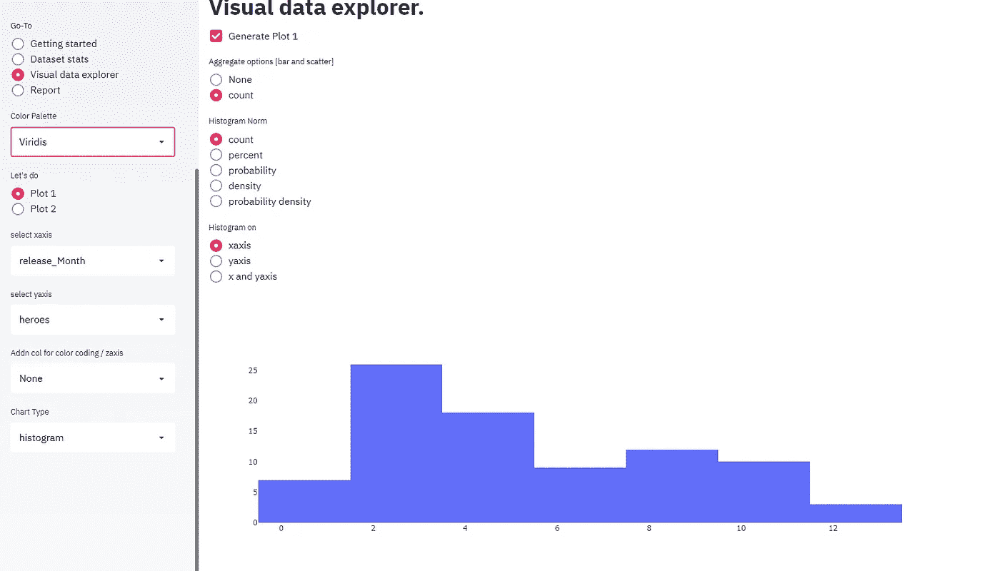
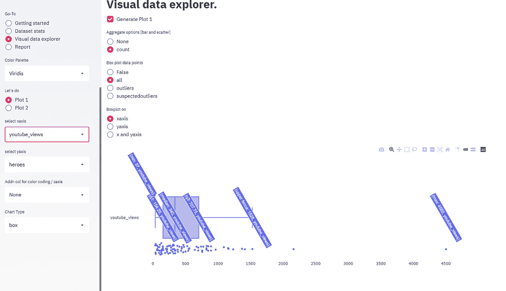

# vizdxp 简介—用于快速探索性数据分析和可视化

> 原文：<https://medium.com/analytics-vidhya/introducing-vizdxp-for-quick-exploratory-data-analysis-and-visualizations-89128326e8ac?source=collection_archive---------15----------------------->

## 可视化浏览数据，并在几分钟内将其部署到您的工作站中

[安德鲁·尼尔](https://unsplash.com/@andrewtneel?utm_source=medium&utm_medium=referral)在 [Unsplash](https://unsplash.com?utm_source=medium&utm_medium=referral) 上拍照

E 勘探数据分析(EDA)是一个重要的过程，它启动了数据调查，如发现模式、识别异常、获得洞见等。有许多方法可以浏览表格数据。只是捕捉到一些对我有利的信息，作为这个故事的铺垫:)

*   使用 excel，pivots 浏览数据，使用默认图表选项，并通过 powerpoint/over excel 电子表格/呈现结果..
*   使用 Python/R 处理数据，并使用绘图库可视化这些数据。通过 power point 展示调查结果/通过首选技术堆栈将 it 作为应用程序进行部署/..

直到我开始做更多的数据分析和处理更大的数据集，我的选择一直是 excel 和 powerpoint(企业方式)。当我开始使用更大的数据集进行探索、预测活动和展示发现时，我开始使用 python，使用漂亮的绘图库，如 plotly、Seaborn、matplotlib..

vizdxp 是进行快速初步数据分析的首次尝试，任何人都可以使用，无需编码，并使用数据分析师通常使用的强大库。目前 vizdxp 支持 csv 格式的数据。也可以随意将其扩展到任何其他数据类型/数据库连接。它是开源的，在下一个版本中还将引入数据预处理功能。

您可以使用自己的数据[在线](https://vizdxp.herokuapp.com/)探索 vizdxp，或者从 [github](http://github.com/Vinothsuku/vizdxp) 下载到您的本地工作站，在您的网络中探索和托管它。

主页

vizdxp 是一个开源的 web 应用，通过 streamlit 设计，用 plotly 库编织。**使用起来非常简单——只需拖拽&任何 csv 文件，然后直观地浏览数据。**默认情况下，应用程序将根据用户选择计算出更好的可视化效果。根据需要随意定制。

# **主要特点**

- **简单**快速进行任何**探索性数据分析**

-在几分钟内从任何 csv 创建交互式**仪表盘 web 应用程序，并分享调查结果**

- **将** it 作为 web 应用程序部署在您自己的工作站上

-按**默认**-图表类型和聚合基于用户选择的列应用，删除空行，日期字段转换为多个子字段

-高度**可定制**

-可轻松**扩展**用于其他图表类型

-不再有静态报告。在您的组织中托管此 webapp，目标用户可以浏览他们的视图，而不仅仅是查看已处理的静态报告

-包括图表类型—散点图、条形图、饼图、热图、直方图和箱线图

# **安装**

(在终端/命令提示符下)

> pip 安装 vizdxp

(安装完成后)

> python -m vizdxp

通过浏览器浏览 vizdxp。一旦安装完成，用户可以完全脱机工作。

**这个包也是托管** [**在线**](https://vizdxp.herokuapp.com) **。**请随意探索您自己的数据

# **探索步骤**

上传你的数据。左窗格中的 csv 格式(最大限制为 200mb)。

-数据上传后，用户可以通过点击左侧窗格中的单选按钮，在**“数据集统计”**中快速查看数据集

-浏览数据集中的几行以了解数据集

-记录总数

-按列:计数、唯一值计数(唯一)、最高唯一值记录(最高)及其频率(频率)、平均值、标准差(标准)、最小值(最小)、最大值(最大)、百分位数 25%、50%和 75%

-在左侧窗格中选择**“可视数据浏览器”**

-选择 xaxis，yaxis 并点击“在右窗格中生成图 1”以获得默认图形。**根据选择的列，将生成默认图形类型和选项**。用户可以根据需要更改图形类型和选项。

-如果用户想要查看第三轴视图，用户可以选择**“颜色编码/坐标轴添加栏”**。相对于 x 和 y 轴，将根据第三列选择应用颜色代码

-随意探索图表类型，如**热图、箱线图、直方图**，这些图表提供了关于数据的不同视角，但较少探索的图表类型

热图

柱状图

箱子

# **执照**

- vizdxp 是完全免费的、开源的，并获得了 MIT 的许可。

- Vizdxp 是以 [Streamlit](https://www.streamlit.io/) 为框架开发的。

- [Plotly](https://plotly.com) 是使用的可视化库。