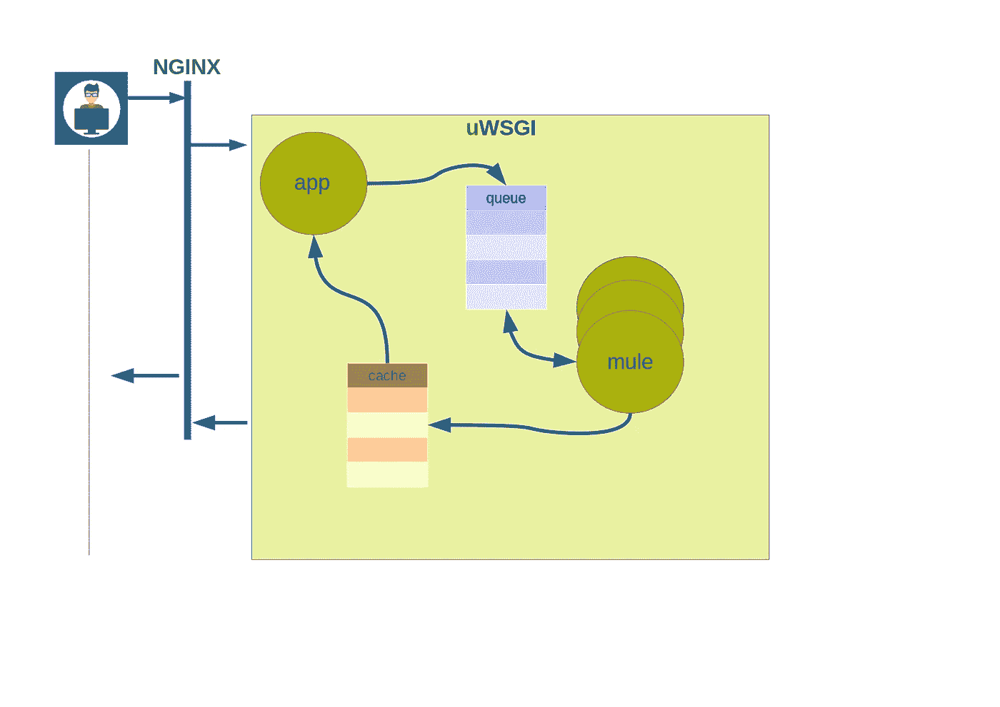

# 将您的机器学习模型部署到生产中

> 原文：<https://medium.com/analytics-vidhya/introduction-c8f820e094e5?source=collection_archive---------8----------------------->


布拉登·科拉姆在 [Unsplash](https://unsplash.com/?utm_source=unsplash&utm_medium=referral&utm_content=creditCopyText) 拍摄的照片

# 介绍

机器学习每天都受到越来越多的关注。因此，对 ML 模型的生产就绪部署的需求急剧增加。
在本文中，我们将讨论如何将您的机器学习模型部署到生产中。
我们将从简单的方法开始，这不是在生产中要做的事情，
增加解决方案的复杂性，最后，在用所有这些噩梦折磨你之后，我们将以部署和服务你的模型的正确方式结束。

# 先决条件

*   我们使用 linux
*   Python 3
*   [烧瓶](https://flask.palletsprojects.com/en/1.1.x/)
*   [uWSGI](https://uwsgi-docs.readthedocs.io/en/latest/)
*   码头工人
*   [雷](https://ray.io/)

网上大部分可用资源建议你在 Flask API 后面部署 ML 模型并为其服务。大概是这样的:

([感谢 Luigi Patruno 的精彩系列文章](https://mlinproduction.com/))

```
from flask import Flask, requestapp = Flask(__name__)
model = None def some_fancy_loading_logic():
    # Load your model here
    return None @app.before_first_request
def load_model():
    global model
    model = some_fancy_loading_logic() @app.route('/predict', methods=['POST'])
def predict():
    global model
    data = request.get_json()
    prediction = model.predict(data)
    inp_out = {'input': data, 'prediction': prediction}
    return inp_outif __name__ == '__main__':
    app.run(host='0.0.0.0', port=80, debug=True)
```

并在 docker 中打包:

```
FROM python:3.6COPY ./requirements.txt /tmp
RUN pip3 install --upgrade pip \
  && pip3 install -r /tmp/requirements.txtCOPY ./app /app
CMD ["python", "/app/main.py"]
```

太不可思议了。不是吗？简答:没有！

长回答:如果你开始这个并查看日志，它会对你大喊:

> "警告:这是一个开发服务器。不要在生产部署中使用它。

这里有一篇短文描述为什么: [Flask 不是您的生产服务器](https://build.vsupalov.com/flask-web-server-in-production/)和[官方文档](https://flask.palletsprojects.com/en/1.1.x/tutorial/deploy/#run-with-a-production-server)明确声明不使用 Flask 内部服务器，而是使用生产就绪的 WSGI 服务器。所以我们从这个开始。

为了完成这个任务，请牢记黄金法则(如果有人已经做到了——使用它，不要发明它！)我们将使用[这个](https://github.com/tiangolo/uwsgi-nginx-flask-docker)作为父 docker 图像(感谢[塞巴斯蒂安·拉米雷斯](https://github.com/tiangolo))。这个图像满足了我们所有的需求。这里是我们将用来创建图像的 Dockerfile 文件:

```
FROM tiangolo/uwsgi-nginx-flask:python3.6COPY ./requirements.txt /tmp
RUN pip3 install --upgrade pip \
  && pip3 install -r /tmp/requirements.txtCOPY ./app /app
```

dockerfile - /app 目录的肉。这是所有奇迹发生的地方。这是将在 WSGI 中运行的应用程序，为我们的模型提供服务。要理解在用 nginx 和 wsgi 部署 flask 应用程序时发生的奇妙事情，请看[这个](https://flask.palletsprojects.com/en/1.0.x/deploying/uwsgi/)。

首先，让我们用以下内容创建一个简单的 main.py:

```
from flask import Flaskapp = Flask(__name__) @app.route('/predict', methods=['POST'])
def predict():
    return "Still want to continue?"
```

添加 uwsgi ini 文件:

```
[uwsgi]
module = main
callable = app
```

您可以在 [github](https://github.com/hbeybutyan/articles/tree/main/model_deployment) 中查看项目结构

构建…

```
docker build -t simple_app .
```

运行…

```
docker run -p 8080:8080 -it simple_app:latest
```

请求…

```
curl -X POST -d {\"text\":\"tadaaam\"} 127.0.0.1:80/predict -H "Content-Type: application/json"
```

这个太简单了，不好评论什么。现在让我们创建一个类来代表我们训练好的模型。创建实例后，我们将加载模型，并根据用户请求进行预测。如果翻译成 Python:

```
from time import sleep class FancyModel:
    def __init__(self):
        # Here we load pretrained model. It lasts somewhat long.
        sleep(0.05) def predict(self, text):
        sleep(0.005)
        return "Can't tell anything smart about: {}".format(text)
```

这篇文章不是关于任何特定的模型或 ML 问题。这就是为什么我们用这个简单的类模拟了一个漫长的不眠之夜的结果，你做了大量的工作来获得一个最终表现有点合理的模型。在现实生活中，您将使用您最喜欢的库来加载预训练模型。可能还会进行一些输入验证。这里我们保持简单。我们假设加载模型需要 50 毫升，进行预测需要 5 毫升。

把所有东西粘在一起，我们就有了这个:

```
from flask import Flask, request
from FancyModel import FancyModelapp = Flask(__name__) @app.route('/predict', methods=['POST'])
def predict():
    fnc = FancyModel()
    data = request.get_json()
    return fnc.predict(data["text"])
```

再次-构建…运行…请求…

但是等等，这太难看了。对于每个传入的请求，我们加载模型。这就像你打电话给电视供应商的技术支持，他们会让你在线一个小时。我打赌他们会错过你在明年合同上的签字。所以我们再进一步，做另一件丑陋的事。

```
from flask import Flask, request
from FancyModel import FancyModelapp = Flask(__name__)
fnc = FancyModel() @app.route('/predict', methods=['POST'])
def predict():
    data = request.get_json()
    return fnc.predict(data["text"]) 
```

再次-构建…运行…请求…

耶哈哈。现在不需要为每个请求加载模型。这样不好吗？肯定没有！问题是你可能使用的一些框架可能不是线程安全的。比如尝试谷歌“tensorflow 叉安全”。这可能不仅仅是张量流和分叉的情况。所以让我们更进一步。我们需要每个模型生活在它自己的过程中。这里我们有多种选择。例如，继续使用纯 python。创建一个长生命进程池，关注它们的生命周期等。我们不会这样做。相反，我们将使用一个 uWSGI 的居民，如[骡子](https://uwsgi-docs.readthedocs.io/en/latest/Mules.html)。下面是现在服务请求的方式:



一旦 http 服务器收到请求并将其转发给我们的应用程序，我们将:

1.  为请求生成一个 uuid，并将请求放入队列。
2.  通知骡子。如果所有的任务都完成了，那么骡子就在等待一个确认，即有一个任务要服务。
3.  等待结果出现在缓存中。

依次，骡子:

1.  收听确认消息。
2.  一旦收到请求，就轮询任务队列。
3.  使用请求 uuid 作为关键字进行预测并将结果添加到缓存中。

让我们在项目中添加一头骡子。

首先，我们现在需要对 uwsgi 进行一些配置更改。这是新的配置。

```
[uwsgi]
module = main
callable = app
mule=hard_working_mule.py
mule=hard_working_mule.py
mule=hard_working_mule.py
mule=hard_working_mule.pymaster = true
queue = 100
queue-blocksize = 2097152
cache2 = name=mcache,items=10,blocksize=2097152
```

让我们一行一行来。

uWSGI 服务器需要知道在哪里可以找到应用程序的 callable，前两行就是关于这个的。接下来，我们指定每个 mule 将运行什么，正如您所看到的，我们希望初始化 4 个 mule。每头骡子运行的代码很快就会出现。接下来，uwsgi [队列](https://uwsgi-docs.readthedocs.io/en/latest/Queue.html)和[缓存](https://uwsgi-docs.readthedocs.io/en/latest/Caching.html)被初始化。好吧，我知道你注意到了。我们漏了一行

```
master = true
```

这样我们就启动了一个名为“缓存清理器”的线程。它的目的是从缓存中删除过期的密钥。如果我们错过了什么，就有点警惕了。

正如所承诺的，这是每头骡子将要做的:

```
from FancyModel import FancyModel
import uwsgi
import jsonif __name__ == '__main__':
    fnc = FancyModel()
    while True:
        uwsgi.mule_get_msg()
        req = uwsgi.queue_pull()
        if req is None:
            continue
        json_in = json.loads(req.decode("utf-8"))
        text = json_in["text"]
        # to store transliterations
        json_out = {"res": fnc.predict(text)}
        uwsgi.cache_update(json_in.get("id"), json.dumps(json_out, ensure_ascii=False), 0, "mcache")
```

主要逻辑是:

```
from flask import Flask, request, Response
import uuid
import json
import uwsgiCACHE_NAME = "mcache"def process_request(json_in):
    uid = str(uuid.uuid4())
    json_in["id"] = uid
    uwsgi.queue_push(json.dumps(json_in))
    # Actual content of message does not really matter
    # This is just to triger mule execution
    uwsgi.mule_msg("s")
    while not uwsgi.cache_exists(uid, CACHE_NAME):
        continue
    res = uwsgi.cache_get(uid, CACHE_NAME)
    uwsgi.cache_del(uid, CACHE_NAME)
    return Response(response=res,
                            status=200,
                            mimetype="application/json") app = Flask(__name__) @app.route('/predict', methods=['POST'])
def predict():
    data = request.get_json()
    return process_request(data)
```

看起来不错，不是吗？再说一次-不。

让我们看看是怎么回事。首先:骡子代码中丑陋的“虽然是真的”:但是让我们假设我们是优秀的、迂腐的程序员，这不是问题。按照规定，我们有 4 头骡子来满足我们的需求。但是等等。谁说 4 骡子是个好选择？我们是怎么得出这个数字的。如果我们有一个非常大的请求率，那么 4 只骡子不能及时满足所有的请求怎么办？在这种情况下，队列将填满，我们将开始丢失请求。这意味着我们也需要仔细选择队列的大小。但是怎么做呢？这个决定背后的基本原理是什么？除了实践，没有任何理由可以改变和摧毁一切。

“但是等等”——你可以说——“我们可以扩展应用程序来满足更多的请求。”

好的。将所有这些乱七八糟的东西打包到 docker 中，并通过复制进行扩展。在这种情况下，我们的扩展粒度是 4 骡子，加上运行主代码的进程，等等。这是典型的资源浪费。如果我们有许多必须服务的模型(也许我们提供 45 种语言的翻译，并为每一对训练了单独的模型)，那该怎么办？策略必须是什么？把所有东西都装在一只骡子里，可能会跑出队列？每个型号再养 4 头骡子，尽可能浪费资源？

另一件要注意的事情是:如果 mule 接受了请求并在服务过程中死去了怎么办。我们等待结果出现在缓存中。更糟糕的是，每个特定的解决方案都会带来新的问题。

那怎么办呢？

认识一下[雷](https://docs.ray.io/en/master/index.html)。让我们不要谈论它有多好，开始使用它。我不打算描述部署 Ray 的所有步骤。在文档中有很好的描述。相反，我们将研究一个简单的用例，涵盖我们之前在 ngnix 和 uwsgi 方面的内容。顺便说一句，雷有令人难以置信的响应社区。如果有的话，试着在 Slack 频道上提问。

我们假设您已经配置了 kubernates 和 kubectl 来与之交互。如果没有，可以尝试一下 [minikube](https://minikube.sigs.k8s.io/docs/start/) 。它很好地记录了你如何[在你的 kubernetes](https://docs.ray.io/en/master/cluster/kubernetes.html) 上部署 Ray cluster。长话短说:

1.  从 [repo](https://github.com/ray-project/ray/tree/master/doc/kubernetes) 下载配置文件:
2.  使用以下命令在 kubernates 中创建名称空间

```
kubectl create -f ray/doc/kubernetes/ray-namespace.yaml
```

3.使用以下工具部署射线群集:

```
kubectl apply -f ray/doc/kubernetes/ray-cluster.yaml
```

显然，您需要更深入地了解这个 yaml 文件，以了解发生了什么。但是这些都是不言自明的，即使没有经验的 kubernates 用户也可以通过谷歌了解那里发生了什么。

我们完了。雷已经在你的 kubernates 上运行了。如果需要，请检查它:

```
kubectl get pods -n ray
```

您可以在那里看到 3 个工作节点。想换吗？在上面的 yaml 中更改 worker 节点副本的数量，重新应用配置，并根据需要找出尽可能多的 worker。更进一步，杀死一个工人——它会再次上升。配置自动缩放——甚至有一个用于自动缩放的 kubernates 操作符。此外，kubernates 还有更多的细节功能。

现在，假设已经启动了 ray cluster，部署我们的模型将类似于:

```
import ray
from ray import serve
from FancyModel import FancyModel
# connect to Ray cluster
ray.init(address="auto")
client = serve.start(detached=True, http_options={"host": "0.0.0.0"})
client.create_backend("lr:v1", FancyModel)
client.create_endpoint("fancy_predictor", backend="lr:v1", route="/predict")
```

耶哈哈。它在那里。尝试请求它。你知道吗？它附带了糖果:缩放、增量部署、在后端之间分割流量(比如训练模型的不同版本)、会话亲和性、监控等等。

上面说一点是怎么回事吧。首先，我们初始化射线运行时。这假设已经有一个长寿命的射线束可以到达，并且我们可以连接到它。随后我们开始用[射线在上面发球](https://docs.ray.io/en/master/serve/index.html)。[服务](https://docs.ray.io/en/master/serve/index.html)是我们甜甜圈的精华。它是在 [Ray actors](https://docs.ray.io/en/master/actors.html#actor-guide) 之上创建的，它是框架不可知的，它是 python 优先的，它是 Rayish。我们在这里使用的一些关键概念是:后端——这是应用程序的业务逻辑。在我们的例子中，这是 FancyModel 及其所有的结构和接口。端点——这是允许我们通过 HTTP 与后端交互的东西。端点可以有一个或多个后端(例如，在一个端点下可以提供从亚美尼亚语到英语的多种翻译模式)。如果你注意到在启动 Ray Serve 时我们指定了“detached=True”。这是因为 Ray Serve 的生命周期是和从 serve.start()返回的客户端耦合在一起的。一旦超出范围，服务实例将被销毁。但是正如我们所记得的那样，我们需要长期有效的模型，所以这些模型并不是每个请求都加载的。分离式服务解决了这个问题。

# 摘要

在本文中，我们研究了将机器学习模型部署到生产中的问题。我们从在玩具、非生产级烧瓶服务中部署 ML 模型的简单选项开始。然后将它发展成一个更健壮的、生产就绪的、仍然非常混乱的解决方案。最后，我们使用了 Ray，正如它所宣传的那样——用于构建分布式应用程序的简单、通用的 API。有了它提供的所有工具，现在将您的模型部署到生产环境就容易多了。配合其他 ML R&D、Ops、工具(如 [MLFlow](https://www.mlflow.org/docs/latest/tracking.html) 、 [aimhubio](https://github.com/aimhubio/aim) 等)..)现在，管理您的 ML 产品的生命周期变得更加容易，从培训、评估您的模型到将其部署到生产环境。