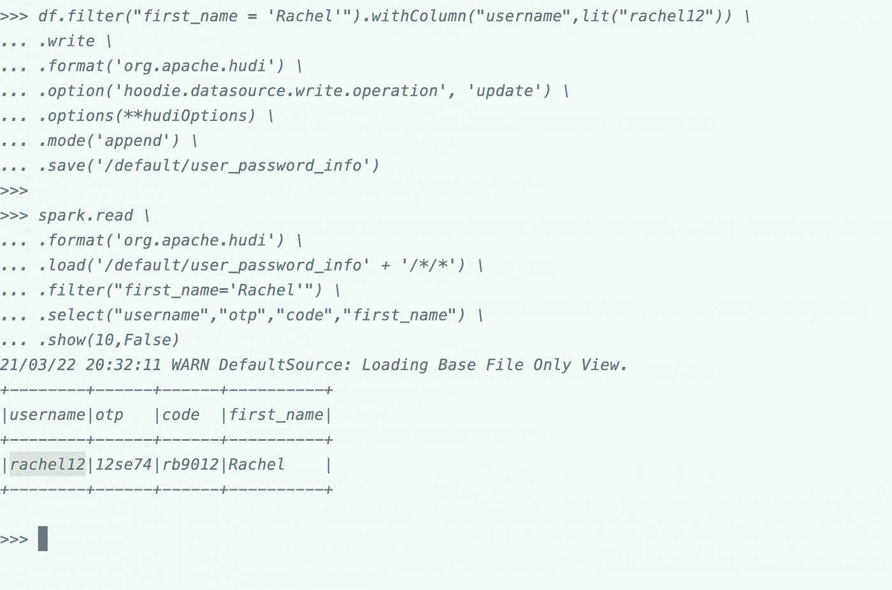
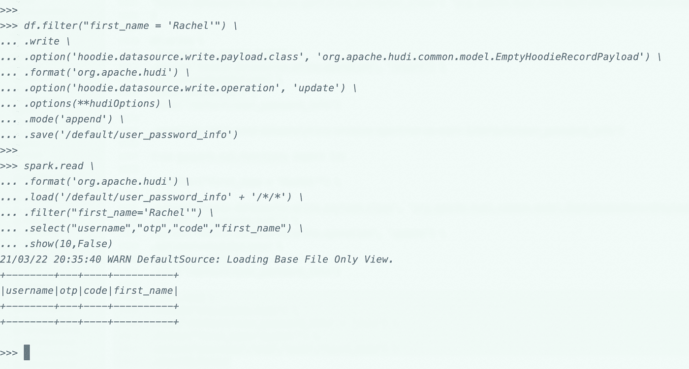

# 使用 PySpark 介绍 Apache 胡迪

> 原文：<https://medium.com/analytics-vidhya/introduction-to-apache-hudi-with-pyspark-62915e1a6c5c?source=collection_archive---------4----------------------->


在当今世界，与以前相比，我们更加关注个人数据隐私。在未来，肯定需要制定关于数据隐私的法律，个人数据的存储也将成为发展中国家的问题。

因为许多欧盟国家已经制定了管理个人数据使用的通用数据保护条例(GDPR)。因此，如果用户请求组织从数据湖中选择退出或删除他/她的个人数据。从 1pb 的数据中删除一条记录变得非常棘手。

为了克服从大数据系统中删除单个行的问题，市场上有许多可用的解决方案，即从 Hive 事务属性到数据块 Delta 功能。今天我们将学习 Apache 胡迪，并做一些从数据集中删除记录的实践。

# 环境:AWS EMR 5.32(包括 Spark 2.4.3)

在 AWS EMR 5.32 中，我们默认使用 apache 胡迪 jar，要使用它们，我们只需提供一些参数:


让我们深入了解一下，在使用 Apache Spark ( pyspark)时，插入/更新和删除是如何与胡迪一起工作的

# 数据集:

在演示中，我们使用了一个用户及其恢复密码的样本数据


在我们继续接收这些数据之前，让我们首先在 spark/hive 中创建一个表

```
CREATE TABLE `user_password_info`(
  `timestamp` STRING,
  `username` STRING,
  `identifier` STRING,
  `otp` STRING,
  `code` STRING,
  `first_name` STRING,
  `last_name` STRING,
  `department` STRING,
  `location` STRING)
STORED AS
INPUTFORMAT 'org.apache.hudi.hadoop.HoodieParquetInputFormat'
OUTPUTFORMAT 'org.apache.hadoop.hive.ql.io.parquet.MapredParquetOutputFormat';
```

一旦创建了表，我们将读取数据集，并尝试将它们插入到上面的胡迪表中


我们现在已经完成了数据的写入，将选择一个用户并尝试更新与其对应的值。


在上面的单元格中，我们可以看到一些额外的列，这些是胡迪的元数据列，如果我们直接读取表，并且我们没有在模式中保留这些列，那么我们在查询时就不会拥有它们。

让我们以用户" **Rachel** "为例，我们将尝试更新 Rachel 的用户名


我们想从“Booker 12”->“Rachel 12”中更新 Rachel 的用户名



所以我们可以看到“Rachel”对应的用户名被更新了。现在，让我们从表中删除用户本身。



我们可以看到用户“Rachel”不再存在于表中。

实际上，Apache Spark 通过将胡迪库放在 Spark 类路径中来支持胡迪，这肯定会对管理用户隐私合规性或不断变化的维度有很大帮助。

以后我会尽量详细报道更精彩的话题。

这只是一个开始。感谢阅读！！

迪彭德拉·辛格