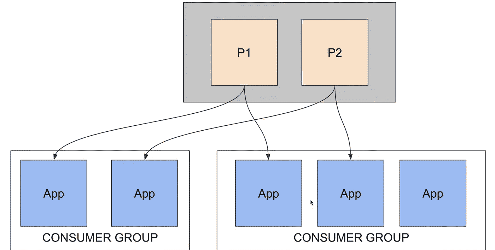

# 阿帕奇卡夫卡的简单概念

> 原文：<https://medium.com/analytics-vidhya/introduction-to-apache-kafka-841c1238d5b6?source=collection_archive---------1----------------------->

# 介绍

Apache Kafka 是一个开源的分布式**事件流**平台，被数千家公司用于高性能数据管道、流分析、数据集成和关键任务应用。**事件流**是从数据库、传感器、移动设备、云服务和软件应用程序等事件源实时捕获数据的实践

**卡夫卡的特点**是:
它是一个分布式、分区的消息传递系统。
·高度容错。
高度可扩展。它可以每秒钟处理和发送数百万条信息给几个接收者。

Kafka 可用于**组织中的各种用途**，例如:
**消息服务，** Kafka 可用于实时发送和接收数百万条消息。
**实时流处理**，Kafka 可用于实时处理连续的信息流，并将其传递给 Storm 等流处理系统。
**日志聚合，Kafka 可以用来从多个系统收集物理日志文件，并将它们存储在一个中心位置，比如 HDFS。
**提交日志服务**，Kafka 可以作为分布式系统的外部提交日志。
**事件源**，Kafka 可以用来维护事件的时间顺序。
**网站活动跟踪**，Kafka 可用于处理实时网站活动，如页面浏览、搜索或用户可能采取的其他行动。**

# **使用阿帕奇卡夫卡前后的区别**

**我们为什么不用通常的方法呢？现在我们将模拟我们的应用程序如何不使用 Apache Kafka。**

****在**之前**

****

**例如，我们有几个类似上面的应用程序，如果我们在 ERP 应用程序需要订单数据时不使用发布-订阅，那么我们必须将数据发送到 ERP，然后应用程序成员将数据发送到 ERP，每个处理的数据都需要一个请求。用这种方法，当你的 app 比较多的时候，比如 100 个 app，效率不高，数据事务图会比较复杂，一个 app 崩溃，另一个 app 也会崩溃。因此，需要另一种方法。**

****在**之后**

****

**使用 Apache Kafka 后，通过按摩经纪人发送和接收数据的过程，如果其中一个 app 出现错误，也不会破坏现有的流量。上述过程将使用**发布**和**订阅**，发布/订阅通过消息代理实时自动传输数据。通过使用这种方法，我们不需要从特定的应用程序请求所需的数据，该过程将自动完成。Apache Kafka 也是一个**消息代理**应用程序。还有其他几个按摩经纪人应用程序，但最流行的按摩经纪人应用程序是 Apache Kafka。**

# **发布者和订阅者**

**Apache Kafka 是一个可以用来处理发布和订阅的应用程序。Apache Kafka 也是一个消息代理应用程序。**

****发布** =发送数据
**订阅** =接收数据**

****

**通过使用发布/订阅，所有发布者应用程序将向主题发送数据(**主题**是一个**表**，如果它在数据库中被类推的话)，然后所有订阅者将听到数据(数据检索的术语是**侦听，**因此每个传入的数据将被所有订阅者立即接收)。这个过程将由 message broker 应用程序维护。**

**一个 ***主题*** 是卡夫卡中的一个信息范畴。Kafka 中的数据将存储在一个主题中。**

****卡夫卡:主题—数据库:表格****

**apache Kafka 上的数据无法更改。在 Kafka 中，主题数据不能处理更新，概念上 Kafka 发送事件或日志。**

# **卡夫卡建筑**

********

*   ******Streams API**允许将数据流从输入主题转换为输出主题。****
*   ******Connect API**允许将数据从某个源系统摄取到 Kafka，或者从 Kafka 推入某个接收系统。****
*   ********生产者 API** 允许应用程序向 Kafka 集群中的主题发送数据流。******
*   ********消费者 API** 允许应用程序从 Kafka 集群中的主题读取数据流。******

****应用程序可以同时充当生产者和消费者。****

********

****卡夫卡不能处理自己的集群，因此需要一个动物园管理员来管理卡夫卡。Kafka 上的所有管理都将在 zookeeper 中完成，但数据将存储在 apache Kafka 中。****

# ****划分****

********

****主题分为分区，分区是卡夫卡中的排比单位。分区可以分布在 Kafka 集群中。
在创建一个我们可以确定的主题时，我们可以确定我们想要多少个分区。为什么要使用分区？这是因为一个分区只能被一个应用程序订阅****

******1 个分区— 1 个应用******

****当使用 apache Kafka 时，建议分区数量大于创建的应用程序数量。****

****每个 Kafka 服务器可以处理一个或多个分区。
一个分区可以跨多个服务器复制，以实现容错。
一台服务器被标记为分区的领导者，其他服务器被标记为追随者。
领导者控制分区的读写，而从者复制数据。
如果一个领导者失败，其中一个追随者会自动成为领导者。
·ZooKeeper 用于首领选择。****

********

****0 到 12 称为日志，数据会不断增加，会形成历史，比如我们把数据加到 log 0 上，值为“1”，然后在 log 1 上，值为“1”。复制对该方法没有影响。****

********

****上面是一个例子，我们有 2 个消费者，在消费者 A 中，消费的数据是第 9 个字(偏移量 9)，对于消费者 B，消费的是第 11 个数据(偏移量 11)。偏移函数是数据分布的标志。比如消费者 A 消费数据 1，2，3 然后 app 死亡，那么当 app 重启时 app 就不需要再从头消费数据了，可以立即继续消费 4，5，6 等。分区和偏移量是由 Kafka 自动设置的，所以不需要担心这个问题。****

# ****复制****

********

****在上面的示例中，有 3 个 Kafka 服务器，复制用 R 表示，分区用 p 表示。对于分区创建和复制，将由 apache Kafka 管理。在分区放置和复制中，1 个服务器不能有相同的 1 个分区和 1 个复制。
所以不可能
S = P < A >，R<A>举个例子:
服务器 1 = P1
服务器 2 = P2，R1
服务器 3 = R2****

# ****消费者群体****

****在 Apache Kafka 中，有一个所谓的消费者组，消费者组是应用程序的集合，其中一个消费者组只能访问一个分区。****

********

****在上图中，当有 2 个类似的应用程序时，应用程序上会有重复的数据，因为每个应用程序都消耗 2 个分区的数据。因此，我们使用客户群来解决这个问题。****

********

****在上面的例子中，一个用户组只能访问一个分区。不能再多了，因此当你创建一个分区时，分区必须大于一个消费者组中的应用数量。****

******分区数量> =应用数量******

********

****上面的例子是一个错误的例子，因为 app 的数量大于分区的数量。****

# ****自留责任保险****

****我们知道，在 Kafka 中，数据是不可更改的，因此它需要自动删除不时持续增长的数据。在 apache Kafka 中有两种方法可以擦除数据:****

1.  ******日志保留时间** 日志保留时间是基于时间的数据删除，例如当数据是 7 天前的数据时，该数据将被自动删除(在 Kafka 中，默认的日志保留时间是 7 天)。****
2.  ******日志保留字节** 日志保留字节是基于数据量的数据删除。例如，当我们有 1 千兆字节，旧的数据将被删除。****
3.  ******偏移保留时间** 偏移保留时间是偏移数据在 Kafka 中存储的时间。偏移数据是 apache Kafka 在应该使用 Kafka 数据的应用程序不活动时存储的数据。举个例子:当有 1 个不活跃的 app 时，那么数据会存储在 apache Kafka 中。如果应用程序长时间不活动，存储在 apache Kafka 中的数据会增加。因此，需要偏移保留时间来删除数据。(默认偏移保留时间为 7 天)****

****感谢您阅读这篇文章。希望这篇文章能对数据开发有所帮助。别忘了跟着并给予很多掌声。下次见****

## ****来源:****

****[https://kafka.apache.org/](https://kafka.apache.org/)
[https://www.youtube.com/watch?v=SArQUV0CE2I&list = PL-ctdcapefh 8 djmuqgojbjudlety 8 mqyf](https://www.youtube.com/watch?v=SArQUV0CE2I&list=PL-CtdCApEFH8dJMuQGojbjUdLEty8mqYF)
[https://LMS . simpli learn . com/courses/2810/Big-Data-Hadoop-and-Spark-Developer/Sylvia](https://lms.simplilearn.com/courses/2810/Big-Data-Hadoop-and-Spark-Developer/syllabus)****