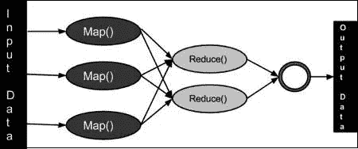
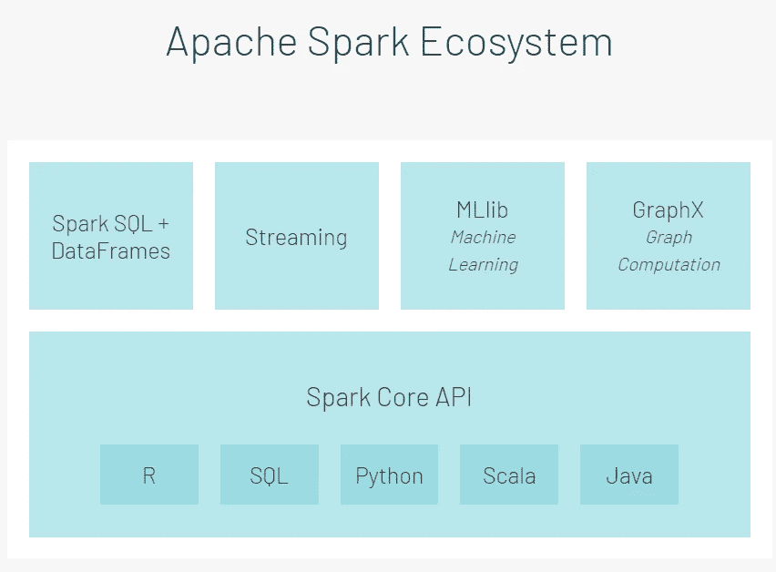

# Apache Spark 简介

> 原文：<https://medium.com/analytics-vidhya/introduction-to-apache-spark-b2d4ff8aacec?source=collection_archive---------14----------------------->

当今世界运行于数据之上，每天都会产生数万亿字节的数据。随着大数据系统成为必需品，传统系统一夜之间变得过时。虽然我们可以说大多数组织不处理如此大规模的数据，但对更好的数据管理的需求却在不断增长，以便组织能够快速扩展全球标准。

SQL 表正在被 NoSQL 或图形数据库所取代。熊猫和 Numpy 数据框架现在正在成为大数据框架的一部分。Hadoop、Spark 和 Hive 正在成为行业的必需品。Apache Spark 是最常用、也是最受推荐的大数据框架之一。在我们理解 Apache Spark 之前，了解一些基本系统是很重要的。

# 什么是 MapReduce？

MapReduce 是一种编程模型，用于处理支持并行处理的大型数据集。需要注意的是，在一些用例中，并行处理不起作用，在这种情况下，Map Reduce 和 Apache Spark 都没有用。

MapReduce 是 Hadoop 生态系统和 Spark 中的主要组件之一。它旨在通过将工作拆分为处理较小数据集的独立任务来支持大量数据的并行处理。MapReduce 从用户那里获取整个数据集，将其分割成更小的任务(MAP)，并将它们分配给 worker 节点。一旦所有工作节点成功地完成它们的每个独立任务，来自独立活动的结果被聚集(减少)并作为对应于整个数据集的单个结果返回。通常，Map 和 Reduce 函数是用户定义的函数，用于解决代码试图解决的业务用例。

MapReduce 正在工作。(图片来自 tutorialspoint.com)

# 什么是火花？

Apache Spark 是一个通用的集群计算系统。像 MapReduce 一样，它与一组计算机(节点)一起工作，并行处理工作并改善响应时间。然而，与 MapReduce 不同，Spark 集群具有内存中的性质。内存中特性是一个允许 Spark 集群在节点上缓存数据的特性，而不是每次都从磁盘中获取数据。由于数据量巨大，通常需要很长时间的读写操作现在对于每个节点都是一次性操作，从而节省了时间并提高了处理速度。

数据的内存处理是使用**弹性分布式数据集** (RDD)完成的。用户必须指定操作，rdd 跨所有节点在内存中分发数据和执行操作。

Spark 生态系统设计为两层——Spark 核心，第二层是一个库和 API 包。

databricks.com 解释的星火生态系统。

Apache spark 不提供集群管理或存储管理工具。通常，人们使用 YARN 进行集群管理，并将分布式数据存储在 Hadoop 文件系统(HDFS)或 AWS 的 S3 系统上。Spark 还有一个名为 SPARK ENGINE 的计算引擎，它负责将任务分成更小的任务，调度任务进行并行处理，向集群提供数据，并报告故障。它也是中间管理层，与集群管理器和数据管理器交互。

Apache Spark 核心 API——在 R、SQL、Python、Scala 和 Java 中可用——最初用于编写数据处理逻辑。这些 API 基于 rdd，缺少一些性能优化器。然而，由于没有额外的开销，它们也为用户提供了最大程度的定制和灵活性，以根据组织的需求进行编码。

为了克服核心 API 的缺点并提供更有针对性的支持，引入了基于核心 API 的第二层 Apache Spark。第二层通常分为 4 组逻辑 APIs 库:

1.  SparkSQL 和 Dataframes。
    这允许用户将 SQL 命令应用于 Spark 数据帧。它们主要用于结构化和半结构化数据。
2.  流式传输。
    这些 API 用于处理连续传入的无界数据流。
3.  Mllib。
    这个库用于支持所有可以部署在 Spark 框架上的机器学习活动。
4.  GraphX。
    这是一个允许将图形处理算法应用于可用数据集的库。

# Spark vs Hadoop

一个常见的问题是——当 MapReduce 已经是 Hadoop 的一部分时，为什么还要使用 Spark？或者——当 Spark 构建在 Hadoop 生态系统之上时，它的优势是什么？Spark 和 Hadoop 之间的一些关键区别是:

*   **性能** —与 Spark 相比，Hadoop 相对*慢*，因为磁盘操作。Spark 的速度*更快*，由于其内存特性，更适合实时分析。Spark 在内存中快 100 倍，在磁盘上快 10 倍。但是，当其他需要资源的服务正在运行时，执行时间可能会减少。
*   **数据处理** — Hadoop 只批量处理数据*即。* *顺序*分步加工。Spark 以*批处理、实时和图表形式处理数据。*
*   **机器学习** — Hadoop 使用 Mahout 进行代数运算，并有*稀缺的 ML 库*支持。Spark 有一个*大型 ML 库*用来构建管道和执行超参数调优。
*   **易用性**—Hadoop MapReduce*没有交互模式，需要大量编码。*另一方面，Spark 有很多高级 API，具有*更少的编码和交互模式。*
*   **成本** — Hadoop 比*便宜*，因为它需要更多的磁盘内存。Spark 需要更大的内存来运行，这使得它更加昂贵。
*   **容错** — Hadoop 是容错的*，因为它跨多个节点复制数据*。Spark RDDs 是容错的*，因为它们在内存中。*

总的来说，当系统需要更便宜、与时间无关和更容错时，就选择 Hadoop。当算法迭代且需要交互式数据处理或机器学习时，会选择 Spark。当预期结果是实时的时，Spark 也有优势。

既然对 Spark 生态系统及其明显优势的简要介绍已经完成，在以后的文章中，我将描述 SparkSQL 和 PySpark 等概念。

感谢您阅读本博客。如果你喜欢这篇文章，请留下掌声。如果对如何提高我的工作质量有什么建议，我想听听。:)
欢迎对下一篇博客的主题提出建议。:D