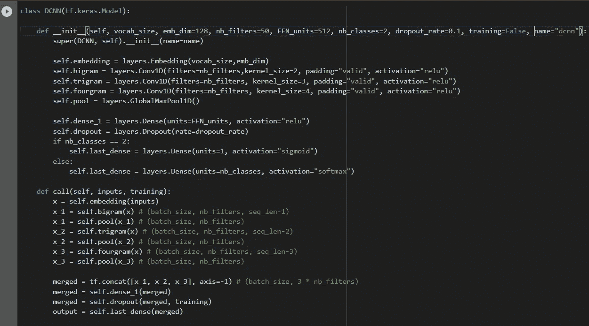

# BERT 简介及其在情感分析中的应用

> 原文：<https://medium.com/analytics-vidhya/introduction-to-bert-and-its-application-in-sentiment-analysis-9c593e955560?source=collection_archive---------2----------------------->

布雷特·乔丹在 [Unsplash](https://unsplash.com?utm_source=medium&utm_medium=referral) 上的照片

BERT 是超级令人兴奋的算法，不仅对我，对整个 NLP(自然语言处理)社区都是如此。

超级厉害。超级有意思。而且真的很高兴和大家分享，怎么用，怎么用。

在去 BERT 之前，我们先从更一般的角度来看一下 NLP。NLP(自然语言处理)是人工智能处理人类语言的一部分。实际上，它几乎无处不在。例如，Web 或您的搜索引擎使用 NLP 来优化结果。在最近的一份报告中，语音助手如 Siri 或 Alexa 使用 NLP 技术来理解我们所说的话。NLP 也用于电子邮件箱的垃圾邮件检测。NLP 用于广泛使用的翻译器中。聊天机器人是使用 NLP 构建的。

所以这个领域做了很多研究，BERT 是由 **Google** 发布的 NLP 高级算法。

## 以下是关于伯特的几点。

1.  谷歌 2018 年底发布的 NLP 算法
2.  过去 5 年来，NLP 带来了最大的改变
3.  更好地理解上下文中的单词和句子
4.  例如，已经在谷歌搜索引擎中实现

BERT 是一个应该理解语言并提供我们称之为语言建模的工具。谷歌已经开始在搜索引擎中使用它。下图显示了 BERT 实施前后的示例。

图片来自[https://cloud . Google . com/ai-platform/training/docs/algorithms/Bert-start](https://cloud.google.com/ai-platform/training/docs/algorithms/bert-start)

*参考上图，*使用 BERT 模型，我们可以更好地理解“为某人”是该查询的重要部分，而之前我们忽略了它的含义，以及关于配药的一般结果。

## **伯特是什么？**

BERT 代表来自变压器的双向编码器表示。我将把这张完整的表格分成三部分。

**编码器表示:** BERT 是一个*语言建模系统*，经过预先训练，拥有庞大的语料库和巨大的处理能力。我们只需要使用这个预先训练好的模型，并根据我们的需要进行微调。

*什么是语言建模？*这意味着 BERT 为单词和序列提供了最好、最有效和最灵活的表示。例如，我们给 BERT 一个句子或两个句子，它将生成一个单独的向量或向量列表，可以根据我们的需要使用。

**来自 Transformer:** Transformer 是 BERT 架构的基本构建模块。因此，谷歌开发了 transformer，它旨在处理许多序列，以将任务排序，从而构建一个翻译器或聊天机器人。然后，他们使用相同的变压器的一小部分，并使用它更聪明的方式来创建伯特。

**双向:**在 NLP 项目的大部分时间里，我们想要预测句子中的下一个单词。为了预测下一个单词，即句子的右边部分，我们需要访问句子的左边部分。甚至有时我们只能接触到句子的右边部分，我们需要预测句子的左边部分。一个特殊的情况是，当某个模型分别用句子的左右两部分训练，然后将两部分连接起来。所以它变成伪双向的。BERT 在处理单词时使用左右语境，实现了完全双向的模型。这意味着它可以访问整个上下文或句子来预测单词。这使伯特更有力量。

了解了上述概念后，让我们跳到 BERT 可以应用的地方。

## **伯特的应用:**

1.  使用记号赋予器处理数据
2.  使用 BERT 作为嵌入层
3.  微调伯特，你的模型的核心

在这篇博客中，我们将学习 **BERT 的数据处理标记器(情感分析器)。**

# 情感分析器:

在这个项目中，我们将尝试使用带有 BERT 的 tokenizer 来改进我们的个人模型(*在这个例子中，CNN 用于分类*)。

首先，我们将首先建立一个分类模型来评估一条推文在感觉上是积极的还是消极的..

## **训练和测试数据:**

你可以从下面的链接下载数据。[http://help.sentiment140.com/for-students](http://help.sentiment140.com/for-students)

## **完整的项目编码:**

我使用 Google Colab 作为这个项目的编辑器，因为它是一个托管的 Jupyter 笔记本服务，不需要设置就可以使用，同时提供对计算资源(包括 GPU)的免费访问。我已经把完整的代码上传到了我的 Github 库。

[https://github . com/Tariqueakhtar/Machine-Learning/tree/master/perspective % 20 analysis % 20 Bert](https://github.com/Tariqueakhtar/Machine-Learning/tree/master/Sentiment%20Analysis%20BERT)

## **安装并导入与 BERT 相关的包:**

除了像 Pandas，numpy，BeautifulSoup 这样的基本库之外，我们还需要安装两个与 BERT 相关的包，即 bert-for-tf2 和 sentencepiece，如下所示。

我们还必须使用像 tensorflow、bert 和 tensorflo_hub( *这样的库，它是一个经过训练的机器学习模型的仓库，可以随时进行微调，可以部署在任何地方。只需几行代码就可以重用经过训练的模型，如 BERT 和更快的 R-CNN。*)

## 在 colab 上加载数据:

一旦我们使用 Pandas 加载了训练数据，让我们来看看数据样本。

作者图片

下面是数据集中的列。

1.  情感(二元目标变量)
2.  身份证明（identification）
3.  日期
4.  询问
5.  用户
6.  用户的文本或推文

这个项目我们只需要两栏，即**文本和情绪**，因为我们只需要通过分析用户的推文来预测积极或消极的感觉。

## 数据清理:

在 colab 上导入训练数据后，我们需要删除不必要的列，如 id、date、query 和 user。下面是相同的代码。

数据帧如下所示。

作者图片

现在，让我们清理文本，因为它有特殊字符。下面是清理的代码。

这是清洗后的结果。

作者图片

## 使用 BERT 进行标记化:

在项目的这一部分，我们将使用 BERT 工具进行标记化，如下所示。

那么我们在上面的代码中做了什么。让我们从每一行代码开始一步步理解。

1.  从 bert 创建 fullTokenizer。
2.  通过调用 tensorflow_hub 创建一个 bert 层，并将预构建模型的路径作为 url 在 kers layer 中传递。在这种情况下，我们将直接使用这个模型，不会微调它，这就是为什么我们传递参数*可训练=假。*这一行代码只是给分词器提供信息。
3.  现在我们使用来自 tokenizer 的 vocab 文件。
4.  为 tokenizer 做小写。
5.  有了以上所有的信息，我们就能够创建记号赋予器了

## 将推文/文本传递给 Tokenizer:

现在使用 cleaned_data 中的所有 tweet/text，将它们传递给 tokenizer，并将每个令牌转换为 id。下面是相同的代码。

上述代码的示例输出如下图所示。

作者图片

## **数据集创建:**

我们将创建填充批次(因此我们为每个批次独立填充句子)，这样我们尽可能添加最少的填充标记。为此，我们按长度对句子进行排序，应用填充批处理，然后进行洗牌。

作者的源代码

## *训练和测试数据集:*

为了创建训练和测试数据集，我们将采用 BATCH_SIZE = 32，并在整个数据集上使用该批处理大小。然后，我们将混洗数据，并获得第十批测试数据，其余的是训练数据。

## 模型构建和培训:

因此，我们已经完成了所有的数据处理阶段，现在我们准备开始建立我们的模型。这将是我在这篇文章开头谈到的 CNN。这里的想法是有三个不同的卷积滤波器，大小分别为 2、3 和 4，我们只需取最大值，连接所有东西并使用它，然后尝试完成分类。

作者图片

在建立了模型的结构之后，我们需要精确地传递参数来开始训练。低于本例中传递的参数。

## 将 CNN 模型拟合到训练数据；

我们运行了 5 个时期来拟合模型，并且我们得到了如下的训练准确度分数。

历元 1/5—损失:0.4289 —精度:0.8025

历元 2/5 —损失:0.4289 —精度:0.8025

历元 3/5-损失:0.3412-精度:0.8517

历元 4/5 —损失:0.3010 —精度:0.8715

历元 5/5-损失:0.2638-精度:0.8885

作者图片

## 在测试数据集上评估模型:

一旦 CNN 模型被训练，我们需要评估它在测试数据上的表现，下面是损失和准确性。

损耗:0.4114 —精度:0.8322

作者图片

让我们用几个句子来评价这个模型。为此，我编写了一个单独的函数。下面是功能。

作者的源代码

我们只需要将句子传递到这个函数中，就可以得到它的正面或负面情绪。

作者图片

作者图片

## 结论:

看起来训练和测试精度的差异大约是 5%,这意味着我们仍然需要对模型进行微调，这是我留给你的任务。让我知道你在调整这个模型方面的想法。

感谢阅读..

## 参考:

 [## 张量流集线器

### TensorFlow Hub 是一个经过训练的机器学习模型库，可随时进行微调，并可部署在任何地方。重复使用…

www.tensorflow.org](https://www.tensorflow.org/hub)  [## 内置 BERT 算法入门

### 本教程向您展示了如何在人工智能上训练来自变压器(BERT)模型的双向编码器表示

cloud.google.com](https://cloud.google.com/ai-platform/training/docs/algorithms/bert-start)  [## 对于学者——sensition 140——一个 Twitter 情绪分析工具

### Sentiment140 不是开源的，但是有一些开源代码的资源有类似的实现:数据…

help.sentiment140.com](http://help.sentiment140.com/for-students)