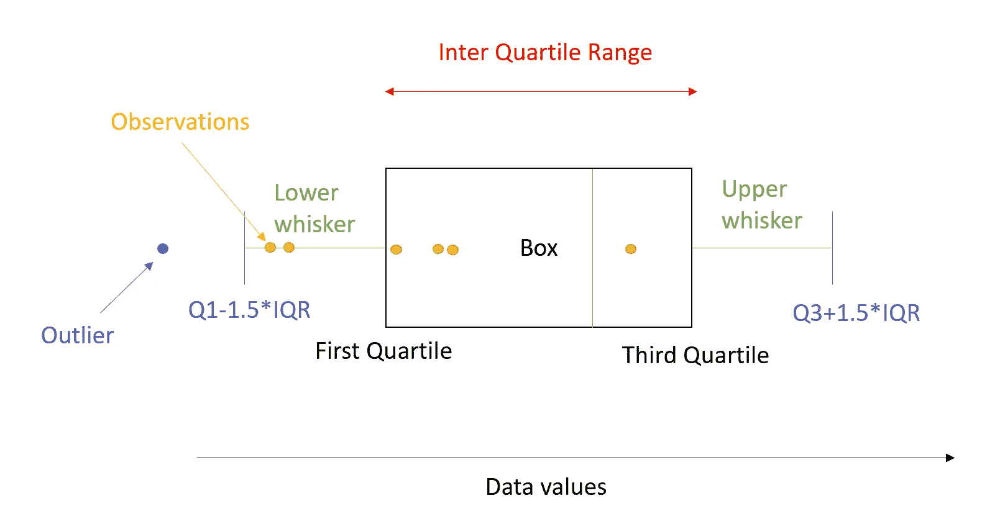

# 介绍盒状图以及如何解释它们

> 原文：<https://medium.com/analytics-vidhya/introduction-to-box-plots-and-how-to-interpret-them-22464acbcba7?source=collection_archive---------3----------------------->

## 用 Python 实现

箱线图是描述性统计中非常有用的图形。箱线图通过显示统计数据直观地展示了数字数据的许多特征，如平均值、平均数等。

直观地说，箱形图如下所示: