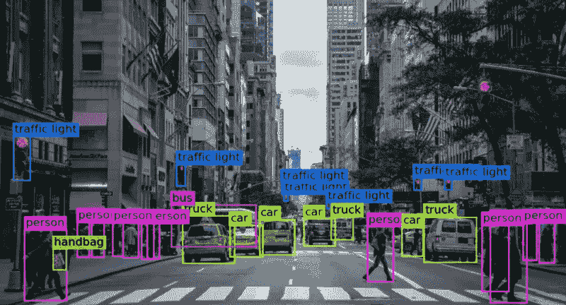
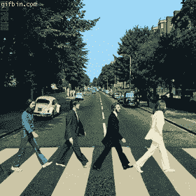
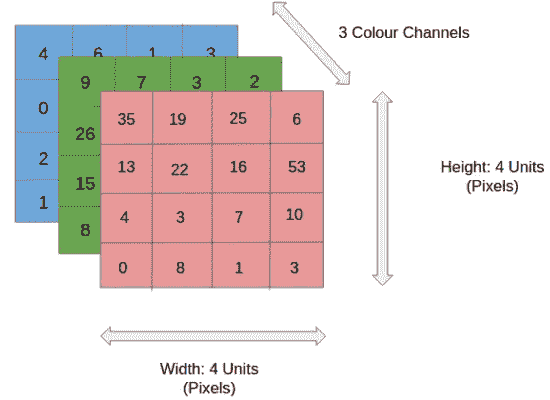

# OpenCV 计算机视觉简介|第 1 部分

> 原文：<https://medium.com/analytics-vidhya/introduction-to-computer-vision-with-opencv-part-1-3dc948521deb?source=collection_archive---------14----------------------->

在我们的日常生活中，最简单的情况之一就是，在过马路之前，你必须向两边看，以确定在那一刻通过是否安全，

起初，这似乎是一个简单的情况，事实上并非如此，因为在这个过程中，我们使用的可能是我们大脑能够执行的最复杂的功能之一:处理我们看到的东西。

因此，教会机器看到我们所看到的是一个非常复杂的过程，这是由于一些因素:我们无法通过数学方程完全复制人类的视觉，我们仍然没有完全理解我们的大脑如何执行这一处理。

因此，我们已经为计算机视觉找到了一个很好的定义:**一个试图用机器复制人类视觉的过程。**

在文章的第一部分，我们将了解最基本的概念，并学习一些工具来开始用 Python 编写你的第一个计算机视觉脚本。所以，为了让你更容易理解下面的步骤，你需要一个关于 **Python** 和 **Google Colaboratory** 的概念(一个在线 Python 编程环境，也就是说，你不需要在你的机器上安装任何东西)。

## 了解 OpenCV

OpenCV(开源计算机视觉)最初是为了使计算机视觉更简单而开发的，目标已经实现，它是目前我所知道的最完整的库之一，可用于 Python、C++、Java 等。

如前所述，本文将使用 Python 进行演示，因此如果您想按照教程使用您的机器，使用`pip`安装它非常简单，只需使用下面的命令:`pip install opencv-python`。对于那些将使用 Google Colab 的人来说，这个过程是不必要的。

## OpenCV 的第一个代码

首先，我们将使用 OpenCV 打开一个图像，但首先需要使用`import cv2`导入库，然后我将导入它和我们将在整篇文章中使用的其他一些库。

**注意:**只有使用 colab 的人才需要第二行。

在导入我们将要使用的库之后，我们将读取一个图像并查看它。

预期的输出是一个图像，在本例中，您使用了以下图像:

打开图像查看是一个非常简单的过程，利用这个库，只需在`imread()`函数中用引号通知图像路径，然后使用`cv2_imshow()`函数。

## 机器如何“看到”图像

在机器上，图像以三维数字矩阵的形式进行处理，其中矩阵的高度和宽度对应于图像的尺寸，第三维对应于图像通道，例如，如果图像是彩色的，通道的数量将是 3 (RGB ),代表红色、绿色、蓝色。

分析已经说过的内容，并借助图像，我们可以得出结论，矩阵中的每个“正方形”代表一个像素，其值对应于该点的颜色强度。

这可以用我们的代码来演示，因为图像被计算机视为矩阵，而 *numpy* 是一个优秀的库，用于对多维数组执行操作，你可以用它来查看关于图像的一些信息

使用 *numpy* 的`shape`方法，可以可视化代表我们图像的矩阵的维度

`print(img.shape)`->-`(512, 512, 3)`

获得的输出正是我们所期望的，一个由 3 个值组成的数组，其中前两个值表示宽度和高度，最后一个值表示颜色通道的数量，因为我使用了一个彩色图像，所以显示了 3 个通道。

我们已经到了文章第一部分的结尾，下一步我们将看到如何将图像转换为灰色阴影，并创建我们的第一个项目放在 github 上。

如果你想知道我在 github 上的知识库，这里有[链接](https://github.com/rafaelgrecco/Data-Science)。