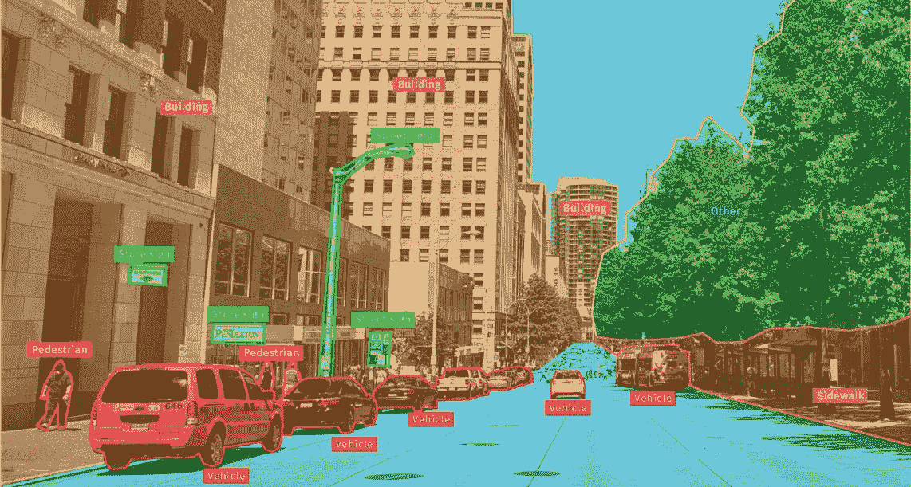
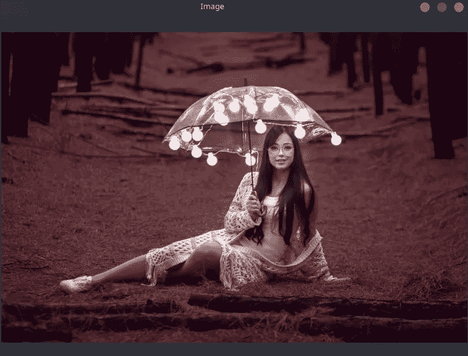
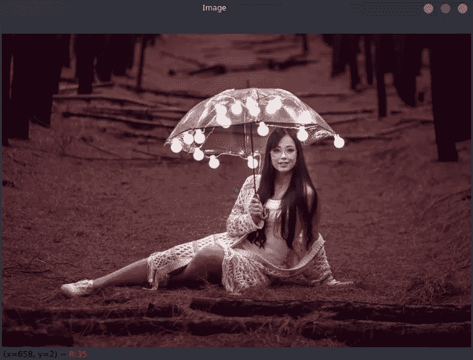
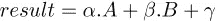
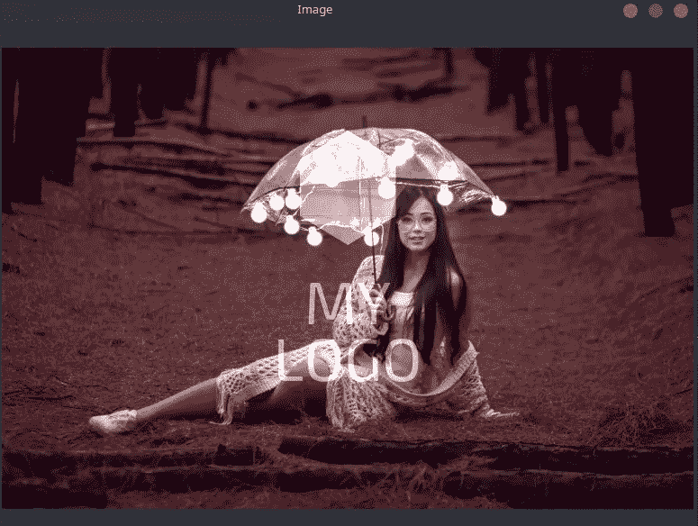
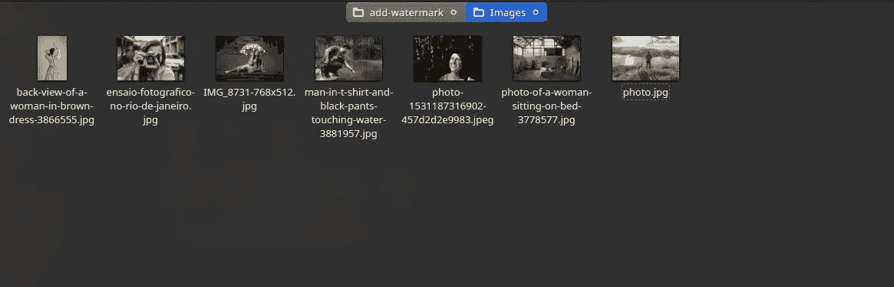
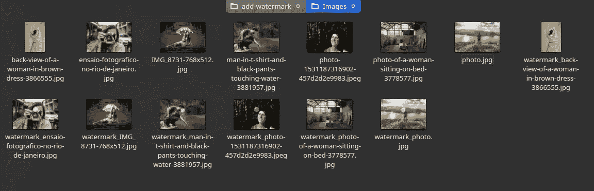
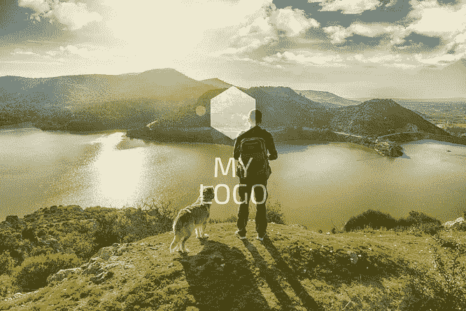
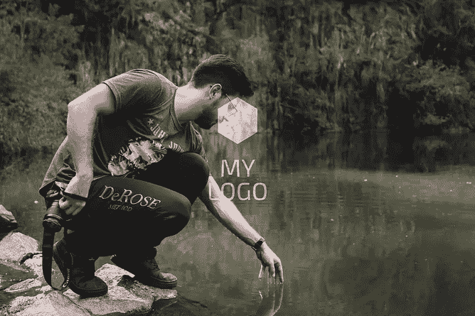
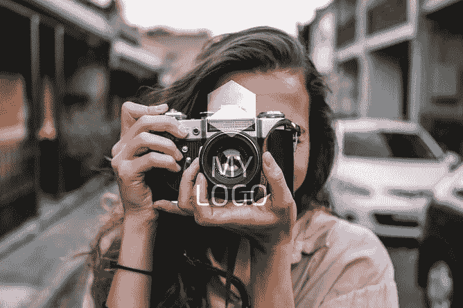

# OpenCV 计算机视觉简介|第 2 部分

> 原文：<https://medium.com/analytics-vidhya/introduction-to-computer-vision-with-opencv-part-2-2ff85c1abf15?source=collection_archive---------18----------------------->

在教程的第一部分([点击此处查看](/analytics-vidhya/introduction-to-computer-vision-with-opencv-part-1-3dc948521deb))，介绍了 OpenCV 库的最基本的主题，在这一步，我们将应用这些知识和其他知识来制作一个项目，你可以将它添加到你的文件夹中。

## 问题是

想象一下，你是一个从事摄影的人，你有很多照片是从你受雇参加的一个聚会上拍摄的，你想把它们添加到你的作品集里，但是你需要给它们添加你公司的水印，为了做到这一点，你需要在一些编辑软件比如 Photoshop 或者 GIMP 中一张一张地打开，然后手动添加你的徽标。

为几张照片做这个并不是很大的工作量，但是想想你要为 100 多张照片做这个，可能 200 张，300 张甚至 1000 张，现在实际上是一个很大的问题，因为花在上面的时间会极高。

然而，可以注意到，这是一个机械的过程，所有(或几乎所有)这种类型的过程都可以通过一些脚本实现自动化。所以让我们用计算机视觉自动化这个过程来优化你的时间。

## 解决方案

为了更好地执行算法，请确保徽标是白底黑字，为了更容易，本教程中使用的图像以及完整的代码都存放在我的 *github* 存储库中，只需[单击此处](https://github.com/rafaelgrecco/Watermark-Project)即可访问。

此外，确保所有要添加水印的图像都在同一个文件夹中。

现在，让我们编写脚本，第一步将一如既往地导入我们将在整个开发过程中使用的库。

现在我们将导入与`imread()`函数一起使用的徽标，然后我们将提取图像的高度和宽度。

channels 变量也在那里，因为正如我们在第 1 课中学到的，shape 方法返回 3 个值，即高度、宽度和通道数。如果你没看过第 1 部分，我强烈推荐([点击这里看第 1 部分](/analytics-vidhya/introduction-to-computer-vision-with-opencv-part-1-3dc948521deb))。

在对所有图像执行该过程之前，让我们对单个图像执行该过程，因此让我们提取我们想要测试的图像的高度和宽度。

在这一步，使用`imshow()`功能，我们将看到我们想要添加的徽标和图像。

现在，让我们假设我们要在图像的中心添加我们的徽标，我们要怎么做才能找到图像的中间呢？好的，因为我们有了图像的高度和宽度，如果我们找到这些值的一半，我们就有了图像的中心，让我们开始吧。

注意，我们使用 int this 来允许 **center_x** 和 **center_y** 的值为整数。用 *openCV* 的`circle()`函数我们会看到图像的中心点。

好了，现在让我们来看一下极值点，也就是说，我们将划定图像中徽标所在的区域，对于左上角，我们将从图像的中心减去徽标的中心，我们将使用代码来简化这一步。

让我们用 circle 函数来形象化这两点

我在这里放了一个更大的半径，在案例 10 中，为了提高可视化，用点来可视化我们的图像，我们将有:

请注意，这些点界定了感兴趣的区域。

现在我们有了界定感兴趣区域的点，我们现在必须把这个标志放在那个区域，所以首先我们要写区域。

定义好区域后，让我们使用`addWeighted()`函数将它与我们的徽标连接起来，与 OpenCV add 函数不同，该函数旨在合并两幅图像，该操作在以下等式中举例说明:

其中 A 是第一个图像，B 是第二个图像，α和β是每个图像的权重，在我们的代码中，第一个图像是 *img* 的权重为 1，第二个图像是水印，权重为 0.4，如果第二个值在代码中不满意，您可以增加或减少它，直到找到您想要的结果。在我们的代码中，伽马值为零。

我们去看代码。

最后，让我们将这个变量与之前划定的区域相匹配

现在让我们看看最终的图像并检查结果

这是结果，但是，我们不想逐个图像地应用这个图像，我们想优化我们的时间，所以让我们对我们的代码进行一些更改，以便将它应用到给定文件夹中的所有图像。

我会把完整的最终代码和评论的变化，使这一进程适用于所有的图像。

第一个变化是 path 变量，它将包含包含图像的文件夹的路径，为了到达这个文件夹，我们使用 glob 库中的 glob 函数，并且作为一个参数，我们传递文件夹的路径，并且在文件夹内我们将搜索所有格式(*)的所有文件(*)，如下(*。*).

另一个变化是，我们所有的代码现在都在 for 中，它将在路径中寻找每个图像的路径，找到的那些图像将成为我们的`imread()`函数的参数。

接下来的变化在最后两行，第 31 行的目标是将图像名称存储在文件变量中，在下一行我们使用`imwrite()`函数保存图像，这是因为现在的目标不是查看图像，而是将图像与徽标一起保存在我们的机器上。

## 代码操作

这里我们有一些保存在一个目录中的图像，让我们对该目录中的图像运行我们的代码，看看结果

在 0.833 秒内，代码已经将转换应用于所有图像，结果如下。

**注意**:脚本的运行时间会随着图像的数量和计算机的处理能力而变化。

我会在这里放一些图片

如果你想检查所有的结果，这个项目的文件夹将存放在 [github](https://github.com/rafaelgrecco/Watermark-Project) 上，里面有原始图像和那些被应用到水印的图像。

关于 OpenCV 的计算机视觉教程的第 2 部分已经结束，在第 3 部分中，我们将执行一个具有更多功能和更深层次的项目。

我希望本教程对您的计算机视觉之旅有所帮助，欢迎留下任何评论，如果您想联系我，可以在我的 LinkedIn 上找到我，非常感谢您的光临。好好学习！