# 卷积神经网络简介

> 原文：<https://medium.com/analytics-vidhya/introduction-to-convolutional-neural-networks-2c88dfadaa8f?source=collection_archive---------20----------------------->

你有没有想过计算机是如何识别物体的？和人类识别物体的方式完全不同。计算机将图像理解为一组数字，因为它们只与数字交互。每个对象都有特定的模式，计算机将根据该模式来识别图像中的对象。

卷积神经网络(CNN)是一种具有一个或多个卷积层的神经网络，其假设输入是图像。细胞神经网络主要用于目标识别、图像分类和图像聚类。比如面部识别、分析文档、理解气候、支持自动驾驶汽车等。现在有许多 CNN 架构，如 AlexNet、VGGNet、ResNet 等。

## 1.回旋

CNN 有一个或多个卷积层，这些卷积层基于卷积数学方法。卷积层使用一组滤波器将输入图像转换为滤波后的输出图像。这就像一个二维数字矩阵。

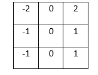

3x3 过滤器

将滤波器应用于卷积层的步骤很少。让我们举一个例子来解释这些步骤。考虑下面的 4x4 图像和 3x3 滤波器，以产生 2x2 输出图像。

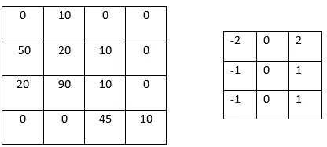

4x4 图像和 3x3 滤镜

*图像中的数字代表像素值，范围为 0–255。*

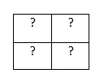

2x2 输出图像

在应用滤波器之后，卷积层将产生 2x2 图像作为输出。

**第一步**:将滤镜覆盖在图像上方的相关位置。

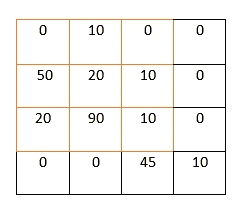

将滤镜覆盖在图像左侧的顶部

**第二步**:对重叠图像值和滤波器值进行逐元素相乘。

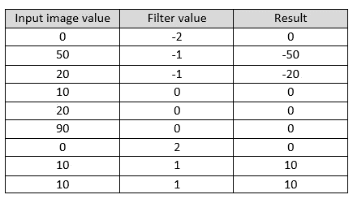

元素乘法的结果

**第三步**:对所有元素的乘积求和。

Sum = (-50)+ (-20)+10+10=(-50)

然后将所有元素乘积相加的结果放在输出图像中。由于第一个过滤器覆盖在图像的左上方，上述操作的结果应该放在输出图像的左上方。

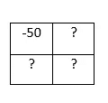

2x2 输出图像

**步骤 4:** 对整个输入图像重复相同的场景。

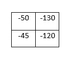

最终 2x2 输出图像

但是这个输出图像是 2x2 大小，想想如果我们想要输出图像和输入图像一样大。我们可以使用**填充**到原始输入图像中，我们可以在输入图像周围添加 0 来调整图像大小，以获得与原始图像大小相同的输出。

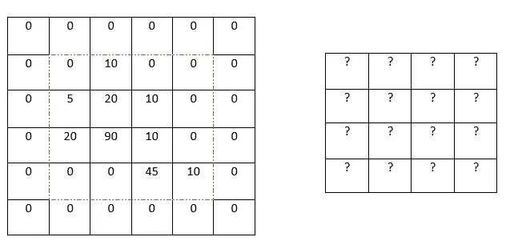

一个 4x4 输入与一个 3x3 滤波器卷积，使用相同的填充产生一个 4x4 输出

以上描述了卷积神经网络的滤波过程的主要步骤。让我们来关注一下对图像进行过滤会发生什么？上面我们用了一个 3x3 的滤镜，就是俗称的垂直清醒滤镜。

用水平索贝尔滤波器卷积的图像

上图是垂直索贝尔滤镜的一个例子。这些索贝尔滤波器主要检测图像的边缘。有两种类型清醒过滤器:

1.  垂直索贝尔过滤器-它检测图像的垂直边缘。
2.  水平索贝尔过滤器-它检测图像的水平边缘。

经过滤波器的所有滤波处理后，它在原始图像周围输出一个强边缘。这个边缘检测图像比原始图像更有用。它为网络做出决策提供了更详细的图像。

## **2。联营**

当滤波器如上所述工作时，有可能在相邻像素中输出相似的值。因此，卷积层输出中包含的许多详细数据都是多余的。例如，如果我们使用一个过滤器，在图像的特定位置找到边缘，我们也有机会在从原始位置移动 1 个像素的位置找到相对边缘。但是这些所有的边缘都一样，没有什么新的发现。

通过合并图层，我们可以解决这个问题。通过在输入中一起提供池化值，池化图层将减小输入的大小。实践中使用了不同的机制，如最大值、最小值或平均值。但是大多数时候池操作输出最大值的输出。作为池大小为 2 的最大池层的示例，

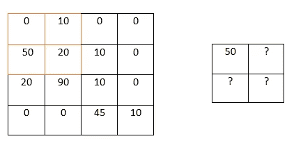

4x4 图像上产生 2x2 输出的最大池(大小为 2)

合并任务很容易，经过一个卷积层后，我们只需遍历 2x2 块(最大合并大小=2)中的输入图像，然后将该块的最大值添加到输出图像的相关像素中。这个池方法将输入的宽度和高度除以池的大小。

例如，如果我们在具有 8 个滤波器的初始卷积层之后放置一个池大小为 2 的最大池层。池层将把 26x26x8 的输入转换成 13x13x8 的输出。

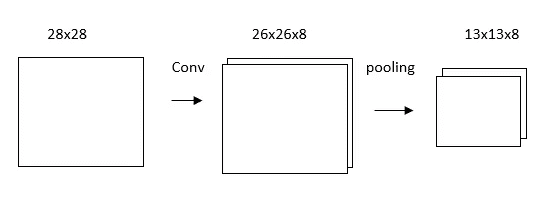

卷积层和最大池化后的输出图像

*注意:由于填充，输出是 26x26x8，而不是 28x28x8，这会将输入的宽度和高度减少 2。*

## 3.Softmax

在 CNN 的最后阶段，它应该输出预测。对于多类分类，我们可以使用 softmax 层，一个全连接(密集)层来进行预测。全连接层的每个节点都连接到前一层的每个输出。

例如，如果我们使用具有 10 个节点的 softmax 层作为 CNN 的最终层，每个节点代表一个数字。图层中的每个节点都将连接到每个输入。在 softmax 层之后，CNN 的输出将是由具有最高概率的节点表示的数字。

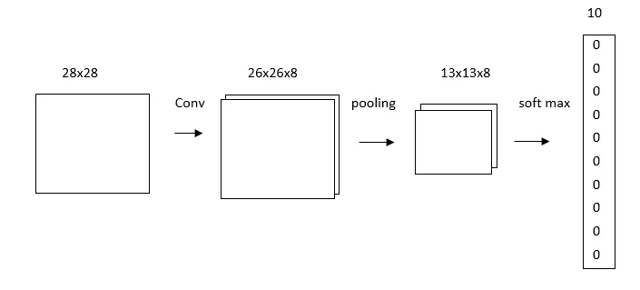

使用 softmax 图层的 CNN 的最终输出

## 4.结论

这里我们总结一下关于卷积神经网络的讨论。我们已经讨论了 CNN 的背景、卷积层、池层和 softmax 层。在这篇文章中，我们期望提供关于卷积神经网络的基本理解。

## 参考

1.  [https://www . kdnugges . com/2020/06/introduction-convolutional-neural-networks . html](https://www.kdnuggets.com/2020/06/introduction-convolutional-neural-networks.html)

2.https://victorzhou.com/blog/intro-to-cnns-part-1/

3.[https://www . flatworldsolutions . com/data-science/articles/7-applications-of-convolutionary-neural-networks . PHP](https://www.flatworldsolutions.com/data-science/articles/7-applications-of-convolutional-neural-networks.php)