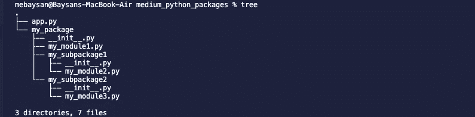

# 创建自己的 Python 包的介绍

> 原文：<https://medium.com/analytics-vidhya/introduction-to-create-own-python-packages-9aed417036ee?source=collection_archive---------6----------------------->

大家好。在这个故事中，我将尝试解释我们如何创建自己的 Python 包和模块。这个故事不是关于如何发布你的包，它只是关于如何创建你的包和模块，因为我想我会解释整个过程，但是我太懒了。因此，我们将只讨论这些主题:

*   什么是包和模块
*   什么是 **__init__。py** 文件
*   什么是相对和绝对路径

# 创建工作区

我将创建一个文件夹，并在该文件夹上打开 vscode。

```
cd Desktop/WS && mkdir medium_python_packages && cd medium_python_packages && code .
```

我在我的工作空间里创造了这个结构。我在每个**的 my_module*中都放了 hello 方法。py** 文件。像下面这样:

```
def hello(): print('Hello I\'m a function from my_module1')
```

> 对于额外的信息，我们可以使用**树**命令(mac 和 linux)将文件夹结构显示为一棵树。



此故事项目的文件夹结构

在这之后，我们将在几分钟内尝试理解 Python 包 a 中的基本术语。

如你所见，我们有一个名为 **my_package** 的文件夹。我们称之为包裹。并且每个包都必须包含 **__init__。py** 文件。现在就把它当成一个神奇的功能吧。感谢 **__init__。我们可以给我们的文件和文件夹赋予包属性。我们把包文件夹下的 Python 文件称为模块，把包下的文件夹称为子包。每个子包也必须包含 **__init__。py** 文件。**

在根文件夹中，如果我使用这个结构，我将使用绝对路径:

```
from my_package.my_module1 import hello
```

但是如果我想在**_ _ init _ _(init _ _)中导入 **my_module3.py** 。 **my_subpackage2** 的 py** ，我要用相对导入(后面我们会描述那是干什么用的)。

```
from .my_module3 import hello
```

# 让我们开始一些进口

我要从 my_module1.py 文件中导入 **hello 函数**。正如我们所知，它位于包的根级别。为此，我需要使用绝对路径来导入。但首先我想给你看些东西。当我尝试用这个导入时:

```
import my_package.my_module1
```

我将得到错误消息“my_module1 未定义”。这里的问题是什么？


如果我们想从 app.py 文件中访问 hello 方法，我们需要使用绝对路径来导入。

```
from my_package.my_module1 import hello
```


您可能认为访问其他函数需要使用相同方式，即绝对路径。


> 对于额外的信息，您可以使用“as”关键字给函数一个临时名称。

但是我想从包名中访问我的函数。我们如何做到这一点？在这种情况下，我们会遇到 __init__。py 文件和相关导入。正如我们所说的，每个包/子包都包含 __init__。我们可以在这里导入我们需要从包名访问的函数。

我将转到 my_package 的 init 文件，并在这里导入 my_module。


感谢 init 文件中所有导入的函数，我们可以从包名中访问它。


但是，有下划线但是:)如果我想从 my_module2.py 访问 hello 函数，可以这样做吗？正如你可能认为的，没有。

为此，我需要在 my_subpackage1 的 init 文件中导入 my_module2.py，并在 my_package 的 init 文件中导入 my_subpackage1。


my_subpackage1 的初始化文件


我的包的初始化文件

现在我可以从包名中访问这些函数。


是的，我们已经学习了绝对路径，相对路径，__init__。py 文件、包、子包和模块术语。我希望它有帮助。

亲切的问候。