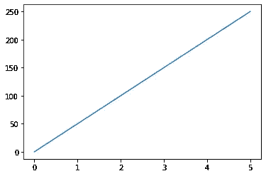
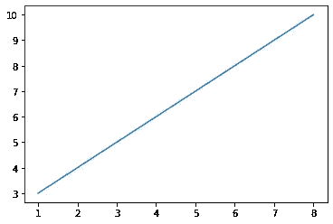
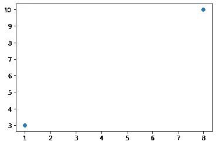
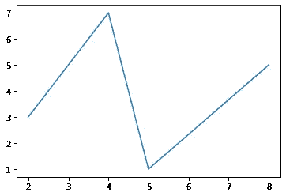
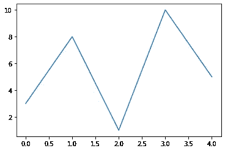
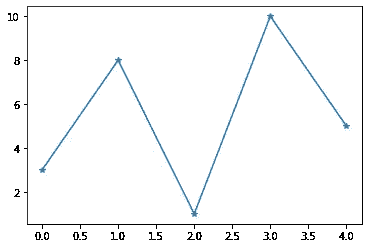
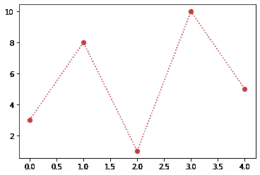
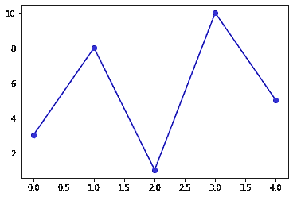
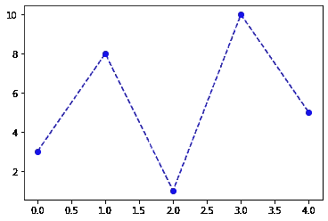

# 数据可视化简介

> 原文：<https://medium.com/analytics-vidhya/introduction-to-data-visualization-a63adcd5b042?source=collection_archive---------25----------------------->

**数据可视化**是信息和**数据**的图形化表示。通过使用图表、图形和地图等可视化元素，**数据可视化**工具提供了一种便捷的方式来查看和理解**数据**中的趋势、异常值和模式。


# Matplotlib

Matplotlib 是一个非常棒的 Python 可视化库，用于数组的 2D 绘图。Matplotlib 是一个基于 NumPy 数组的多平台数据可视化库，旨在与更广泛的 SciPy 堆栈一起工作。它是由约翰·亨特在 2002 年提出的。

可视化的最大好处之一是，它允许我们以易于理解的视觉方式直观地访问大量数据。Matplotlib 由几个图组成，如线形图、条形图、散点图、直方图等。

# Matplotlib 安装

```
python -m pip install -U matplotlib
```

# 导入 Matplotlib

```
from matplotlib import pyplot as plt
*or*
import matplotlib.pyplot as plt
```

# Matplotlib 中的基本图

Matplotlib 附带了各种各样的情节。图表有助于理解趋势、模式和建立关联。它们是对定量信息进行推理的典型工具。这里包括了一些样地。

# 入门指南

```
import matplotlib.pyplot as plt
import numpy as np
xpoints=np.array([0,5])
ypoints=np.array([0,250])
plt.plot(xpoints,ypoints)
plt.show()
```



```
#draw a line from position (1,3) to (1,8)
xpoints=np.array([1,8])
ypoints=np.array([3,10])
plt.plot(xpoints,ypoints)
plt.show()
```



```
#plotting without line
#draw two points one at(1,3) and one at(8,10)
xpoints=np.array([1,8])
ypoints=np.array([3,10])
plt.plot(xpoints,ypoints,'o')
plt.show()
```



```
#multiple points 
xpoints=np.array([2,4,5,8])
ypoints=np.array([3,7,1,5])
plt.plot(xpoints,ypoints)
plt.show()
```



```
#if we do not specify x-axis then defaukt value is 0,1,2,3,etc.
ypoints=np.array([3,8,1,10,5])
plt.plot(ypoints)
plt.show()
```



```
#marker at each point
ypoints=np.array([3,8,1,10,5])
plt.plot(ypoints,marker='o')
plt.show()
```



```
ypoints=np.array([3,8,1,10,5])
plt.plot(ypoints,marker='*')
plt.show()
```


```
#format string
ypoints=np.array([3,8,1,10,5])
plt.plot(ypoints, 'o:r')   #dotted line :
plt.show()
```



```
ypoints=np.array([3,8,1,10,5])
plt.plot(ypoints,'o-b')   #solid line
plt.show()
```



```
ypoints=np.array([3,8,1,10,5])
plt.plot(ypoints,'o--b')   #dashed line
plt.show()
```

