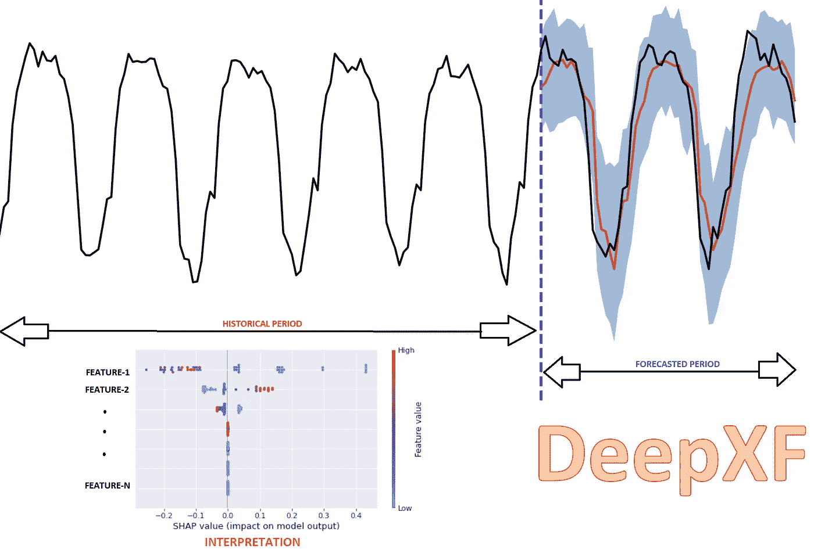
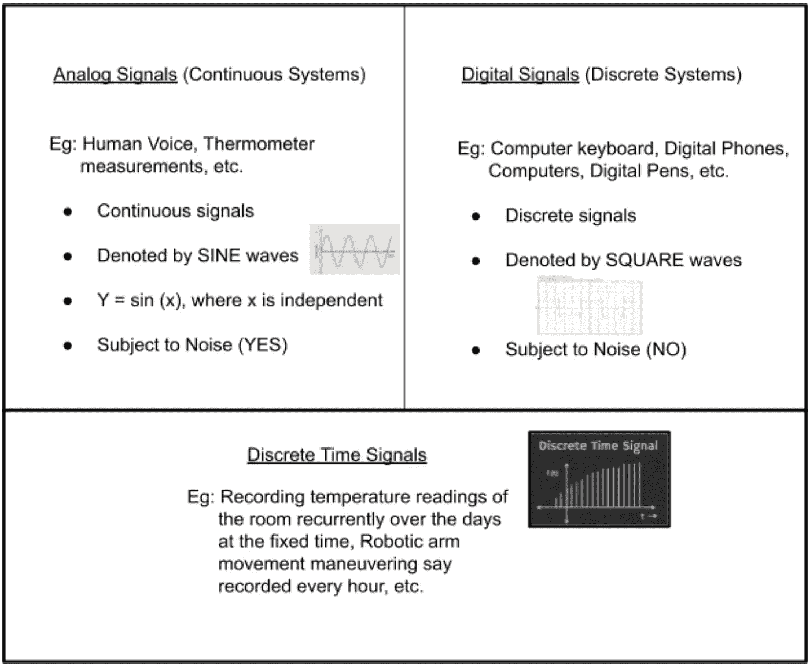

# DeepXF 简介

> 原文：<https://medium.com/analytics-vidhya/introduction-to-deepxf-e90ce7c2858c?source=collection_archive---------5----------------------->

Python 库，用几行代码构建可解释的预测/临近预报模型。

嗨，朋友们。在这篇博客文章中，我们将快速浏览一下包“ [**Deep-XF**](https://github.com/ajayarunachalam/Deep_XF) ”，它对于预测、临近预报、时间序列数据分析、从信号中过滤噪声、比较两个输入信号等非常有用。这个包的 USP 是它的一堆附加实用程序助手函数，以及可用于解释黑盒模型结果的模型可解释性模块，无论是预测/临近预报问题。

作者图片:DeepXF 包服务的直观表示

# **什么是信号？**

在工程中，表示某种信息的基本量称为“信号”。在数学世界中，信号是一个简单地传递一些信息的函数。

# 信号的例子

日常生活中出现的一些真实世界的信号示例(不限于此)包括音频信号、图片、视频信号、医疗信号(EEG、ECG、EMG)等。而更科学的特定案例包括声纳和雷达信号、地球物理信号(地震数据等)。

# 信号分类

作者图片:从通信工程角度对信号进行分类

# 信号与时间序列

*   在时间序列数据集中，待预测值(y)是时间的函数**【y = y(t)】**
*   一个**信号**是更一般的版本，其中因变量' **y** '不必总是时间的函数，尽管它可以是**【y = y(t)】**；它可以是空间坐标**【y = y(x，y)】**的函数，也可以是距离源**【y = y(r)】**的函数，等等。举个例子。

# 重新审视时间序列

时间序列数据可用于(但不限于)

*   **描述性分析—** 在相关数据中识别模式。换句话说，时间序列中趋势和季节性的变化被识别。
*   **预测—** 根据以前的观察结果对长期/短期趋势进行预测。
*   **临近预报—** 根据之前的观测结果对非常短期的趋势进行预测。
*   **库存分析—** 分析时间序列数据中任何事件的影响。
*   **质量控制—** 当特定尺寸出现偏差时，会发出警报。
*   **异常检测—** 识别偏离数据集正常行为的数据点、事件和/或观察值。

# **深入了解 DeepXF**

“DeepXF”是一个开源的低代码 python 库。“DeepXF”是一个复杂的时间序列数据预测/临近预报模型构建工具。利用这种“简单”、“易于使用”和“低代码”的解决方案，人们可以轻松地自动构建可解释的深度预测/临近预报模型。此外，它还提供了使用连体神经网络进行时间序列信号相似性测试的便利，以及使用滤波器对时间序列信号进行去噪。

适合这个[库](https://pypi.org/project/deep-xf/)的一些直接用例应用包括**、【可解释预测】、**可解释临近预报**、**时序数据分析**、**去噪时序信号**、**时序** **信号相似性测试**、**时序数据预处理**等。**

关于安装和开始检查[这里](https://github.com/ajayarunachalam/Deep_XF)。

**PS:** 这个包总的来说还在开发中，所以随时欢迎你的评论和你认为可能包含的东西。此外，如果你想成为一个贡献者，你总是最受欢迎的。请。如果你有兴趣成为一名贡献者，请联系我们。

RNN/LSTM/GRU/BiRNN/BiLSTM/big ru 已经是初始版本推出的一部分，而、、变形金刚、GAN、CNN 等。正在进行中，一旦测试完成，将很快添加。

# 接触

你可以在 ajay.arunachalam08@gmail.com 找到我；并通过 [linkedin](https://www.linkedin.com/in/ajay-arunachalam-4744581a/) 连接

参考资料:-

[https://simple.wikipedia.org/wiki/Forecasting](https://simple.wikipedia.org/wiki/Forecasting#:~:text=Forecasting%20is%20studying%20and%20saying,is%20done%20with%20scientific%20methods.&text=Science%20cannot%20know%20the%20future,and%20sometimes%20they%20are%20wrong)

 [## 预测定义

### 预测是一种技术，使用历史数据作为输入，做出明智的估计，是预测的…

www.investopedia.com](https://www.investopedia.com/terms/f/forecasting.asp)  [## 期望值最大化算法-维基百科

### 在统计学中，期望最大化(EM)算法是一种寻找(局部)最大似然或…

en.wikipedia.org](https://en.wikipedia.org/wiki/Expectation%E2%80%93maximization_algorithm)  [## EM 算法(期望最大化):简单定义

### 最大似然估计> EM 算法(期望最大化)你可能想先阅读这篇文章:什么…

www.statisticshowto.com](https://www.statisticshowto.com/em-algorithm-expectation-maximization/)  [## 时间序列-维基百科

### 在数学中，时间序列是按时间顺序索引(或列出或绘制)的一系列数据点。最常见的是…

en.wikipedia.org](https://en.wikipedia.org/wiki/Time_series)  [## stats models . TSA . statespace . dynamic _ factor _ MQ。动态工厂模型

### 基于 EM 算法的动态因子模型:月度/季度数据选项。动态因素模型的实施…

www.statsmodels.org](https://www.statsmodels.org/stable/generated/statsmodels.tsa.statespace.dynamic_factor_mq.DynamicFactorMQ.html)  [## 信号处理-维基百科

### 信号处理是电气工程的一个子领域，主要研究分析、修改和合成信号

en.wikipedia.org](https://en.wikipedia.org/wiki/Signal_processing)  [## 滤波器(信号处理)-维基百科

### 在信号处理中，滤波器是一种从信号中去除一些不需要的成分或特征的装置或过程…

en.wikipedia.org](https://en.wikipedia.org/wiki/Filter_%28signal_processing%29)  [## 暹罗神经网络-维基百科

### 连体神经网络(有时也称为双胞胎神经网络)是一种人工神经网络，使用相同的…

en.wikipedia.org](https://en.wikipedia.org/wiki/Siamese_neural_network)  [## 可解释的人工智能-维基百科

### 可解释的人工智能(XAI)是人工智能(人工智能)，其中解决方案的结果可以被人类理解…

en.wikipedia.org](https://en.wikipedia.org/wiki/Explainable_artificial_intelligence)