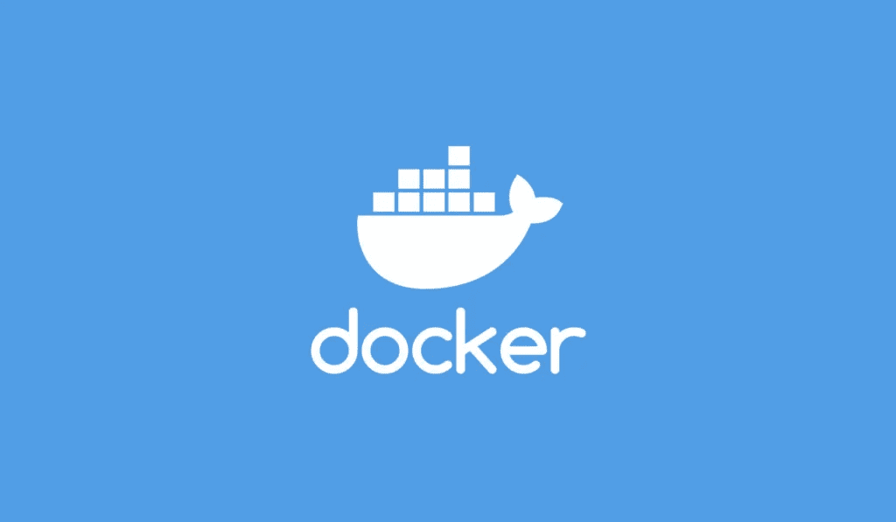

# Docker 简介

> 原文：<https://medium.com/analytics-vidhya/introduction-to-docker-69a0e84a7053?source=collection_archive---------5----------------------->



Docker 已经成为行业中一个有趣且非常有用的工具。但作为一名新生，很难理解“Docker 是什么？”，“是用来干嘛的？”或者“它的优点是什么？”等。下面就让我们来看看并回答所有这些问题。

> Docker 是什么？


根据维基百科，

" Docker 是 PAAS 的一个组合，它使用操作系统虚拟化来交付被称为容器的软件包中的软件."

让我们以一种更简单的方式来理解，在部署或测试任何软件时，我们在虚拟机或测试机上(可以是测试人员的笔记本电脑或任何其他虚拟环境)进行，我们需要安装所需的软件或操作系统，因此可能会出现多个版本错误。这就是 Docker 容器发挥作用的地方。

在 Docker 中，创建了一个映像，这就像一个操作系统虚拟化，即它可以在您的计算机上运行不同的操作系统，而无需手动安装和设置。

编写 docker 文件并生成映像将有助于解决操作系统或软件版本错误，还将加快资源设置。

> Docker 有哪些用途和优势？

Docker 的优势之一是它减少了手动设置虚拟设备或测试设备或任何其他设备所需的设置时间。

在多台机器上使用软件时可能出现的软件版本错误可以通过运行机器的 Docker 文件或 Docker 映像来消除。

使用 Docker containers 和 Kubernetes 或任何其他 Docker manager 服务，处理流量或增加/减少服务器/虚拟机上的运行节点变得更加容易。

如果任何一个 Docker 容器节点停止工作，另一个 Docker 容器节点就会启动，并使用 Kubernetes 或任何其他 Docker 管理器服务进行设置，而无需任何人工干预。这防止了应用程序停机。

随着应用程序的文档化，应用程序或软件的维护变得更容易，麻烦更少。

> Docker 文件和 Docker 图像的示例

让我们看一下 docker 文件，了解它的一些命令:

```
FROM ubuntu:18.04
COPY . /app
RUN make /app
CMD python /app/app.py
```

`FROM`根据给定的 Docker 图像创建图层。示例:

## 来自 ubuntu:18.04

这就创建了一层 **ubuntu:18.04** Docker 图像。

2.`COPY`添加 Docker 客户端当前目录中的文件。示例:

## 收到。。/应用程序

将计算机当前目录中的所有项目复制到。 **ubuntu 的/app 目录:18.04。**

3.`RUN`用`make`构建你的应用。它在我们构建 docker 映像时触发。

## 运行 make。/应用程序

它为中的应用程序运行 make 命令。 **ubuntu 的/app 目录:18.04** Docker 图片。

4.`CMD`指定在容器中运行什么命令。它在我们启动创建的 docker 映像时触发。

## CMD python /app/app.py

Docker 镜像 **ubuntu:18.04** 启动后，它将使用`CMD`中给定的命令运行应用程序。

> **临时演员:**

要了解机器学习项目的 Docker 用例，请访问:

[https://github.com/Darkshadow9799/Super-Resolution.git](https://github.com/Darkshadow9799/Super-Resolution.git)