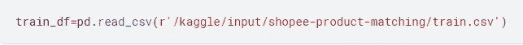
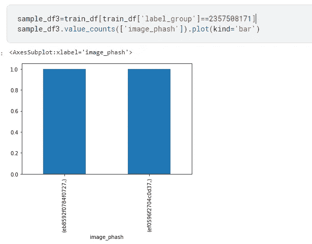
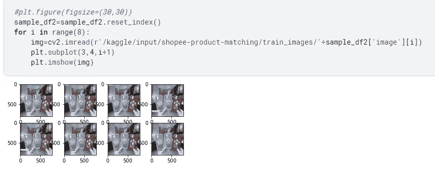

# 基于图像和文本数据的探索性数据分析简介

> 原文：<https://medium.com/analytics-vidhya/introduction-to-exploratory-data-analysis-for-image-text-based-data-1179e194df3f?source=collection_archive---------0----------------------->

今天，在本帖中，我们将为 Kaggle 上正在进行的比赛之一[Shopee-Price Match Guarantee](https://www.kaggle.com/c/shopee-product-matching)做一个简单而全面的 EDA。探索性数据分析是解决任何数据科学或机器学习问题的第一步。这是熟悉您可以使用的数据的最简单的方法。你对数据了解得越多，你就离解决问题越近。

所以，让我们把手弄脏，进入探索性数据分析的世界。这个问题是文本数据和图像数据的混合，因此探索它会很有趣。

# **第一步:理解问题陈述-**

在你开始解题之前，首先你需要很好的理解问题陈述。所以，让我们先从这个开始。您可以在此处获得完整的问题陈述和数据描述:

 [## 专柜价格匹配保证

### 通过图像确定两个产品是否相同

www.kaggle.com](https://www.kaggle.com/c/shopee-product-matching) 

我们有一组图像和它们的产品类别。基于这些可用的信息，我们需要找到与给定产品相似的产品。

**比如:**

对于给定的产品 A，我们需要找到与 A 最相似的其他 50 张图片。为此，我们需要关于每种产品的一些信息。我们将在这篇文章的后半部分研究这些可用的信息。

# **第二步:分析数据帧:**

# **列车数据:**

首先，我们将读取可用的数据帧，分析它们的形状和大小以及可用的数据类型。

将数据读入熊猫数据框

数据帧的打印形状

打印前几行

关于数据帧中每一列的信息

发现数据见解很重要，在每一步写下观察结果也很重要。

# **观察:**

1.  我们有 34250 张训练图像。在我们的数据框架中，我们将图像标题作为文本特征。
2.  我们还有 image_phash 和 label_group 作为其他功能。相似的 posting_id 是我们需要为每张图片预测的。

# 测试数据:

读取测试数据帧

分析测试数据的形状

分析前几行测试数据

分析关于每列的信息

我们现在已经看到了我们的测试和训练数据帧。现在，我们需要从数据集中找到一些见解，看看列之间是否存在任何类型的隐藏模式或关系。因为我们只有 5 列，所以分析每一列并不困难。因此，我们将从相同的开始。

# **步骤 3:浏览数据列:**

# **标签 _ 组:**

我们将从 label_group 开始。该列不是为测试数据集提供的。并且，给定同一 label_group 中的图像最相似。因此，在某种程度上，这就像我们的目标标签。因此，让我们在这一领域进行更多探索:

按 Label_group 分组以查看每个标签的数量

检查重复的标签组

唯一标签组的数量

## **绘制每个标签组中的图像数量:**

条形图前 50 个标签组的每个标签中的图像数量

# **观察:**

1.  从以上信息中，我们可以看到，对于任何 label_group，属于类似 label_group 的产品的最大数量是 51。
2.  在我们的训练数据集中有 23236 个重复的标签组，因为许多产品共享相同的 label_group。
3.  总共有 11014 个独特的标签。由于标签的数量非常大，这不能被视为简单的分类问题。

# **标题:**

现在，我们也给出了每张图片的标题。我们将探索这一领域，并找出类似产品/图片的这些图片有多相似。标题相同或相似的图像很可能也是相似的，应该属于同一类别。让我们找出这种可能性的机会，看看它是否真的成立:

为了分析标题，我们首先从分析标题的长度开始。因此，我们找出每个标题的字数。

添加新列标题 _ 长度

检查最小标题长度

我们看到任何标题的最大字数是 61(不是很大的数字)，最小是 1。

**为了更清楚，让我们在标签组的标题上画一个单词云(通过随机选择),看看我们是否能找到什么。由于标题的长度不是很大，我们可以从 wordcloud 中获得一个很好的视图。**

文字云图片来自 group_label: 1163569239

我们可以看到，4 个单词的出现次数比题目中出现的其他单词要多得多。另外，SCARLETT 这个词还有另一种变体，我们也看到了。美白也是一样。因此，为了分析标题，重要的是所有的单词都要用相同的大小写。

分析特定标签组的标题长度

我们看到在标题长度和标签组之间没有这样的关系。

我们对一个 label_group 执行的一系列 title_length 操作，与我们对更多 label _ group 执行的操作相同。

**不同标签组的标题分析:**

文字云图片来自 group_label: 2357508171

# **观察:**

1.  属于不同标签组的产品有完全不同的词。因此，可以得出结论，所有权在这个问题上起着重要作用。
2.  此外，对于属于同一 label_group 的产品，很少有词出现得更频繁，这再次支持了上述说法。
3.  对于属于同一 label_group 的图像，标题中的字数没有关系。
4.  对于同一标签组中的图像，散列值分布很广。

# **图像 _ 相位分析:**

Image_phash 给出了每张图片对应的 hash_vale。让我们首先分析几个例子，如果属于相同 label_group 的图像具有相同或不同散列值的图像。

image _ phash for label _ groip 235708171

image _ phash for label _ groip 1163569239

我们已经检查了属于同一个 label_group 的图像可能具有不同的 hash _ values。让我们检查具有相同散列值的图像是否具有不同的标签组。

根据 hash_value 检查图像的分布

检查来自不同标签组的图像是否具有相同的散列值

# **观察:**

1.  存在相同的 hash_value 图像属于不同组的情况。但是可以说，大多数只属于同一个 label_group。
2.  我们被给定一个感知散列值，因此为了计算两幅图像之间的相似性，我们将考虑汉明距离。
3.  Hash_value 也是给定图像的一个重要特征。我们需要小心地使用它和其他可用的特征来找出最相似的图像

**图像哈希分析辅助函数:**

基于前 1000 个图像的 Hash_Value 构建图像矩阵

我们正在寻找类似的产品图像。首先，我们可以根据这里计算的价值，为每种产品选择 50 种最相似的产品。

这可以使用以下代码来完成:

现在为了清晰直观，我们从这本字典中为每种产品绘制了排名前 50 位的产品。这里的信息可能不太准确，因为我们不是考虑 38k 行的整个数据集，而是只考虑前 1000 行。

# **观察:**

基于这些，结果并不乐观。这也可能是因为我们只是拍摄了图像样本。让我们尝试使用前 10 个图像，将它们的匹配 hash_value 与数据集中的所有图像进行比较。

**现在，如果我们对随机选取的图像进行分析，并将 hash_value 与数据集中所有可用的图像进行比较，让我们看看这是如何工作的。**

## 对于索引 2937:

哇！这一次的结果要好得多。因此，我们必须明智地利用完整的数据。与子集进行比较没有帮助。

作为进一步的分析，您还可以检查基于 hash_value 发现相似的图像是否具有相同的标签。

# **观察:**

1.  我们得到了很好的结果，但只是在有相同 hash_value 的图像的情况下。因此，人们可以在某种程度上依赖这种技术。这也清楚地表明 hash_value 是这里要考虑的一个重要参数。
2.  我们看到，基于 hash_difference 的前 50 个相似图像中没有一个是带有相同标签的图像。我们将使用海明距离重复这些步骤，看看是否有所发现。

**图像分析:**

# **绘制具有相同标签 _ 组的图像:**

具有相同标签组的图像样本

# 使用相同的散列值绘制图像:

# **观察:**

1.  每个图像的 Hash_value 是任何给定图像的重要特征，它有助于将相似的图像分组在一起。
2.  对于感知哈希，汉明距离是计算两个给定图像之间相似性的主要度量。
3.  汉明距离值越短(值越小)，图像越相似。

# **基于标题分析图像相似度:**

正如我们前面看到的，标题是一个重要的特性。让我们看看基于标题比较的结果有多好。在根据标题计算相似度之前，我们将执行一些简单的文本转换技术。

正如我们之前看到的，所有的标题都应该是相同的大小写，我们将会相应地做。为了计算基于标题的相似性，我们使用了 [fuzzywuzzy](https://pypi.org/project/fuzzywuzzy/) 库。

**助手功能:**

计算模糊率的函数

**对于索引 0:**

根据模糊率，将相似图像排在索引为 0 的图像的前面

**对于指数 10:**

根据模糊率，将相似图像排在索引为 10 的图像的前面

**对于指数 30:**

根据模糊率排列与索引为 30 的图像最相似的图像

## **一个重要的观察结果:**

基于标题的 index_30 产品的相似图片看起来不合适。因此，我们使用 label_group 运行检查。我们观察到的是一个很大的错误:

我们看到，根据标题，与索引 30 处的图像相似的所有图像属于不同的 label_group。为了找出发生了什么，我们进一步查看与索引 30 处的图像具有相同 label_group 的所有图像。

*而且，这给了我们错误。我们看到术语* ***莫伊纳·卡夫坦*** *在两个标题中都存在，但是因为完整的字符串不相同，所以我们得到较低的模糊率。为了解决这个问题，我们需要识别分隔符并查找最大比率。为了实现这一点，我们编写了计算模糊率的函数的改进版本，如下所示:*

**现在我们用这个新函数再次计算指数 30:**

现在我们看到，所有根据标题与索引 30 处的图像相似的图像都属于不同的 label_group。为了找出发生了什么，我们进一步查看与索引 30 处的图像具有相同 label_group 的所有图像。

并且，这给了我们错误。我们看到术语 ***【莫伊纳·卡福坦*** *在两个标题中都存在，但是因为完整的字符串不相同，所以我们得到了较低的模糊率。为了解决这个问题，我们需要识别分隔符并查找最大比率。为了实现这一点，我们编写了计算模糊比率的函数的改进版本，如下所示:*

**现在我们用这个新函数再次计算指数 30:**

我们现在有类似的产品了。因此，添加分隔符逻辑解决了我们的问题。

**观察:**

1.  标题是一个重要的特征。我们不应该忽略标题中的单词。模糊率越高，图像越相似。
2.  不仅仅是标题我们发现 image_hash_value 也是一个重要的特性。
3.  我们没有考虑图像本身来计算相似性，因此，我们也可以这样做。
4.  我们需要想出一种方法，将这些参数结合起来，以最佳的方式给我们带来最相似的图像。

**遗言..**

嗯，这很简单，但我们得到了一些惊人的见解。这显示了执行探索性数据分析的力量和魔力。我希望你喜欢这篇文章。

完整的代码请参考:[https://www.kaggle.com/mansichoudhary3296/shopee-1](https://www.kaggle.com/mansichoudhary3296/shopee-1)

**参考文献:**

1.  [https://www.appliedaicourse.com/](https://www.appliedaicourse.com/)
2.  [https://www.kaggle.com/c/shopee-product-matching/code](https://www.kaggle.com/c/shopee-product-matching/code)