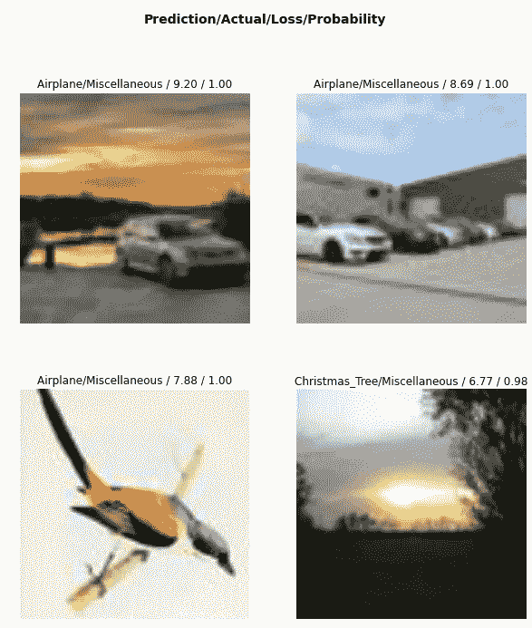

# fastai v2 简介

> 原文：<https://medium.com/analytics-vidhya/introduction-to-fastai-v2-902520c9466?source=collection_archive---------8----------------------->

fastai 是 Pytorch 之上的高级框架，用于训练机器学习模型，并在非常少的代码行中实现最先进的性能。fastai 对于 pytorch，就像 keras 对于 tensorflow 一样。

这篇文章是一篇初学者指南类的文章，可能对试图学习这个框架的人有所帮助，可能是因为有人告诉他们这是 ML 中的新热点；)


这篇文章可能对其他人很重要，但对我也很有帮助。我认为我的文章是一个自我创建的维基，或者是我花了 20 多个小时才找到的所有堆栈溢出答案的汇编。

写博客或向别人解释你学到的东西是更彻底理解概念的好方法。闲聊够了，让我们开始吧！

# 概观


关于 fastai v1 的文章很多。但是由于开发人员从头开始创建了 v2，所以除了官方文档之外，关于它的信息非常少，根据我个人的经验，官方文档并不是非常详细。

无论如何，你可以去他们的官方文件[这里](https://docs.fast.ai/)。

他们将框架分为三个部分:表格、愿景和正文。**列表** ML 涵盖了机器学习问题，我们为每个用户或设备提供了一个特征列表，或者我们技术上称之为样本。**视觉**涵盖以图像为数据集的问题，我们可能需要进行分类、语义分割或对象检测。 **Text** 涵盖了我们想要进行自然语言处理的部分。

在这篇文章中，我将只解释一个组成部分，愿景。

# 愿景:总管道

1.  **导入库**

```
import torch
import fastai
import numpy as np
import matplotlib.pyplot as plt
from pathlib import Path
from PIL import Image
from tqdm import tqdmfrom fastai.vision.all import *
from fastai.vision.augment import *
device = torch.device("cuda:0" if torch.cuda.is_available() else "cpu")
device
```

这将导入所有必需的库。

**2。创建数据集生成器**

我们可以通过多种方式加载数据集。我将使用 dataframe 来创建 dataloader。

```
csv_path = '../input/hackerearth-holiday-season/dataset/train.csv'
train_path = '../input/hackerearth-holiday-season/dataset/train'
test_path = '../input/hackerearth-holiday-season/dataset/test'df = pd.read_csv(csv_path)
df
```


我们将修改我们的图像列，使其成为图像位置的直接路径。为此，我们将使用功能熊猫。DataFrame.apply()对于修改数据框的内容非常有用。

```
df['Image'] = df['Image'].apply(lambda x: os.path.join(train_path, x))
df
```


现在我们有了我们想要的图像列。太好了！

为了绘制类分布的直方图，pandas 已经给了我们一个很好的命令来绘制它！

```
df['Class'].value_counts().plot.bar()
```


显然，这是一个不平衡的数据集，可以用多种方式处理。

现在，我们想最终创建我们的数据加载器。为此，fastai 提供了 ImageDataLoaders 类，它有一个内部函数 from_df()

```
img_size = 128
augmentations = [
        Rotate(10, p=0.4, mode='bilinear'), 
        Brightness(max_lighting=0.3,p=0.5),
        Contrast(max_lighting=0.4, p=0.5),
        RandomErasing(p=0.3, sl=0.0, sh=0.2, min_aspect=0.3, max_count=1),
        Flip(p=0.5),
        Zoom(max_zoom=1,p=0.5),
        RandomResizedCrop(img_size)
    ]dls = ImageDataLoaders.from_df(df=df,
                               path='.',
                               valid_pct = 0.2, 
                               bs = 32, 
                               device=device, 
                               num_workers=0, 
                               batch_tfms=augmentations, 
                               item_tfms=Resize(img_size))
dls.show_batch()
```

除了 _df 之外，fastai v2 允许多种方式来创建数据加载器。我们可以使用`ImageDataLoaders.from_folder`，它默认假设了 directory(path 参数中提到的)中的两个子目录，train/和 valid/

```
ImageDataLoaders.from_folder(**path**, **train**=*'train'*, **valid**=*'valid'*, **valid_pct**=*None*, **seed**=*None*, **vocab**=*None*, **item_tfms**=*None*, **batch_tfms**=*None*, **bs**=*64*, **val_bs**=*None*, **shuffle_train**=*True*, **device**=*None*)
```

还有另一种方法:`ImageDataLoaders.from_name_re`如果我们在图像名称本身中有标签，这是很有用的。比如`img_001_cat.jpg`和`img_742_dog.jpg`。

```
ImageDataLoaders.from_name_re(**path**, **fnames**, **pat**, **bs**=*64*, **val_bs**=*None*, **shuffle_train**=*True*, **device**=*None*)
```

创建 dataloader 还有许多其他模块化方法。你可以查看更多细节，这里是。

这里我们有一些新的术语。为了将**增强**添加到我们的数据集，我们将创建一个增强列表，如 Rotate、RandomErasing、RandomResizedCrop、Flip 等。它们非常简单明了，很容易理解它们是如何工作的。

为了创建 **dls** ，我们提到了目标数据帧，即 df。 **valid_pct** 表示验证集的百分比分割，在此基础上计算向后传播的错误率和损失。

参数 path 表示 dataframe 中提到的图像路径的相对目录。因为我已经在 df 列中附加了 path，所以我们将简单地添加“.”在路径中。

有 **batch_tfms** 和 **item_tfms** 。item_tfms 表示训练和有效集中所有图像所需的增强。batch_tfms 表示应该应用于批处理的扩充，我们在批处理上训练我们的模型。这意味着 batch_tfms 仅用于训练数据，item_tfms 用于所有图像。(因此，我们不需要在上面定义的扩充中添加 Resize()

我对编写这两个独立的扩充的理解是:

> item_tfms 首先出现，然后是 batch_tfms。这使得转换的大部分计算可以在 GPU 上进行，从而节省了时间。
> 
> 第一步(item_tfms)将所有图像调整到相同的大小(发生在 CPU 上)，然后 batch_tfms 发生在 GPU 上。如果只有一个转换，我们就必须在 CPU 上应用它们，这样会慢一些。


dls.show_batch()的输出

## 3.学习者

```
learn = cnn_learner(dls, 
                    resnet34, 
                    metrics=[accuracy,error_rate])
learn.lr_find()
```

cnn_learner 将返回一个指定的模型(本例中为 resnet34)。度量将用于在每个时期后打印相关信息。准确度度量将在每个历元后显示损失。error_rate 将显示错误率，这是不言自明的。


learn.lr_find()

lr_find 是选择合适学习速率的一个非常好的方法。经验法则是选择 lr=min_lr/10，其中 min_lr 是损失最小的学习速率。这是因为选择 min_lr 可能会导致略大的 lr，这可能会在一些时期后分散您的损失。例如，在这个图中，我选择学习率为 1e-2。

现在，我们使用命令来拟合模型:

```
learn.fit_one_cycle(epochs, lr, wd)
```

fastai v2 有另一个名为 learn.fit()的函数，它具有相同的参数，但它将符合用户提到的固定学习速率。learn.fit_one_cycle()将使用循环 lr 类型的调度程序，其最大学习速率为用户提到的 lr。wd 表示重量衰减量。fastai 鼓励 wd=1e-2。这是通过引入正则化来减少过拟合的经典方法。对于普通新加坡元，重量将被修正为:

```
w = w - lr * w.grad - lr * wd * w
```

您也可以通过以下方式解冻模型:

```
learn.unfreeze() # Set requires_grad=True for all layers
```

这意味着基本模型的参数现在也是可训练的。开发人员应该小心，因为解冻模型后，应该使用非常低的学习率。解冻模型只是为了微调模型。

解冻后，还可以为模型的不同部分设置不同的学习速率。

```
learn.unfreeze()# deepest layers will have lr=1e-5, middle layers will have lr=1e-4 and layers at the beginning will have lr=5e-4
learning_rate = [1e-5, 1e-4, 5e-4]learn.fit(learning_rate, epochs=3)
```

**4。绘图**

训练后我们可以看到一些有用的情节。

**4.a** 为了绘制列车损耗曲线并进行验证，编写 learn.recorder.plot_loss()


learn.recorder.plot_loss()

PS: learn.recorder.plot_metrics()曾在 fastai v1 中使用，但现在已贬值。

**4.b** 剧情混乱矩阵

```
interp = ClassificationInterpretation.from_learner(learn)losses,idxs = interp.top_losses()interp.plot_confusion_matrix(figsize=(7, 7), dpi=100)
```


**4.c** 顶损图片

```
interp.plot_top_losses(4, figsize=(10,11))
```



该命令显示训练中损失最大的图像。这对于调试非常有用。

所以这是一篇速成/维基类型的文章。我希望你喜欢它。如果你看到任何法令或不正确的陈述，请在评论或 LinkedIn[中告诉我。此外，如果你想让我添加 fastai 的一些其他方面(如 fastai v2 中的表格和文本)或任何其他深度学习概念，请告诉我。✌️和平](https://www.linkedin.com/in/karan-tanwar-8a04bb145/)