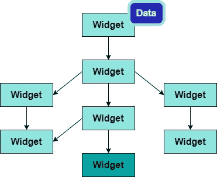

# 颤振介绍

> 原文：<https://medium.com/analytics-vidhya/introduction-to-flutter-ff9912bc41f7?source=collection_archive---------9----------------------->

朋友们好，希望你们都平安无事。今天我想给大家介绍一下 flutter 框架。根据我的经验，我喜欢跳舞。如果你是开发移动应用的爱好者，可以尝试使用 flutter 框架。

现在让我们看看…😎✌

**什么是颤振？**

Flutter 是一个 UI 工具包，用于构建快速的本地编译应用程序。Flutter 有助于在短时间内发布应用程序，并且相对容易编码。Flutter 最好的特性是拥有一个漂亮的 UI 和小部件支持。2020 年对 Flutter 来说是一个奇怪的年份，因为它已经达到了流行的巅峰水平。flutter 使用的是 Dart 编程语言。Flutter 架构由四个组件组成，分别是 Flutter 引擎、基础库、微件和设计专用微件。

**2019-2021 年全球软件开发者使用的跨平台移动框架。**

[图片来源](https://www.statista.com/statistics/869224/worldwide-software-developer-working-hours/)

**反应自然 VS 颤动😎**

[图像来源](https://www.neovasolutions.com/2020/03/17/react-native-vs-flutter-an-evaluation-for-your-app-development/)

**颤振的特征👩‍🎓🎯**

**1。** **热重装**

开发人员可以向应用程序代码中添加新特性，这些变化几乎会立即反映在输出中。

**2。** **开源**

Flutter 是一个用于开发移动应用程序的免费开源框架。

**3。** **Widgets**
编码在 Flutter 中构建任何东西都会在 widget 内部完成。小部件相互嵌套。应用程序本身的根是一个小部件，每个小部件都是一个 dart 对象。

小部件树

**微件的类型**

**无状态小部件** —可以在小部件树中创建一次(静态)

例如:文本、行、列、容器

**有状态小部件** —内部数据可以在小部件生命周期内更改。(动态)

例如:复选框，单选按钮，表单，文本字段，墨水池，滑块

**继承的小部件** —取决于环境状态，可以被它的下级小部件读取。

我们可以使用它们的构造函数在屏幕之间传递数据。但是如果有很多小部件，就会变得混乱…..🤔

因此，我们可以使用继承的小部件来传递我们添加的最后一个小部件的数据，并在首先创建的小部件中进行更新。

步骤 01

步骤 02

步骤 03

因此，我们可以将继承的小部件作为应用程序的根，并在根小部件中设置数据。

步骤 04

然后我们可以将数据传递给它下面的小部件，反之亦然。

步骤 05

**4。** **跨平台**

这个特性允许 Flutter 一次编写代码，维护，并且可以在不同的平台上运行。因此，我们可以为 Android、MacOS、Web、Linux、Microsoft Windows 等多个平台编写一个代码库..

**优缺点**

真的，这个 flutter 框架更好，主要原因是，我们可以在多平台中维护一个代码。flutter 框架中不仅 UI 和小部件支持很好而且很有趣。即使有很少的缺点，我们可以获得的优势是非常高的。

感谢您阅读我的文章…😊😊希望你能看到另一篇关于 flutter 框架的文章。😃

注意安全…！！！！😷😷