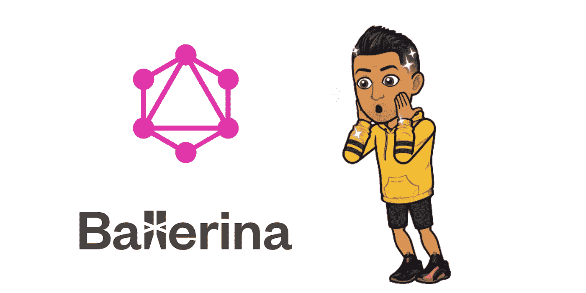
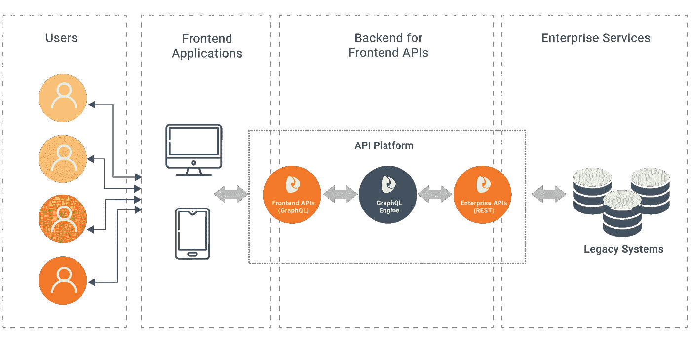

# 芭蕾舞女演员 GraphQL 简介

> 原文：<https://medium.com/analytics-vidhya/introduction-to-graphql-with-ballerina-b883ce46c460?source=collection_archive---------7----------------------->

## 想用更少的 API 调用做更多的事情吗？

GraphQL 已经成为实现数据 API 的重要技术，因为它为查询数据提供了一种方便而直观的方法。它解决了在传统数据服务中可能会注意到的潜在问题，如数据过度获取和高延迟。



## GraphQL 是什么？

所以你可能知道 [REST](https://en.wikipedia.org/wiki/Representational_state_transfer) 架构。我可以说大多数现代应用程序网络架构都是基于 REST 的，它基本上使用 HTTP 调用来获取和修改网络上的数据。常用的操作包括 GET、POST、PUT 和 DELETE。尽管这是一件非常酷的事情，但当考虑大规模应用时，它也有一些缺点。让我解释一下。

假设您有一组 API 端点来获取一些与员工管理系统相关的数据，并且您有一个包含大量数据集的数据库。例如，您需要雇员 Sam 的个人详细信息记录，如地址、联系电话和工资。解决这个问题的方法很简单，就是获取员工列表，浏览该列表，找到 Sam，然后获取他的 ID，最后查询工资表，获取与该 ID 相关的数据。这是正常的做法。想象你有数百万条数据记录，你会在这里面临一些重大问题。

1.  无论是否需要，它都会获取所有数据。这叫做**过度抓取。**
2.  它需要**多次网络调用**才能完成一项简单的工作。
3.  在某些情况下，它可能无法获取您需要的数据(类似于上面的第 2 点),这被称为**提取不足。**

为了解决这些问题，脸书提出了一个名为 **GraphQL** 的非常酷的解决方案，这是一种用于 API 的开源数据查询和操作语言。

## 为什么要使用 GraphQL？

您需要考虑在项目中使用 GraphQL 的原因有很多。主要是，

*   **如我所说，它防止数据过度提取和提取不足**。所以你可以得到你想要的。不多不少。
*   **GraphQL 有一个强类型模式。**我们可以定义我们的 API 支持什么类型的数据记录。这将有助于开发人员容易理解如何使用网络调用。GraphQL 模式最基本的组件是**对象类型**，它只是表示一种可以从服务中获取的对象，以及它有哪些字段。在 GraphQL 模式语言中，我们可以这样表示它:

```
type Employee {
  id: String!
  name: String!
  phone: String!
  age: Int!
}
```

*   **节省时间和带宽。**正如我前面提到的，使用 graphQL，我们可以消除多个调用来完成一项工作。所以我们可以在一个查询调用中做很多事情。脸书提出这一想法的主要原因之一是，大多数脸书用户使用移动设备，不能保证始终有稳定的网络连接，所以 graphql 也有助于用更少的带宽运行查询呼叫。所以双赢。

## 芭蕾舞女演员-GraphQL

哦，我忘了说，你可以使用许多编程语言来编写你的 graphql 服务器，但我最喜欢[芭蕾舞演员](https://ballerina.io/learn/user-guide/network-communication/graphql/)，因为使用芭蕾舞演员编写和理解模式和类型非常简单。它是一种编程语言，GraphQL 是其内置语言级服务支持的一部分。



[https://wso2.com/graphql-apis](https://wso2.com/graphql-apis)

在 Ballerina 中， **GraphQL 对象结构是使用服务建模的。**芭蕾舞演员 GraphQL 服务包含映射到 GraphQL 对象字段的资源方法，并作为解析器函数提供其数据。GraphQL 模式是从这个服务结构及其资源中自动派生出来的。

我们可以像这样写一个简单的 ballerina-graphQL 服务器，

```
import ballerina/graphql;

service graphql:Service /query on new graphql:Listener(8080) {

 resource function get name() returns string {
    return “Sam”;
 }

}
```

上面的服务也可以这样映射。

```
type Query {
 name: String
}
```

所以我们可以发送下面的 GraphQL 查询来查找根查询对象中暴露的`name`字段。

```
{
 name
}
```

我们可以使用，

```
$ bal run your-file-name.bal. 
```

*这将在端点"[http://localhost:8080/query](http://localhost:8080/query)"处公开一个* GraphQL 服务。我们可以像这样发送查询调用。

```
$ curl -X POST -H "Content-type: application/json" -d '{"query":"{name}"}'
```

还有 tada！我们得到这样的回应。

```
{"data":{"name":"Sam"}}
```

我们在这里做的是处理静态数据，但也可以处理动态数据。好了，我想你可能对芭蕾舞演员和 graphql 的组合有了一个基本的概念。让我们再来看看更多关于芭蕾舞演员 graphql 的例子和更深入的概念。再见！