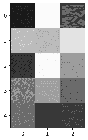

# 图像处理导论

> 原文：<https://medium.com/analytics-vidhya/introduction-to-image-processing-f044b1946adf?source=collection_archive---------17----------------------->

图像随处可见。

它们可以是一幅简单的风景，一张简单的自拍照，或者一张简单的日常生活快照。为了能够存储我们创造的这些珍贵的记忆，我们将这些图像保存为不同的文件格式和图像文件，目前，我们可以将这些文件格式称为图像的数字表示，或者简单的数字图像。

作为一名数据科学家，我们应该能够为其他目的处理图像，这可能对我们的问题有用。

为此，我们可以进行图像处理来清理图像。

图像文件由对应于每个颜色通道值和像素的几个整数/浮点值组成。数组值决定了图片中可以看到的像素的颜色值。所以，换句话说，我们可以把图像想象成一个相互堆叠的 NumPy 数组。

现在我们有了一个上下文，问题是，我们如何看到数组的不同值？

有不同的方法可以做到这一点，让我们在本文中讨论一下。我们也将展示一些图像处理的基本技术。

# **使用 scikit-图像库**

通过使用读取不同格式图像文件的 imread 函数，我们可以使用 scikit-image python 库来读取数字图像。您可以在 imread 函数中传递图像的名称，它会自动读取图像文件。

imread 函数的输出是图像文件的等价 NumPy 数组。还可以通过使用 imread 函数到 imshow 函数的结果来显示图像文件。让我们试着用下面花束的形象。


(图片由作者提供)

下面的代码演示了如何使用 python 命令进行读取和显示。

```
from skimage.io import imshow, imread#read using the imread function
sample = imread(‘flower.jpg’)
print(sample[0])#show using imshow function
imshow(sample)
```


图 1:等效的 Numpy 数组

如图 1 所示，如果我们打印 imread 函数的结果值，我们可以看到一个整数数组。


图 2:花束的样本图片(图片由作者提供)

在图 2 中，您可以看到 imshow 函数的结果，scikit-image 可以在一个类似于带有 x 和 y 坐标的图形中反映数字图像。

我们还可以展示数组的形状:

```
sample.shape
```

(1367, 2048, 3)

正如你在数组的形状上看到的，它有 3 个值，分别对应于图像本身的长度和宽度，以及图像拥有的颜色通道的数量。

我们还可以定义一个示例数组，并将其传递给 imshow 函数:

```
array = np.array([[255, 0], 
                 [0, 255]])imshow(array,cmap='gray');
```


图 imshow 函数的结果(图片由作者提供)

如图 3 所示，imshow 函数的结果是黑白像素的图形，因为 255 是颜色通道中最白的值，零是最黑的值。

请注意，imshow 函数还可以检测数组中输入的浮点数。

```
sample2 = np.random.random((5,3))
print(sample2)
imshow(sample2)
```


图 4:示例数组 2(图片由作者提供)

我们可以在图 4 中看到，数组中有一个浮点值，形状为(5，3)



图 imshow 函数的结果(图片由作者提供)

imshow 函数的结果显示白色、黑色和灰色的不同色调，这意味着该值越高且越接近于 1，它就越白。值越低，越接近零，越黑。

由于它是一个数组，我们也可以用下面不同的绘图风格来显示它:

```
import matplotlib.pyplot as pltfig, ax = plt.subplots(1, 3, figsize=(12,3))
ax[0].pcolor(sample2)
ax[0].set_title('pcolor')
ax[1].matshow(sample2)
ax[1].set_title('matshow')
ax[2].imshow(sample2)
ax[2].set_title('imshow');
```


图 6:不同的绘图风格(作者图片)

## **图像的切片**

我们还可以使用图上显示的 x 轴和 y 轴来切割图像的一部分。让我们先使用示例:

```
import matplotlib.pyplot as plt
slice1 = sample[0:600]
slice2 = sample[:,0:1000]fig, ax = plt.subplots(1, 3, figsize=(15,5))
ax[0].imshow(sample)
ax[0].set_title('Original Image')
ax[1].imshow(slice1)
ax[1].set_title('Sliced Image 1')
ax[2].imshow(slice2)
ax[2].set_title('Sliced Image 2');
```


图 7:切片图像(作者提供的图像)

如图 4 所示，我们可以根据输入的 x 和 y 坐标对图像进行切片，我们使用 NumPy 索引和 NumPy 数组切片方法对特定图像进行垂直和水平切片。

我们也可以使用其他 python 库来完成上述过程。其他库的示例代码如下:

**使用 PIL 图书馆**

```
from PIL import Imagesample3 = Image.open('flower.jpg')
# will output a separate window for the picture
sample3.show()#will convert the image to array
array2 = np.asarray(sample3)
```


图 imshow 的结果(图片由作者提供)

正如你所看到的，使用 PIL 库下的 show()函数，它输出一个单独的窗口，在那里可以看到图像。

您可以通过将 Numpy 等价数组传递给 NumPy 函数来获得它。

# **总结**

有不同的方法来读取数字图像，但最容易使用的图像处理库之一是 scikit-image。

但是等等！

既然我们可以定义如何读取图像文件作为一个 NumPy 数组，我们可以做更多的图像处理！

**继续关注**下一篇文章，我们将通过不同的技术来清洁、处理和增强不同种类的图像。