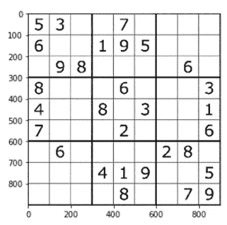

# 图像处理导论第十部分:数独求解器

> 原文：<https://medium.com/analytics-vidhya/introduction-to-image-processing-part-10-sudoku-solver-4530f6c85d6c?source=collection_archive---------7----------------------->

照片由 [**黑冰**](https://www.pexels.com/@black-ice-551383?utm_content=attributionCopyText&utm_medium=referral&utm_source=pexels) 发自 [**Pexels**](https://www.pexels.com/photo/lots-of-numbers-1314543/?utm_content=attributionCopyText&utm_medium=referral&utm_source=pexels)

让我们以一种更加实用和创新的方式再次尝试使用我们已经讨论过的图像处理技术。这一次，我们将使用图像处理从图像中读取数独，并将输出输入到数独求解算法中。为此，我们需要完成三项主要任务:

1.图像处理

2.数字识别

3.解数独。

# **图像处理**

让我们从一张简单的数独照片开始，如图 1 所示。第一步是检测和提取数字。我们通过通常的图像二值化和使用连通分量(即，区域属性)来检测数字来做到这一点。

图一。数独图像

图二。检测到的数字

使用区域属性的*质心*属性，我们可以从数独网格中映射出数字的位置

图 3。示例 regionprops 表和派生要素(即 x_coor，y_coor)

使用 *bbox* 属性，我们可以从源图像中提取数字。

图 4。提取的数字

# **数字识别**

我们可以训练一个机器学习模型来将提取的数字分类到它们正确的数值中。我们不会讨论模型训练的全部细节，但它是使用 MNIST 数据集训练的，图 5 显示了所使用的卷积神经网络(CNN)的摘要。该模型达到了 99%的准确率。

图 5。CNN 体系结构综述

正确识别数字后，我们可以将数独图像重建成 Numpy 数组形式，这将是我们对数独解算器的输入。每个数字的映射基于衍生特征 *x_coor* 和 *y_coor。*9x 9 数组中缺失的坐标被赋值为 0。

图 6。重建的数独数组

**解数独**

令人惊讶的是，Python 已经有了一个解决数独谜题的[库](https://pypi.org/project/py-sudoku/)，所以我们不需要创建算法本身。我们只需要输入重建的数独，它就会返回完整的数独谜题。

图 7。解出的数独

还有那里！这就是我们如何使用图像处理来尝试从数独图像中自动解出数独。