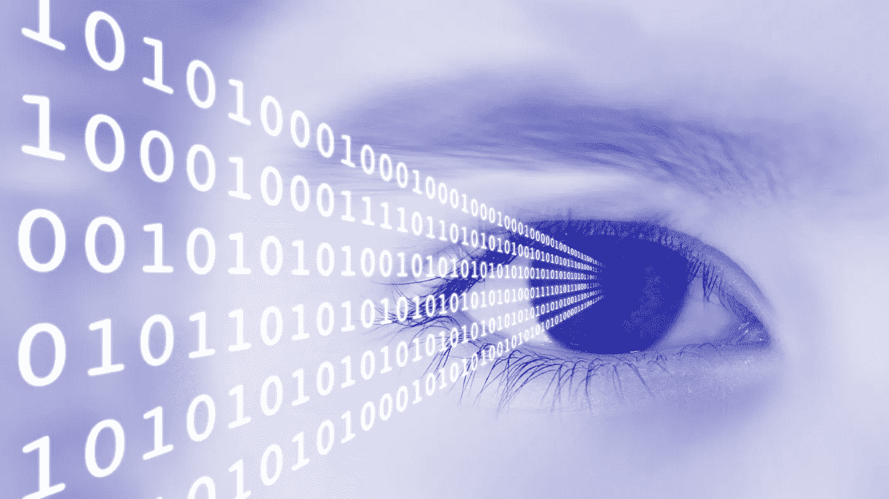
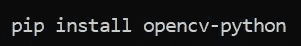
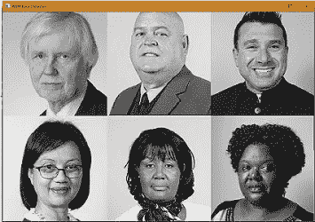
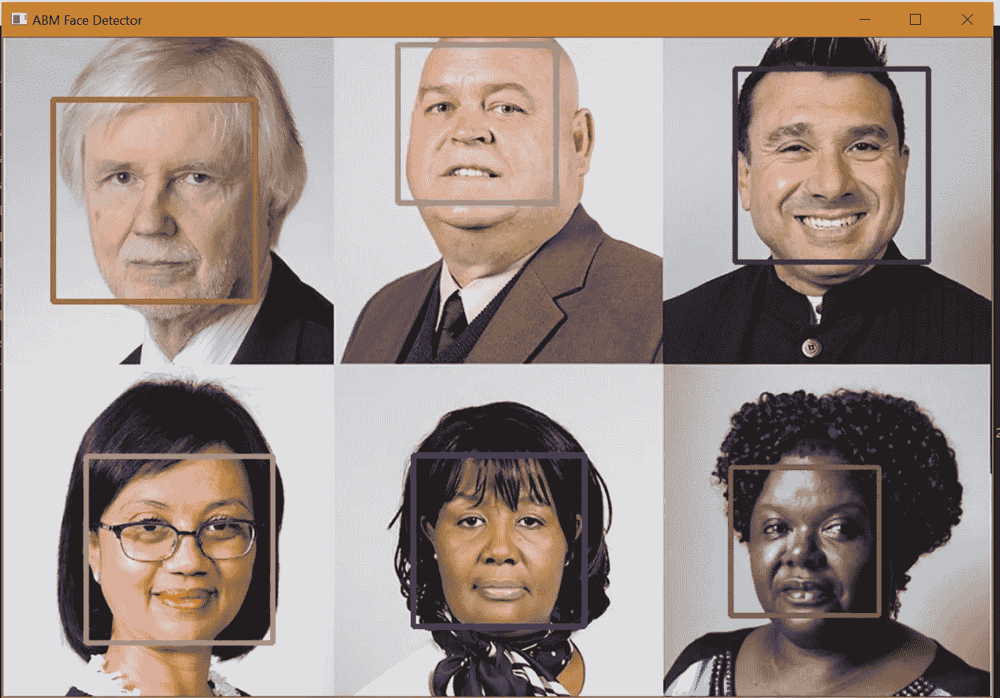

# OpenCV 图像处理简介

> 原文：<https://medium.com/analytics-vidhya/introduction-to-image-processing-with-opencv-2a1bbef8eda0?source=collection_archive---------15----------------------->

## 在这篇文章中，我们将利用图像处理来检测人脸，酷吧？；)第一部分

[**照片由谷歌**](https://images.app.goo.gl/u7syMaNfjSzkxowe7)

## 什么是图像处理？

图像处理通常被称为“数字图像处理”，它被认为是计算机视觉的一个子集。图像处理算法和计算机视觉(CV)算法都将图像作为输入；然而，在图像处理中，输出也是一个*图像*，而在计算机视觉中，输出可以是关于图像的一些*特征/信息。*

图像处理简单地说就是算法对图像进行一些变换，如平滑、锐化、对比、拉伸。

# 先决条件

首先，你应该有一些 Python 的基础知识。其次，你应该知道什么是机器学习以及它如何工作的基础知识，因为我们将在本文中使用一些机器学习算法进行图像处理。另外，如果您接触过 OpenCV，或者对 OpenCV 有基本的了解，将会有所帮助。即使你不知道以上的事情，也不要担心，继续读下去，你会对这些事情有所了解的:)

*   OpenCV:-这是一个开源的计算机视觉库。你可以在的官方文档中找到详细的描述[。](https://opencv-python-tutroals.readthedocs.io/en/latest/py_tutorials/py_tutorials.html#)
*   Haar Cascade:-这是一种基于机器学习的方法，其中从大量的正面和负面图像中训练级联函数。然后，它被用于检测其他图像中的对象。您可以为任何真实世界对象创建 Haar 级联文件。如需详细研究[，请点击此处](https://docs.opencv.org/3.4/d2/d99/tutorial_js_face_detection.html)。

## 装置

因为我们将通过 Python 使用 OpenCV，所以这意味着您已经安装了 Python(版本 3)。安装可以按如下方式进行

> 要检查您的安装是否成功，运行命令 *( import cv2)。*如果你得到的回报没有任何错误，那么你现在已经准备好了！

*   下载代码:-请在你的工作空间克隆这个 [Github 链接](https://github.com/abm98/Face-Detector)开始使用(Image_det.py)。
*   导入图像:-现在，我们要用 OpenCV 做的第一步是通过使用 haar cascade [xml 文件](https://github.com/opencv/opencv/tree/master/data/haarcascades)加载一些预训练数据(Haar cascade 算法)用于正面人脸检测，导入图像并将其转换为灰度。可以这样做:

face.py

**RGB 转灰度图像**

> N **注**:为了在本文中显示，我们对图像进行了缩放，但是我们使用的原始尺寸大约是 600x900。

*   将图像转换为灰度:— RGB 图像包含大量处理过程中可能不需要的数据。当你将一幅 RGB 图像转换成灰度图像时，你丢弃了许多处理过程中不需要的信息，同时也节省了大量的计算能力。它有不同的黑色、灰色和白色。
*   检测人脸并在人脸周围绘制矩形:-

1.  使用在最后一步中初始化的 Haar 级联模型，我们运行并检测图像和检测到的人脸数量。
2.  最后，我们将在前面步骤中检测到的人脸周围创建一个矩形框

> 我从 random *(第一个代码框的第二行)*中导入了 **randrange，这样就创建了一个多种颜色的框。如果你希望它是单一颜色，只需省略随机范围，使用简单的颜色代码。**

检测到的图像

可以看出，我们的脚本检测到了输入图像中的所有 6 个人脸。这在这里很好，但是对于人群的图像来说，在这种情况下它可能不会检测到所有的脸。因此，通过训练我们自己的自定义分类器，我们可以更好地进行预测。

目前就这些，请继续关注本系列的下一篇文章是关于实时人脸检测的。