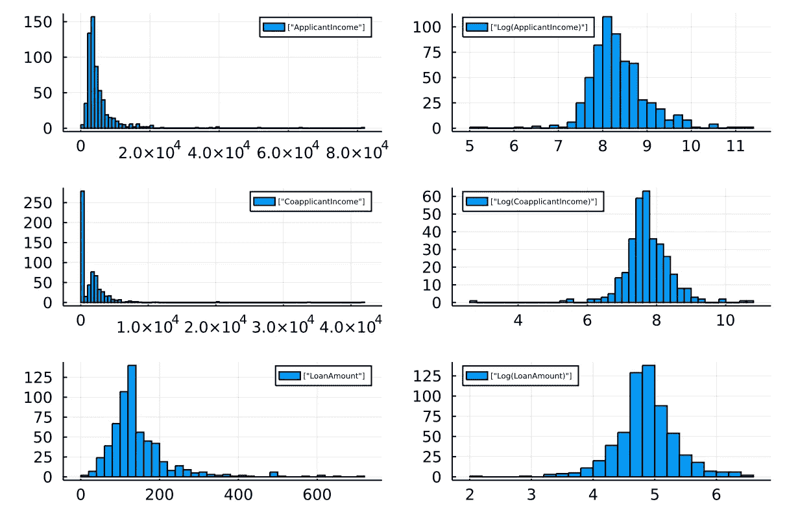

# 朱莉娅·MLJ 简介

> 原文：<https://medium.com/analytics-vidhya/introduction-to-julia-mlj-96a806815cb2?source=collection_archive---------17----------------------->

在这篇文章中，我将使用[贷款批准预测](https://datahack.analyticsvidhya.com/contest/practice-problem-loan-prediction-iii/?utm_source=auto-email#MySubmissions)数据来说明如何使用 Julia 机器学习包 MLJ 进行简单的数据分析生命周期。

# 浏览数据

将 CSV 文件读取到数据帧，指定第一行为标题。

```
df = DataFrame(CSV.File(file, header=1))
```


显示数据摘要，包括最小值/最大值、缺失值数量和数据类型。

```
describe(df)
```


# 清理数据

由于存在一些缺失值，处理缺失值的两种常用方法是:(1)过滤，和(2)估算。茱莉亚包[估算](https://invenia.github.io/Impute.jl/latest/)可以有所帮助。

筛选出缺少值的行。

```
Impute.filter(df; dims=:rows)
```

用统计平均值或模式估算缺失值。默认规则详情可在此[链接](https://invenia.github.io/Impute.jl/latest/api/imputation/#Impute.defaultstats)中找到。

```
Impute.substitute(df)
```

缺失值也可以通过先向前滚动再向后滚动来估算。

```
Impute.locf(df)|> Impute.nocb()
```

# 可视化数据

下面是以透视表格式显示按属性分组的值计数的函数。

```
function pivotView(df1,x,y)
    return unstack(combine(groupby(df1, [x, y]), nrow => :count),x,y,:count,allowmissing=true)
end
```

让我们检查一下受抚养人的数量在贷款状态中是如何分布的。

```
pivotView(df,:Loan_Status, :Dependents)
```


我们还可以显示申请人收入、共同申请人收入和贷款金额的直方图分布。它们的形状看起来像对数正态分布。如果我们绘制对数值的直方图，它就变成正常的钟形，如右边所示。

```
p1 = histogram(df[:,:ApplicantIncome],label=["ApplicantIncome"],legend=:topright,legendfont=font(4))
p1log = histogram(log.(df[:,:ApplicantIncome]),label=["Log(ApplicantIncome)"],legend=:topleft,legendfont=font(4))p2 = histogram(df[:,:CoapplicantIncome],label=["CoapplicantIncome"],legend=:topright,legendfont=font(4))
p2log = histogram(log.(df[:,:CoapplicantIncome]),label=["Log(CoapplicantIncome)"],legend=:topleft,legendfont=font(4))p3 = histogram(df[:,:LoanAmount],label=["LoanAmount"],legend=:topright,legendfont=font(4))
p3log = histogram(log.(df[:,:LoanAmount]),label=["Log(LoanAmount)"],legend=:topleft,legendfont=font(4))plot(p1,p1log, p2,p2log, p3 ,p3log,  layout = (3,2))
```



# 特征工程

基于现有特征创建新特征将是有用的。函数“transform”通过对每一行应用指定的函数(“ByRow(fn)”)来创建一个新列。感叹号意味着它将就地更新数据帧。

```
transform!(df, :Dependents => ByRow(x -> x == "0" ? "N" : "Y") => :hasDependents)transform!(df, :Property_Area => ByRow(x -> x == "Urban" ? "Y" : "N") => :isUrban)

transform!(df, :Loan_Amount_Term => ByRow(x -> x < 360 ? "N" : "Y") => :LongLoan)

transform!(df, [:Loan_Amount_Term,:LoanAmount] => ByRow(/) => :payment)
```

其中最重要的特征是净收益比率。下面的函数将计算净收入比率，方法是将申请人收入和共同申请人收入相加，除以估计的家庭成员人数，然后与每个贷款期限的平均贷款额进行比较，以计算它们的比率。比率越高，偿还能力越强。

```
function netIncome(married,dependents,term,income1,income2,amt)
    if married == "Yes"
        n = 2
    else
        n = 1
    end
    if dependents == "3+"
        n = n + 3
    else
        n = n + parse(Int8, dependents)
    end
    ((income1 + income2)/n) / (amt/term)
endtransform!(df, [:Married,:Dependents ,:Loan_Amount_Term,:ApplicantIncome,:CoapplicantIncome,:LoanAmount] 
        => ByRow(netIncome) => :NetIncome)
```

# MLJ 的数据类型

MLJ 使用科学类型(scitype)作为模型输入的数据类型。我们需要将数据帧(dtype)转换成 scitype。一般情况下，Float 会转换为“连续”。分类值将被转换为 OrderedFactor 或 MultiClass。

```
function unpackData(df,features)y, X = unpack(df[:,features], ==(:Loan_Status), c->true;
    :NumFamily  => Count,
    :Married => OrderedFactor,
    :hasDependents => OrderedFactor,
    :Education     => OrderedFactor,
    :Self_Employed => OrderedFactor,
    :Property_Area => Multiclass,
    :LogApplicantIncome => Continuous,
    :LogCoapplicantIncome => Continuous,
    :payment => Continuous,
    :NetIncome => Continuous,
    :Credit_History => OrderedFactor,
    :LongLoan => OrderedFactor,
    :Loan_Status => OrderedFactor
    )
    return (y,X)
end
y, X = unpackData(df,features)
schema(X)
```


# 分割数据集

将数据集拆分，保留 20%作为验证的测试数据。我们只需要拆分和打乱数据集的索引。

```
train, test = partition(eachindex(y), 0.8, shuffle=true)
```

# 装载模型

MLJ 使用“@load”来加载 ML 模型的代码。这里有一个 XGBoost 分类器的例子。

```
Pkg.add("MLJXGBoostInterface")
Pkg.add("MLJIteration")
using MLJXGBoostInterface
using MLJIteration
cfr = [@load](http://twitter.com/load) XGBoostClassifier pkg=XGBoost
```

# 数据预处理

数字特征需要在 0，1 的范围内进行归一化。分类特征需要被转换成一个热编码器。通常人们会用模型训练建立一个数据预处理的管道。

```
pipe = [@pipeline](http://twitter.com/pipeline)(Standardizer,
                 OneHotEncoder,
                 cfr())
```

# 超参数

每个 ML 模型都有自己的调整参数，选择正确的值很重要。这个过程称为超参数调整。在 MLJ，我们可以将 TunedModel job 定义为通过一系列超参数运行多个模型。下面的代码将在 n=2000 个模型上循环，范围包括学习速率(eta)和树的 max_depth。具有较深树的模型可以拟合更复杂的数据，但是太高会导致过度拟合。

```
r = [
    range(pipe, :(xg_boost_classifier.eta), lower=0.001, upper=0.03, scale=:log),
    range(pipe, :(xg_boost_classifier.max_depth), lower=2, upper=10)
    ]
pipe.xg_boost_classifier.num_round = 200
pipe.xg_boost_classifier.subsample = 0.8
pipe.xg_boost_classifier.colsample_bytree = 0.8
self_tuning_xgb = TunedModel(model=pipe,
                              resampling=CV(nfolds=3),
                              tuning=RandomSearch(),
                              range=r,
                              measure=[LogLoss()],n=2000);
m = machine(self_tuning_xgb, X, y)
fit!(m, rows=train)
fitted_params(m).best_model
```

接下来，我们需要使用对象“machine”将数据绑定到模型管道。然后我们可以运行拟合过程拟合！(m，rows=train)与训练集进行比较。

# 培训和评估

除了单次拟合，它还支持交叉验证。

```
evaluate!(m,resampling=CV(nfolds=3),measure=[LogLoss()], verbosity=1)
```

# 毫升服务

最后一步是对未知数据的预测。

```
yhat = predict(m, X[test,:]);
```

它将在每个目标标签上产生一个概率列表。基于该概率，如果该概率超过预定义的阈值，例如 0.5，我们可以给出预测。

```
function getOutcome(yhat)
    yhat1 = []
    for d in yhat
        if pdf(d,"N") > 0.5
            yhat1 = vcat(yhat1,"N")
        else
            yhat1 = vcat(yhat1,"Y")
        end
    end
    return yhat1
end
```