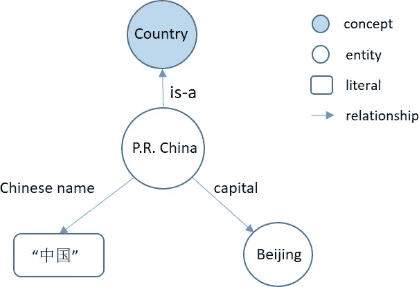

# 知识图简介

> 原文：<https://medium.com/analytics-vidhya/introduction-to-knowledge-graph-645239e24f0c?source=collection_archive---------10----------------------->

知识图是实体及其关系的知识库。它是将实体(如人、地点、物体)表示为节点，实体之间的关系(如位于、是 a 等)表示为边而形成的图。它包含事实，其中事实通常表示为“SPO”三元组:(主语、谓语、宾语)。它实际上包含一个头部实体、关系和一个尾部实体，或者用更简单的术语来说:主语、关系和宾语。

它获取信息并将其整合到一个*本体*中，并应用一个推理机来获取新知识。( *Lisa Ehrlinger 和 Wolfram W——奥地利林茨大学*)

> ( **Ontology** :一个主题领域或领域中的一组概念和类别，显示它们的属性以及它们之间的关系。)

它代表了实体(真实世界的对象和事件，或抽象概念(如文档))的相互联系的描述的集合，其中:

*   描述有正式的语义，允许人和计算机以有效和明确的方式处理它们
*   实体描述相互促进，形成一个网络，其中每个实体代表实体描述的一部分，与它相关，并为它们的解释提供上下文。

> (**语义学**是研究词与词之间的关系，以及我们如何从那些词中提取意义。)

# **知识图可以通过以下步骤创建:**

**数据采集:**

数据可以是我们自己收集的，也可以使用其他数据集。

在这里，如果我们必须创建自己的数据集，我们可以分割目标文本，区分和提取主客体，然后确定它们之间的关系。

**生成 RFD 三元组和四元组:**

我们可以使用***yarrml-parser***将***yarrml***自定义规则翻译成 ***RML(RDF 映射语言)*** 规则，其中*规则随着 ***RMLMapper*** 的执行被翻译成相应的***RML****

> *(**yarrml**:声明性链接数据生成规则的人类可读的基于文本的表示。)*
> 
> *( **RML** 是一种通用的可扩展映射语言，被定义为表达将异构结构和序列化中的数据映射到 RDF *数据模型*的规则。)*

***在图形数据库中存储三元组:***

*将生成的三元组和四元组存储在图形数据库中以备将来使用。*

****一些可用的图形数据库:****

1.  ***Neo4j***
2.  ****ArangoDB****
3.  ****OrientDB****
4.  ****亚马逊海王****

***数据到知识图的映射:***

*我们可以使用 *RDFlib* 将 *RDF* 数据映射到知识图中。*

***或者，***

*我们可以直接从图形数据库中可视化知识图。*

> *( ***RDFlib*** 是一个用于处理 *RFD* 数据的纯 Python 包，其中包括*解析器*、*串行化器*、*图形接口以及更多*。)*

***示例:***

**

*图:知识图的示例图[1]*

*从这个知识图表中，我们可以推断出，中华人民共和国是一个国家，首都北京有中文名称，如图所示。*

# ***知识图谱的应用:***

1.  ***问答系统(基于语义解析、基于信息检索、基于嵌入和基于深度学习):**在语义感知问答(QA)服务中，来自 KGs 的语义信息可以用于增强搜索结果。*
2.  ***推荐系统(基于嵌入和基于路径):**KG 中各种类型的关系有助于提高推荐准确率，增加推荐项目的多样性。KGs 也为推荐系统带来了可解释性。*
3.  ***信息检索:**结合来自 KGs 的实体数据进行信息检索。像:谷歌知识图执行图形搜索的实体搜索任务。*
4.  ***特定领域(医疗、网络安全、金融、新闻、教育等。):**整合各种数据&信息，开发不同领域的知识图，以推断该领域的不同信息。*

# ***参考文献:***

***【1】:吴，天星&齐，桂林&李，程&王，孟。(2018).中文知识图构建技术及其应用综述。可持续性。10.3245.10.3390/su10093245。***

***【2】:邹，小寒。(2020).知识图的应用综述。物理学杂志:会议系列。1487.012016.10.1088/1742–6596/1487/1/012016.***