# 线性回归和 Azure ML Studio 简介

> 原文：<https://medium.com/analytics-vidhya/introduction-to-linear-regression-and-azure-ml-studio-5af64efe2813?source=collection_archive---------10----------------------->

嗨！从上周开始对机器学习概念感兴趣。事实上，在那之前我就感兴趣了，但从那以后我一直试图深入机器学习，因为我已经做了 11 个月的数据分析师，然而数据是我工作的一部分，所以我已经参与了数据方面的工作。关于这个话题，我想我列了一个很好的阅读清单。在这个故事中，我们将试图理解什么是线性回归，以及我们可以通过使用它来做什么。之后，我们将看看 Azure ML Studio，并在这些数据集上创建我们的第一个线性回归模型。

# 线性回归

正如我们所知，有 3 种类型的机器学习。回归来自机器学习的监督学习类型。这种类型的机器学习需要使用带标签的数据。我们将数据集分成两部分:训练和测试数据。我们用训练数据集训练模型，用测试数据集评估它。

> 在这个故事中，我不会解释什么是其他类型的机器学习，什么是监督学习等等。

我们使用回归模型通过使用自变量来预测因变量的数量。

# Azure 机器学习工作室

让我们开始我们的第一次机器学习模型创建之旅。为此，我将使用 [Azure ML Studio](https://studio.azureml.net/) 。这是一项免费服务，直到某一点。实际上，我对这个平台了解不多，但是我可以解释创建一个简单模型的步骤。

## 输入数据

我将从[这里](https://www.kaggle.com/andonians/random-linear-regression)下载数据集。你可以找到两个数据集。我将下载它们，但在 ML Studio 中，我将把它们连接成一个完整的数据集。

> 如果你不知道 Kaggle 是什么，你可以查一下[这个](/dataseries/what-is-kaggle-4751e384e916)故事。我将为您提供简单的信息，您可以从 Kaggle 免费下载数据集。

当您登录 ML Studio 时，您将进入**实验**页面。

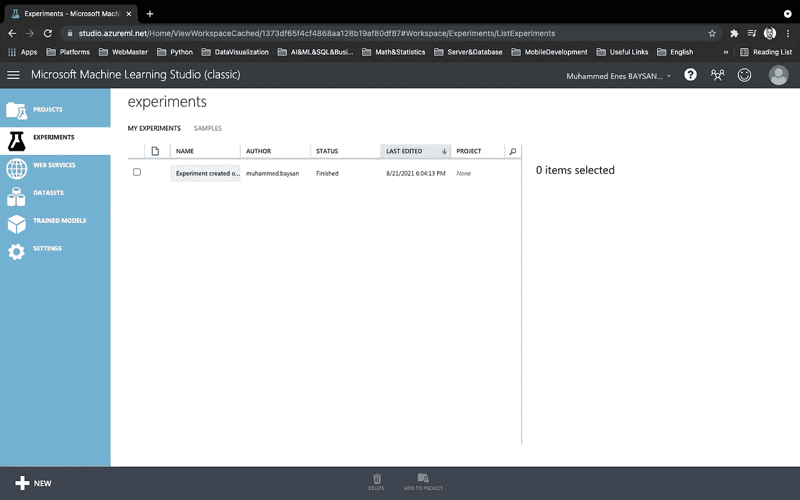

如果您之前没有创建实验，您可能会看到空白页面。我将转到**数据集**页面，单击左侧的“新建”按钮。现在我们可以导入已经从 Kaggle 下载的数据集。我们需要遵循这个路径:数据集- >从本地文件- >选择数据集。

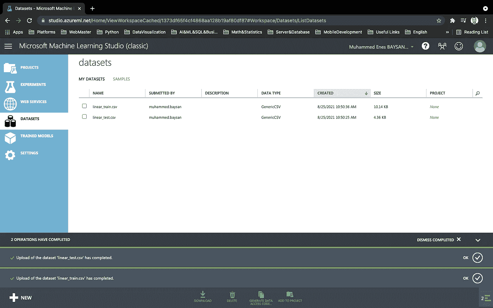

如果我们已经成功地导入了数据集，我们就可以开始创建实验了。

## 创造一个实验

我将再次转到“实验”页面，并单击“新建”按钮。

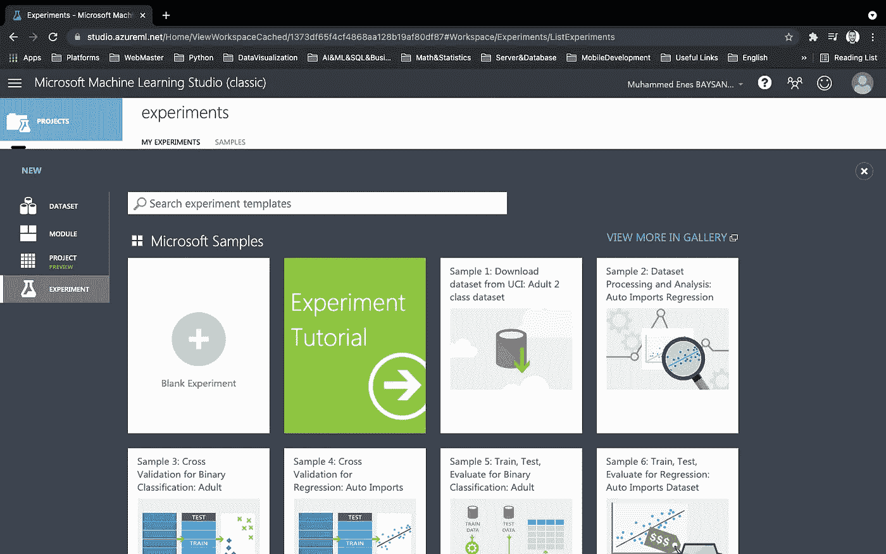

我们可以看到 Azure ML Studio 提供的一些已经构建好的例子。我将单击“空白实验”选项继续。

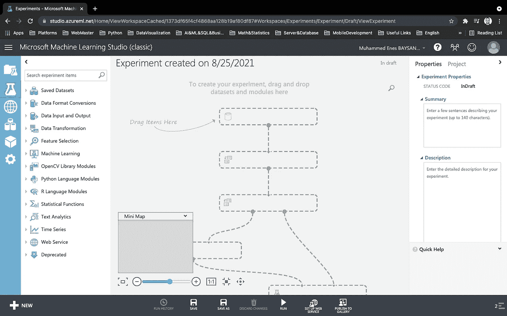

我们可以通过使用位于左侧栏的组件来创建模型和工作流。

## 让我们开始创建一个简单的模型

首先，我们需要导入我们将使用的数据集。在这种情况下，我将使用“保存的数据集”组件。您可以使用左侧边栏中的搜索栏来搜索组件。我要把它拖到中间，然后放下。

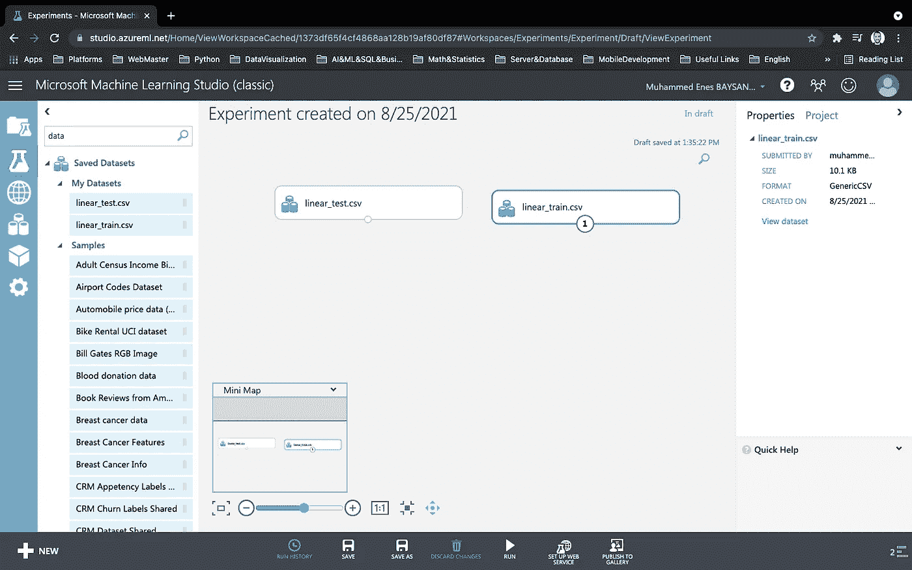

我放弃了两个数据集。事实上，我们可以分开使用，但我想一起使用。首先，我会将它们连接起来，然后我会再次将它们分离为 2 个数据集；训练和测试。

## 连接两个数据集

在这种情况下，我将使用“添加行”组件。我将把它们从底部拖到“添加行”组件的输入点。我这样做是因为它们有相同的列。实际上，我们可以不用连接它们，但是我想展示我们如何连接两个数据集。我们将再次将其分为两个数据集，即测试数据集和训练数据集。

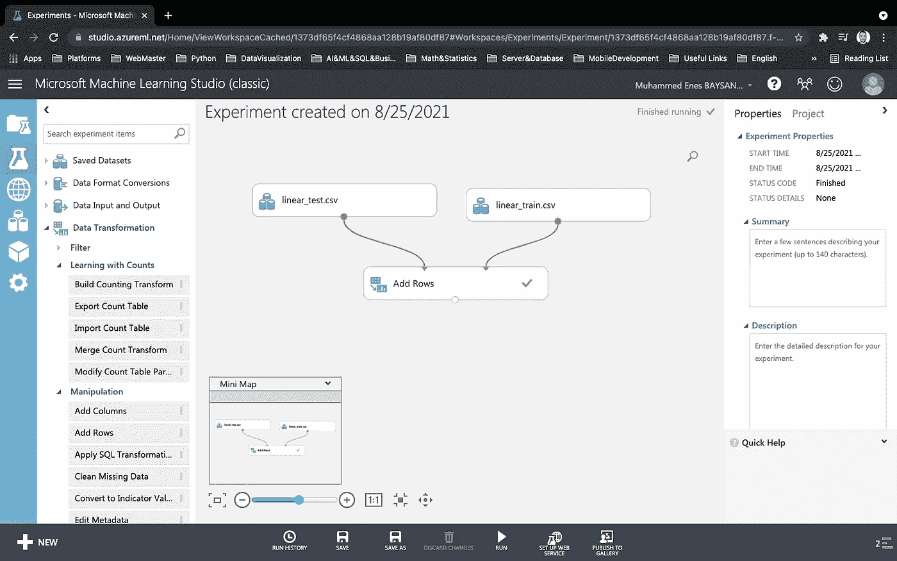

如果您在单击“运行”按钮后悬停在“添加行”组件的底部，您可以看到“可视化”选项。如果使用它，您将看到 1000 行。如果您对 2 个数据集做同样的事情，您将分别看到 300 和 700 行。

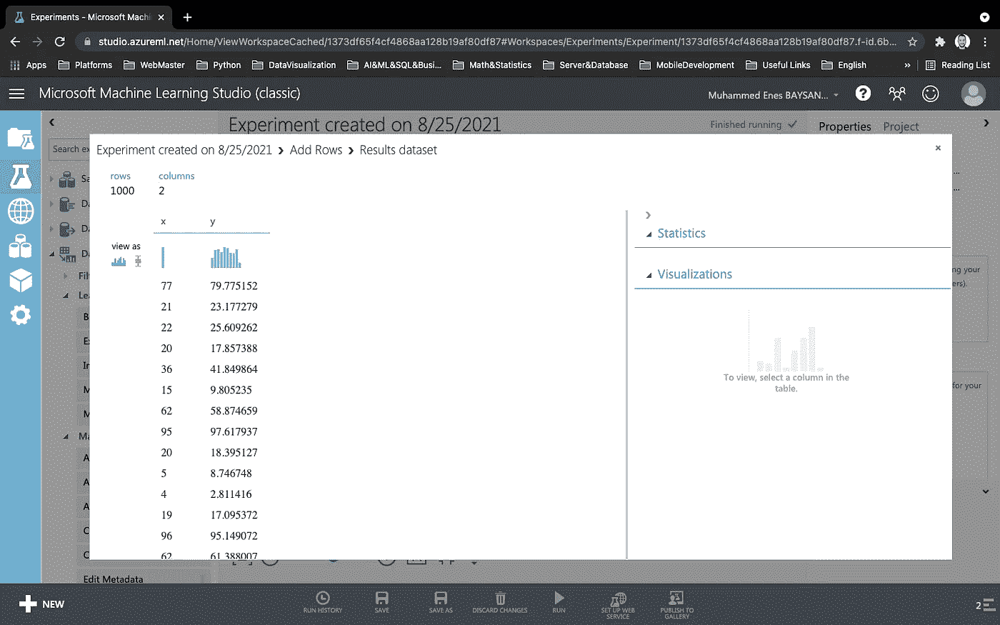

## 分割数据集

现在我们需要将数据集分成两部分，训练和测试数据。我们将用训练数据集训练模型，并用测试数据集评估模型的得分。我将使用“分割数据”组件来分割数据集。我将组件拖放到“添加行”组件下，并将“添加行”底部的点拖到“拆分数据”组件上。

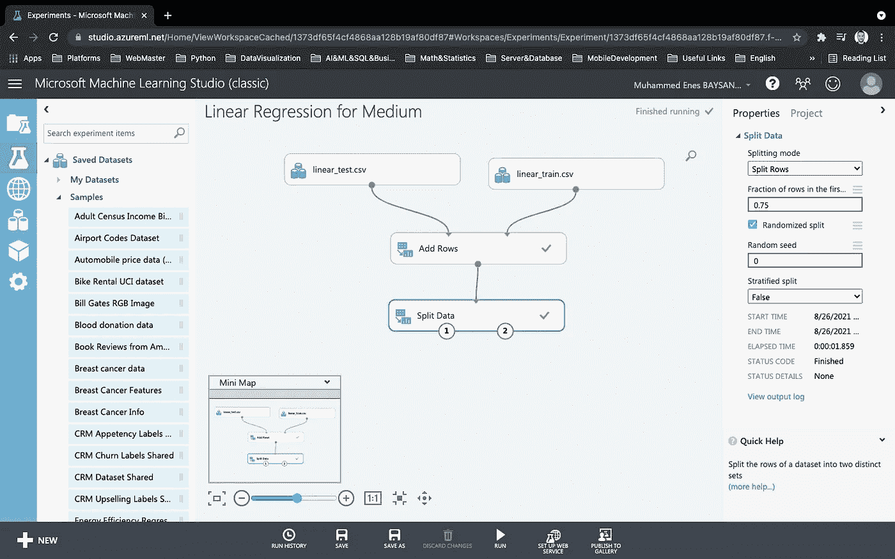

我们可以设置一个百分比，表示有多少百分比是来自右侧的训练数据。在这种情况下，我将主数据集的%75 (0.75)设置为 trainig 数据，测试数据将为%25。ML Studio 将其分为 2 个数据集。

有两个输出点，第一个和第二个。我们对训练数据集使用 1st，对测试数据集使用 2nd。

## 培训模式

我们成功分割了数据集。现在我们需要训练一个模型。我将使用“训练模型”和“线性回归”组件。

我将把“训练模型”组件的第二个输入点与“分割数据”组件的第一个输出点结合起来。之后，我将把“训练模型”组件的第一个输入与“线性回归”组件的输出点结合起来。我将从“火车模型”中选择“y”列。对于我们的例子，我们将通过使用 x 来预测 y。

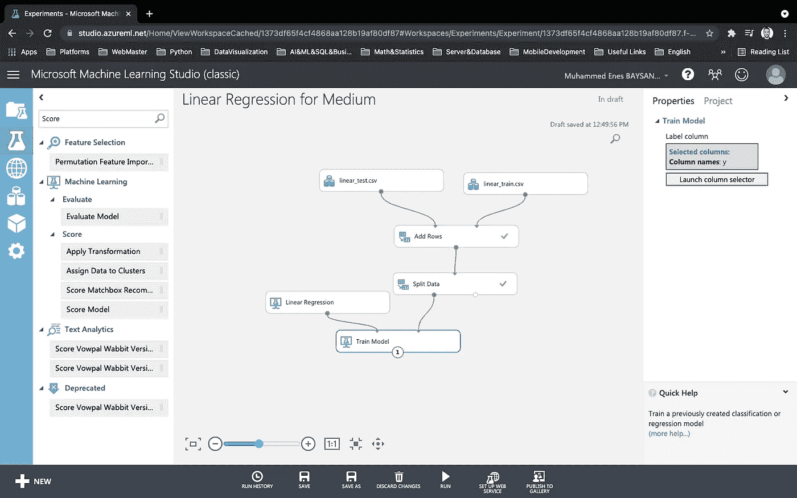

## 对模型评分

我们已经创建了我们的模型。现在我们需要对我们的模型进行评分(测试)。我将使用“分数模型”组件。您可能还记得，我们有现在要使用的测试数据集。我将“训练模型”组件的输出与“得分模型”组件的第一个输入点相结合，并将“得分模型”组件的第二个输入点与“分割数据”组件的第二个输出相结合。

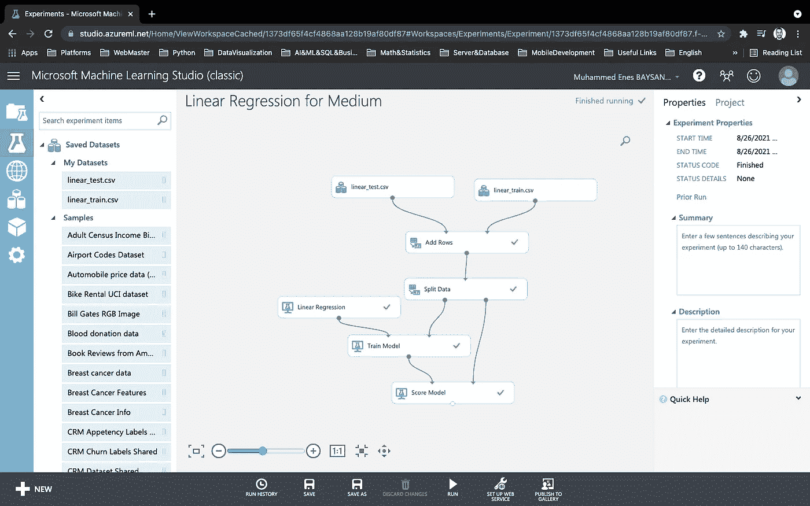

我们可以在“得分标签”栏下看到预测值。

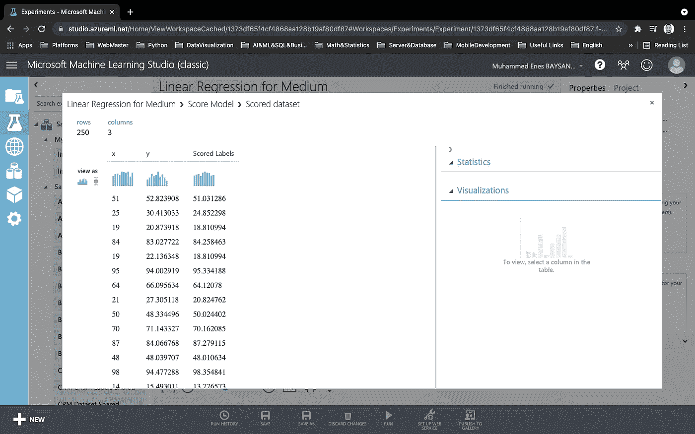

## 评估模型

现在我们可以评估模型了。为此，我将使用“评估模型”组件。我将把“评分模型”组件的输出点与“评估模型”组件的第一个输入点结合起来。

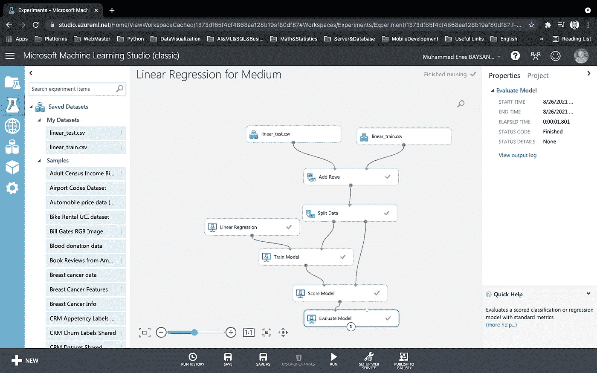

如果我们将鼠标悬停在“评估模型”组件的输出点上，我们可以看到“可视化”按钮。

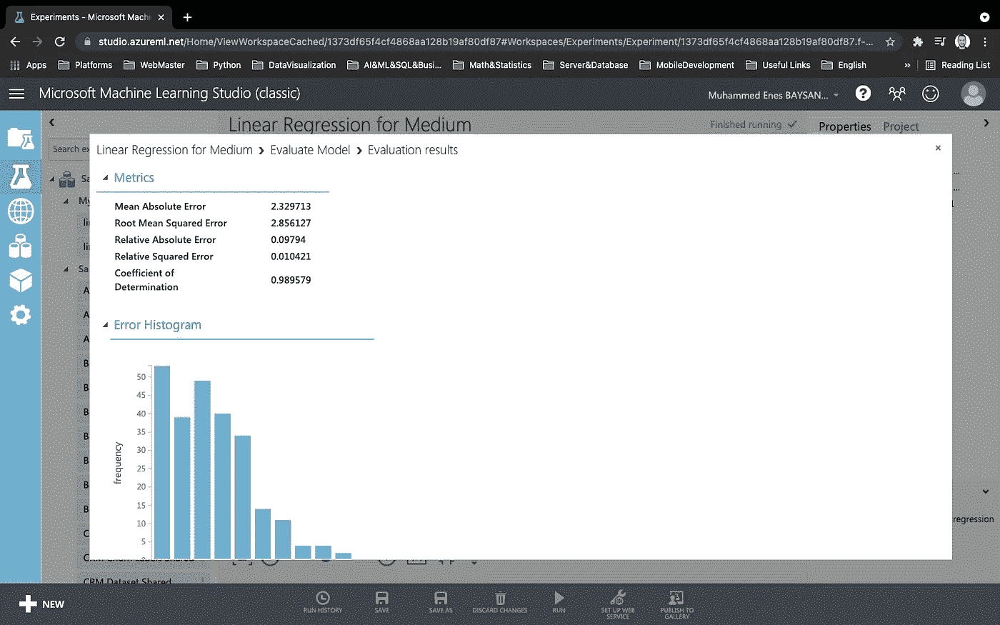

# 最后的想法

我希望这个故事是有帮助的，你喜欢它。我说过，我的机器学习之旅并不长。为了理解机器学习的核心，我正在玩 ML Studio 这样的程序。我想向你介绍 Azure ML Studio。

亲切的问候。