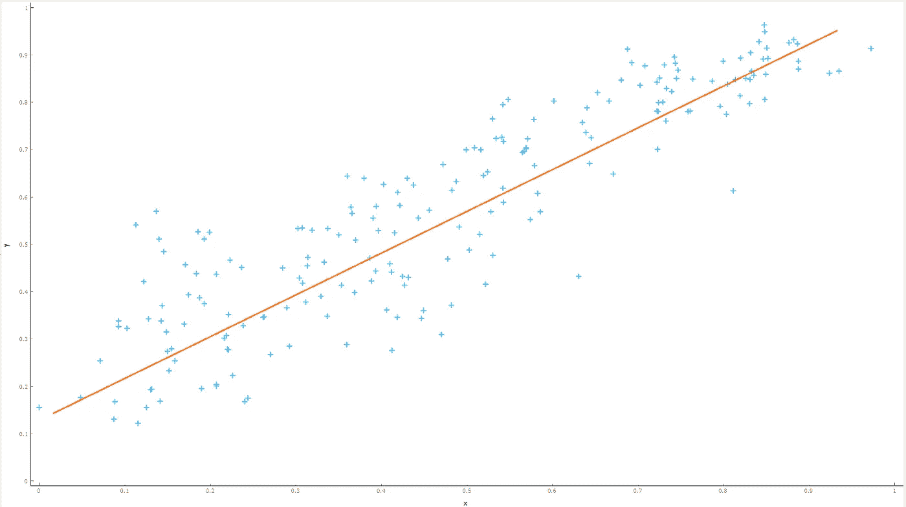

# 线性回归简介— sklearn 糖尿病数据集

> 原文：<https://medium.com/analytics-vidhya/introduction-to-linear-regression-sklearn-diabetes-dataset-f63378b0a1ee?source=collection_archive---------5----------------------->

线性回归-只需找到与周围数据点距离最小的直线的方程。

> 我们都知道线的方程式，我们在高中学过，
> 
> y = mx + c

如果你知道这个，字面意思就是你知道一个简单的线性回归方程。很多时候，我们觉得像“回归”这样的大词可能意味着大事情，尽管它们可能像上面的等式一样简单。

在线性回归中，

y:是被预测的变量(又名因变量)。它是数值连续数据类型。

m:这里的系数‘m’就是直线的斜率。

x:是被称为自变量的变量。

c:我们知道这是一个常数值，也就是 y 轴截距。(“x”为零时“y”的值。基本上意味着它是与纵轴相交的点。

对于多元线性回归，x(预测值/特征)的数量将多于一个。方程看起来会是这样的。

Y = m1x1 + m2x2 + …… + C

线性回归简单易懂，但却是一种非常强大的机器学习算法。其基本假设是自变量/特征与响应/目标变量*【线性】*。

现在，我们将关注如何在 Python 中进行线性回归&分析结果。我们将使用的数据集是 sklearn 包中名为“糖尿病”的内置数据集。

线性回归分析-使用糖尿病数据集

感谢您的阅读。如果你想阅读更多关于 ML 的话题，请关注我，通过鼓掌和分享内容来激励我。谢谢&学习愉快！