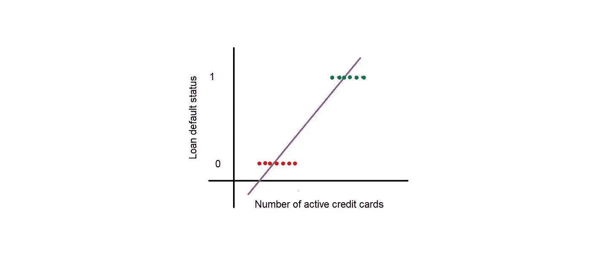
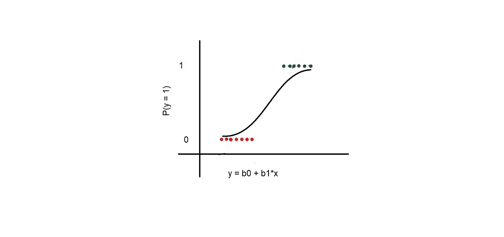

# 逻辑回归介绍

> 原文：<https://medium.com/analytics-vidhya/introduction-to-logistic-regression-dab8e0ccf2df?source=collection_archive---------20----------------------->

你有没有想过，为什么有的人被银行展期贷款或信用卡，有的人却没有？银行如何在一定程度上确定他们提供贷款或信用卡的个人不会拖欠贷款或拖欠信用卡付款？答案很简单——他们依赖于所谓的信用评分。较高的信用评分意味着你有很高的信用价值，他们可以安全地向你提供贷款，而较低的信用评分意味着你的信用价值很低，给你贷款是有风险的，因为你很有可能会拖欠还款。

我公司最大的客户之一是一家位于美国的信用局公司，我为该客户工作。他们的业务是为银行和其他金融机构建立信用评分模型。你能猜到他们开发了什么模型来计算信用评分吗？是的，你猜对了——逻辑回归模型！

如果你是机器学习的新手，就目前而言，要明白主要有两种类型的机器学习技术——监督的和非监督的。监督算法处理带标签的数据，这意味着您的数据已经有了一个目标变量，您的算法会尝试从该目标中学习。说到无监督算法，没有标记数据。为了这个主题，让我们不要跑题，只要坚持监督算法。

监督学习算法有两个主要用例——回归和分类。回归是指预测一个连续变量，例如根据房屋的某些特征预测房价。你可能在高中数学课上知道方程 y = mx + c。这个方程是一个简单的线性回归模型。分类处理分类变量，例如分类一个人是否会拖欠贷款。

逻辑回归是一种用于分类问题的监督机器学习算法。等等！刚才，我说回归意味着预测一个连续变量，但现在，我说逻辑回归用于分类。我理解错了吗？不要！你很快就会发现。

假设我们有一个数据集，其中包含许多个人的历史信用数据，数据集中的一个变量表示某个特定的个人是否拖欠贷款。我们称之为目标变量。现在，让我们从数据中选择一个独立变量——有效信用卡的数量。当你仔细观察数据时，你会发现拥有更多活跃信用卡的个人倾向于拖欠贷款。似乎合乎逻辑，对不对？由于存在线性关系，我们可以对该数据拟合一条回归线，如下图所示。y 轴上的 0 表示“未默认”，1 表示“默认”。

现在，我们遇到了一个情况。回归线可以从-∞延伸到+∞。这似乎与我们手头的情况不太相符。默认状态只能是 0 或 1。这就是一种叫做 sigmoid 变换的数学变换来拯救我们的地方。它将回归的输出值转换为概率，并使用以下公式将最佳拟合线或回归线转换为 S 形曲线，其中 y 代表回归线的输出，p 代表概率。

p = 1/1 +exp(-y)

当回归线的输出达到-∞时，该曲线的一端达到 0，当回归线的输出达到+∞时，该曲线的另一端达到 1。转换后的曲线如下图所示。x 轴显示回归线的输出，y 轴显示贷款违约的概率。

现在，我们将阈值设置为 0.5。如果违约概率在 0.5 以上，我们就说这个人会拖欠贷款。如果概率低于 0.5，我们就说这个人不会拖欠贷款。那么，你如何找到最佳的 S 曲线，以便我们最终在大多数情况下正确地将一个人分类为违约者或非违约者。这是通过最小化以下称为 logloss 的损失函数来实现的。

log loss =-1/N(∑(yi(logpi)+(1-yi)log(1-pi)))

乍一看，上面的函数看起来很吓人，但实际上非常简单。让我们借助下面的 4 个案例来看看这个公式是如何工作的。

案例 1:一个人实际上是违约者，通过 S 曲线，我们发现这个人违约的概率很高。这里，y = 1，p 是一个很高的值。让我们假设 p 为 1。因此，logp 将变成为 0 的 log1。在 logloss 函数中代入这些值得到 0 值，这意味着损失为零，因此数据点被正确分类。

案例 2:一个人实际上是违约者，但是通过 S 曲线，我们发现这个人违约的概率很低。这里，y = 1，p 是一个很低的值。让我们假设 p 为 0。因此，logp 将变成 log0，也就是-∞。将这些值代入 logloss 函数，得到值∞，这意味着损失巨大，因此数据点被错误分类。

案例 3:一个人实际上没有违约，通过 S 曲线，我们发现这个人违约的概率很低。这里，y = 0，p 是一个很低的值。让我们假设 p 为 0。因此，log(1-p)将变成为 0 的 log1。在 logloss 函数中代入这些值得到 0 值，这意味着损失为零，因此数据点被正确分类。

案例 4:一个人实际上没有违约，但通过 S 曲线，我们发现这个人违约的概率很高。这里，y = 1，p 是一个很高的值。让我们假设 p 为 1。因此，log(1-p)将变成 log0，也就是-∞。将这些值代入 logloss 函数，得到值∞，这意味着损失巨大，因此数据点被错误分类。

所以，现在你可能发现损失函数并不复杂！最重要的是，现在你应该明白为什么这种分类算法被称为逻辑“回归”。sigmoid 曲线实际上是一条转换后的回归线！

小贴士:如果你想有一个非常好的信用评分，经常贷款和使用你的信用卡，永远不要拖欠还款。